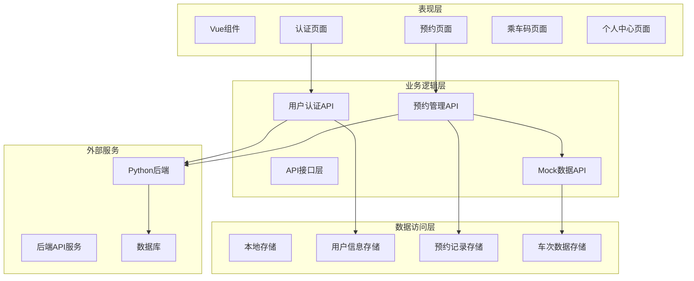
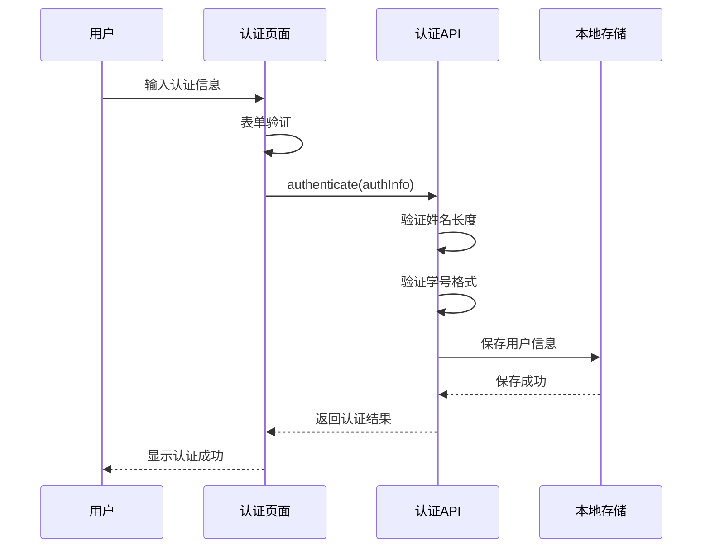
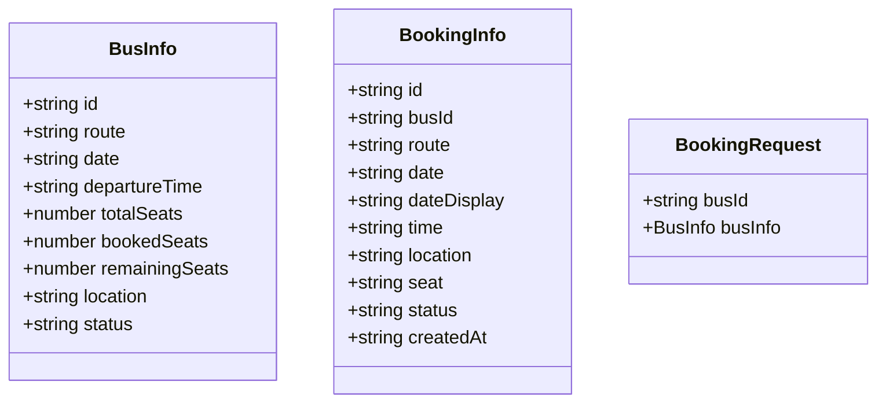
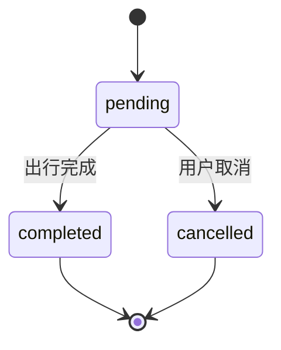
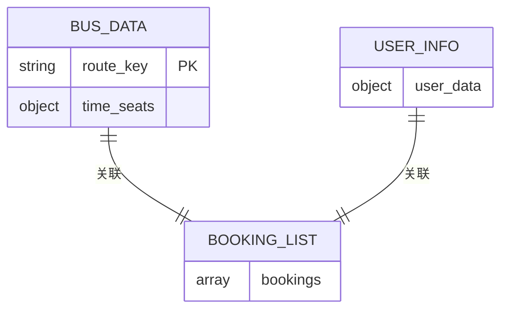
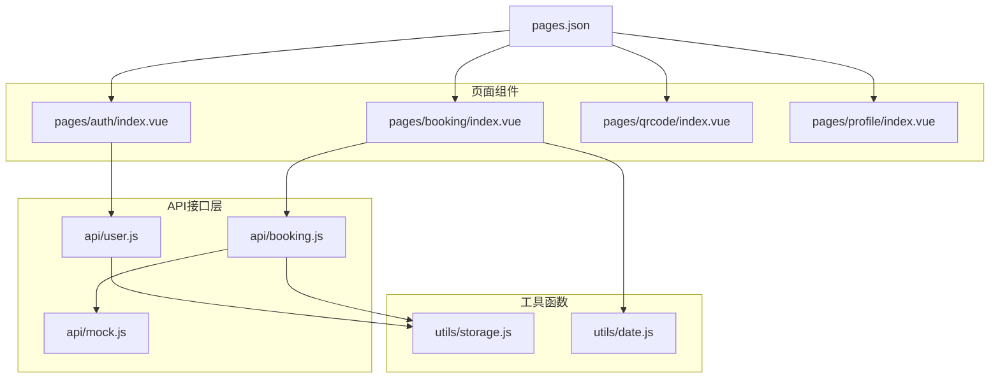
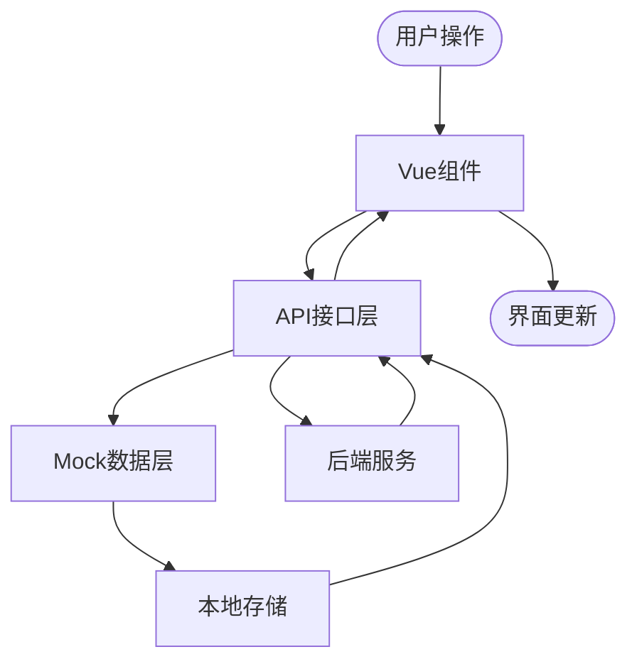

# API接口文档

<cite>
**本文档引用的文件**
- [api/user.js](file://api/user.js)
- [api/booking.js](file://api/booking.js)
- [api/mock.js](file://api/mock.js)
- [utils/storage.js](file://utils/storage.js)
- [utils/date.js](file://utils/date.js)
- [pages/auth/index.vue](file://pages/auth/index.vue)
- [pages/booking/index.vue](file://pages/booking/index.vue)
- [pages.json](file://pages.json)
- [PROJECT.md](file://PROJECT.md)
</cite>

## 目录
1. [简介](#简介)
2. [项目结构](#项目结构)
3. [核心组件](#核心组件)
4. [架构概览](#架构概览)
5. [详细组件分析](#详细组件分析)
6. [依赖关系分析](#依赖关系分析)
7. [性能考虑](#性能考虑)
8. [故障排除指南](#故障排除指南)
9. [结论](#结论)
10. [附录](#附录)

## 简介
本项目是一个基于 uni-app 框架开发的湖北大学校车预约小程序，采用前后端分离的设计理念。系统当前使用 Mock 数据层进行开发测试，预留了完整的后端 API 接口规范，便于后期无缝迁移到真实的 Python 后端服务。

系统主要功能包括：
- 用户身份认证与信息管理
- 校车车次查询与预约管理
- 乘车码生成与展示
- 个人中心与预约历史查询

## 项目结构
项目采用模块化的文件组织方式，核心目录结构如下：

```mermaid
graph TB
subgraph "前端应用"
A[pages/] -- 页面组件
B[api/] -- API接口层
C[utils/] -- 工具函数
D[static/] -- 静态资源
end
subgraph "页面组件"
A1[auth/index.vue] -- 身份认证
A2[booking/index.vue] -- 车辆预约
A3[qrcode/index.vue] -- 乘车码
A4[profile/index.vue] -- 个人中心
end
subgraph "API接口层"
B1[user.js] -- 用户认证
B2[booking.js] -- 预约管理
B3[mock.js] -- Mock数据
end
subgraph "工具函数"
C1[storage.js] -- 本地存储
C2[date.js] -- 日期处理
end
A1 --> B1
A2 --> B2
B2 --> B3
B1 --> C1
B2 --> C1
A2 --> C2
```

**图表来源**
- [pages.json:1-62](file://pages.json#L1-L62)
- [api/user.js:1-128](file://api/user.js#L1-L128)
- [api/booking.js:1-165](file://api/booking.js#L1-L165)
- [api/mock.js:1-226](file://api/mock.js#L1-L226)

**章节来源**
- [PROJECT.md:41-67](file://PROJECT.md#L41-L67)
- [pages.json:1-62](file://pages.json#L1-L62)

## 核心组件
系统的核心组件包括用户认证接口、预约管理接口和 Mock 数据层。每个组件都采用了 Promise 异步处理模式，确保良好的用户体验和错误处理能力。

### 用户认证接口
用户认证接口负责处理用户的身份验证和信息管理，支持学生和教职工两种身份类型。

### 预约管理接口
预约管理接口提供完整的车次查询、预约创建、历史记录查询和预约取消功能，所有操作都基于 Mock 数据层实现。

### Mock 数据层
Mock 数据层模拟真实的后端服务，提供完整的数据结构和业务逻辑，包括车次信息、预约状态管理和座位分配算法。

**章节来源**
- [api/user.js:8-128](file://api/user.js#L8-L128)
- [api/booking.js:8-165](file://api/booking.js#L8-L165)
- [api/mock.js:6-226](file://api/mock.js#L6-L226)

## 架构概览
系统采用分层架构设计，各层职责明确，便于维护和扩展。



**图表来源**
- [pages/auth/index.vue:100-189](file://pages/auth/index.vue#L100-L189)
- [pages/booking/index.vue:99-297](file://pages/booking/index.vue#L99-L297)
- [api/user.js:6-128](file://api/user.js#L6-L128)
- [api/booking.js:6-165](file://api/booking.js#L6-L165)

## 详细组件分析

### 用户认证接口

#### 接口规范
用户认证接口提供身份验证和信息管理功能，支持以下操作：

**认证接口**
- HTTP 方法: POST
- URL 模式: `/api/auth/login`
- 请求参数: `{ name, studentId, userType }`
- 响应格式: `{ isAuthenticated, name, studentId, userType, authenticatedAt }`

**获取用户信息接口**
- HTTP 方法: GET
- URL 模式: `/api/user/profile`
- 请求参数: 无
- 响应格式: `{ name, studentId, userType, authenticatedAt }`

**更新用户信息接口**
- HTTP 方法: POST
- URL 模式: `/api/user/update`
- 请求参数: `{ name, studentId, userType }`
- 响应格式: `{ name, studentId, userType, authenticatedAt }`

#### 认证流程


**图表来源**
- [pages/auth/index.vue:155-187](file://pages/auth/index.vue#L155-L187)
- [api/user.js:72-100](file://api/user.js#L72-L100)

#### 参数验证规则
- 姓名: 必填，至少2个字符
- 学号/工号: 必填，至少6位字符
- 身份类型: 支持 'student' 和 'teacher'

#### 错误处理
- 输入验证失败: 返回具体错误信息
- 本地存储失败: 返回存储异常
- 网络请求失败: 返回网络错误

**章节来源**
- [api/user.js:72-126](file://api/user.js#L72-L126)
- [pages/auth/index.vue:136-152](file://pages/auth/index.vue#L136-L152)

### 预约管理接口

#### 车次查询接口
**接口规范**
- HTTP 方法: POST
- URL 模式: `/api/bus/list`
- 请求参数: `{ route, date }`
- 响应格式: `Array<BusInfo>`

**车次信息结构**


**图表来源**
- [api/booking.js:14-40](file://api/booking.js#L14-L40)
- [api/mock.js:77-87](file://api/mock.js#L77-L87)

#### 预约创建接口
**接口规范**
- HTTP 方法: POST
- URL 模式: `/api/booking/create`
- 请求参数: `{ busId, busInfo }`
- 响应格式: `{ BookingInfo }`

**预约状态流转**


#### 历史记录查询接口
**接口规范**
- HTTP 方法: GET
- URL 模式: `/api/booking/my`
- 请求参数: 无
- 响应格式: `Array<BookingInfo>`

#### 预约取消接口
**接口规范**
- HTTP 方法: POST
- URL 模式: `/api/booking/cancel`
- 请求参数: `{ bookingId }`
- 响应格式: `{ boolean }`

**章节来源**
- [api/booking.js:14-163](file://api/booking.js#L14-L163)
- [api/mock.js:99-203](file://api/mock.js#L99-L203)

### Mock 数据层

#### 数据结构设计
Mock 数据层采用内存存储方式，模拟真实的数据库操作：

**基础车次数据**
- 长江新区至武昌: 07:30, 09:00, 12:00, 17:30
- 武昌至长江新区: 08:00, 10:00, 14:00, 18:00
- 总座位数: 45座/车次

**数据存储结构**


**图表来源**
- [api/mock.js:6-41](file://api/mock.js#L6-L41)
- [api/mock.js:138-147](file://api/mock.js#L138-L147)

#### 业务逻辑实现
Mock 数据层实现了完整的预约业务逻辑：

**座位分配算法**
- 随机生成座位号: A1-A12, B1-B12, C1-C12, D1-D12
- 座位状态管理: available/full/booked
- 预约冲突检测: 同一用户同一车次只能预约一次

**数据一致性保证**
- 预约创建: 原子性操作，确保数据完整性
- 预约取消: 状态回滚和座位恢复
- 实时更新: 本地存储同步更新

**章节来源**
- [api/mock.js:22-41](file://api/mock.js#L22-L41)
- [api/mock.js:101-151](file://api/mock.js#L101-L151)

## 依赖关系分析

### 组件依赖图


**图表来源**
- [pages/auth/index.vue:100-100](file://pages/auth/index.vue#L100-L100)
- [pages/booking/index.vue:99-100](file://pages/booking/index.vue#L99-L100)
- [api/booking.js:6-6](file://api/booking.js#L6-L6)
- [pages.json:2-26](file://pages.json#L2-L26)

### 数据流分析
系统采用单向数据流设计，确保数据的一致性和可预测性：



**图表来源**
- [PROJECT.md:115-121](file://PROJECT.md#L115-L121)
- [api/booking.js:14-16](file://api/booking.js#L14-L16)

**章节来源**
- [PROJECT.md:115-134](file://PROJECT.md#L115-L134)
- [pages/booking/index.vue:114-135](file://pages/booking/index.vue#L114-L135)

## 性能考虑

### 前端性能优化
1. **异步加载**: 所有 API 调用采用异步处理，避免阻塞主线程
2. **缓存策略**: 本地存储减少重复请求
3. **懒加载**: 页面按需加载，提升首屏速度
4. **虚拟滚动**: 大数据量列表采用虚拟滚动优化

### Mock 数据性能
1. **延迟模拟**: 300-500ms 延迟模拟真实网络环境
2. **内存管理**: 及时清理不需要的数据引用
3. **批量操作**: 支持批量数据更新操作

### 后端迁移建议
1. **连接池**: 使用连接池管理数据库连接
2. **缓存层**: Redis 缓存热点数据
3. **分页查询**: 大数据量采用分页查询
4. **索引优化**: 为常用查询字段建立索引

## 故障排除指南

### 常见问题及解决方案

**认证失败**
- 检查用户名和密码格式
- 确认网络连接正常
- 清理本地存储重新认证

**预约失败**
- 检查车次座位状态
- 确认用户已认证
- 查看控制台错误信息

**数据不同步**
- 清理本地存储
- 重新登录认证
- 检查网络连接

### 错误码说明
- 200: 请求成功
- 400: 参数错误
- 401: 未认证
- 404: 资源不存在
- 500: 服务器内部错误

### 调试技巧
1. 使用浏览器开发者工具查看网络请求
2. 检查本地存储中的数据结构
3. 监控 API 调用频率和响应时间
4. 使用断点调试定位问题

**章节来源**
- [PROJECT.md:183-202](file://PROJECT.md#L183-L202)

## 结论
本项目采用模块化和分层架构设计，提供了完整的校车预约功能。Mock 数据层确保了开发效率，同时预留了完整的后端 API 接口规范，便于后期无缝迁移。

系统的主要优势：
- 清晰的模块划分和职责分离
- 完善的错误处理和异常捕获
- 灵活的配置和扩展机制
- 详细的文档和注释

## 附录

### API 接口对照表

| 接口名称 | HTTP方法 | URL模式 | 请求参数 | 响应格式 |
|---------|---------|--------|---------|---------|
| 用户认证 | POST | `/api/auth/login` | `{name, studentId, userType}` | `{isAuthenticated, userInfo}` |
| 获取用户信息 | GET | `/api/user/profile` | 无 | `{userInfo}` |
| 更新用户信息 | POST | `/api/user/update` | `{userInfo}` | `{userInfo}` |
| 获取车次列表 | POST | `/api/bus/list` | `{route, date}` | `Array<BusInfo>` |
| 创建预约 | POST | `/api/booking/create` | `{busId, busInfo}` | `{BookingInfo}` |
| 获取我的预约 | GET | `/api/booking/my` | 无 | `Array<BookingInfo>` |
| 取消预约 | POST | `/api/booking/cancel` | `{bookingId}` | `{boolean}` |

### 数据模型定义

**用户信息模型**
```javascript
{
  isAuthenticated: boolean,
  name: string,
  studentId: string,
  userType: 'student' | 'teacher',
  authenticatedAt: string
}
```

**车次信息模型**
```javascript
{
  id: string,
  route: string,
  date: string,
  departureTime: string,
  totalSeats: number,
  bookedSeats: number,
  remainingSeats: number,
  location: string,
  status: 'available' | 'full' | 'booked'
}
```

**预约信息模型**
```javascript
{
  id: string,
  busId: string,
  route: string,
  date: string,
  dateDisplay: string,
  time: string,
  location: string,
  seat: string,
  status: 'pending' | 'completed' | 'cancelled',
  createdAt: string
}
```

### 后端迁移指南

**迁移步骤**
1. 修改 `api/` 目录下文件的注释代码
2. 替换 API 地址为实际后端地址
3. 添加认证头信息
4. 测试接口连通性
5. 验证数据格式兼容性

**注意事项**
- 保持现有 API 接口签名不变
- 确保响应数据结构一致
- 实现完整的错误处理机制
- 添加必要的安全防护措施

**章节来源**
- [PROJECT.md:159-174](file://PROJECT.md#L159-L174)
- [api/user.js:15-34](file://api/user.js#L15-L34)
- [api/booking.js:18-39](file://api/booking.js#L18-L39)