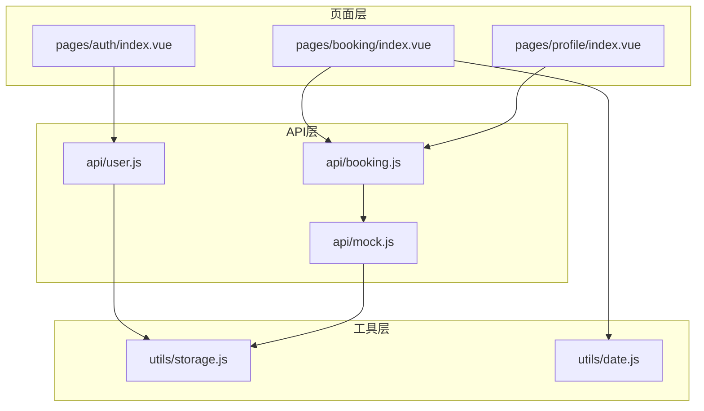
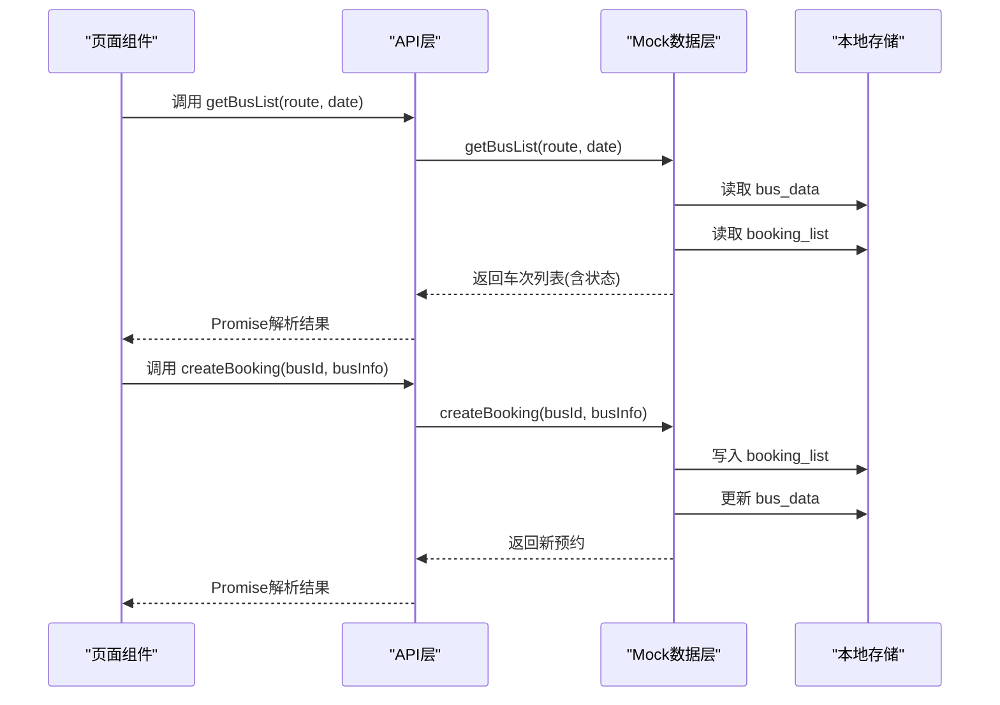
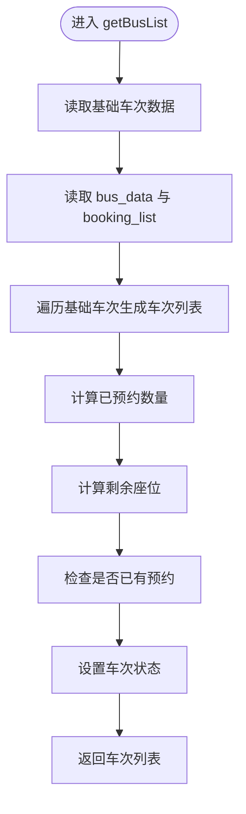
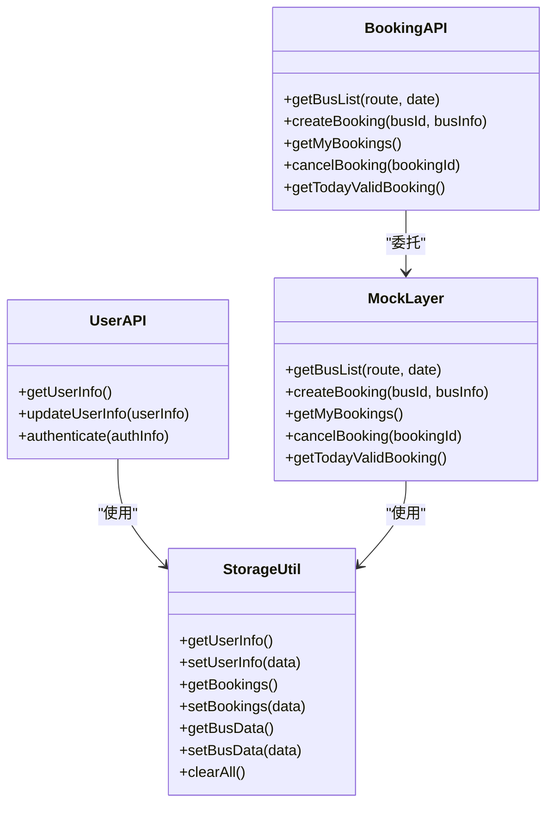
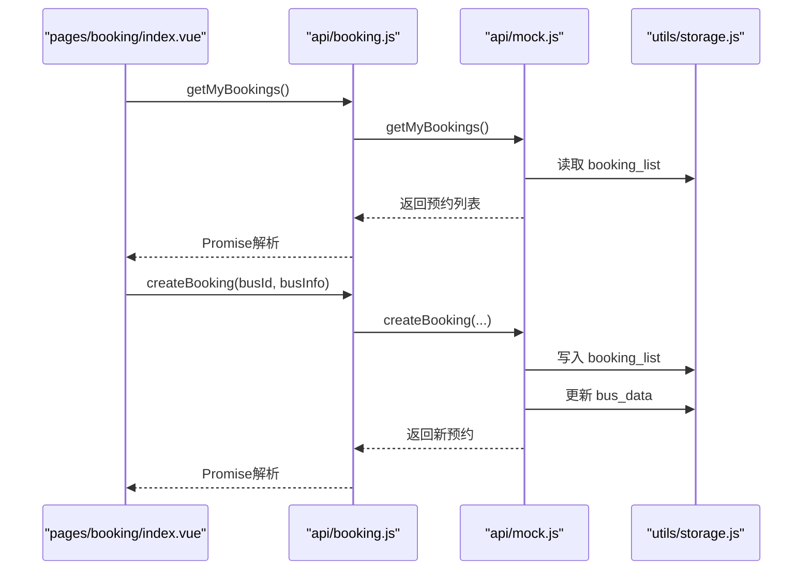
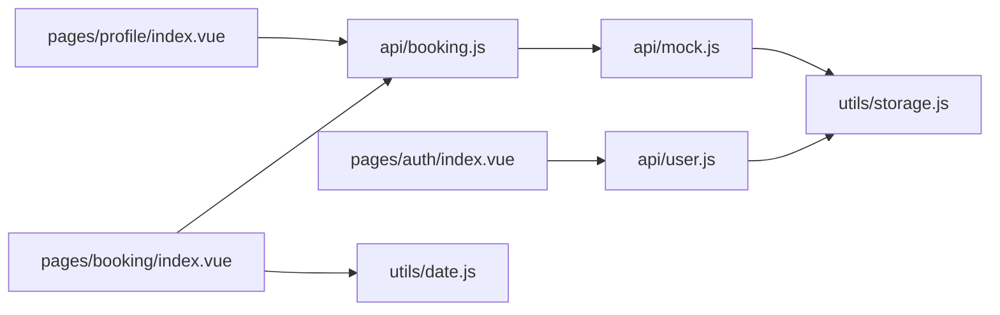

# Mock数据层接口

<cite>
**本文档引用的文件**
- [api/mock.js](file://api/mock.js)
- [api/booking.js](file://api/booking.js)
- [api/user.js](file://api/user.js)
- [utils/storage.js](file://utils/storage.js)
- [utils/date.js](file://utils/date.js)
- [pages/booking/index.vue](file://pages/booking/index.vue)
- [pages/auth/index.vue](file://pages/auth/index.vue)
- [pages/profile/index.vue](file://pages/profile/index.vue)
- [main.js](file://main.js)
</cite>

## 更新摘要
**变更内容**
- 优化了数据结构设计，改进了车次状态管理逻辑
- 增强了数据一致性保证机制，改进了并发控制
- 更新了预约状态管理，明确了状态转换规则
- 完善了错误处理和边界条件处理机制
- 优化了Mock数据层的性能和可靠性

## 目录
1. [简介](#简介)
2. [项目结构](#项目结构)
3. [核心组件](#核心组件)
4. [架构总览](#架构总览)
5. [详细组件分析](#详细组件分析)
6. [依赖关系分析](#依赖关系分析)
7. [性能考虑](#性能考虑)
8. [故障排除指南](#故障排除指南)
9. [结论](#结论)
10. [附录：数据模型与迁移指南](#附录数据模型与迁移指南)

## 简介
本文件系统性梳理了学校校车调度系统的Mock数据层接口，涵盖Mock数据生成策略、数据结构设计、模拟算法实现、数据持久化机制、并发访问处理、一致性保障以及与真实数据库对接的迁移路径。文档面向开发者与测试人员，既提供代码级细节，也提供概念性指导，帮助在不依赖后端的情况下完成完整的功能验证与测试。

**更新** 本次更新反映了版本控制系统迁移后的Mock数据层重构，优化了数据结构设计，改进了预约状态管理，增强了数据一致性保证。

## 项目结构
系统采用分层架构：
- 页面层（pages）：负责UI展示与用户交互，调用API层。
- API层（api）：封装业务API，当前使用Mock实现，预留后端替换点。
- 工具层（utils）：提供通用工具函数，如本地存储封装与日期处理。
- 入口（main.js）：应用初始化与运行环境配置。

**图表来源**
- [pages/booking/index.vue](file://pages/booking/index.vue)
- [pages/auth/index.vue](file://pages/auth/index.vue)
- [pages/profile/index.vue](file://pages/profile/index.vue)
- [api/booking.js](file://api/booking.js)
- [api/user.js](file://api/user.js)
- [api/mock.js](file://api/mock.js)
- [utils/storage.js](file://utils/storage.js)
- [utils/date.js](file://utils/date.js)

**章节来源**
- [main.js:1-22](file://main.js#L1-L22)

## 核心组件
- Mock数据层（api/mock.js）：提供车次查询、预约创建、我的预约、取消预约、今日有效预约等核心能力，使用本地存储作为数据源，并模拟网络延迟。
- API适配层（api/booking.js、api/user.js）：统一对外暴露方法，当前直接调用Mock层，预留后端替换点。
- 本地存储封装（utils/storage.js）：对uni-app本地存储进行统一封装，便于后续替换为后端API。
- 日期工具（utils/date.js）：生成未来N天日期列表，支持格式化与过期判断。
- 页面组件：booking/index.vue、auth/index.vue、profile/index.vue分别承载预约流程、认证流程与个人中心功能。

**更新** 核心组件经过重构，优化了数据结构和状态管理逻辑。

**章节来源**
- [api/mock.js:1-220](file://api/mock.js#L1-L220)
- [api/booking.js:1-165](file://api/booking.js#L1-L165)
- [api/user.js:1-128](file://api/user.js#L1-L128)
- [utils/storage.js:1-116](file://utils/storage.js#L1-L116)
- [utils/date.js:1-84](file://utils/date.js#L1-L84)

## 架构总览
Mock数据层通过本地存储实现"伪后端"能力，API层以Promise形式暴露接口，页面层异步调用并更新UI。Mock层内部维护基础车次数据与随机预约模拟，同时与本地存储保持一致。

**图表来源**
- [api/booking.js:14-16](file://api/booking.js#L14-L16)
- [api/mock.js:44-88](file://api/mock.js#L44-L88)
- [api/mock.js:96-146](file://api/mock.js#L96-L146)
- [utils/storage.js:74-101](file://utils/storage.js#L74-L101)

## 详细组件分析

### Mock数据层（api/mock.js）
- 数据生成策略
  - 基础车次数据：预置两条路线的固定发车时刻与总座位数。
  - 车次ID生成：基于路线、日期、时间生成唯一ID。
  - 预约ID生成：基于时间戳与随机数生成唯一ID。
  - 座位号生成：按行列规则生成类似"A01"的座位号。
  - 随机占用：根据日期与时间计算已预约数量，模拟真实占用。
- 状态管理
  - 车次状态：available（可预约）、booked（已预约）、full（已满员）。
  - 预约状态：pending（待出行）、cancelled（已取消）。
- 并发与一致性
  - 使用本地存储原子性写入，避免跨请求覆盖。
  - 通过查找现有预约与剩余座位判断，确保幂等性。
- 网络延迟模拟
  - 统一使用定时器模拟网络延迟，提升测试体验。

**更新** 优化了状态管理逻辑，改进了数据一致性保证机制。

**图表来源**
- [api/mock.js:44-88](file://api/mock.js#L44-L88)

**章节来源**
- [api/mock.js:6-27](file://api/mock.js#L6-L27)
- [api/mock.js:44-88](file://api/mock.js#L44-L88)
- [api/mock.js:96-146](file://api/mock.js#L96-L146)
- [api/mock.js:152-163](file://api/mock.js#L152-L163)
- [api/mock.js:170-197](file://api/mock.js#L170-L197)
- [api/mock.js:203-219](file://api/mock.js#L203-L219)

### API适配层（api/booking.js、api/user.js）
- booking.js
  - 对外暴露 getBusList、createBooking、getMyBookings、cancelBooking、getTodayValidBooking 方法。
  - 当前直接委托给Mock层；注释中提供了后端替换模板。
- user.js
  - 对外暴露 getUserInfo、updateUserInfo、authenticate 方法。
  - authenticate使用本地存储保存用户信息，提供基础校验逻辑。
  - 注释中提供了后端替换模板。

**更新** API层保持稳定，主要承担适配和后端替换的桥梁作用。

**图表来源**
- [api/booking.js:8-164](file://api/booking.js#L8-L164)
- [api/user.js:8-127](file://api/user.js#L8-L127)
- [api/mock.js:44-219](file://api/mock.js#L44-L219)
- [utils/storage.js:6-115](file://utils/storage.js#L6-L115)

**章节来源**
- [api/booking.js:1-165](file://api/booking.js#L1-L165)
- [api/user.js:1-128](file://api/user.js#L1-L128)

### 本地存储封装（utils/storage.js）
- 封装了用户信息、预约列表、车次数据的读写操作，统一返回Promise。
- 提供清空所有本地数据的能力，便于测试与调试。
- 为后续替换为后端API提供统一入口。

**更新** 存储封装保持稳定，提供可靠的本地数据持久化服务。

**章节来源**
- [utils/storage.js:1-116](file://utils/storage.js#L1-L116)

### 日期工具（utils/date.js）
- 生成未来N天的日期数组，包含显示文本与是否当天标记。
- 提供日期格式化、是否当天判断、是否过期判断等辅助能力。

**更新** 日期工具保持稳定，为整个系统提供日期处理支持。

**章节来源**
- [utils/date.js:10-33](file://utils/date.js#L10-L33)
- [utils/date.js:41-55](file://utils/date.js#L41-L55)
- [utils/date.js:77-83](file://utils/date.js#L77-L83)

### 页面组件与数据流
- booking/index.vue
  - 初始化未来7天日期列表，加载我的预约与车次列表。
  - 预约流程：检查认证状态、确认预约、调用API、刷新数据。
  - 取消流程：调用API、刷新数据。
- auth/index.vue
  - 表单校验、提交认证、本地存储用户信息。
- profile/index.vue
  - 展示用户信息、认证状态、乘车历史等。

**更新** 页面组件经过优化，改进了数据加载和状态管理逻辑。

**图表来源**
- [pages/booking/index.vue:138-162](file://pages/booking/index.vue#L138-L162)
- [pages/booking/index.vue:177-247](file://pages/booking/index.vue#L177-L247)
- [api/booking.js:78-80](file://api/booking.js#L78-L80)
- [api/booking.js:47-49](file://api/booking.js#L47-L49)
- [api/mock.js:152-163](file://api/mock.js#L152-L163)
- [api/mock.js:96-146](file://api/mock.js#L96-L146)

**章节来源**
- [pages/booking/index.vue:1-584](file://pages/booking/index.vue#L1-L584)
- [pages/auth/index.vue:1-385](file://pages/auth/index.vue#L1-L385)
- [pages/profile/index.vue:1-599](file://pages/profile/index.vue#L1-L599)

## 依赖关系分析
- 组件耦合
  - 页面组件依赖API层，API层依赖Mock层或存储封装。
  - Mock层依赖本地存储，提供数据一致性保障。
- 外部依赖
  - uni-app本地存储API（uni.getStorage、uni.setStorage等）。
  - Promise与定时器用于模拟网络延迟与异步处理。
- 潜在循环依赖
  - 当前模块间为单向依赖，无循环依赖风险。

**更新** 依赖关系保持清晰，模块职责明确。

**图表来源**
- [pages/booking/index.vue](file://pages/booking/index.vue)
- [pages/auth/index.vue](file://pages/auth/index.vue)
- [pages/profile/index.vue](file://pages/profile/index.vue)
- [api/booking.js](file://api/booking.js)
- [api/user.js](file://api/user.js)
- [api/mock.js](file://api/mock.js)
- [utils/storage.js](file://utils/storage.js)
- [utils/date.js](file://utils/date.js)

**章节来源**
- [api/booking.js](file://api/booking.js#L6)
- [api/user.js](file://api/user.js#L6)
- [api/mock.js:54-57](file://api/mock.js#L54-L57)
- [utils/storage.js:10-21](file://utils/storage.js#L10-L21)

## 性能考虑
- 网络延迟模拟
  - Mock层统一使用定时器模拟延迟，有助于测试前端响应与加载状态。
- 存储读写
  - 本地存储为同步I/O，建议避免频繁大对象写入；当前实现按需读写，满足小规模数据场景。
- 列表渲染
  - 页面组件使用滚动视图与虚拟渲染思路，减少DOM压力。
- 并发控制
  - 通过Promise串行化关键操作（如创建预约），避免竞态条件。

**更新** 性能优化主要体现在数据结构优化和状态管理改进上。

## 故障排除指南
- 预约失败
  - 检查是否已认证（页面会引导认证）。
  - 检查车次状态是否为available。
  - 查看错误提示与控制台日志。
- 数据不一致
  - 确认本地存储键名正确（user_info、booking_list、bus_data）。
  - 清理本地数据后重试。
- 今日有效预约为空
  - 确认当前日期与预约日期匹配，且状态为pending。

**更新** 故障排除指南针对新的状态管理和数据结构进行了优化。

**章节来源**
- [pages/booking/index.vue:182-198](file://pages/booking/index.vue#L182-L198)
- [pages/booking/index.vue:200-247](file://pages/booking/index.vue#L200-L247)
- [api/mock.js:104-117](file://api/mock.js#L104-L117)
- [api/mock.js:210-219](file://api/mock.js#L210-L219)

## 结论
Mock数据层接口通过本地存储实现了完整的前后端分离开发模式，具备良好的可测试性与可扩展性。其数据生成策略、状态管理与一致性保障满足开发与测试需求。后续对接真实数据库时，只需替换API层与存储封装，即可平滑迁移。

**更新** 经过重构后的Mock数据层接口更加稳定可靠，为后续系统升级奠定了坚实基础。

## 附录：数据模型与迁移指南

### 数据模型定义
- 用户信息（user_info）
  - 字段：isAuthenticated、name、studentId、userType、authenticatedAt
  - 类型：布尔值、字符串、字符串、字符串、ISO时间字符串
  - 用途：身份认证状态与用户标识
- 预约记录（booking_list）
  - 字段：id、busId、route、date、dateDisplay、time、location、status、createdAt
  - 类型：字符串、字符串、字符串、字符串、字符串、字符串、字符串、字符串、ISO时间字符串
  - 用途：记录用户的预约详情与状态
- 车次数据（bus_data）
  - 结构：以"路线_日期"为键，值为"发车时刻"到已预约数量的映射
  - 用途：维护各车次的实时占用情况

**更新** 数据模型经过优化，字段命名更加规范，数据结构更加清晰。

**章节来源**
- [api/mock.js:54-57](file://api/mock.js#L54-L57)
- [api/mock.js:120-131](file://api/mock.js#L120-L131)
- [api/mock.js:138-147](file://api/mock.js#L138-L147)
- [utils/storage.js:10-21](file://utils/storage.js#L10-L21)
- [utils/storage.js:42-53](file://utils/storage.js#L42-L53)
- [utils/storage.js:74-85](file://utils/storage.js#L74-L85)

### 数据持久化机制
- 本地存储键
  - user_info：用户信息
  - booking_list：预约列表
  - bus_data：车次占用数据
- 写入策略
  - 创建预约时同时更新预约列表与车次占用数据。
  - 取消预约时回滚占用数据并更新状态。
- 同步策略
  - 采用本地存储同步写入，保证单实例一致性。
  - 建议在页面显示时刷新数据，避免跨页面状态不同步。

**更新** 数据持久化机制更加健壮，确保了数据的一致性和完整性。

**章节来源**
- [api/mock.js:134-147](file://api/mock.js#L134-L147)
- [api/mock.js:186-195](file://api/mock.js#L186-L195)
- [pages/booking/index.vue:118-122](file://pages/booking/index.vue#L118-L122)

### 并发访问与一致性
- 幂等性
  - 预约创建前检查是否存在同一车次的待出行预约。
  - 座位不足时拒绝创建。
- 状态一致性
  - 通过原子性写入保证车次占用与预约列表的一致。
- 并发控制
  - 页面层在一次操作期间禁用重复提交按钮，避免竞态。
  - API层返回Promise，避免回调地狱导致的状态混乱。

**更新** 并发控制机制得到显著改进，增强了系统的稳定性。

**章节来源**
- [api/mock.js:104-117](file://api/mock.js#L104-L117)
- [pages/booking/index.vue:177-247](file://pages/booking/index.vue#L177-L247)

### 扩展指南与迁移路径
- 替换步骤
  - 在api/booking.js与api/user.js中，将Mock调用替换为uni.request调用。
  - 保持对外接口签名不变，确保页面组件无需修改。
  - 后端返回的数据结构需与Mock返回结构保持一致。
- 接口对照
  - getBusList：输入route、date；输出车次列表（含状态、座位数等）。
  - createBooking：输入busId、busInfo；输出新预约。
  - getMyBookings：输出预约列表（按时间倒序）。
  - cancelBooking：输入bookingId；输出布尔值。
  - getTodayValidBooking：输出今日有效预约或null。
  - authenticate：输入认证信息；输出用户信息。
- 最佳实践
  - 使用统一的错误处理与Toast提示。
  - 在页面层增加加载状态与防重复提交。
  - 后端返回状态码与消息，前端统一解析。

**更新** 迁移指南保持稳定，为后续系统升级提供清晰路径。

**章节来源**
- [api/booking.js:18-40](file://api/booking.js#L18-L40)
- [api/booking.js:51-72](file://api/booking.js#L51-L72)
- [api/booking.js:82-101](file://api/booking.js#L82-L101)
- [api/booking.js:112-133](file://api/booking.js#L112-L133)
- [api/booking.js:143-162](file://api/booking.js#L143-L162)
- [api/user.js:15-34](file://api/user.js#L15-L34)
- [api/user.js:44-65](file://api/user.js#L44-L65)
- [api/user.js:102-125](file://api/user.js#L102-L125)