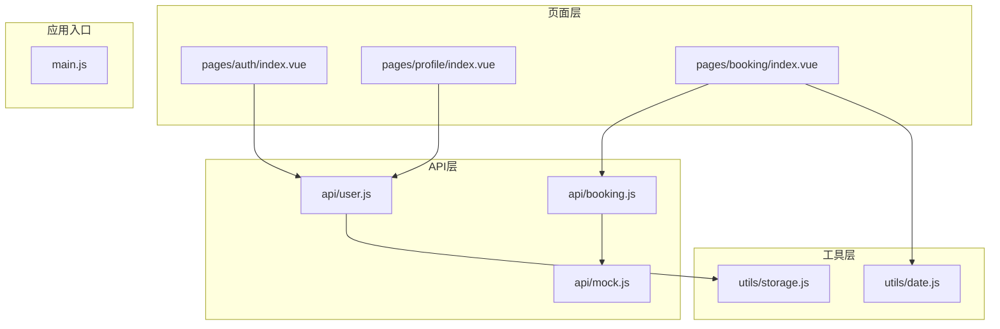
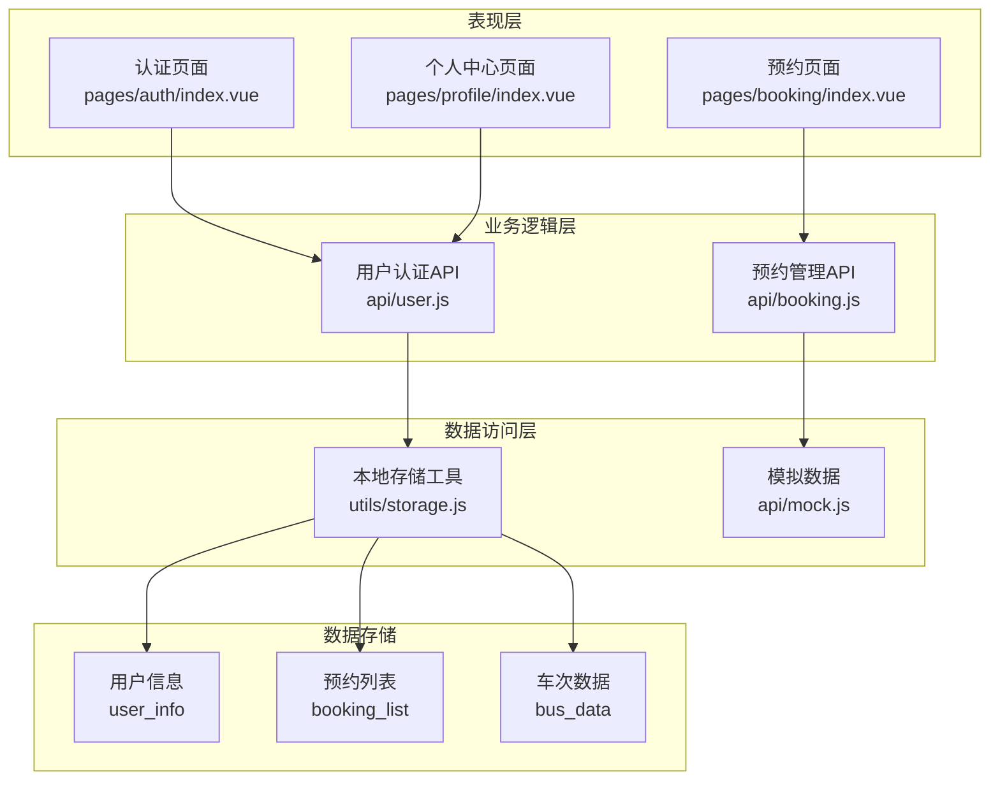
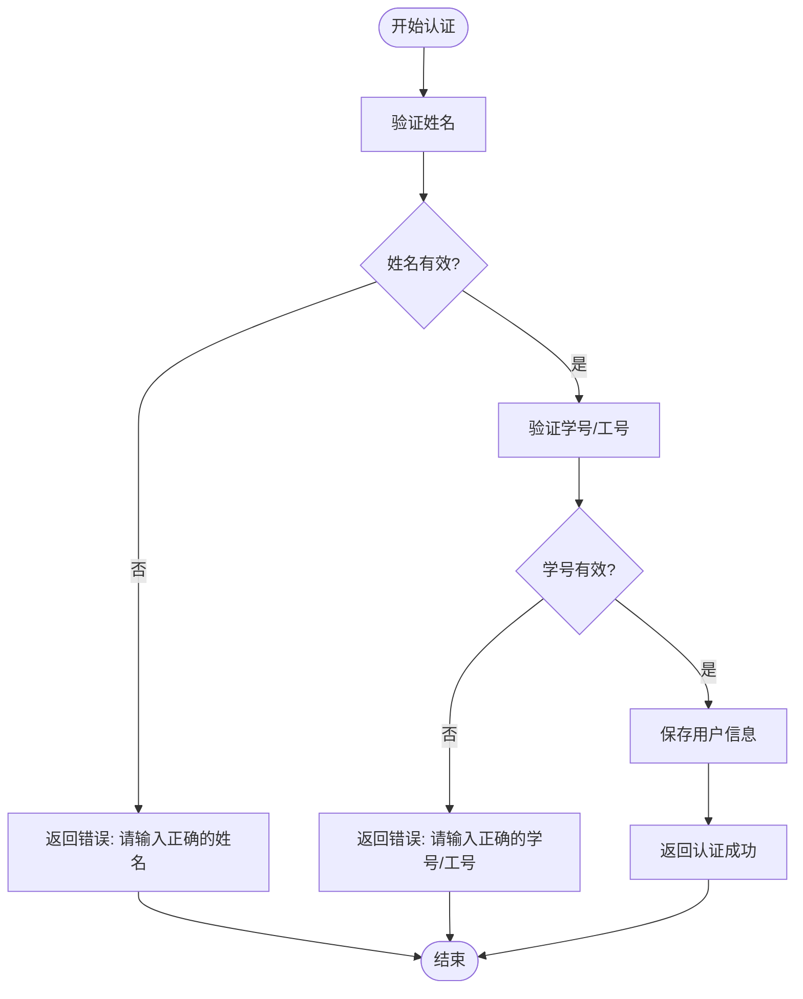
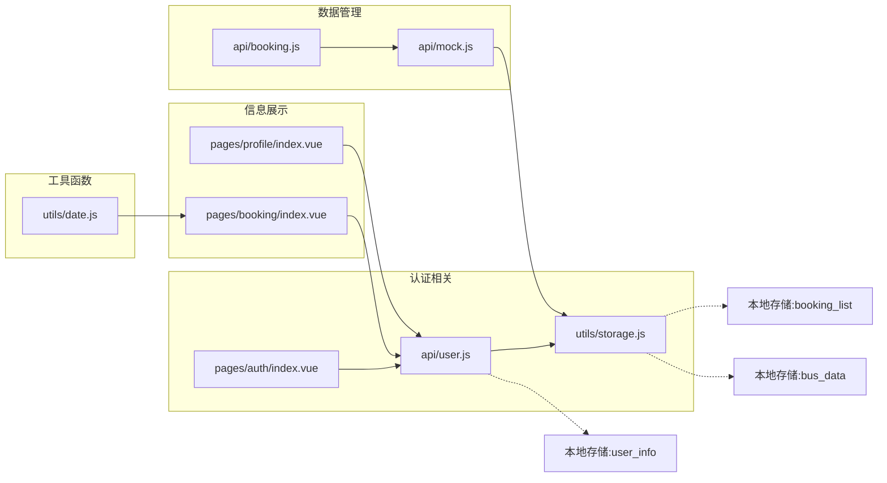
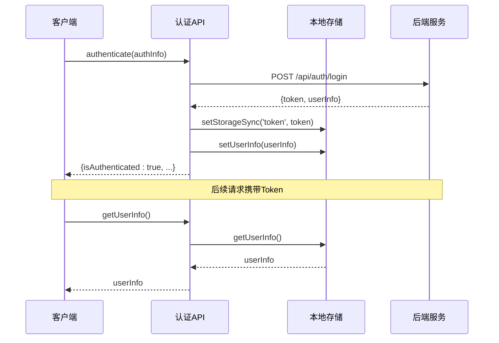

# 用户认证接口

<cite>
**本文档引用的文件**
- [api/user.js](file://api/user.js)
- [pages/auth/index.vue](file://pages/auth/index.vue)
- [utils/storage.js](file://utils/storage.js)
- [pages/profile/index.vue](file://pages/profile/index.vue)
- [pages/booking/index.vue](file://pages/booking/index.vue)
- [api/booking.js](file://api/booking.js)
- [api/mock.js](file://api/mock.js)
- [utils/date.js](file://utils/date.js)
</cite>

## 目录
1. [简介](#简介)
2. [项目结构](#项目结构)
3. [核心组件](#核心组件)
4. [架构概览](#架构概览)
5. [详细组件分析](#详细组件分析)
6. [依赖关系分析](#依赖关系分析)
7. [性能考虑](#性能考虑)
8. [故障排除指南](#故障排除指南)
9. [结论](#结论)
10. [附录](#附录)

## 简介

本项目是一个基于UniApp的校车调度系统，其中用户认证接口是整个系统的安全基础。本文档详细说明了用户认证相关的API接口，包括authenticate()认证接口、getUserInfo()用户信息获取接口和updateUserInfo()用户信息更新接口的完整规范。

系统采用本地存储机制进行用户状态管理，支持学生和教职工两种身份类型。认证流程简单直观，用户只需提供真实姓名、学号/工号和身份类型即可完成认证。

## 项目结构

项目采用模块化的文件组织结构，主要分为以下几个部分：



**图表来源**
- [api/user.js:1-128](file://api/user.js#L1-L128)
- [pages/auth/index.vue:1-385](file://pages/auth/index.vue#L1-L385)
- [utils/storage.js:1-116](file://utils/storage.js#L1-L116)

**章节来源**
- [api/user.js:1-128](file://api/user.js#L1-L128)
- [pages/auth/index.vue:1-385](file://pages/auth/index.vue#L1-L385)
- [utils/storage.js:1-116](file://utils/storage.js#L1-L116)

## 核心组件

### 用户认证API (api/user.js)

用户认证API提供了完整的身份验证功能，当前实现为本地验证模式，预留了与后端API集成的扩展点。

**章节来源**
- [api/user.js:8-128](file://api/user.js#L8-L128)

### 认证界面 (pages/auth/index.vue)

认证界面提供了用户友好的表单输入体验，包含姓名输入、学号/工号输入和身份类型选择功能。

**章节来源**
- [pages/auth/index.vue:1-385](file://pages/auth/index.vue#L1-L385)

### 本地存储工具 (utils/storage.js)

本地存储工具封装了UniApp的存储API，为用户信息和预约数据提供统一的存取接口。

**章节来源**
- [utils/storage.js:6-116](file://utils/storage.js#L6-L116)

## 架构概览

系统采用分层架构设计，各层职责明确，便于维护和扩展：



**图表来源**
- [pages/auth/index.vue:100](file://pages/auth/index.vue#L100)
- [pages/profile/index.vue:153](file://pages/profile/index.vue#L153)
- [pages/booking/index.vue:99](file://pages/booking/index.vue#L99)
- [api/user.js:6](file://api/user.js#L6)
- [api/booking.js:6](file://api/booking.js#L6)
- [utils/storage.js:10](file://utils/storage.js#L10)

## 详细组件分析

### authenticate() 认证接口

#### 接口定义
- **方法名**: authenticate(authInfo)
- **参数类型**: Object
- **返回值**: Promise<UserInfo>

#### 参数规范

| 参数名 | 类型 | 必填 | 验证规则 | 描述 |
|--------|------|------|----------|------|
| name | String | 是 | 非空且长度≥2 | 用户真实姓名 |
| studentId | String | 是 | 长度≥6 | 学号或工号 |
| userType | String | 是 | 'student' 或 'teacher' | 身份类型 |

#### 请求格式
```javascript
const authInfo = {
    name: "张三",
    studentId: "2023001234",
    userType: "student"
}
```

#### 响应格式
```javascript
{
    isAuthenticated: true,
    name: "张三",
    studentId: "2023001234",
    userType: "student",
    authenticatedAt: "2024-01-15T09:30:00.000Z"
}
```

#### 错误处理机制



**图表来源**
- [api/user.js:72-100](file://api/user.js#L72-L100)

#### 成功场景示例
- 输入: `{name: "李四", studentId: "2023005678", userType: "teacher"}`
- 输出: 用户信息对象，包含认证状态和基本信息
- 行为: 自动跳转回上一页，显示成功提示

#### 失败场景示例
- 输入: `{name: "A", studentId: "12345"}`
- 返回: `Error: 请输入正确的姓名`
- 行为: 显示错误提示，保持在认证页面

**章节来源**
- [api/user.js:72-100](file://api/user.js#L72-L100)
- [pages/auth/index.vue:155-187](file://pages/auth/index.vue#L155-L187)

### getUserInfo() 用户信息获取接口

#### 接口定义
- **方法名**: getUserInfo()
- **参数**: 无
- **返回值**: Promise<UserInfo|null>

#### 数据格式要求

用户信息对象包含以下字段：

| 字段名 | 类型 | 必填 | 描述 |
|--------|------|------|------|
| isAuthenticated | Boolean | 是 | 是否已认证 |
| name | String | 是 | 用户姓名 |
| studentId | String | 是 | 学号/工号 |
| userType | String | 是 | 身份类型 |
| authenticatedAt | String | 是 | 认证时间戳 |

#### 返回值结构
```javascript
// 已认证用户
{
    isAuthenticated: true,
    name: "张三",
    studentId: "2023001234",
    userType: "student",
    authenticatedAt: "2024-01-15T09:30:00.000Z"
}

// 未认证用户
null
```

#### 错误处理
- 本地存储读取失败时返回null
- 不抛出异常，保持调用方稳定性

**章节来源**
- [api/user.js:12-35](file://api/user.js#L12-L35)
- [utils/storage.js:10-22](file://utils/storage.js#L10-L22)

### updateUserInfo() 用户信息更新接口

#### 接口定义
- **方法名**: updateUserInfo(userInfo)
- **参数**: Object - 用户信息对象
- **返回值**: Promise<Boolean>

#### 参数验证规则

更新接口采用直接存储模式，不进行额外验证：
- 接收任意用户信息对象
- 直接覆盖存储中的用户信息
- 返回存储操作结果

#### 数据格式要求
支持任意用户信息对象，常见字段包括：
- name: 用户姓名
- studentId: 学号/工号  
- userType: 身份类型
- 其他自定义字段

#### 返回值结构
- `true`: 存储成功
- `false`: 存储失败

**章节来源**
- [api/user.js:41-66](file://api/user.js#L41-L66)
- [utils/storage.js:27-37](file://utils/storage.js#L27-L37)

## 依赖关系分析

系统各组件之间的依赖关系如下：



**图表来源**
- [pages/auth/index.vue:100](file://pages/auth/index.vue#L100)
- [pages/profile/index.vue:153](file://pages/profile/index.vue#L153)
- [pages/booking/index.vue:99](file://pages/booking/index.vue#L99)
- [api/user.js:6](file://api/user.js#L6)
- [api/booking.js:6](file://api/booking.js#L6)
- [utils/storage.js:10](file://utils/storage.js#L10)

**章节来源**
- [pages/auth/index.vue:100](file://pages/auth/index.vue#L100)
- [pages/profile/index.vue:153](file://pages/profile/index.vue#L153)
- [pages/booking/index.vue:99](file://pages/booking/index.vue#L99)
- [api/user.js:6](file://api/user.js#L6)
- [api/booking.js:6](file://api/booking.js#L6)
- [utils/storage.js:10](file://utils/storage.js#L10)

## 性能考虑

### 本地存储优化
- 使用Promise包装异步存储操作
- 避免重复的存储读取操作
- 批量操作时合并存储调用

### 认证流程优化
- 前端表单验证减少无效请求
- 防止重复提交的按钮禁用机制
- 合理的错误提示时机

### 数据缓存策略
- 页面切换时避免重复加载用户信息
- 预加载必要的基础数据
- 合理的缓存失效策略

## 故障排除指南

### 常见问题及解决方案

#### 认证失败
**症状**: 提交认证后显示错误信息
**可能原因**:
- 姓名长度不足2个字符
- 学号/工号长度不足6位
- 身份类型不是'student'或'teacher'

**解决方法**:
```javascript
// 检查表单验证
console.log('姓名长度:', this.form.name.length)
console.log('学号长度:', this.form.studentId.length)
console.log('身份类型:', this.form.userType)
```

#### 用户信息获取失败
**症状**: 个人信息页面显示未认证状态
**可能原因**:
- 本地存储中缺少user_info键
- 存储数据格式不正确

**解决方法**:
```javascript
// 检查本地存储
const userInfo = uni.getStorageSync('user_info')
console.log('用户信息:', userInfo)
```

#### 预约功能受限
**症状**: 预约页面提示需要先认证
**可能原因**:
- 本地存储中user_info不存在或未认证

**解决方法**:
```javascript
// 检查认证状态
const userInfo = uni.getStorageSync('user_info')
if (!userInfo || !userInfo.isAuthenticated) {
    // 引导用户认证
    uni.navigateTo({ url: '/pages/auth/index' })
}
```

**章节来源**
- [pages/auth/index.vue:155-187](file://pages/auth/index.vue#L155-L187)
- [pages/booking/index.vue:182-198](file://pages/booking/index.vue#L182-L198)

## 结论

本用户认证接口设计简洁实用，满足了校车调度系统的基本需求。当前实现采用本地存储模式，便于开发和测试，同时预留了与后端API集成的扩展点。

系统的主要优势：
- 简洁的认证流程，用户体验良好
- 完善的前端验证机制
- 清晰的错误处理和提示
- 良好的代码结构和可扩展性

建议的改进方向：
- 添加Token管理机制
- 实现更严格的用户信息验证
- 增加会话管理和自动登出功能
- 完善错误日志和监控

## 附录

### Token管理策略

虽然当前版本使用本地存储，但可以按以下方式迁移到Token管理：



**图表来源**
- [api/user.js:102-125](file://api/user.js#L102-L125)
- [utils/storage.js:10-22](file://utils/storage.js#L10-L22)

### 迁移步骤

从本地存储迁移到后端API的步骤：

1. **修改API接口**
   - 替换本地存储调用为HTTP请求
   - 添加Authorization头
   - 实现标准的JSON响应格式

2. **更新认证流程**
   - 修改authenticate()方法
   - 添加Token存储和管理
   - 实现自动登录检查

3. **更新页面逻辑**
   - 移除本地存储依赖
   - 添加网络请求状态处理
   - 实现错误重试机制

4. **测试验证**
   - 单元测试覆盖
   - 集成测试验证
   - 性能测试评估

### 最佳实践指南

#### 开发阶段
- 使用Mock数据进行快速迭代
- 保持API接口的一致性
- 编写完整的单元测试

#### 生产环境
- 实现完善的错误处理
- 添加请求超时和重试机制
- 优化网络请求性能
- 实施安全防护措施

#### 维护阶段
- 定期更新依赖包
- 监控系统性能指标
- 收集用户反馈并持续改进