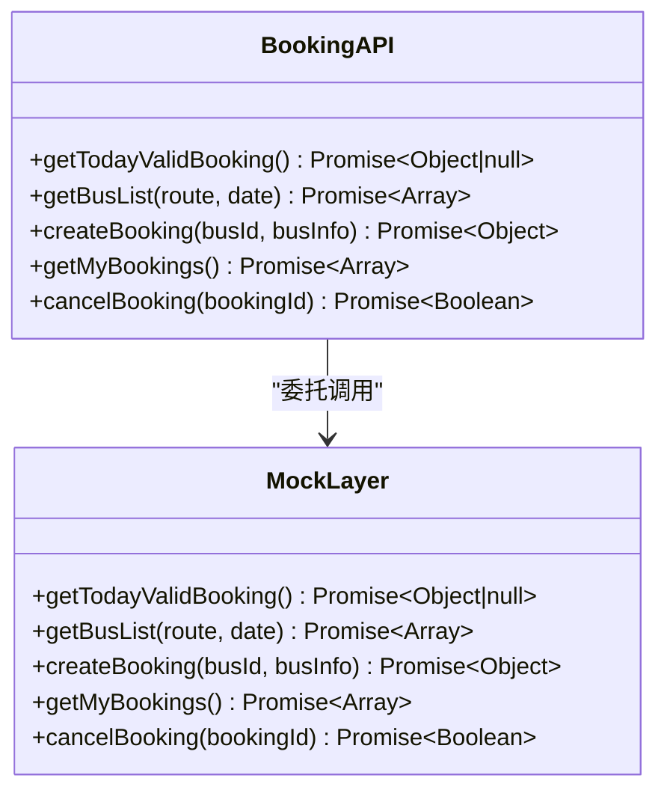
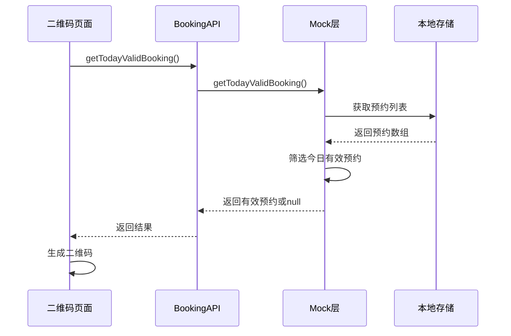
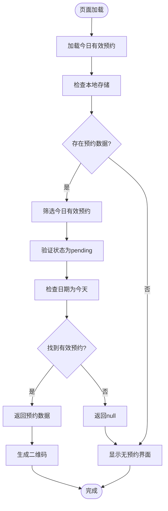
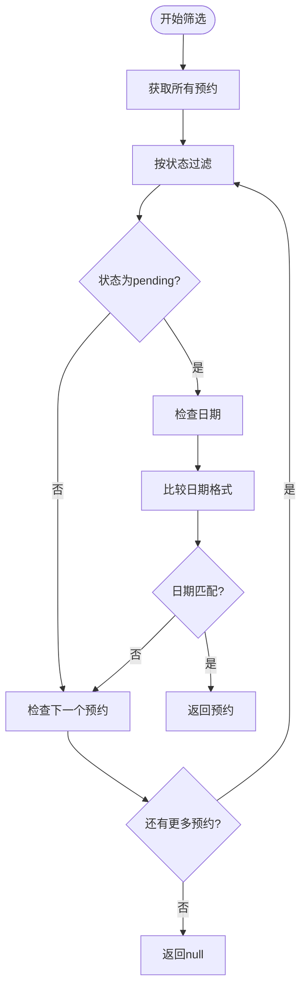
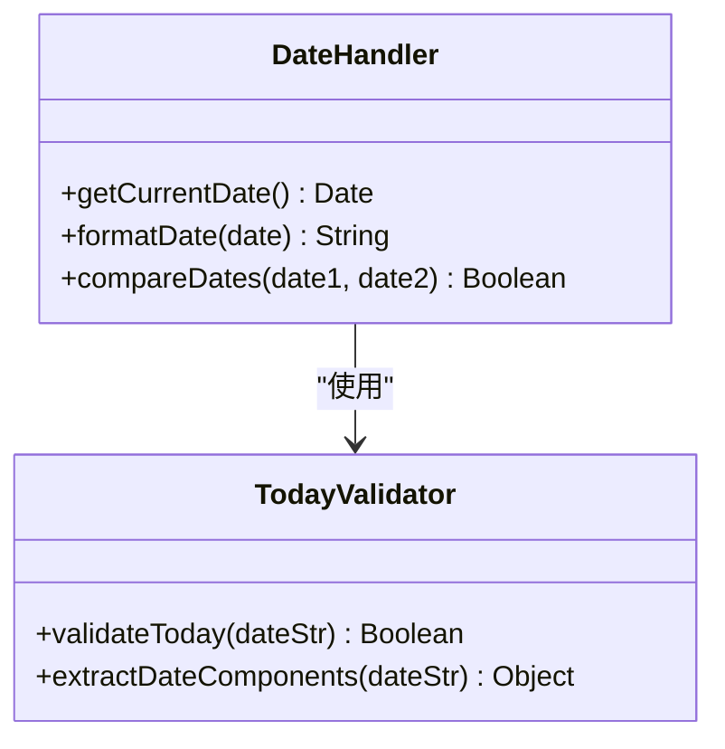
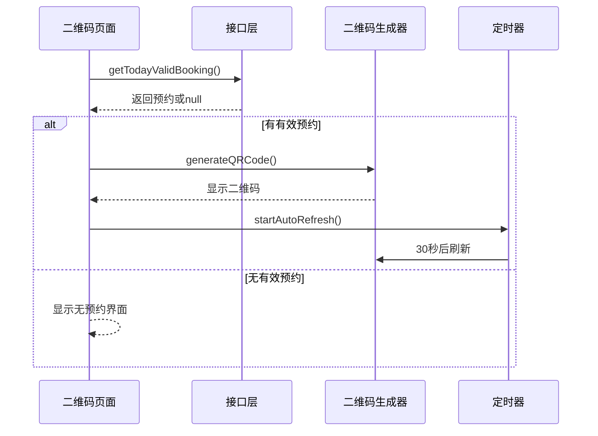
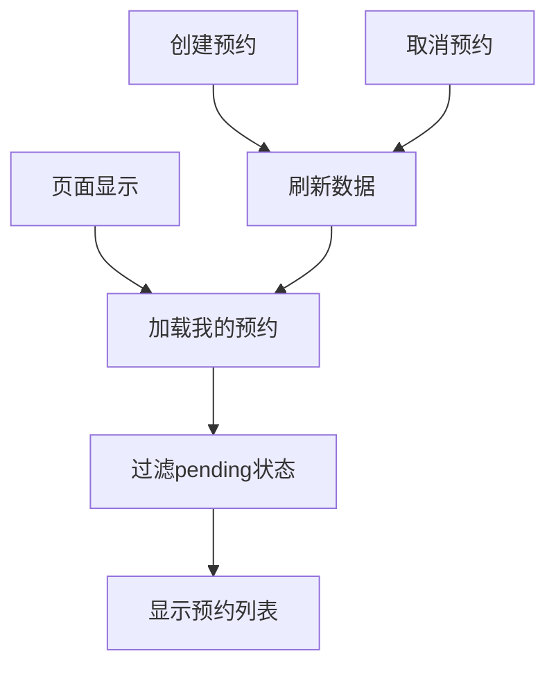
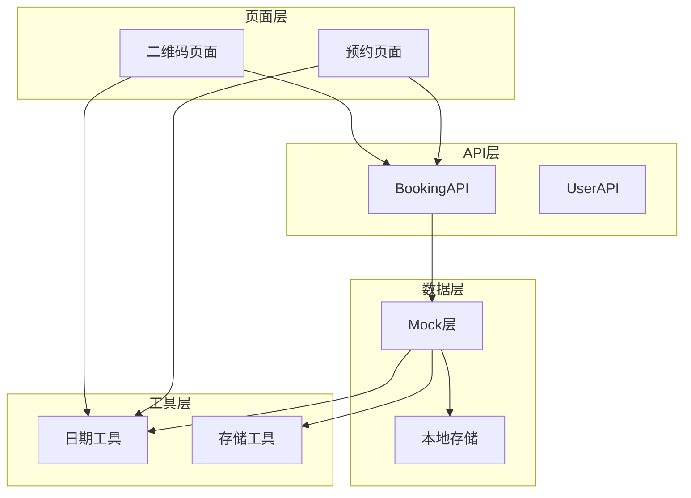

# 今日有效预约查询接口

<cite>
**本文档引用的文件**
- [api/booking.js](file://api/booking.js)
- [api/mock.js](file://api/mock.js)
- [pages/qrcode/index.vue](file://pages/qrcode/index.vue)
- [utils/date.js](file://utils/date.js)
- [pages/booking/index.vue](file://pages/booking/index.vue)
</cite>

## 目录
1. [简介](#简介)
2. [接口概述](#接口概述)
3. [核心组件](#核心组件)
4. [架构概览](#架构概览)
5. [详细组件分析](#详细组件分析)
6. [依赖关系分析](#依赖关系分析)
7. [性能考虑](#性能考虑)
8. [故障排除指南](#故障排除指南)
9. [结论](#结论)

## 简介

今日有效预约查询接口（getTodayValidBooking）是校车预约系统中的关键功能模块，专门用于查询用户当天有效的预约记录。该接口在二维码生成和乘车验证场景中发挥着重要作用，确保用户能够及时获取当天的乘车凭证。

该接口采用Mock数据层实现，使用本地存储作为数据持久化方案，为后续接入真实后端API提供了良好的扩展性。

## 接口概述

### 接口基本信息
- **接口名称**: getTodayValidBooking
- **功能描述**: 查询用户当天有效的预约记录
- **返回值**: 预约对象或null
- **调用方**: 二维码页面、预约管理页面
- **数据来源**: 本地存储的预约列表

### 接口特点
- **时效性**: 仅返回当天的预约记录
- **有效性**: 仅返回状态为"待出行"的预约
- **唯一性**: 返回第一个匹配的有效预约
- **容错性**: 无有效预约时返回null

## 核心组件

### API层组件
API层负责对外提供统一的接口访问方法，当前使用Mock数据实现：

**图表来源**
- [api/booking.js:139-163](file://api/booking.js#L139-L163)
- [api/mock.js:209-225](file://api/mock.js#L209-L225)

### 数据模型
预约记录的数据结构包含以下关键字段：

| 字段名 | 类型 | 描述 | 示例 |
|--------|------|------|------|
| id | String | 预约ID | BK_1712543200123_456 |
| busId | String | 车次ID | BUS_CW_20240409_0730 |
| route | String | 路线名称 | "长江新区至武昌" |
| date | String | 预约日期 | "2024-04-09" |
| time | String | 出发时间 | "07:30" |
| location | String | 候车位置 | "长江新区南大门" |
| seat | String | 座位号 | "A01" |
| status | String | 预约状态 | "pending" |
| createdAt | String | 创建时间 | "2024-04-08T10:30:00Z" |

**章节来源**
- [api/mock.js:120-131](file://api/mock.js#L120-L131)

## 架构概览

### 整体架构流程

**图表来源**
- [pages/qrcode/index.vue:85-101](file://pages/qrcode/index.vue#L85-L101)
- [api/booking.js:139-141](file://api/booking.js#L139-L141)
- [api/mock.js:209-225](file://api/mock.js#L209-L225)

### 数据流图

**图表来源**
- [api/mock.js:215-219](file://api/mock.js#L215-L219)

## 详细组件分析

### getTodayValidBooking实现分析

#### 核心算法逻辑

接口的核心筛选逻辑包含两个关键条件：

1. **状态验证**: `b.status === 'pending'`
2. **日期验证**: `b.date === todayStr || b.date.startsWith(todayStr.substring(5))`

**图表来源**
- [api/mock.js:215-219](file://api/mock.js#L215-L219)

#### 时间处理机制

接口使用标准JavaScript Date对象进行日期处理：

**图表来源**
- [api/mock.js:212-213](file://api/mock.js#L212-L213)
- [utils/date.js:62-69](file://utils/date.js#L62-L69)

**章节来源**
- [api/mock.js:209-225](file://api/mock.js#L209-L225)

### 二维码生成集成

#### 业务流程

当用户进入二维码页面时，系统会自动执行以下流程：

1. **加载预约**: 调用getTodayValidBooking获取有效预约
2. **状态判断**: 检查返回结果是否为null
3. **二维码生成**: 如果有有效预约，则生成动态二维码
4. **定时刷新**: 启动30秒自动刷新机制

**图表来源**
- [pages/qrcode/index.vue:85-101](file://pages/qrcode/index.vue#L85-L101)
- [pages/qrcode/index.vue:165-175](file://pages/qrcode/index.vue#L165-L175)

**章节来源**
- [pages/qrcode/index.vue:83-183](file://pages/qrcode/index.vue#L83-L183)

### 预约管理页面集成

#### 数据同步机制

预约管理页面通过以下方式与今日有效预约接口保持数据同步：

1. **页面显示时刷新**: 每次页面显示时重新加载数据
2. **状态过滤**: 仅显示状态为"pending"的预约
3. **实时更新**: 预约创建和取消后自动刷新

**图表来源**
- [pages/booking/index.vue:118-122](file://pages/booking/index.vue#L118-L122)
- [pages/booking/index.vue:138-146](file://pages/booking/index.vue#L138-L146)

**章节来源**
- [pages/booking/index.vue:124-296](file://pages/booking/index.vue#L124-L296)

## 依赖关系分析

### 组件依赖图

**图表来源**
- [api/booking.js:6](file://api/booking.js#L6)
- [api/mock.js:1](file://api/mock.js#L1)
- [utils/date.js:1](file://utils/date.js#L1)

### 关键依赖关系

1. **API层依赖**: 所有页面通过API层访问数据，便于后期替换
2. **数据层依赖**: Mock层依赖本地存储进行数据持久化
3. **工具层依赖**: 日期处理和存储操作依赖相应的工具函数

**章节来源**
- [api/booking.js:1-165](file://api/booking.js#L1-L165)
- [api/mock.js:1-226](file://api/mock.js#L1-L226)

## 性能考虑

### 时间复杂度分析
- **筛选算法**: O(n)，其中n为预约总数
- **查找效率**: 线性搜索，对于小规模数据集性能良好
- **内存使用**: O(1)额外空间，主要消耗在返回的对象上

### 优化建议
1. **索引优化**: 可以考虑按日期和状态建立索引
2. **缓存策略**: 对于频繁查询的用户，可以添加内存缓存
3. **分页加载**: 当预约数量增长时，考虑分页加载策略

### 异步处理
- **延迟模拟**: 使用setTimeout模拟网络延迟，提升用户体验
- **并发控制**: 避免重复请求，使用防抖机制

## 故障排除指南

### 常见问题及解决方案

#### 1. 无有效预约返回
**现象**: 接口返回null
**原因**: 
- 用户当天没有预约
- 预约状态不是"pending"
- 日期格式不匹配

**解决方案**:
- 检查用户是否已完成身份认证
- 确认预约状态是否为"pending"
- 验证日期格式是否正确

#### 2. 日期匹配失败
**现象**: 日期格式不匹配导致筛选失败
**原因**: 
- 日期格式不一致
- 时区处理问题

**解决方案**:
- 统一使用ISO 8601格式
- 明确时区处理逻辑

#### 3. 二维码生成异常
**现象**: 二维码无法正常显示
**原因**:
- Canvas上下文创建失败
- 定时器未正确清理

**解决方案**:
- 检查Canvas组件是否正确渲染
- 确保组件卸载时清理定时器

**章节来源**
- [pages/qrcode/index.vue:76-81](file://pages/qrcode/index.vue#L76-L81)
- [pages/qrcode/index.vue:98-100](file://pages/qrcode/index.vue#L98-L100)

### 调试技巧

1. **控制台输出**: 在关键节点添加console.log输出
2. **数据验证**: 检查本地存储中的数据格式
3. **边界测试**: 测试不同日期和状态的组合

## 结论

今日有效预约查询接口作为校车预约系统的核心功能，具有以下特点：

1. **明确的职责边界**: 专注于查询当天有效预约，功能单一且清晰
2. **良好的扩展性**: 采用Mock层设计，便于后期接入真实后端
3. **完善的错误处理**: 对无有效预约的情况提供友好的处理
4. **紧密的业务集成**: 与二维码生成和乘车验证场景紧密结合

该接口的设计充分考虑了移动应用的使用场景，通过合理的数据结构和筛选逻辑，为用户提供准确的当日乘车凭证信息。随着系统的演进，该接口将继续发挥重要作用，支撑更多的业务场景和功能需求。