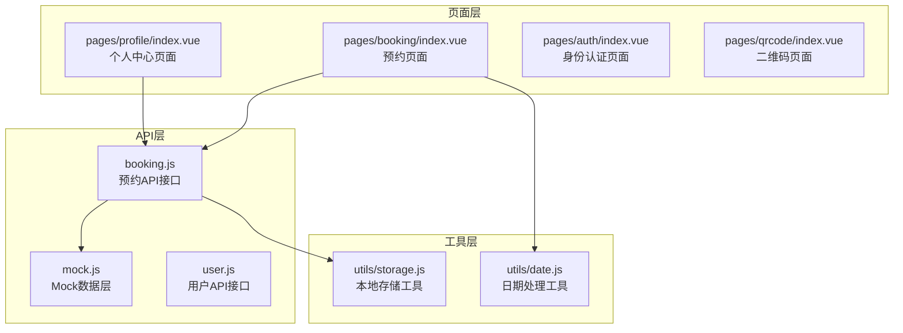
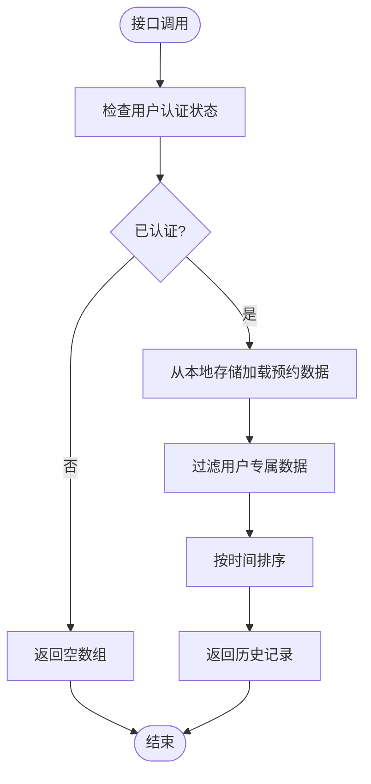
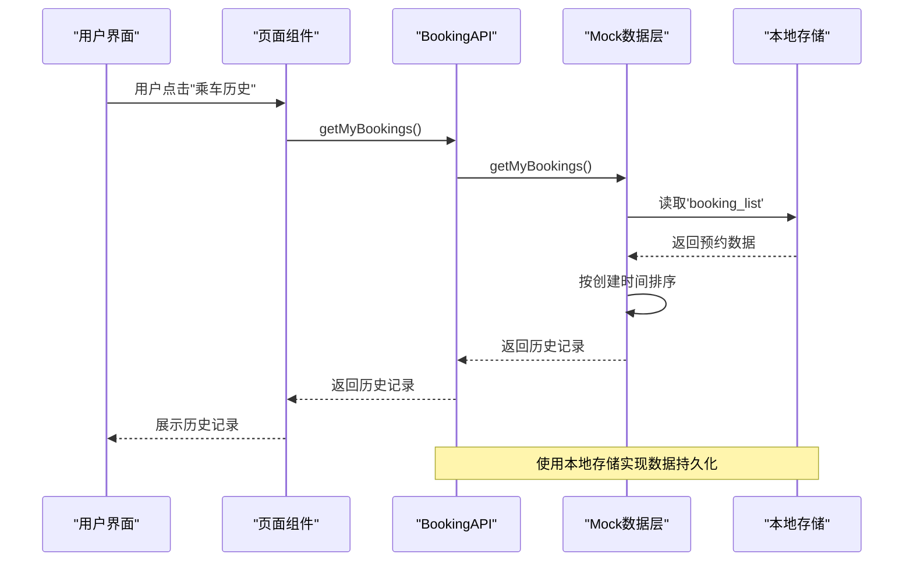
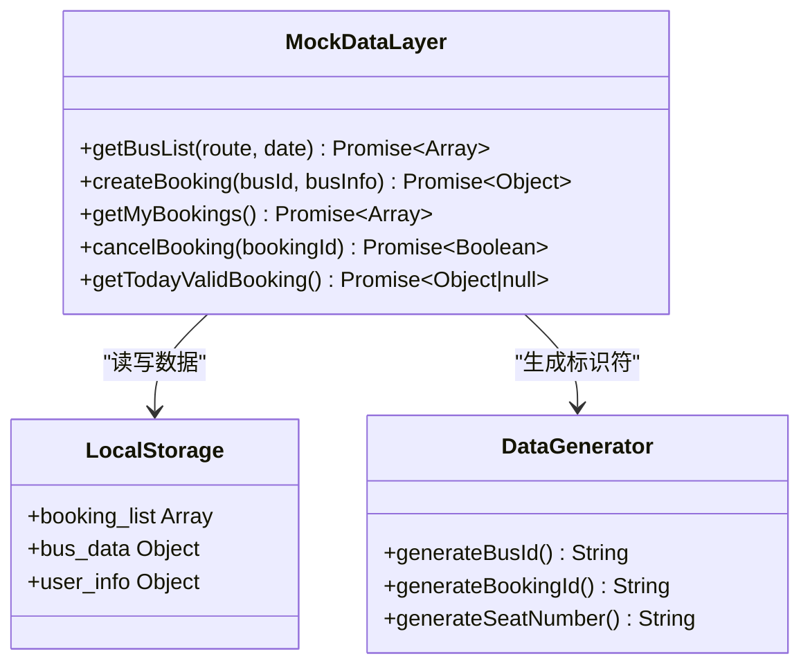
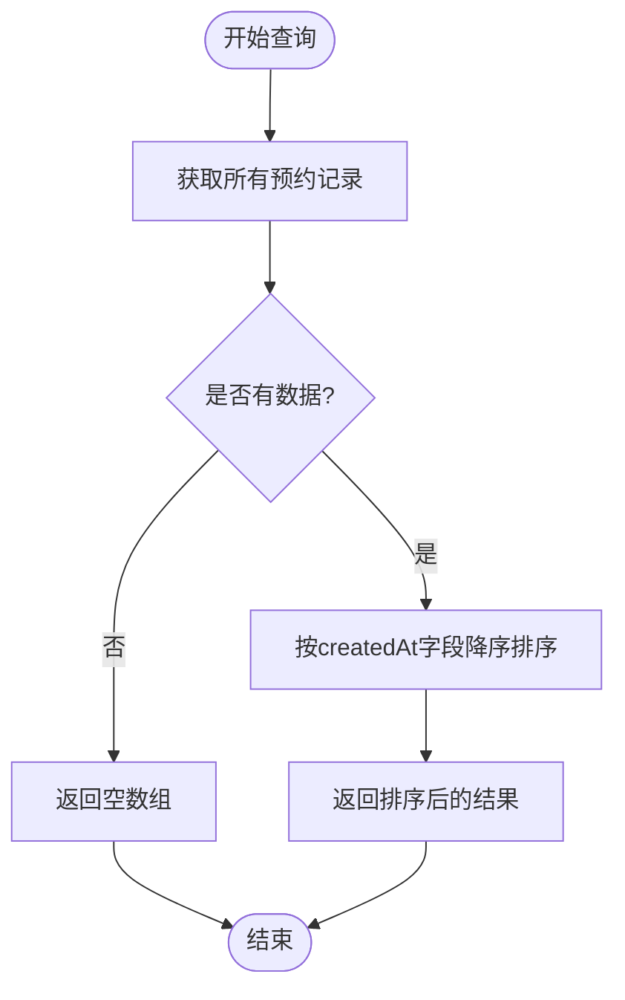
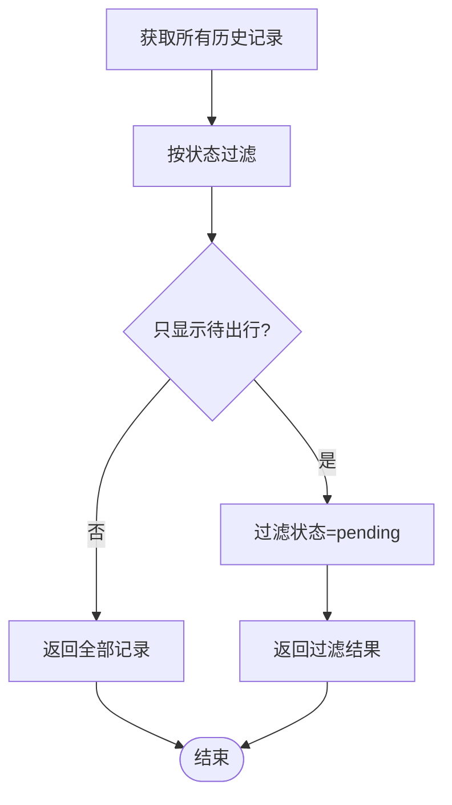
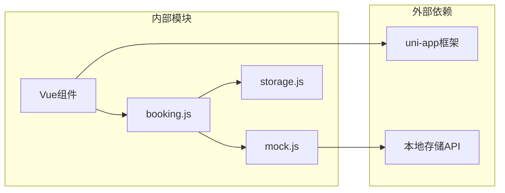
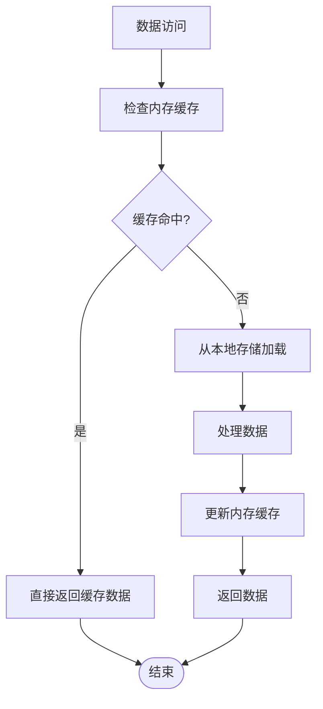

# 历史记录查询接口

<cite>
**本文档引用的文件**
- [api/booking.js](file://api/booking.js)
- [api/mock.js](file://api/mock.js)
- [pages/booking/index.vue](file://pages/booking/index.vue)
- [pages/profile/index.vue](file://pages/profile/index.vue)
- [utils/storage.js](file://utils/storage.js)
- [utils/date.js](file://utils/date.js)
</cite>

## 目录
1. [简介](#简介)
2. [项目结构](#项目结构)
3. [核心组件](#核心组件)
4. [架构概览](#架构概览)
5. [详细组件分析](#详细组件分析)
6. [依赖关系分析](#依赖关系分析)
7. [性能考虑](#性能考虑)
8. [故障排除指南](#故障排除指南)
9. [结论](#结论)

## 简介

历史记录查询接口（getMyBookings）是校车调度系统中的核心功能之一，用于获取用户的预约历史记录。该接口采用无参数设计，通过本地存储机制实现数据持久化，确保用户能够查看自己的所有预约历史，包括已完成、待出行和已取消的预约记录。

该接口当前使用Mock数据层进行开发测试，后期可无缝切换到真实的后端API服务。接口设计遵循RESTful API规范，提供简洁明了的数据结构和完善的错误处理机制。

## 项目结构

校车调度系统的前端架构采用模块化设计，主要包含以下关键目录和文件：



**图表来源**
- [api/booking.js:1-165](file://api/booking.js#L1-L165)
- [api/mock.js:1-226](file://api/mock.js#L1-L226)
- [pages/booking/index.vue:1-575](file://pages/booking/index.vue#L1-L575)
- [pages/profile/index.vue:1-595](file://pages/profile/index.vue#L1-L595)

**章节来源**
- [api/booking.js:1-165](file://api/booking.js#L1-L165)
- [api/mock.js:1-226](file://api/mock.js#L1-L226)

## 核心组件

### getMyBookings 接口概述

getMyBookings 是一个专门用于获取用户历史记录的API方法，具有以下特点：

- **无参数设计**：接口不接受任何参数，简化调用流程
- **自动权限控制**：通过本地存储机制实现用户级别的数据隔离
- **完整历史记录**：返回用户的所有预约历史，不限制状态过滤
- **排序机制**：按创建时间降序排列，最新记录优先显示

### 数据访问权限控制

系统采用基于本地存储的权限控制机制：



**图表来源**
- [api/booking.js:78-102](file://api/booking.js#L78-L102)
- [api/mock.js:158-169](file://api/mock.js#L158-L169)

**章节来源**
- [api/booking.js:75-102](file://api/booking.js#L75-L102)
- [api/mock.js:158-169](file://api/mock.js#L158-L169)

## 架构概览

历史记录查询接口在整个系统架构中的位置如下：



**图表来源**
- [pages/profile/index.vue:206-218](file://pages/profile/index.vue#L206-L218)
- [api/booking.js:78-80](file://api/booking.js#L78-L80)
- [api/mock.js:158-169](file://api/mock.js#L158-L169)

## 详细组件分析

### API接口实现

#### 接口定义与签名

getMyBookings 接口采用简洁的无参数设计，符合RESTful API的最佳实践：

```javascript
// 接口签名
getMyBookings() {
    // 当前使用mock数据
    return mock.getMyBookings()
}
```

#### Mock数据层实现

Mock数据层提供了完整的数据模拟功能：



**图表来源**
- [api/mock.js:49-225](file://api/mock.js#L49-L225)

#### 数据存储机制

系统使用uni-app的本地存储API实现数据持久化：

| 存储键名 | 数据类型 | 描述 | 示例 |
|---------|----------|------|------|
| `booking_list` | Array | 预约记录数组 | `[booking1, booking2, ...]` |
| `bus_data` | Object | 车次统计数据 | `{route_date: {time: count}}` |
| `user_info` | Object | 用户认证信息 | `{isAuthenticated: true, ...}` |

**章节来源**
- [api/mock.js:158-169](file://api/mock.js#L158-L169)
- [utils/storage.js:42-69](file://utils/storage.js#L42-L69)

### 数据结构定义

#### 历史记录数据模型

每个预约记录包含以下字段：

| 字段名 | 类型 | 必填 | 描述 | 示例值 |
|--------|------|------|------|--------|
| id | String | 是 | 预约唯一标识符 | `"BK_1703664543210_456"` |
| busId | String | 是 | 车次唯一标识符 | `"BUS_CW_20240101_0730"` |
| route | String | 是 | 行驶路线 | `"长江新区至武昌"` |
| date | String | 是 | 预约日期 | `"2024-01-01"` |
| dateDisplay | String | 否 | 显示用日期 | `"01-01 周一"` |
| time | String | 是 | 出发时间 | `"07:30"` |
| location | String | 是 | 上车地点 | `"长江新区南大门"` |
| seat | String | 是 | 分配座位号 | `"A05"` |
| status | String | 是 | 预约状态 | `"pending"` |
| createdAt | String | 是 | 创建时间 | `"2024-01-01T10:30:00Z"` |

#### 状态枚举值

预约状态支持以下三种状态：

| 状态值 | 描述 | 颜色标识 | 页面显示 |
|--------|------|----------|----------|
| `pending` | 待出行 | 蓝色 | "待出行" |
| `completed` | 已完成 | 绿色 | "已完成" |
| `cancelled` | 已取消 | 红色 | "已取消" |

**章节来源**
- [api/mock.js:120-131](file://api/mock.js#L120-L131)
- [pages/profile/index.vue:239-246](file://pages/profile/index.vue#L239-L246)

### 查询逻辑与算法

#### 排序算法

getMyBookings 接口实现了基于创建时间的降序排序：



**图表来源**
- [api/mock.js:158-169](file://api/mock.js#L158-L169)

#### 数据过滤机制

虽然接口设计为无参数，但实际应用中会根据状态进行过滤：



**图表来源**
- [pages/booking/index.vue:138-146](file://pages/booking/index.vue#L138-L146)

### 页面集成与使用

#### 个人中心页面集成

个人中心页面提供了历史记录查询的入口：

```javascript
// 历史记录按钮点击事件
async onHistory() {
    try {
        const bookings = await bookingApi.getMyBookings()
        this.historyList = bookings
        this.showHistoryModal = true
    } catch (error) {
        uni.showToast({
            title: '加载失败',
            icon: 'none'
        })
    }
}
```

#### 预约页面集成

预约页面展示了历史记录的实时更新：

```javascript
// 页面显示时刷新数据
onShow() {
    // 每次显示页面时刷新数据
    this.loadMyBookings()
    this.loadBusList()
}

// 加载历史记录
async loadMyBookings() {
    try {
        const bookings = await bookingApi.getMyBookings()
        // 只显示待出行的预约
        this.myBookings = bookings.filter(b => b.status === 'pending')
    } catch (error) {
        console.error('加载预约列表失败:', error)
    }
}
```

**章节来源**
- [pages/profile/index.vue:206-218](file://pages/profile/index.vue#L206-L218)
- [pages/booking/index.vue:118-146](file://pages/booking/index.vue#L118-L146)

## 依赖关系分析

### 组件耦合度分析



**图表来源**
- [api/booking.js:6](file://api/booking.js#L6)
- [api/mock.js:54-57](file://api/mock.js#L54-L57)

### 数据流依赖

历史记录查询涉及以下数据流向：

1. **UI触发** → **API调用** → **Mock层处理** → **本地存储读取** → **数据返回**

2. **状态管理** → **组件渲染** → **用户交互** → **数据更新** → **存储持久化**

**章节来源**
- [api/booking.js:78-80](file://api/booking.js#L78-L80)
- [api/mock.js:158-169](file://api/mock.js#L158-L169)

## 性能考虑

### 数据访问优化

#### 内存使用优化

- **懒加载策略**：只有在用户主动查询时才加载数据
- **数据缓存**：利用Vue组件的响应式特性减少重复渲染
- **异步处理**：使用Promise避免阻塞主线程

#### 存储效率优化



#### 网络延迟模拟

Mock层实现了合理的延迟模拟：
- `getMyBookings`: 300ms延迟
- `createBooking`: 500ms延迟  
- `cancelBooking`: 300ms延迟

**图表来源**
- [api/mock.js:159-168](file://api/mock.js#L159-L168)

### 扩展性考虑

#### 后端API迁移

接口设计预留了后端API迁移的完整支持：

```javascript
// 后期接入后端API的示例
return new Promise((resolve, reject) => {
    uni.request({
        url: 'http://your-python-backend/api/booking/my',
        method: 'GET',
        header: {
            'Authorization': 'Bearer ' + uni.getStorageSync('token')
        },
        success: (res) => {
            if (res.data.code === 200) {
                resolve(res.data.data)
            } else {
                reject(new Error(res.data.message))
            }
        },
        fail: (err) => {
            reject(err)
        }
    })
})
```

**章节来源**
- [api/booking.js:82-101](file://api/booking.js#L82-L101)

## 故障排除指南

### 常见问题诊断

#### 数据加载失败

**症状**：历史记录页面显示为空白或加载失败

**可能原因**：
1. 本地存储损坏或格式错误
2. 网络请求超时
3. 用户未完成身份认证

**解决方案**：
```javascript
// 添加错误处理和重试机制
async loadMyBookings() {
    try {
        const bookings = await bookingApi.getMyBookings()
        this.myBookings = bookings.filter(b => b.status === 'pending')
    } catch (error) {
        console.error('加载预约列表失败:', error)
        uni.showToast({
            title: '加载失败，请稍后重试',
            icon: 'none'
        })
    }
}
```

#### 数据同步问题

**症状**：新增预约后历史记录未及时更新

**解决方案**：
```javascript
// 在预约成功后手动刷新数据
await bookingApi.createBooking(bus.id, busInfo)
await this.loadMyBookings()
await this.loadBusList()
```

**章节来源**
- [pages/booking/index.vue:237-247](file://pages/booking/index.vue#L237-L247)
- [pages/profile/index.vue:212-218](file://pages/profile/index.vue#L212-L218)

### 调试技巧

#### 开发环境调试

1. **检查本地存储**：使用浏览器开发者工具查看`booking_list`内容
2. **监控API调用**：观察网络面板中的请求响应
3. **验证数据格式**：确保返回的数据结构符合预期

#### 生产环境监控

```javascript
// 添加数据完整性检查
function validateBookingData(bookings) {
    if (!Array.isArray(bookings)) {
        console.error('数据格式错误:', bookings)
        return false
    }
    
    for (let booking of bookings) {
        const requiredFields = ['id', 'busId', 'route', 'date', 'time', 'status']
        for (let field of requiredFields) {
            if (!booking[field]) {
                console.error('缺少必要字段:', booking)
                return false
            }
        }
    }
    
    return true
}
```

## 结论

历史记录查询接口（getMyBookings）作为校车调度系统的核心功能，展现了优秀的架构设计和用户体验考虑。其无参数设计简化了调用流程，基于本地存储的权限控制确保了数据安全，而Mock数据层的实现为后续的后端集成提供了无缝迁移路径。

### 主要优势

1. **简洁的API设计**：无参数接口降低了使用复杂度
2. **完善的数据管理**：支持多种状态的历史记录展示
3. **良好的扩展性**：预留了完整的后端API迁移方案
4. **优秀的用户体验**：实时数据更新和友好的错误处理

### 改进建议

1. **添加分页支持**：对于大量历史记录场景，建议实现分页加载
2. **增强搜索功能**：支持按日期、路线等条件筛选历史记录
3. **数据导出功能**：允许用户导出历史记录为PDF或Excel格式
4. **离线数据同步**：在网络异常情况下提供更好的数据一致性保证

该接口为整个校车调度系统的用户管理功能奠定了坚实的基础，为后续的功能扩展和性能优化提供了清晰的发展方向。