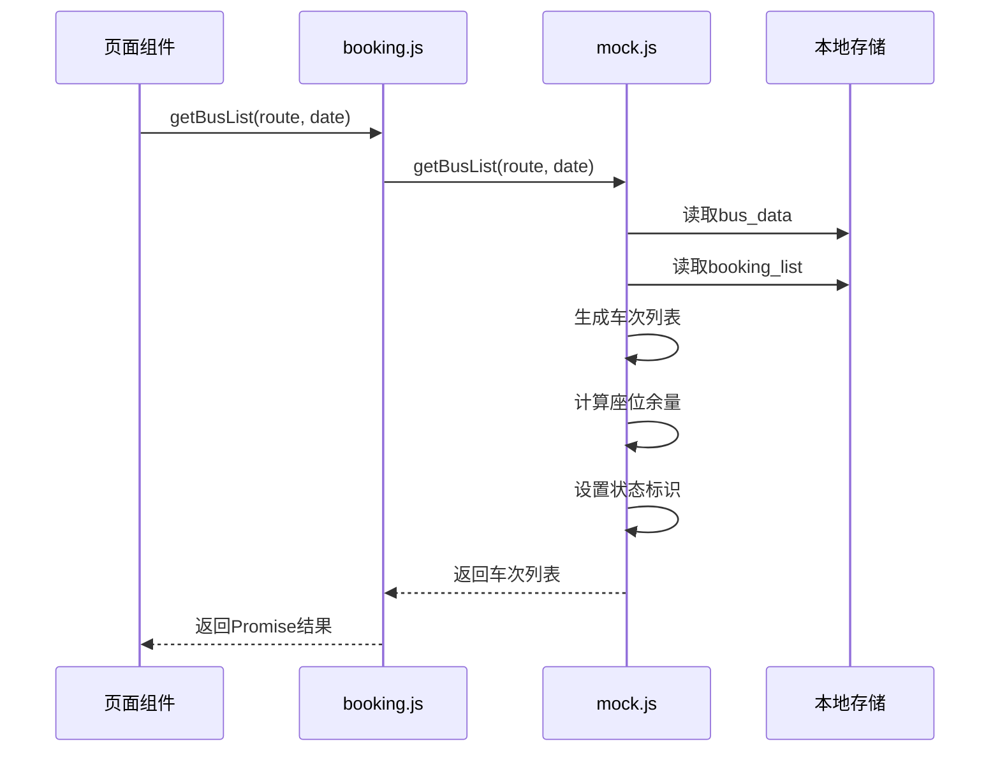
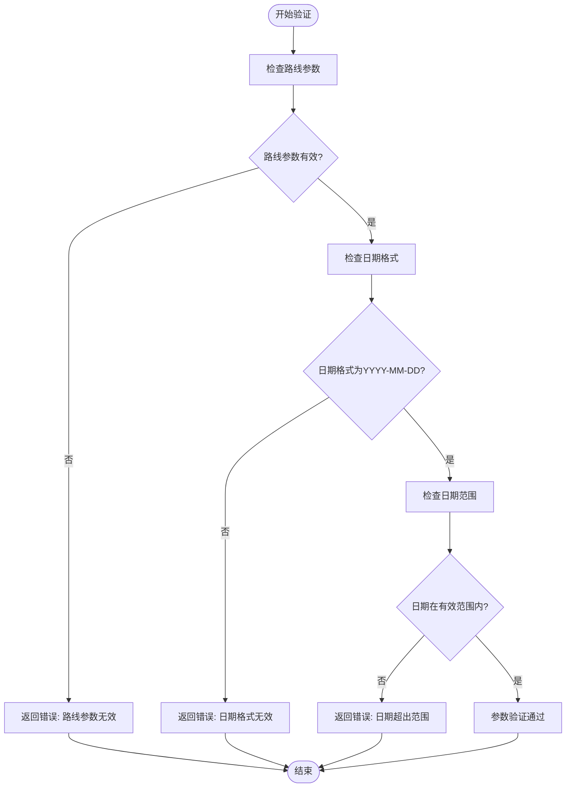
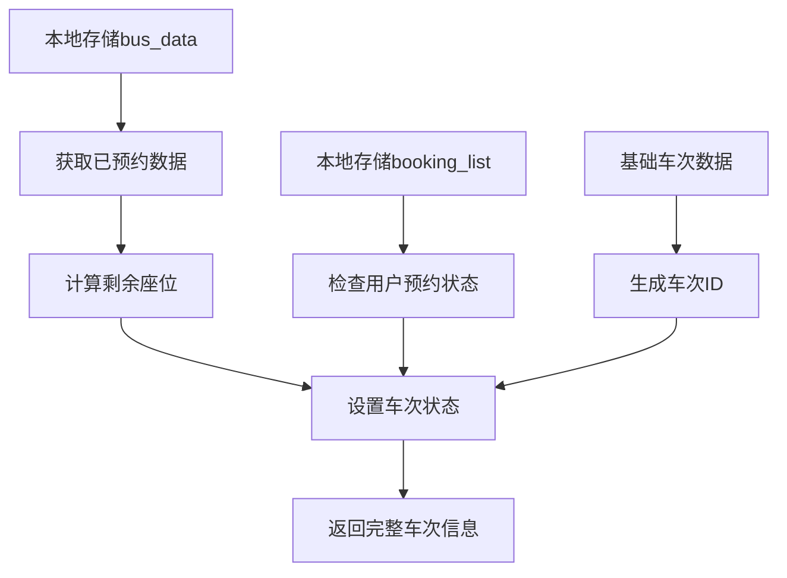
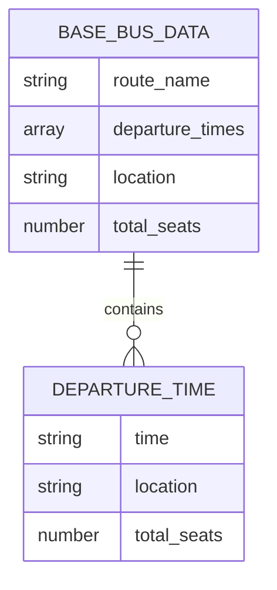
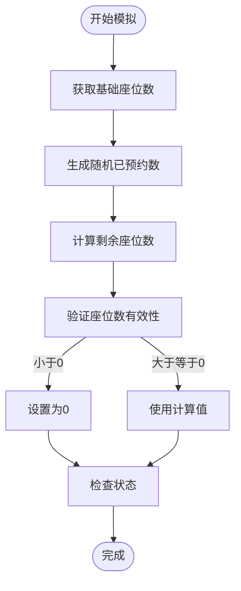
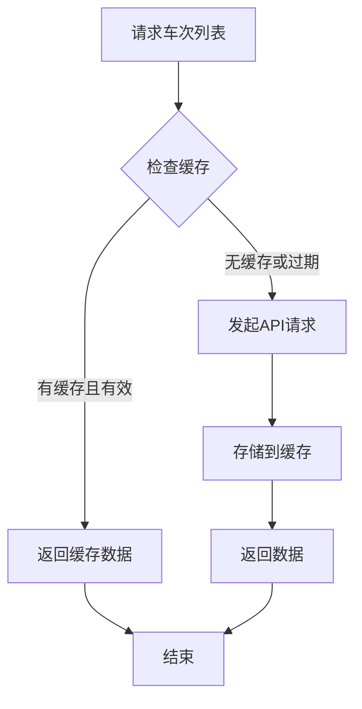
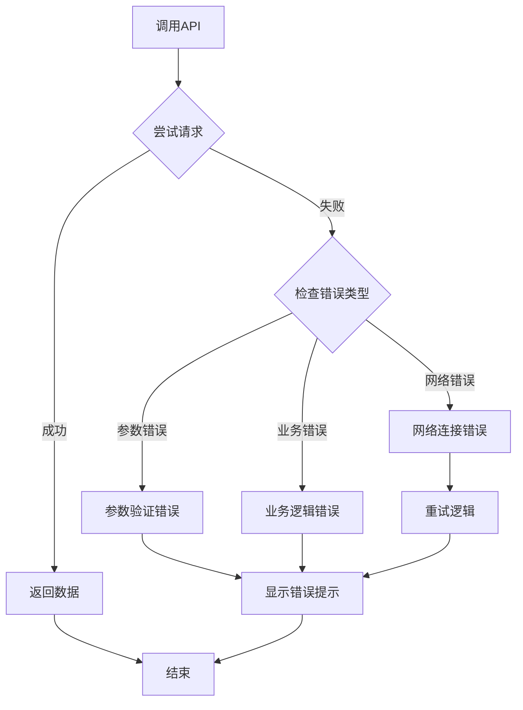

# 车次查询接口

<cite>
**本文档引用的文件**
- [api/mock.js](file://api/mock.js)
- [api/booking.js](file://api/booking.js)
- [pages/booking/index.vue](file://pages/booking/index.vue)
- [utils/date.js](file://utils/date.js)
- [PROJECT.md](file://PROJECT.md)
</cite>

## 目录
1. [简介](#简介)
2. [接口概述](#接口概述)
3. [参数规范](#参数规范)
4. [返回数据结构](#返回数据结构)
5. [Mock数据层实现](#mock数据层实现)
6. [请求响应示例](#请求响应示例)
7. [性能优化与缓存策略](#性能优化与缓存策略)
8. [错误处理](#错误处理)
9. [最佳实践](#最佳实践)
10. [总结](#总结)

## 简介

车次查询接口（getBusList）是湖北大学校车预约系统的核心功能模块，基于uni-app框架开发，为用户提供便捷的校车查询和预约服务。该接口支持双向校区间（长江新区至武昌、武昌至长江新区）的车次查询，提供实时的座位余量信息和预约状态。

## 接口概述

### 基本信息
- **接口名称**: getBusList
- **功能描述**: 获取指定路线和日期的可用校车班次列表
- **接口类型**: 异步API
- **返回类型**: Promise<Array>
- **当前实现**: Mock数据层（后期可替换为真实后端API）

### 调用流程



**图表来源**
- [api/booking.js:14-16](file://api/booking.js#L14-L16)
- [api/mock.js:49-93](file://api/mock.js#L49-L93)

## 参数规范

### 路线参数 (route)
- **类型**: String
- **必填**: 是
- **取值范围**: 
  - `"长江新区至武昌"`
  - `"武昌至长江新区"`
- **格式要求**: 精确匹配上述两个字符串之一
- **默认值**: 无

### 日期参数 (date)
- **类型**: String
- **必填**: 是
- **格式要求**: `YYYY-MM-DD`
- **取值范围**: 
  - 最小值: 当前日期
  - 最大值: 当前日期+6天（未来7天）
- **默认值**: 无

### 参数验证流程



**图表来源**
- [api/mock.js:49-53](file://api/mock.js#L49-L53)
- [utils/date.js:10-33](file://utils/date.js#L10-L33)

**章节来源**
- [api/mock.js:43-48](file://api/mock.js#L43-L48)
- [pages/booking/index.vue:151-154](file://pages/booking/index.vue#L151-L154)

## 返回数据结构

### 基本字段说明

| 字段名 | 类型 | 必填 | 描述 | 示例值 |
|--------|------|------|------|--------|
| id | String | 是 | 车次唯一标识符 | `"BUS_CW_20241201_0730"` |
| route | String | 是 | 车次路线名称 | `"长江新区至武昌"` |
| date | String | 是 | 出发日期 | `"2024-12-01"` |
| departureTime | String | 是 | 出发时间 | `"07:30"` |
| totalSeats | Number | 是 | 总座位数 | `45` |
| bookedSeats | Number | 是 | 已预约座位数 | `15` |
| remainingSeats | Number | 是 | 剩余座位数 | `30` |
| location | String | 是 | 上车地点 | `"长江新区南大门"` |
| status | String | 是 | 车次状态 | `"available"` |

### 状态枚举值

| 状态值 | 描述 | 场景说明 |
|--------|------|----------|
| `available` | 可预约 | 有剩余座位且未被当前用户预约 |
| `full` | 已满员 | 剩余座位数为0 |
| `booked` | 已预约 | 当前用户已对该车次预约 |

### 数据生成逻辑



**图表来源**
- [api/mock.js:60-88](file://api/mock.js#L60-L88)

**章节来源**
- [api/mock.js:77-87](file://api/mock.js#L77-L87)

## Mock数据层实现

### 数据结构设计

#### 基础车次数据
系统预设两条主要路线的基础车次信息：



**图表来源**
- [api/mock.js:7-20](file://api/mock.js#L7-L20)

#### 本地存储结构
系统使用微信小程序本地存储管理数据：

| 存储键 | 数据类型 | 描述 | 结构示例 |
|--------|----------|------|----------|
| `bus_data` | Object | 车次预约统计数据 | `{ "路线_日期": { "时间": 预约数量 } }` |
| `booking_list` | Array | 预约记录列表 | `[ { ... } ]` |
| `user_info` | Object | 用户身份信息 | `{ isAuthenticated: true, ... }` |

### 数据生成策略

#### 车次ID生成规则
- **格式**: `BUS_{路线代码}_{日期代码}_{时间代码}`
- **路线代码**: 
  - "长江新区至武昌" → "CW"
  - "武昌至长江新区" → "WC"
- **日期代码**: 移除分隔符的日期格式
- **时间代码**: 移除分隔符的时间格式

#### 座位数模拟算法


**图表来源**
- [api/mock.js:62-63](file://api/mock.js#L62-L63)

**章节来源**
- [api/mock.js:23-41](file://api/mock.js#L23-L41)
- [api/mock.js:54-93](file://api/mock.js#L54-L93)

## 请求响应示例

### 成功请求示例

#### 请求
```javascript
// 路线: 长江新区至武昌
// 日期: 2024-12-01
const response = await bookingApi.getBusList(
    "长江新区至武昌", 
    "2024-12-01"
);
```

#### 响应数据
```json
[
    {
        "id": "BUS_CW_20241201_0730",
        "route": "长江新区至武昌",
        "date": "2024-12-01",
        "departureTime": "07:30",
        "totalSeats": 45,
        "bookedSeats": 12,
        "remainingSeats": 33,
        "location": "长江新区南大门",
        "status": "available"
    },
    {
        "id": "BUS_CW_20241201_0900",
        "route": "长江新区至武昌",
        "date": "2024-12-01",
        "departureTime": "09:00",
        "totalSeats": 45,
        "bookedSeats": 45,
        "remainingSeats": 0,
        "location": "长江新区南大门",
        "status": "full"
    }
]
```

### 失败请求示例

#### 参数错误
```javascript
try {
    await bookingApi.getBusList("无效路线", "2024-12-01");
} catch (error) {
    console.error(error.message); // "参数错误: 路线参数无效"
}
```

#### 网络错误
```javascript
try {
    await bookingApi.getBusList("长江新区至武昌", "2024-12-01");
} catch (error) {
    console.error("请求失败:", error.message);
    uni.showToast({
        title: "加载失败",
        icon: "none"
    });
}
```

**章节来源**
- [pages/booking/index.vue:154-161](file://pages/booking/index.vue#L154-L161)

## 性能优化与缓存策略

### 当前实现特点

#### 模拟延迟
- **getBusList**: 300ms延迟
- **createBooking**: 500ms延迟  
- **cancelBooking**: 300ms延迟
- **getMyBookings**: 300ms延迟

#### 数据持久化
- 使用微信小程序本地存储
- 支持数据清理和恢复
- 预设7天的数据有效期

### 缓存策略建议

#### 前端缓存


#### 缓存配置建议
- **缓存时间**: 5分钟
- **缓存键**: `bus_list_${route}_${date}`
- **缓存失效**: 基于时间戳的TTL机制
- **缓存更新**: 异步后台刷新

### 性能优化建议

#### 1. 数据预加载
- 预加载未来7天的车次数据
- 缓存热门路线的车次信息
- 实现智能预取机制

#### 2. 分页加载
- 实现虚拟滚动
- 懒加载机制
- 滚动位置保持

#### 3. 并发优化
- 批量数据请求
- 请求去重
- 错误重试机制

## 错误处理

### 错误类型分类

#### 参数验证错误
- **路线参数无效**: 路线不在预设列表中
- **日期格式错误**: 不符合YYYY-MM-DD格式
- **日期范围超限**: 日期超出未来7天范围

#### 网络请求错误
- **请求超时**: 服务器响应时间过长
- **连接失败**: 网络不可用
- **服务器错误**: 5xx状态码

#### 业务逻辑错误
- **数据不存在**: 查询不到对应车次
- **权限不足**: 用户未认证
- **状态冲突**: 车次状态异常

### 错误处理流程



**图表来源**
- [pages/booking/index.vue:155-161](file://pages/booking/index.vue#L155-L161)

**章节来源**
- [pages/booking/index.vue:155-161](file://pages/booking/index.vue#L155-L161)

## 最佳实践

### 前端使用建议

#### 参数验证
```javascript
// 建议在调用前进行参数验证
function validateGetBusListParams(route, date) {
    const validRoutes = ['长江新区至武昌', '武昌至长江新区'];
    const dateRegex = /^\d{4}-\d{2}-\d{2}$/;
    
    if (!validRoutes.includes(route)) {
        throw new Error('无效的路线参数');
    }
    
    if (!dateRegex.test(date)) {
        throw new Error('日期格式必须为YYYY-MM-DD');
    }
    
    // 验证日期范围
    const inputDate = new Date(date);
    const today = new Date();
    const maxDate = new Date();
    maxDate.setDate(today.getDate() + 6);
    
    if (inputDate < today || inputDate > maxDate) {
        throw new Error('日期必须在今天到未来6天之间');
    }
}
```

#### 错误处理
```javascript
// 建议的错误处理模式
async function safeGetBusList(route, date) {
    try {
        validateGetBusListParams(route, date);
        const result = await bookingApi.getBusList(route, date);
        return result;
    } catch (error) {
        console.error('车次查询失败:', error);
        uni.showToast({
            title: error.message || '查询失败',
            icon: 'none'
        });
        return [];
    }
}
```

### 后端对接准备

#### 接口迁移指南
当从Mock数据迁移到真实后端时，只需修改`api/booking.js`中的实现：

```javascript
// 当前实现（Mock）
getBusList(route, date) {
    return mock.getBusList(route, date)
}

// 后端实现模板
getBusList(route, date) {
    return new Promise((resolve, reject) => {
        uni.request({
            url: 'http://your-backend/api/bus/list',
            method: 'POST',
            data: { route, date },
            header: {
                'Content-Type': 'application/json',
                'Authorization': 'Bearer ' + uni.getStorageSync('token')
            },
            success: (res) => {
                if (res.data.code === 200) {
                    resolve(res.data.data)
                } else {
                    reject(new Error(res.data.message))
                }
            },
            fail: (err) => {
                reject(err)
            }
        })
    })
}
```

**章节来源**
- [api/booking.js:18-39](file://api/booking.js#L18-L39)

## 总结

车次查询接口（getBusList）作为校车预约系统的核心功能，具有以下特点：

### 技术优势
- **模块化设计**: 清晰的API层分离，便于后期替换
- **Mock数据**: 完整的模拟数据实现，支持快速开发测试
- **本地存储**: 基于微信小程序的本地存储机制
- **状态管理**: 完善的车次状态标识和业务逻辑

### 功能特性
- **双路线支持**: 长沙新区至武昌、武昌至长江新区双向
- **实时状态**: 动态计算座位余量和预约状态
- **未来7天**: 支持未来一周的车次查询
- **用户友好**: 完整的错误处理和用户体验

### 发展规划
- **后端对接**: 已预留完整的后端API接口迁移方案
- **性能优化**: 支持缓存策略和并发优化
- **扩展性**: 易于添加新的路线和功能特性

该接口为整个校车预约系统奠定了坚实的技术基础，为后续的功能扩展和性能优化提供了良好的架构支撑。