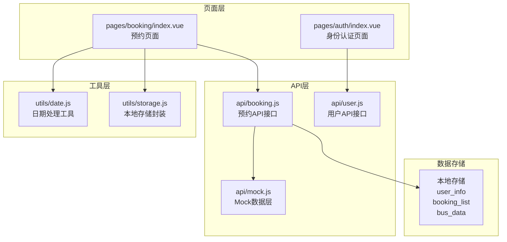
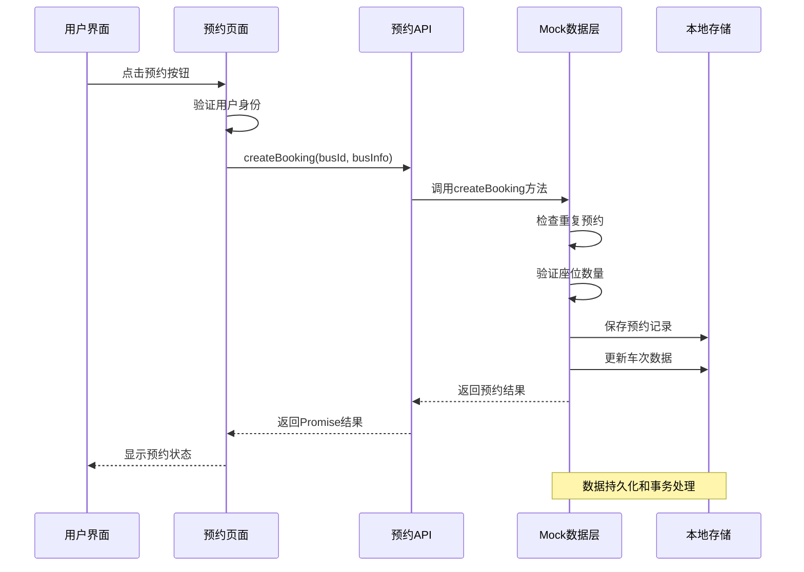
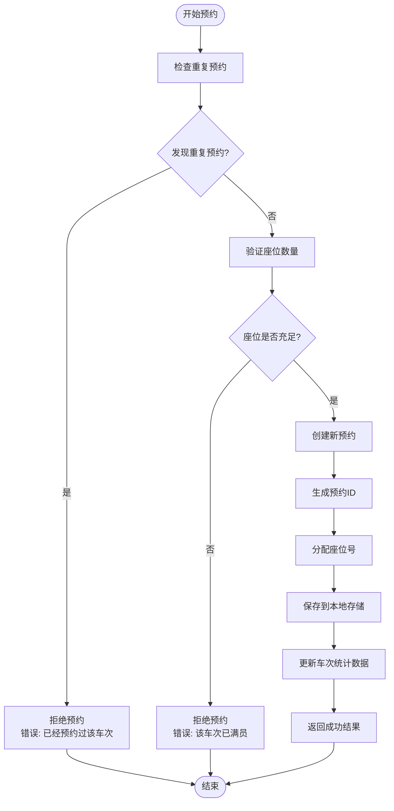
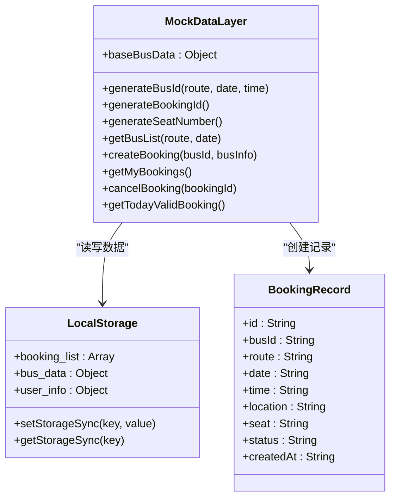
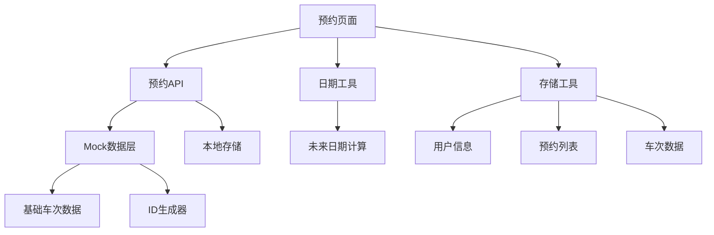

# 预约创建接口

<cite>
**本文档引用的文件**
- [api/booking.js](file://api/booking.js)
- [api/mock.js](file://api/mock.js)
- [pages/booking/index.vue](file://pages/booking/index.vue)
- [utils/date.js](file://utils/date.js)
- [utils/storage.js](file://utils/storage.js)
- [PROJECT.md](file://PROJECT.md)
</cite>

## 目录
1. [简介](#简介)
2. [项目结构](#项目结构)
3. [核心组件](#核心组件)
4. [架构概览](#架构概览)
5. [详细组件分析](#详细组件分析)
6. [依赖关系分析](#依赖关系分析)
7. [性能考虑](#性能考虑)
8. [故障排除指南](#故障排除指南)
9. [结论](#结论)

## 简介

本文档详细说明了学校校车预约系统中的预约创建接口（createBooking）的完整API文档。该系统基于uni-app框架开发，采用Mock数据层实现，为湖北大学师生提供便捷的校车查询、预约、乘车管理服务。

预约创建接口是整个预约系统的核心功能，负责处理用户的车次预约请求，包括座位验证、冲突检查、状态管理和数据持久化等功能。系统当前使用本地存储作为数据持久化层，支持座位数量的实时更新和预约状态的跟踪管理。

## 项目结构

系统采用模块化的项目结构，主要包含以下关键目录和文件：



**图表来源**
- [PROJECT.md:41-67](file://PROJECT.md#L41-L67)
- [PROJECT.md:113-134](file://PROJECT.md#L113-L134)

**章节来源**
- [PROJECT.md:41-67](file://PROJECT.md#L41-L67)
- [PROJECT.md:113-134](file://PROJECT.md#L113-L134)

## 核心组件

### 预约创建接口概述

预约创建接口（createBooking）是系统中最核心的功能模块，负责处理用户对特定车次的预约请求。该接口接收两个主要参数：车次ID（busId）和车次信息对象（busInfo），并返回一个包含完整预约信息的对象。

### 参数结构要求

#### busId 车次ID参数
- **类型**: 字符串（String）
- **格式**: BUS_CW_YYYYMMDD_HHMM 或 BUS_WC_YYYYMMDD_HHMM
- **规则**: 
  - BUS_ 前缀标识车次
  - CW/WC 后缀标识方向（长江新区至武昌/武昌至长江新区）
  - YYYYMMDD 日期编码
  - HHMM 时间编码
- **示例**: BUS_CW_20240115_0930

#### busInfo 车次信息对象
busInfo 对象包含以下必需字段：

| 字段名 | 类型 | 必需 | 描述 | 示例 |
|--------|------|------|------|------|
| route | String | 是 | 路线名称 | "长江新区至武昌" |
| date | String | 是 | 预约日期 | "2024-01-15" |
| departureTime | String | 是 | 出发时间 | "09:30" |
| location | String | 是 | 上车地点 | "长江新区南大门" |
| remainingSeats | Number | 是 | 剩余座位数 | 15 |
| bookedSeats | Number | 是 | 已预约座位数 | 30 |

**章节来源**
- [api/booking.js:47-73](file://api/booking.js#L47-L73)
- [api/mock.js:95-152](file://api/mock.js#L95-L152)

## 架构概览

系统采用分层架构设计，确保各层职责清晰分离：



**图表来源**
- [pages/booking/index.vue:176-247](file://pages/booking/index.vue#L176-L247)
- [api/booking.js:47-73](file://api/booking.js#L47-L73)
- [api/mock.js:101-152](file://api/mock.js#L101-L152)

## 详细组件分析

### 预约创建流程

#### 主要处理步骤

1. **参数验证阶段**
   - 检查busId格式合法性
   - 验证busInfo对象完整性
   - 确认必需字段存在

2. **重复预约检查**
   - 查询本地存储中的预约列表
   - 检索相同busId且状态为pending的预约
   - 如果存在则拒绝重复预约

3. **座位验证机制**
   - 检查busInfo.remainingSeats是否大于0
   - 验证座位数量充足性
   - 实时计算座位占用情况

4. **预约创建阶段**
   - 生成唯一的预约ID
   - 分配随机座位号
   - 设置初始状态为pending
   - 记录创建时间戳

5. **数据持久化**
   - 保存预约记录到booking_list
   - 更新车次数据统计
   - 维护座位数量一致性

#### 座位验证机制



**图表来源**
- [api/mock.js:101-152](file://api/mock.js#L101-L152)

#### 冲突检查逻辑

系统实现了多层次的冲突检查机制：

1. **用户级冲突检查**
   - 检查同一用户在同一车次上的重复预约
   - 防止用户恶意刷票行为

2. **座位级冲突检查**
   - 基于remainingSeats字段的实时验证
   - 预防超卖情况发生

3. **状态级冲突检查**
   - 仅对状态为pending的预约进行冲突判断
   - 避免对已完成或已取消的预约产生影响

#### 状态管理

预约状态采用简单而有效的状态模型：

| 状态值 | 描述 | 用途 |
|--------|------|------|
| pending | 待出行 | 预约已创建但未乘车 |
| completed | 已完成 | 乘客已乘车 |
| cancelled | 已取消 | 预约已被取消 |

**章节来源**
- [api/mock.js:101-152](file://api/mock.js#L101-L152)
- [pages/booking/index.vue:249-257](file://pages/booking/index.vue#L249-L257)

### Mock数据层实现

#### 数据结构设计

系统使用三个主要的数据存储键：

1. **user_info**: 用户身份信息
   - 包含姓名、学号/工号、身份类型
   - 用于预约权限验证

2. **booking_list**: 预约记录列表
   - 存储所有用户的预约信息
   - 支持按时间排序和状态过滤

3. **bus_data**: 车次统计数据
   - 按路线和日期组织的座位占用数据
   - 支持实时座位数量计算

#### 数据持久化策略



**图表来源**
- [api/mock.js:6-41](file://api/mock.js#L6-L41)
- [api/mock.js:95-226](file://api/mock.js#L95-L226)

#### 事务处理机制

Mock数据层实现了基本的事务处理能力：

1. **原子性保证**
   - 预约创建和座位更新在同一个Promise中完成
   - 确保数据一致性

2. **回滚机制**
   - 预约创建失败时自动回滚座位数量
   - 防止数据不一致状态

3. **并发控制**
   - 使用同步存储操作避免竞态条件
   - 确保多用户场景下的数据安全

**章节来源**
- [api/mock.js:101-152](file://api/mock.js#L101-L152)
- [api/mock.js:176-203](file://api/mock.js#L176-L203)

### 请求响应示例

#### 成功响应示例

成功的预约创建将返回包含完整预约信息的对象：

```javascript
{
  "id": "BK_1705321800123_456",
  "busId": "BUS_CW_20240115_0930",
  "route": "长江新区至武昌",
  "date": "2024-01-15",
  "dateDisplay": "01-15 周一",
  "time": "09:30",
  "location": "长江新区南大门",
  "seat": "B07",
  "status": "pending",
  "createdAt": "2024-01-15T08:30:00.000Z"
}
```

#### 异常情况处理

**座位已满异常**
- **错误消息**: "该车次已满员"
- **触发条件**: busInfo.remainingSeats <= 0
- **处理方式**: 拒绝预约请求

**重复预约异常**
- **错误消息**: "您已经预约过该车次"
- **触发条件**: 发现相同busId且状态为pending的预约
- **处理方式**: 返回错误信息给用户

**章节来源**
- [api/mock.js:104-117](file://api/mock.js#L104-L117)

## 依赖关系分析

系统各组件之间的依赖关系如下：



**图表来源**
- [pages/booking/index.vue:99-100](file://pages/booking/index.vue#L99-L100)
- [api/booking.js:6](file://api/booking.js#L6)
- [api/mock.js:6-41](file://api/mock.js#L6-L41)

### 组件耦合度分析

- **低耦合设计**: API层与页面层通过接口隔离
- **高内聚性**: Mock数据层集中处理业务逻辑
- **可扩展性**: 支持后期替换为真实后端API

**章节来源**
- [PROJECT.md:123-134](file://PROJECT.md#L123-L134)

## 性能考虑

### 响应时间优化

系统通过以下机制优化响应性能：

1. **异步处理**: 所有数据操作采用Promise异步执行
2. **延迟模拟**: 使用setTimeout模拟网络延迟，提升用户体验
3. **缓存策略**: 本地存储减少重复数据获取

### 内存使用优化

- **数据压缩**: 预约记录采用精简结构存储
- **按需加载**: 页面切换时才加载相关数据
- **垃圾回收**: 及时清理不再使用的临时变量

## 故障排除指南

### 常见问题及解决方案

**问题1: 预约功能无法使用**
- **可能原因**: 未完成身份认证
- **解决方法**: 先访问身份认证页面完成认证

**问题2: 座位显示异常**
- **可能原因**: 本地存储数据损坏
- **解决方法**: 清除本地存储后重新启动应用

**问题3: 预约状态不更新**
- **可能原因**: 页面未刷新数据
- **解决方法**: 返回上一页重新进入或手动刷新

### 错误处理机制

系统实现了完善的错误处理机制：

1. **前端错误处理**: 页面层捕获并显示错误信息
2. **后端错误处理**: API层统一处理异常情况
3. **数据一致性**: 确保错误情况下数据状态正确

**章节来源**
- [pages/booking/index.vue:182-198](file://pages/booking/index.vue#L182-L198)
- [pages/booking/index.vue:240-246](file://pages/booking/index.vue#L240-L246)

## 结论

预约创建接口（createBooking）作为学校校车预约系统的核心功能，实现了完整的座位验证、冲突检查和状态管理机制。通过Mock数据层的设计，系统提供了完整的功能演示，同时保持了良好的可扩展性，便于后期替换为真实的后端API。

系统的主要优势包括：
- **用户友好**: 直观的界面设计和流畅的操作体验
- **功能完整**: 覆盖预约全流程的关键环节
- **数据安全**: 严格的冲突检查和状态管理
- **易于维护**: 清晰的代码结构和模块化设计

未来可以进一步优化的方向包括：集成真实的后端API、增强数据安全机制、添加更多业务规则验证等。