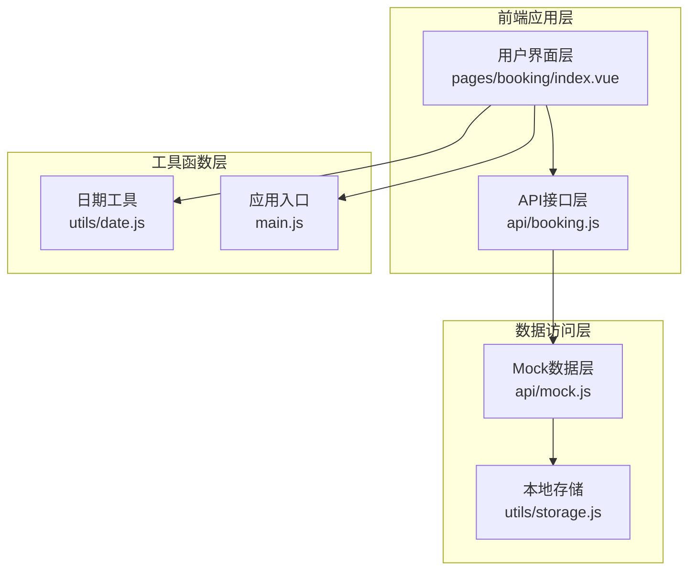
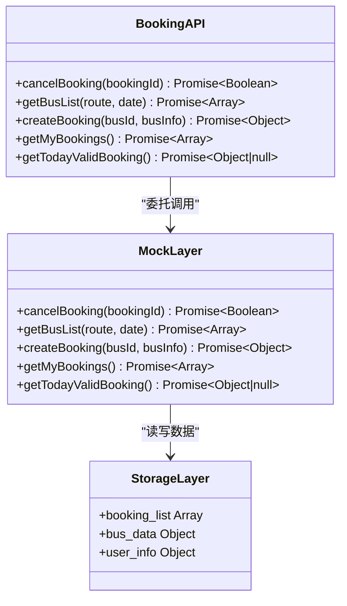
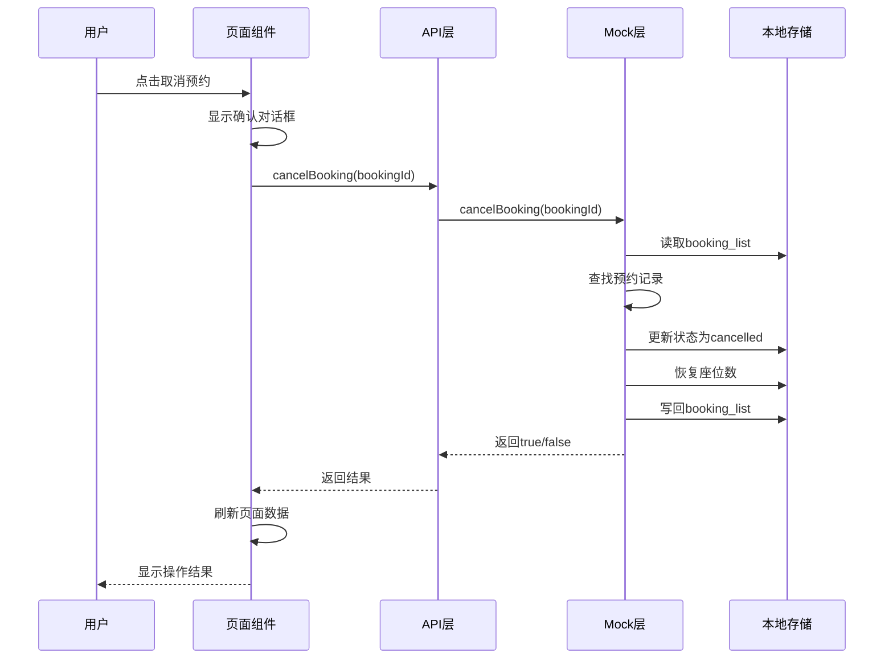
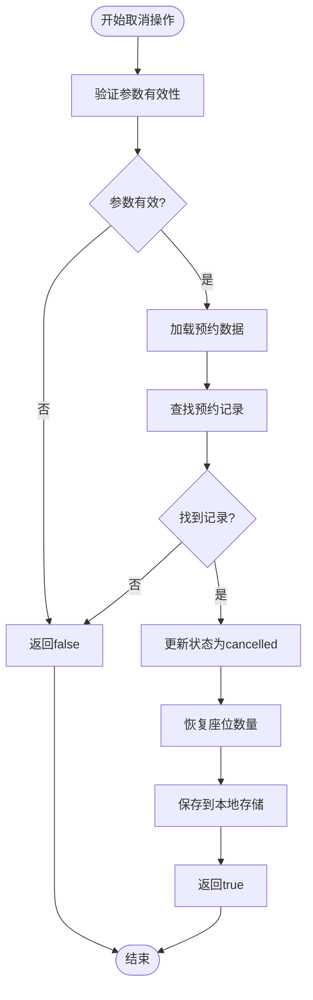
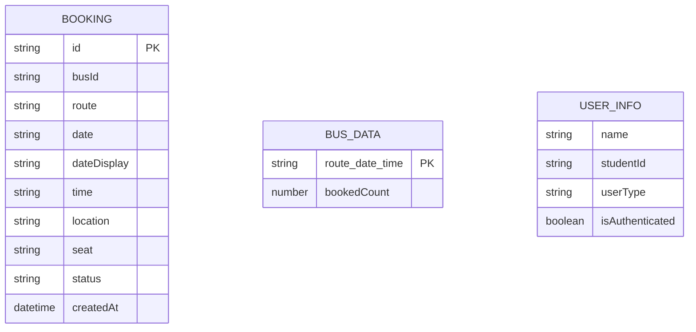
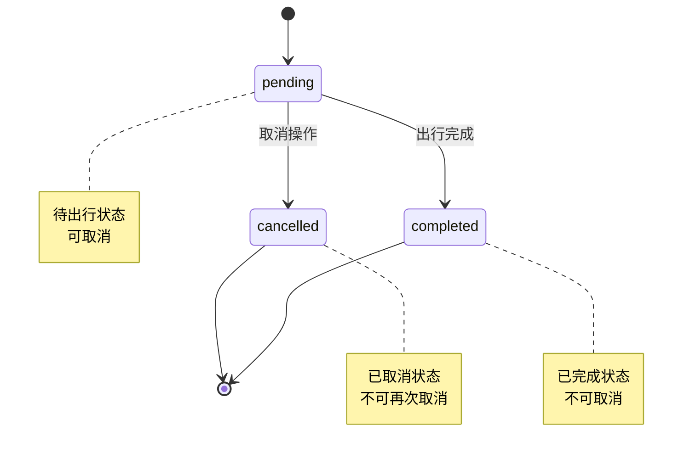
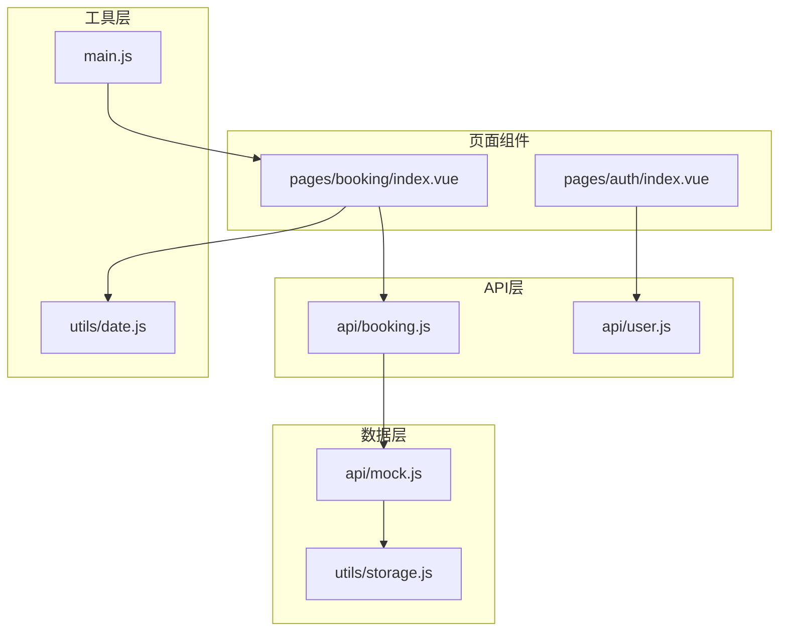
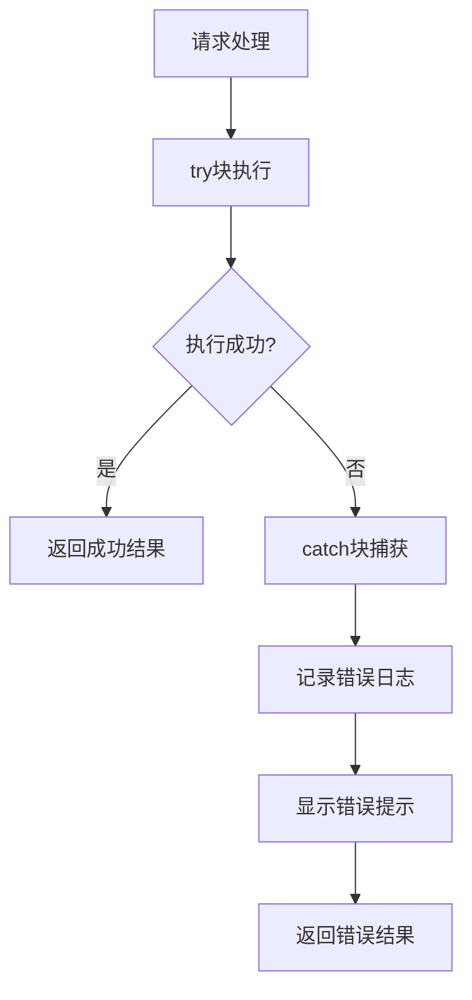

# 预约取消接口

<cite>
**本文档引用的文件**
- [api/booking.js](file://api/booking.js)
- [api/mock.js](file://api/mock.js)
- [pages/booking/index.vue](file://pages/booking/index.vue)
- [utils/date.js](file://utils/date.js)
- [utils/storage.js](file://utils/storage.js)
- [main.js](file://main.js)
</cite>

## 目录
1. [简介](#简介)
2. [项目结构](#项目结构)
3. [核心组件](#核心组件)
4. [架构概览](#架构概览)
5. [详细组件分析](#详细组件分析)
6. [依赖关系分析](#依赖关系分析)
7. [性能考虑](#性能考虑)
8. [故障排除指南](#故障排除指南)
9. [结论](#结论)

## 简介

本文档详细说明了学校班车预约系统的预约取消接口（cancelBooking）的完整API规范。该系统采用UniApp框架开发，使用Mock数据层进行模拟操作，支持预约取消功能。文档涵盖了参数要求、验证规则、业务逻辑、错误处理以及并发安全等方面。

## 项目结构

系统采用模块化架构设计，主要包含以下核心模块：

**图表来源**
- [pages/booking/index.vue:1-575](file://pages/booking/index.vue#L1-L575)
- [api/booking.js:1-165](file://api/booking.js#L1-L165)
- [api/mock.js:1-226](file://api/mock.js#L1-L226)

**章节来源**
- [pages/booking/index.vue:1-575](file://pages/booking/index.vue#L1-L575)
- [api/booking.js:1-165](file://api/booking.js#L1-L165)
- [api/mock.js:1-226](file://api/mock.js#L1-L226)

## 核心组件

### 预约取消接口定义

预约取消接口位于API层，提供统一的接口调用方法：

**图表来源**
- [api/booking.js:8-165](file://api/booking.js#L8-L165)
- [api/mock.js:176-203](file://api/mock.js#L176-L203)
- [utils/storage.js:1-116](file://utils/storage.js#L1-L116)

### 接口参数规范

| 参数名称 | 类型 | 必填 | 描述 | 格式要求 |
|---------|------|------|------|----------|
| bookingId | String | 是 | 预约唯一标识符 | BK_ + 时间戳 + 随机数 |
| route | String | 否 | 路线名称 | 长江新区至武昌 或 武昌至长江新区 |
| date | String | 否 | 预约日期 | YYYY-MM-DD格式 |

**章节来源**
- [api/booking.js:104-134](file://api/booking.js#L104-L134)
- [api/mock.js:171-175](file://api/mock.js#L171-L175)

## 架构概览

系统采用分层架构设计，确保职责分离和可维护性：

**图表来源**
- [pages/booking/index.vue:260-295](file://pages/booking/index.vue#L260-L295)
- [api/booking.js:108-110](file://api/booking.js#L108-L110)
- [api/mock.js:176-203](file://api/mock.js#L176-L203)

## 详细组件分析

### 预约取消业务流程

#### 核心处理逻辑

**图表来源**
- [api/mock.js:176-203](file://api/mock.js#L176-L203)

#### 参数验证规则

1. **bookingId格式验证**
   - 必须以"BK_"开头
   - 包含时间戳部分
   - 包含随机数部分
   - 格式：BK_YYYYMMDDHHMMSS_mmm

2. **数据完整性检查**
   - 检查booking_list是否存在
   - 验证预约记录的完整性
   - 确保状态字段存在

3. **业务状态检查**
   - 仅对状态为"pending"的预约进行取消
   - 防止重复取消操作

**章节来源**
- [api/mock.js:176-203](file://api/mock.js#L176-L203)
- [pages/booking/index.vue:268-295](file://pages/booking/index.vue#L268-L295)

### 数据模型设计

#### 预约记录数据结构

**图表来源**
- [api/mock.js:120-131](file://api/mock.js#L120-L131)
- [api/mock.js:190-195](file://api/mock.js#L190-L195)

#### 状态转换图

**图表来源**
- [pages/booking/index.vue:250-257](file://pages/booking/index.vue#L250-L257)
- [api/mock.js:185-187](file://api/mock.js#L185-L187)

### 并发处理与数据一致性

#### 并发控制机制

1. **同步操作保证**
   - 所有存储操作都是同步执行
   - 使用setTimeout模拟异步延迟
   - 确保操作顺序性

2. **数据一致性策略**
   - 先更新状态，再恢复座位数
   - 使用原子性操作避免中间状态
   - 通过本地存储保证数据完整性

3. **竞态条件防护**
   - 在取消前检查预约状态
   - 防止重复取消操作
   - 确保数据更新的原子性

**章节来源**
- [api/mock.js:176-203](file://api/mock.js#L176-L203)
- [utils/storage.js:1-116](file://utils/storage.js#L1-L116)

## 依赖关系分析

### 组件依赖图

**图表来源**
- [pages/booking/index.vue:99](file://pages/booking/index.vue#L99)
- [api/booking.js:6](file://api/booking.js#L6)
- [api/mock.js:1-5](file://api/mock.js#L1-L5)

### 外部依赖

| 依赖名称 | 版本 | 用途 | 重要性 |
|---------|------|------|--------|
| uni-app | 最新版本 | 跨平台框架 | 核心依赖 |
| vue | 2.x/3.x | 视图框架 | 核心依赖 |
| uni.promisify.adaptor | 自带 | 异步适配器 | 核心依赖 |

**章节来源**
- [main.js:1-22](file://main.js#L1-L22)
- [pages/booking/index.vue:99](file://pages/booking/index.vue#L99)

## 性能考虑

### 性能优化策略

1. **异步操作优化**
   - 使用setTimeout模拟网络延迟
   - 控制异步操作的执行时机
   - 避免阻塞主线程

2. **内存管理**
   - 及时清理不需要的数据
   - 避免内存泄漏
   - 合理使用缓存机制

3. **用户体验优化**
   - 显示加载状态
   - 提供及时的反馈信息
   - 优化页面渲染性能

### 性能监控指标

| 指标类型 | 目标值 | 测量方法 |
|---------|--------|----------|
| 响应时间 | < 500ms | 接口调用耗时 |
| 内存使用 | < 50MB | 应用内存占用 |
| 页面渲染 | < 100ms | 首屏渲染时间 |
| 用户交互 | < 100ms | 事件响应时间 |

## 故障排除指南

### 常见问题及解决方案

#### 预约取消失败

**问题描述**：用户点击取消按钮后，预约状态未更新

**可能原因**：
1. bookingId格式不正确
2. 预约记录不存在
3. 网络连接异常
4. 本地存储权限问题

**解决步骤**：
1. 验证bookingId格式是否符合BK_前缀规则
2. 检查本地存储中的booking_list数据
3. 确认网络连接状态
4. 重新启动应用尝试

#### 状态更新异常

**问题描述**：预约状态已更新但座位数未恢复

**可能原因**：
1. 数据库操作失败
2. 状态同步问题
3. 并发访问冲突

**解决步骤**：
1. 检查bus_data存储结构
2. 验证路由+日期+时间组合键
3. 实施重试机制
4. 添加日志记录

### 错误处理机制

**图表来源**
- [pages/booking/index.vue:275-295](file://pages/booking/index.vue#L275-L295)

**章节来源**
- [pages/booking/index.vue:275-295](file://pages/booking/index.vue#L275-L295)
- [api/mock.js:176-203](file://api/mock.js#L176-L203)

## 结论

预约取消接口（cancelBooking）作为学校班车预约系统的核心功能之一，具有以下特点：

1. **简洁明了的API设计**：单一参数设计，易于理解和使用
2. **完善的错误处理**：覆盖各种异常情况，提供友好的用户反馈
3. **可靠的并发控制**：通过同步操作和状态检查确保数据一致性
4. **良好的扩展性**：采用Mock层设计，便于后续集成真实后端服务

该接口为用户提供了便捷的预约管理功能，支持灵活的业务场景需求。随着系统的演进，可以逐步替换Mock层为真实的后端服务，同时保持API接口的向后兼容性。