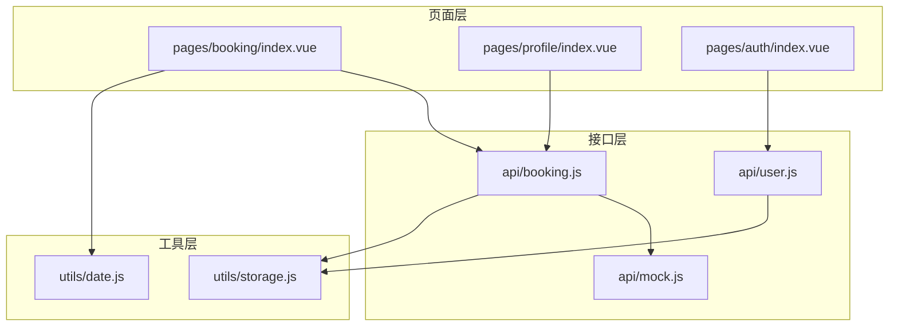
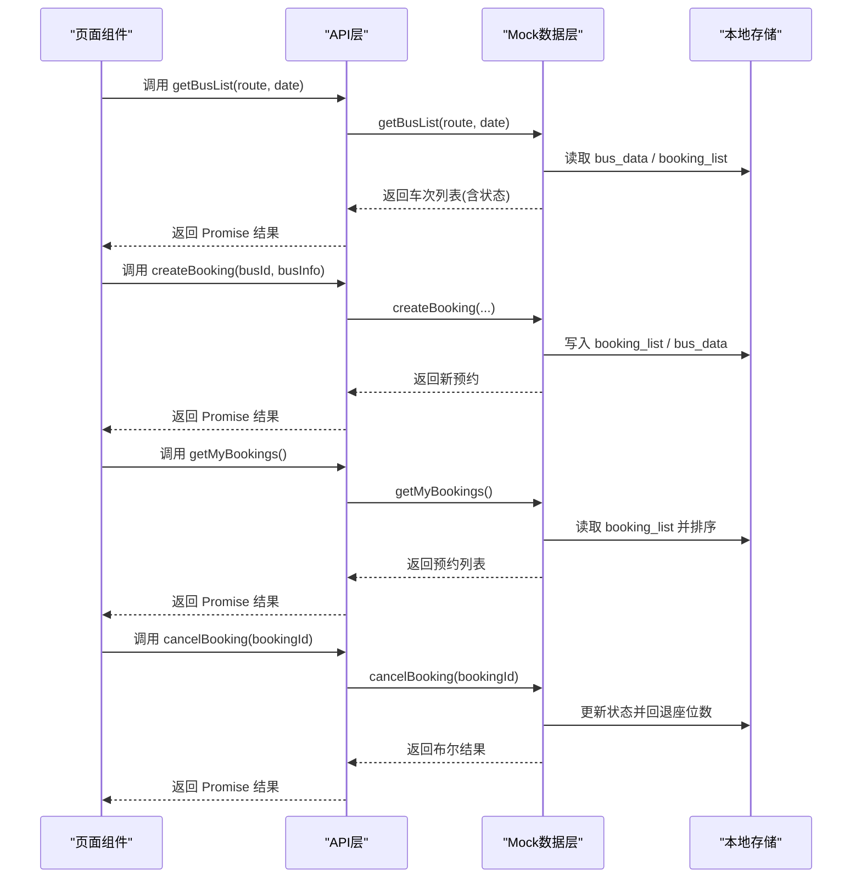
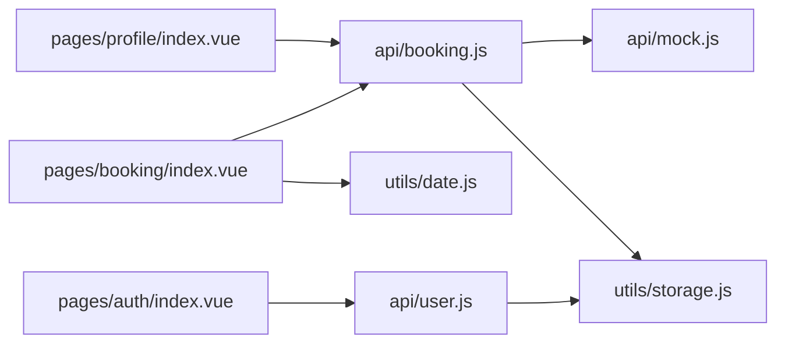

# 预约管理接口

<cite>
**本文引用的文件**
- [api/booking.js](file://api/booking.js)
- [api/mock.js](file://api/mock.js)
- [api/user.js](file://api/user.js)
- [pages/booking/index.vue](file://pages/booking/index.vue)
- [pages/profile/index.vue](file://pages/profile/index.vue)
- [pages/auth/index.vue](file://pages/auth/index.vue)
- [utils/date.js](file://utils/date.js)
- [utils/storage.js](file://utils/storage.js)
- [PROJECT.md](file://PROJECT.md)
</cite>

## 目录
1. [简介](#简介)
2. [项目结构](#项目结构)
3. [核心组件](#核心组件)
4. [架构总览](#架构总览)
5. [详细组件分析](#详细组件分析)
6. [依赖关系分析](#依赖关系分析)
7. [性能考虑](#性能考虑)
8. [故障排查指南](#故障排查指南)
9. [结论](#结论)
10. [附录](#附录)

## 简介
本文件为“预约管理接口”的完整API文档，覆盖以下能力：
- getBusList() 车次查询接口：参数规范、过滤与排序规则
- createBooking() 预约创建接口：座位验证、冲突检查与状态管理
- getMyBookings() 历史记录查询接口：数据结构与分页机制
- cancelBooking() 预约取消接口：业务规则与撤销流程
- Mock数据层：数据模拟策略与测试用例
- 请求/响应示例、错误处理机制与性能优化建议

## 项目结构
系统采用 uni-app（Vue 3）架构，按“页面-接口层-工具层”组织：
- 页面层：booking/index.vue、profile/index.vue、auth/index.vue
- 接口层：api/booking.js、api/user.js、api/mock.js
- 工具层：utils/date.js、utils/storage.js
- 文档与配置：PROJECT.md、pages.json、manifest.json

图表来源
- [pages/booking/index.vue:114-135](file://pages/booking/index.vue#L114-L135)
- [pages/profile/index.vue:156-179](file://pages/profile/index.vue#L156-L179)
- [pages/auth/index.vue:102-113](file://pages/auth/index.vue#L102-L113)
- [api/booking.js:8-165](file://api/booking.js#L8-L165)
- [api/user.js:8-128](file://api/user.js#L8-L128)
- [api/mock.js:49-226](file://api/mock.js#L49-L226)
- [utils/date.js:10-33](file://utils/date.js#L10-L33)
- [utils/storage.js:6-116](file://utils/storage.js#L6-L116)

章节来源
- [PROJECT.md:41-67](file://PROJECT.md#L41-L67)

## 核心组件
- 预约接口层：提供 getBusList()、createBooking()、getMyBookings()、cancelBooking()、getTodayValidBooking() 等方法，当前统一委托给 mock.js 实现，预留后端替换点。
- 用户接口层：提供 getUserInfo()、updateUserInfo()、authenticate()，当前使用本地存储封装。
- 页面交互层：booking/index.vue、profile/index.vue、auth/index.vue 分别承载预约、历史与认证交互。
- 工具层：date.js 提供日期计算；storage.js 封装本地存储读写。

章节来源
- [api/booking.js:8-165](file://api/booking.js#L8-L165)
- [api/user.js:8-128](file://api/user.js#L8-L128)
- [pages/booking/index.vue:98-298](file://pages/booking/index.vue#L98-L298)
- [pages/profile/index.vue:152-248](file://pages/profile/index.vue#L152-L248)
- [pages/auth/index.vue:99-189](file://pages/auth/index.vue#L99-L189)
- [utils/date.js:10-33](file://utils/date.js#L10-L33)
- [utils/storage.js:6-116](file://utils/storage.js#L6-L116)

## 架构总览
整体数据流：页面组件调用 API 层，API 层通过 mock.js 与本地存储交互，最终更新页面状态。

图表来源
- [api/booking.js:14-134](file://api/booking.js#L14-L134)
- [api/mock.js:49-203](file://api/mock.js#L49-L203)
- [utils/storage.js:6-116](file://utils/storage.js#L6-L116)

## 详细组件分析

### getBusList() 车次查询接口
- 参数规范
  - route: 路线名称，支持值："长江新区至武昌"、"武昌至长江新区"
  - date: 日期字符串，格式 "YYYY-MM-DD"
- 过滤与排序
  - 过滤：根据 route 与 date 从基础车次数据中筛选匹配项
  - 排序：按出发时间升序（由基础数据顺序决定）
- 状态计算
  - available：剩余座位 > 0 且未被当前用户预约
  - full：剩余座位 ≤ 0
  - booked：当前用户已对同一车次存在待出行预约
- 返回字段
  - id、route、date、departureTime、totalSeats、bookedSeats、remainingSeats、location、status

请求示例
- 方法：GET/POST（当前 mock 以函数参数形式接收）
- 路径：/api/bus/list（预留后端接口）
- 请求体：{ route, date }
- 成功响应：数组，元素包含上述字段

响应示例
- 成功：[{ id, route, date, departureTime, totalSeats, bookedSeats, remainingSeats, location, status }, ...]
- 失败：错误消息（如日期格式不正确）

错误处理
- 输入校验：route 与 date 非空
- 网络/存储异常：捕获并返回错误

性能与可用性
- 模拟延迟：300ms，提升交互体验
- 本地缓存：优先从本地存储读取 bus_data 与 booking_list

章节来源
- [api/booking.js:14-40](file://api/booking.js#L14-L40)
- [api/mock.js:49-93](file://api/mock.js#L49-L93)
- [pages/booking/index.vue:148-162](file://pages/booking/index.vue#L148-L162)

### createBooking() 预约创建接口
- 参数规范
  - busId: 车次唯一标识
  - busInfo: 包含 route、date、dateDisplay、departureTime、location、remainingSeats、bookedSeats
- 业务规则
  - 冲突检查：同一用户对同一车次仅允许一个待出行预约
  - 座位验证：remainingSeats > 0
  - 状态管理：创建时状态为 pending
  - 座位占用：更新 bus_data 对应时间点的已预约数
- 返回字段
  - id、busId、route、date、dateDisplay、time、location、seat、status、createdAt

请求示例
- 方法：POST
- 路径：/api/booking/create
- 请求体：{ busId, busInfo }

响应示例
- 成功：{ id, busId, route, date, dateDisplay, time, location, seat, status, createdAt }
- 失败：错误消息（如已预约/已满员）

错误处理
- 冲突：用户已预约该车次
- 超员：剩余座位不足
- 存储异常：写入失败

性能与可用性
- 模拟延迟：500ms
- 本地持久化：booking_list、bus_data

章节来源
- [api/booking.js:47-73](file://api/booking.js#L47-L73)
- [api/mock.js:101-152](file://api/mock.js#L101-L152)
- [pages/booking/index.vue:176-247](file://pages/booking/index.vue#L176-L247)

### getMyBookings() 历史记录查询接口
- 数据结构
  - 返回数组，元素为预约记录对象
  - 字段：id、busId、route、date、dateDisplay、time、location、seat、status、createdAt
- 排序规则
  - 按 createdAt 降序排列（最近创建的在前）
- 分页机制
  - 当前实现：一次性返回全部记录，未分页
  - 建议：若数据量增长，可引入分页参数（page、size）与服务端分页

请求示例
- 方法：GET
- 路径：/api/booking/my

响应示例
- 成功：[{ id, busId, route, date, dateDisplay, time, location, seat, status, createdAt }, ...]
- 失败：错误消息

性能与可用性
- 模拟延迟：300ms
- 本地排序：内存中按时间排序

章节来源
- [api/booking.js:78-102](file://api/booking.js#L78-L102)
- [api/mock.js:158-169](file://api/mock.js#L158-L169)
- [pages/booking/index.vue:138-146](file://pages/booking/index.vue#L138-L146)
- [pages/profile/index.vue:207-218](file://pages/profile/index.vue#L207-L218)

### cancelBooking() 预约取消接口
- 参数规范
  - bookingId: 预约唯一标识
- 业务规则
  - 状态变更：将 status 更新为 cancelled
  - 座位回退：bus_data 对应车次时间点的已预约数减一
  - 返回值：true/false（存在/不存在）
- 返回字段
  - 布尔值：true 表示成功取消，false 表示未找到

请求示例
- 方法：POST
- 路径：/api/booking/cancel
- 请求体：{ bookingId }

响应示例
- 成功：true
- 失败：false 或错误消息

性能与可用性
- 模拟延迟：300ms
- 本地持久化：booking_list、bus_data

章节来源
- [api/booking.js:108-134](file://api/booking.js#L108-L134)
- [api/mock.js:176-203](file://api/mock.js#L176-L203)
- [pages/booking/index.vue:260-295](file://pages/booking/index.vue#L260-L295)

### Mock数据层与测试用例
- 数据模拟策略
  - 基础车次：两条路线，每条路线包含多个班次，固定总座位数
  - 车次ID生成：BUS_{CW/WC}_{YYYYMMDD}_{HHMM}
  - 预约ID生成：BK_{时间戳}_{随机数}
  - 座位号生成：列A-D + 行01-12
  - 随机占用：部分班次模拟已预约数量
- 测试用例建议
  - 车次查询：传入不同 route/date，断言返回列表非空、状态正确
  - 预约创建：重复预约同一车次应失败；超员预约应失败；正常创建应成功
  - 历史查询：断言按时间倒序排列
  - 取消预约：存在与不存在的 bookingId 的行为差异
  - 状态一致性：取消后 bus_data 对应时间点的已预约数回退

章节来源
- [api/mock.js:6-41](file://api/mock.js#L6-L41)
- [api/mock.js:49-226](file://api/mock.js#L49-L226)

## 依赖关系分析
- 页面组件依赖 API 层，API 层依赖 Mock/Storage
- 日期工具被页面组件用于生成未来7天日期列表
- 用户认证依赖用户接口层与本地存储

图表来源
- [pages/booking/index.vue:99-100](file://pages/booking/index.vue#L99-L100)
- [pages/profile/index.vue:154](file://pages/profile/index.vue#L154)
- [pages/auth/index.vue:100](file://pages/auth/index.vue#L100)
- [api/booking.js:6](file://api/booking.js#L6)
- [api/user.js:6](file://api/user.js#L6)
- [utils/date.js:10-33](file://utils/date.js#L10-L33)
- [utils/storage.js:6-116](file://utils/storage.js#L6-L116)

## 性能考虑
- 模拟延迟：getBusList()/createBooking()/getMyBookings()/cancelBooking() 均设置模拟延迟，提升交互体验
- 本地存储：减少网络往返，但需注意数据一致性与清理
- 排序与过滤：在内存中进行，建议在数据量较大时引入服务端分页与索引
- UI优化：页面滚动容器与按钮禁用状态，避免重复提交

[本节为通用性能建议，不直接分析具体文件]

## 故障排查指南
- 预约失败
  - 已预约同一车次：检查是否存在 status=pending 的相同 busId
  - 已满员：检查 remainingSeats 是否大于 0
- 取消失败
  - bookingId 不存在：返回 false
  - bus_data 不一致：检查对应 route/date/time 的已预约数是否正确回退
- 页面无数据
  - 本地存储为空：清除后重试或初始化数据
  - 日期/路线选择错误：确认 route 与 date 格式

章节来源
- [api/mock.js:104-117](file://api/mock.js#L104-L117)
- [api/mock.js:179-200](file://api/mock.js#L179-L200)
- [pages/booking/index.vue:155-161](file://pages/booking/index.vue#L155-L161)

## 结论
本系统通过清晰的分层设计与 Mock 数据层，实现了从页面到接口再到本地存储的完整闭环。接口具备明确的参数规范、状态管理与错误处理机制，适合快速迭代与后续对接真实后端。建议在数据规模扩大后引入服务端分页与更完善的认证体系。

[本节为总结性内容，不直接分析具体文件]

## 附录

### API定义与示例

- getBusList(route, date)
  - 请求：{ route, date }
  - 响应：车次列表（含 id、route、date、departureTime、totalSeats、bookedSeats、remainingSeats、location、status）
  - 示例：参见“请求示例/响应示例”小节

- createBooking(busId, busInfo)
  - 请求：{ busId, busInfo }
  - 响应：新建预约对象
  - 示例：参见“请求示例/响应示例”小节

- getMyBookings()
  - 请求：无
  - 响应：预约列表（按 createdAt 降序）
  - 示例：参见“请求示例/响应示例”小节

- cancelBooking(bookingId)
  - 请求：{ bookingId }
  - 响应：布尔值
  - 示例：参见“请求示例/响应示例”小节

- getTodayValidBooking()
  - 请求：无
  - 响应：今日有效预约或 null
  - 示例：参见“请求示例/响应示例”小节

[本节为概览性内容，不直接分析具体文件]

### 请求/响应示例与错误处理

- 请求示例
  - getBusList：POST /api/bus/list { route, date }
  - createBooking：POST /api/booking/create { busId, busInfo }
  - getMyBookings：GET /api/booking/my
  - cancelBooking：POST /api/booking/cancel { bookingId }
  - getTodayValidBooking：GET /api/booking/today

- 响应示例
  - 成功：各接口返回对应数据结构
  - 失败：错误消息（如“您已经预约过该车次”、“该车次已满员”等）

- 错误处理
  - 参数校验：route/date 非空
  - 冲突与超员：返回相应错误
  - 存储异常：捕获并提示

[本节为概览性内容，不直接分析具体文件]