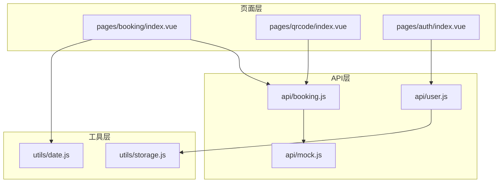
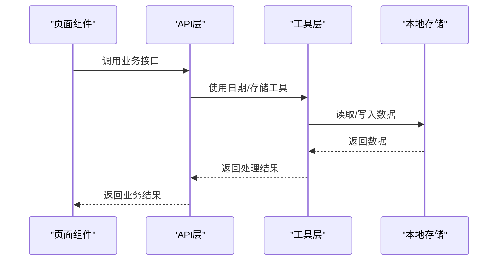
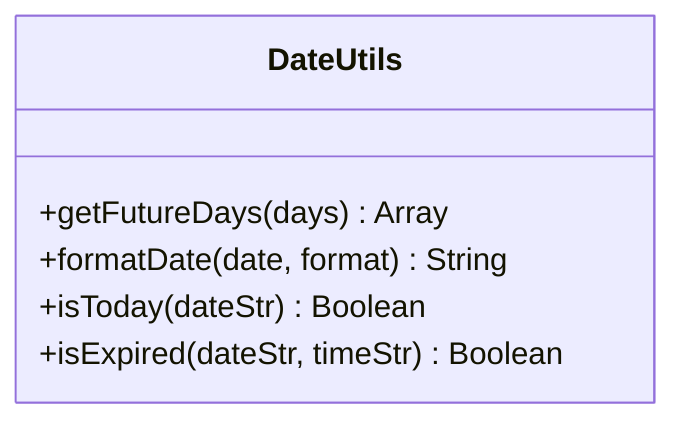
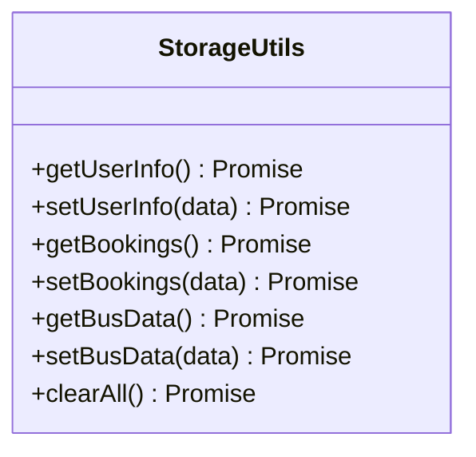
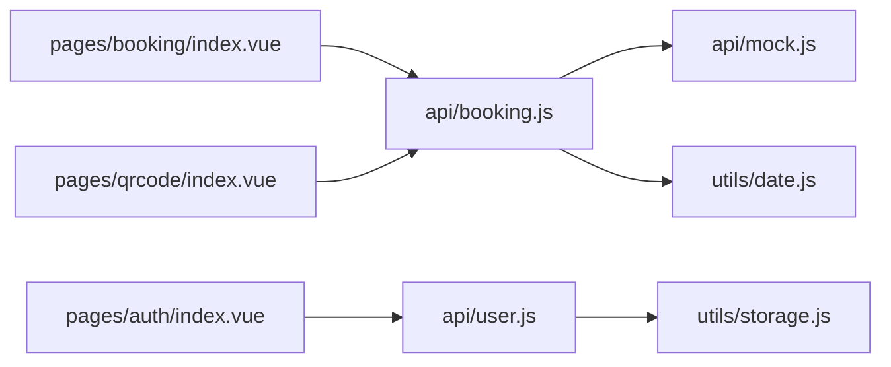

# 工具函数库

<cite>
**本文引用的文件**
- [utils/date.js](file://utils/date.js)
- [utils/storage.js](file://utils/storage.js)
- [api/booking.js](file://api/booking.js)
- [api/user.js](file://api/user.js)
- [api/mock.js](file://api/mock.js)
- [pages/booking/index.vue](file://pages/booking/index.vue)
- [pages/auth/index.vue](file://pages/auth/index.vue)
- [pages/qrcode/index.vue](file://pages/qrcode/index.vue)
- [PROJECT.md](file://PROJECT.md)
</cite>

## 目录
1. [简介](#简介)
2. [项目结构](#项目结构)
3. [核心组件](#核心组件)
4. [架构总览](#架构总览)
5. [详细组件分析](#详细组件分析)
6. [依赖分析](#依赖分析)
7. [性能考虑](#性能考虑)
8. [故障排查指南](#故障排查指南)
9. [结论](#结论)
10. [附录：API参考与最佳实践](#附录api参考与最佳实践)

## 简介
本文件为学校校车调度系统中的工具函数库提供完整的技术文档，重点覆盖以下内容：
- 日期处理工具：日期格式化、时间计算、日期范围生成等实用功能
- 本地存储封装：数据序列化、类型转换、存储策略与错误处理机制
- 使用示例与最佳实践：如何在项目中正确调用这些工具函数
- 性能与兼容性：针对 uni-app 小程序平台的性能考量与兼容性处理
- 扩展性设计：为后续接入后端 API 的演进路径提供指导

## 项目结构
工具函数库位于 utils 目录，分别提供日期处理与本地存储封装；业务层通过 api 层统一对外暴露接口，当前使用 mock 数据，便于后期替换为真实后端。

图表来源
- [pages/booking/index.vue:99-135](file://pages/booking/index.vue#L99-L135)
- [pages/qrcode/index.vue:61-101](file://pages/qrcode/index.vue#L61-L101)
- [pages/auth/index.vue:100-101](file://pages/auth/index.vue#L100-L101)
- [api/booking.js:1-165](file://api/booking.js#L1-L165)
- [api/user.js:1-128](file://api/user.js#L1-L128)
- [api/mock.js:1-226](file://api/mock.js#L1-L226)
- [utils/date.js:1-84](file://utils/date.js#L1-L84)
- [utils/storage.js:1-116](file://utils/storage.js#L1-L116)

章节来源
- [PROJECT.md:41-67](file://PROJECT.md#L41-L67)

## 核心组件
- 日期处理工具（utils/date.js）：提供未来 N 天日期数组生成、日期格式化、当日判断、过期判断等功能
- 本地存储封装（utils/storage.js）：对 uni-app 本地存储进行统一封装，提供用户信息、预约列表、车次数据的读写与清空能力

章节来源
- [utils/date.js:10-83](file://utils/date.js#L10-L83)
- [utils/storage.js:6-115](file://utils/storage.js#L6-L115)

## 架构总览
工具函数库与业务层的交互遵循“页面层 → API层 → 工具层”的数据流设计，当前 API 层通过 mock 数据实现，便于后期替换为真实后端。

图表来源
- [api/booking.js:14-163](file://api/booking.js#L14-L163)
- [api/user.js:12-100](file://api/user.js#L12-L100)
- [utils/date.js:10-83](file://utils/date.js#L10-L83)
- [utils/storage.js:10-114](file://utils/storage.js#L10-L114)

## 详细组件分析

### 日期处理工具（utils/date.js）
- 功能清单
  - 生成未来 N 天日期数组：包含日期字符串、显示文案、是否当天标记
  - 日期格式化：支持自定义格式模板（如 MM-DD 周X）
  - 当日判断：比较传入日期字符串与当前日期
  - 过期判断：结合日期与时间字符串判断是否已过期

- 关键实现要点
  - 日期数组生成：循环构造未来 N 天，使用 padStart 保证两位数格式，星期映射中文
  - 格式化模板：通过字符串替换实现灵活格式输出
  - 当日判断：按年月日逐项比较，避免时区与时分秒差异导致误判
  - 过期判断：拼接日期时间后统一转换为 Date 对象比较

- 复杂度与性能
  - 生成 N 天数组：O(N)，空间 O(N)
  - 格式化与判断：O(1)，常数级开销

- 错误处理与边界
  - 输入为字符串时自动转换为 Date 对象
  - 未提供参数时采用默认值（如 days 默认 7）

- 使用示例（路径）
  - 页面初始化时生成未来 7 天日期数组：[pages/booking/index.vue:126-135](file://pages/booking/index.vue#L126-L135)
  - 日期格式化在预约详情展示中使用：[pages/booking/index.vue:220-227](file://pages/booking/index.vue#L220-L227)

章节来源
- [utils/date.js:10-83](file://utils/date.js#L10-L83)
- [pages/booking/index.vue:126-135](file://pages/booking/index.vue#L126-L135)
- [pages/booking/index.vue:220-227](file://pages/booking/index.vue#L220-L227)

#### 类图：日期工具函数

图表来源
- [utils/date.js:10-83](file://utils/date.js#L10-L83)

### 本地存储封装（utils/storage.js）
- 功能清单
  - 用户信息读取/设置
  - 预约列表读取/设置
  - 车次数据读取/设置
  - 清空所有本地数据

- 实现细节
  - 统一使用 Promise 包装 uni-app 的异步存储 API
  - 成功回调 resolve，失败回调统一返回安全默认值（null/[]），避免异常传播
  - 关键键名：user_info、booking_list、bus_data

- 错误处理与兼容性
  - fail 回调统一走 resolve，确保调用方始终得到一个确定的返回值
  - 适用于微信小程序平台的本地存储限制与容量约束

- 使用示例（路径）
  - 用户认证成功后写入用户信息：[api/user.js:97-99](file://api/user.js#L97-L99)
  - API 层读取用户信息：[api/user.js:12-13](file://api/user.js#L12-L13)
  - API 层读取预约列表：[api/booking.js:78-80](file://api/booking.js#L78-L80)

- 与 API 层的协作
  - API 层通过 storage.js 间接访问本地存储，便于后期替换为后端接口
  - mock 数据层直接使用 uni.setStorageSync/uni.getStorageSync，形成双通道对比

章节来源
- [utils/storage.js:6-115](file://utils/storage.js#L6-L115)
- [api/user.js:12-13](file://api/user.js#L12-L13)
- [api/user.js:97-99](file://api/user.js#L97-L99)
- [api/booking.js:78-80](file://api/booking.js#L78-L80)
- [api/mock.js:54-57](file://api/mock.js#L54-L57)

#### 类图：存储工具类

图表来源
- [utils/storage.js:6-115](file://utils/storage.js#L6-L115)

## 依赖分析
- 页面层依赖 API 层，API 层依赖工具层与本地存储
- API 层当前通过 mock 数据实现，便于替换为真实后端
- 工具层与平台 API（uni-app）耦合度低，便于扩展

图表来源
- [pages/booking/index.vue:99-135](file://pages/booking/index.vue#L99-L135)
- [pages/qrcode/index.vue:61-101](file://pages/qrcode/index.vue#L61-L101)
- [pages/auth/index.vue:100-101](file://pages/auth/index.vue#L100-L101)
- [api/booking.js:14-163](file://api/booking.js#L14-L163)
- [api/user.js:12-100](file://api/user.js#L12-L100)
- [api/mock.js:1-226](file://api/mock.js#L1-L226)
- [utils/date.js:10-83](file://utils/date.js#L10-L83)
- [utils/storage.js:6-115](file://utils/storage.js#L6-L115)

章节来源
- [api/booking.js:14-163](file://api/booking.js#L14-L163)
- [api/user.js:12-100](file://api/user.js#L12-L100)
- [utils/date.js:10-83](file://utils/date.js#L10-L83)
- [utils/storage.js:6-115](file://utils/storage.js#L6-L115)

## 性能考虑
- 日期工具
  - 生成 N 天数组为线性复杂度，建议在页面初始化时一次性生成并缓存，避免重复计算
  - 格式化与判断为常量级，可直接在渲染层调用
- 存储工具
  - Promise 包装减少回调嵌套，提升可维护性
  - 失败回调统一返回安全默认值，避免异常冒泡影响用户体验
- 平台适配
  - 针对微信小程序的本地存储容量与同步/异步行为进行兼容处理
  - 建议在高频读写场景下合并更新，减少多次 setStorageSync 调用

## 故障排查指南
- 日期格式化异常
  - 确认传入日期类型：字符串会被自动转换为 Date 对象
  - 检查格式模板是否包含 MM/DD/周X等占位符
  - 参考路径：[utils/date.js:41-55](file://utils/date.js#L41-L55)
- 当日/过期判断不准确
  - 避免直接比较字符串，应使用日期对象逐项比较年月日
  - 参考路径：[utils/date.js:62-83](file://utils/date.js#L62-L83)
- 本地存储读取为空
  - 检查键名是否匹配 user_info/booking_list/bus_data
  - 确认写入流程是否成功执行
  - 参考路径：[utils/storage.js:10-114](file://utils/storage.js#L10-L114)
- 页面数据不同步
  - 确认页面 onShow 生命周期中触发了数据刷新
  - 参考路径：[pages/booking/index.vue:118-122](file://pages/booking/index.vue#L118-L122)

章节来源
- [utils/date.js:41-83](file://utils/date.js#L41-L83)
- [utils/storage.js:10-114](file://utils/storage.js#L10-L114)
- [pages/booking/index.vue:118-122](file://pages/booking/index.vue#L118-L122)

## 结论
工具函数库以简洁、稳定为目标，为日期处理与本地存储提供了统一且易于扩展的抽象层。通过 API 层与工具层的解耦，项目具备良好的演进能力：既能在当前阶段快速迭代，也能平滑过渡到后端接口。建议在后续开发中持续完善错误处理与边界条件，并根据业务增长优化存储策略与缓存机制。

## 附录：API参考与最佳实践

### 日期处理工具 API
- getFutureDays(days)
  - 参数：days（Number，默认 7）
  - 返回：日期信息数组（包含 date、display、isToday）
  - 使用场景：生成日期选择器的数据源
  - 参考路径：[utils/date.js:10-33](file://utils/date.js#L10-L33)
- formatDate(date, format)
  - 参数：date（Date/String）、format（String，默认 'MM-DD 周X'）
  - 返回：格式化后的日期字符串
  - 使用场景：展示友好日期格式
  - 参考路径：[utils/date.js:41-55](file://utils/date.js#L41-L55)
- isToday(dateStr)
  - 参数：dateStr（YYYY-MM-DD）
  - 返回：Boolean
  - 使用场景：高亮当天选项
  - 参考路径：[utils/date.js:62-69](file://utils/date.js#L62-L69)
- isExpired(dateStr, timeStr)
  - 参数：dateStr（YYYY-MM-DD）、timeStr（HH:MM）
  - 返回：Boolean
  - 使用场景：禁用过期车次
  - 参考路径：[utils/date.js:77-83](file://utils/date.js#L77-L83)

最佳实践
- 在页面初始化时调用 getFutureDays 生成日期数组并缓存
- 使用 formatDate 统一展示日期，避免多处硬编码格式
- 使用 isToday/isExpired 控制 UI 状态与交互

### 本地存储封装 API
- getUserInfo()/setUserInfo(data)
- getBookings()/setBookings(data)
- getBusData()/setBusData(data)
- clearAll()
- 返回值：均返回 Promise，失败时返回安全默认值
- 参考路径：[utils/storage.js:6-115](file://utils/storage.js#L6-L115)

最佳实践
- 写入数据后立即读取确认成功
- 在批量更新时尽量合并操作，减少多次存储调用
- 清理数据时谨慎，避免误删关键信息

### 与 API 层的协作
- API 层通过 storage.js 间接访问本地存储，便于替换为后端接口
- mock 数据层直接使用 uni.setStorageSync/uni.getStorageSync，便于对比与迁移
- 参考路径：[api/user.js:12-13](file://api/user.js#L12-L13)、[api/booking.js:78-80](file://api/booking.js#L78-L80)、[api/mock.js:54-57](file://api/mock.js#L54-L57)