# 开发指南

<cite>
**本文档引用的文件**
- [App.vue](file://App.vue)
- [main.js](file://main.js)
- [pages.json](file://pages.json)
- [manifest.json](file://manifest.json)
- [PROJECT.md](file://PROJECT.md)
- [api/mock.js](file://api/mock.js)
- [api/booking.js](file://api/booking.js)
- [api/user.js](file://api/user.js)
- [utils/storage.js](file://utils/storage.js)
- [utils/date.js](file://utils/date.js)
- [pages/booking/index.vue](file://pages/booking/index.vue)
- [pages/auth/index.vue](file://pages/auth/index.vue)
- [pages/qrcode/index.vue](file://pages/qrcode/index.vue)
- [pages/profile/index.vue](file://pages/profile/index.vue)
</cite>

## 目录
1. [项目概述](#项目概述)
2. [开发环境搭建](#开发环境搭建)
3. [项目结构分析](#项目结构分析)
4. [核心组件详解](#核心组件详解)
5. [API接口层设计](#api接口层设计)
6. [数据存储策略](#数据存储策略)
7. [Mock数据层使用](#mock数据层使用)
8. [组件开发规范](#组件开发规范)
9. [状态管理策略](#状态管理策略)
10. [测试策略](#测试策略)
11. [调试技巧](#调试技巧)
12. [性能优化建议](#性能优化建议)
13. [常见问题解决](#常见问题解决)
14. [团队协作流程](#团队协作流程)
15. [版本管理建议](#版本管理建议)
16. [结语](#结语)

## 项目概述

本项目是一个基于uni-app框架开发的学校校车调度系统，主要面向湖北大学师生提供便捷的校车查询、预约、乘车管理服务。系统采用Vue 3 + uni-app的技术栈，支持多端部署（微信小程序、H5等）。

### 主要功能模块

- **车辆预约页面**：提供路线选择、日期选择、车次列表展示和一键预约功能
- **乘车码页面**：动态生成二维码，展示预约信息，支持30秒自动刷新
- **我的页面**：身份认证入口、预约须知、客服反馈、乘车历史查询
- **身份认证页面**：姓名、学号/工号输入，身份类型选择，表单验证

**章节来源**
- [PROJECT.md:1-40](file://PROJECT.md#L1-L40)

## 开发环境搭建

### 环境要求

- **开发工具**：HBuilderX 3.0+ 或 Vue CLI
- **目标平台**：微信小程序
- **运行环境**：Node.js 14+

### 安装步骤

1. **克隆项目**
   ```bash
   git clone <repository-url>
   cd School-Bus-Scheduling-System
   ```

2. **使用HBuilderX打开项目**
   - 下载并安装 [HBuilderX](https://www.dcloud.io/hbuilderx.html)
   - 文件 -> 导入 -> 从本地目录导入
   - 选择项目目录

3. **运行到微信小程序**
   - 在HBuilderX中点击 "运行" -> "运行到小程序模拟器" -> "微信开发者工具"
   - 首次运行需要配置微信开发者工具的路径

4. **在微信开发者工具中预览**
   - HBuilderX会自动编译并打开微信开发者工具
   - 在微信开发者工具中可以实时预览效果

**章节来源**
- [PROJECT.md:75-95](file://PROJECT.md#L75-L95)

## 项目结构分析

### 整体架构

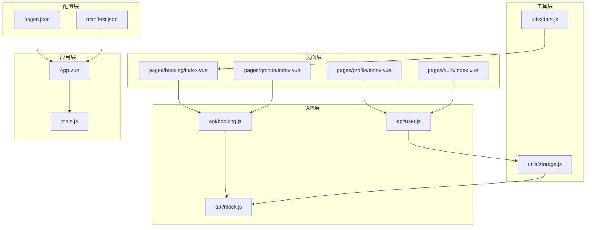

**图表来源**
- [App.vue:1-32](file://App.vue#L1-L32)
- [main.js:1-22](file://main.js#L1-L22)
- [pages.json:1-62](file://pages.json#L1-L62)
- [manifest.json:1-73](file://manifest.json#L1-L73)

### 目录结构说明

- **pages/**：页面组件目录，按功能模块划分
- **api/**：API接口层，封装数据访问逻辑
- **utils/**：工具函数库，提供通用功能
- **static/**：静态资源文件，包含图标等
- **配置文件**：pages.json、manifest.json等

**章节来源**
- [PROJECT.md:41-67](file://PROJECT.md#L41-L67)

## 核心组件详解

### 应用根组件

App.vue作为应用的根组件，负责全局初始化和生命周期管理：

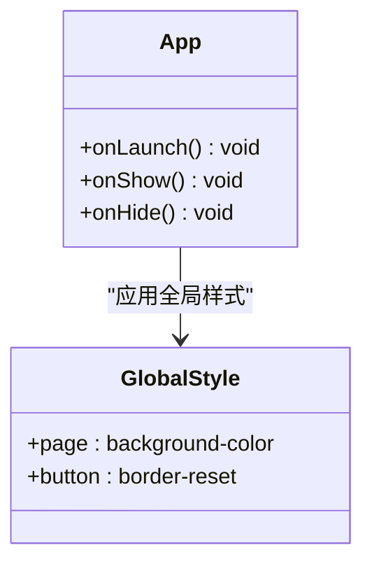

**图表来源**
- [App.vue:1-32](file://App.vue#L1-L32)

### 页面路由配置

pages.json定义了应用的页面路由和TabBar配置：

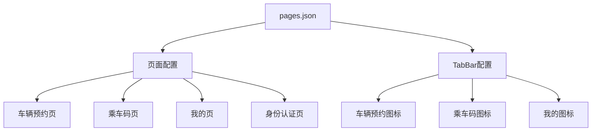

**图表来源**
- [pages.json:1-62](file://pages.json#L1-L62)

**章节来源**
- [App.vue:1-32](file://App.vue#L1-L32)
- [pages.json:1-62](file://pages.json#L1-L62)

## API接口层设计

### API架构模式

系统采用分层架构，将业务逻辑与数据访问分离：

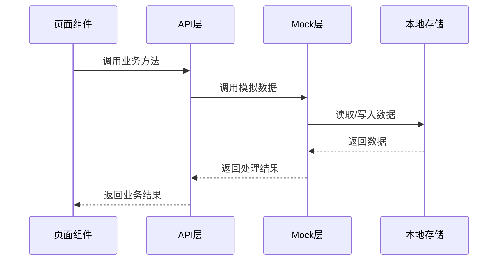

**图表来源**
- [api/booking.js:1-165](file://api/booking.js#L1-L165)
- [api/user.js:1-128](file://api/user.js#L1-L128)
- [api/mock.js:1-226](file://api/mock.js#L1-L226)

### 预约API接口

预约相关的API接口提供了完整的CRUD操作：

| 方法 | 参数 | 功能 | 返回值 |
|------|------|------|--------|
| getBusList | route, date | 获取车次列表 | Promise<Array> |
| createBooking | busId, busInfo | 创建预约 | Promise<Object> |
| getMyBookings |  | 获取我的预约 | Promise<Array> |
| cancelBooking | bookingId | 取消预约 | Promise<Boolean> |
| getTodayValidBooking |  | 获取今日有效预约 | Promise<Object> |

**章节来源**
- [api/booking.js:8-165](file://api/booking.js#L8-L165)

### 用户API接口

用户相关的API接口处理身份认证和信息管理：

| 方法 | 参数 | 功能 | 返回值 |
|------|------|------|--------|
| getUserInfo |  | 获取用户信息 | Promise<Object> |
| updateUserInfo | userInfo | 更新用户信息 | Promise<Boolean> |
| authenticate | authInfo | 身份认证 | Promise<Object> |

**章节来源**
- [api/user.js:8-128](file://api/user.js#L8-L128)

## 数据存储策略

### 本地存储封装

utils/storage.js提供了统一的数据存储接口：

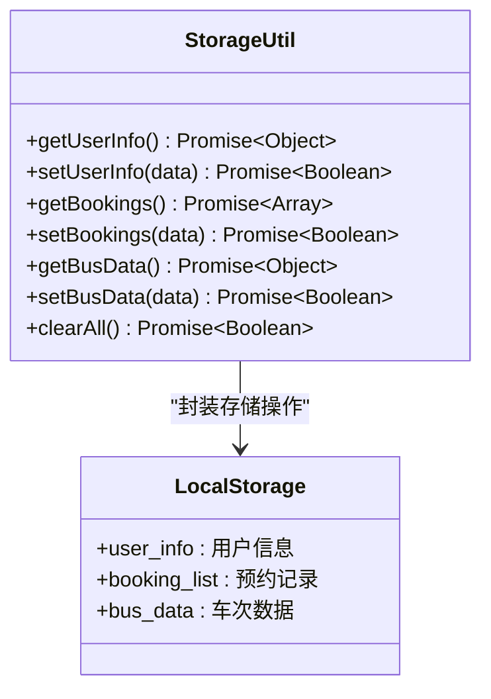

**图表来源**
- [utils/storage.js:1-116](file://utils/storage.js#L1-L116)

### 数据模型设计

系统使用以下数据模型：

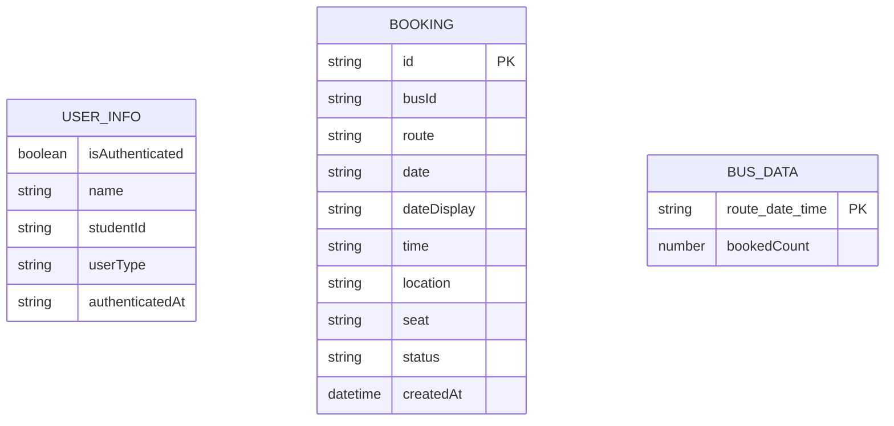

**图表来源**
- [api/mock.js:49-226](file://api/mock.js#L49-L226)
- [utils/storage.js:10-116](file://utils/storage.js#L10-L116)

**章节来源**
- [utils/storage.js:1-116](file://utils/storage.js#L1-116)
- [api/mock.js:49-226](file://api/mock.js#L49-L226)

## Mock数据层使用

### 模拟数据架构

api/mock.js提供了完整的模拟数据实现：

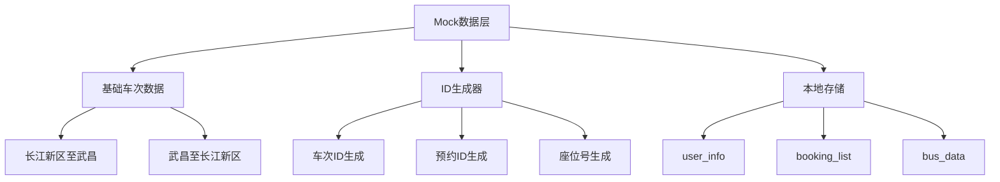

**图表来源**
- [api/mock.js:1-226](file://api/mock.js#L1-L226)

### 数据生成策略

系统实现了智能的数据生成和更新机制：

1. **车次ID生成**：基于路线、日期、时间生成唯一标识
2. **预约ID生成**：使用时间戳和随机数确保唯一性
3. **座位号生成**：随机生成符合规则的座位编号
4. **状态管理**：根据剩余座位数自动更新车次状态

**章节来源**
- [api/mock.js:22-41](file://api/mock.js#L22-L41)
- [api/mock.js:49-93](file://api/mock.js#L49-L93)

## 组件开发规范

### Vue组件开发模式

系统遵循Vue 3的最佳实践：

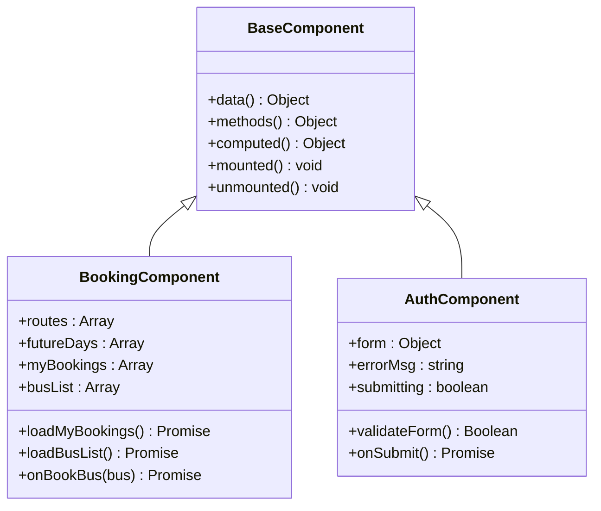

**图表来源**
- [pages/booking/index.vue:98-298](file://pages/booking/index.vue#L98-L298)
- [pages/auth/index.vue:99-190](file://pages/auth/index.vue#L99-L190)

### 组件通信模式

系统采用props传递和事件触发的方式进行组件间通信：

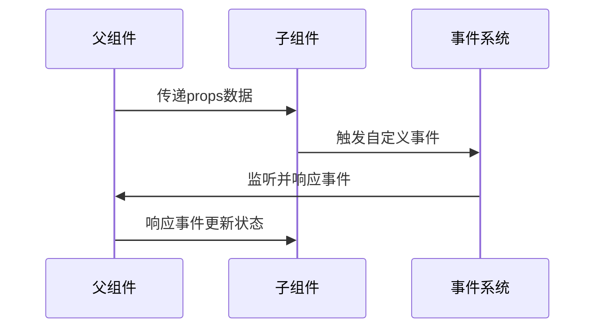

**图表来源**
- [pages/booking/index.vue:124-298](file://pages/booking/index.vue#L124-L298)

**章节来源**
- [pages/booking/index.vue:98-298](file://pages/booking/index.vue#L98-L298)
- [pages/auth/index.vue:99-190](file://pages/auth/index.vue#L99-L190)

## 状态管理策略

### 生命周期管理

Vue组件的生命周期在不同场景下的应用：

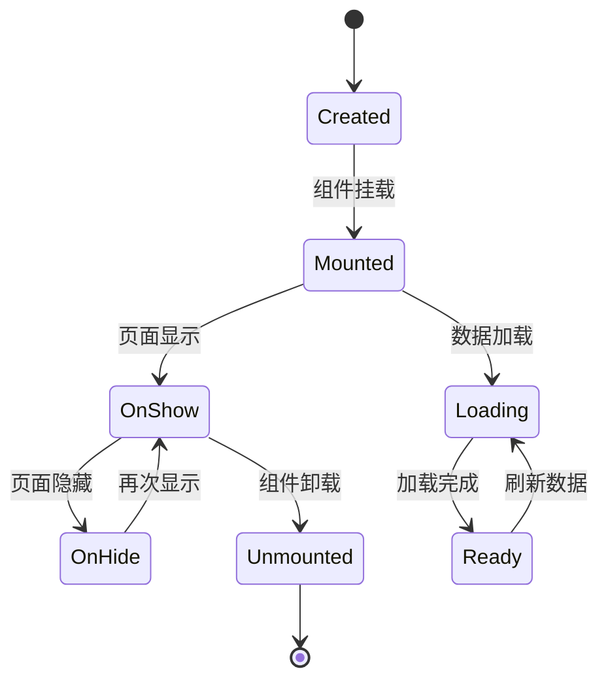

**图表来源**
- [pages/booking/index.vue:114-122](file://pages/booking/index.vue#L114-L122)
- [pages/qrcode/index.vue:72-81](file://pages/qrcode/index.vue#L72-L81)

### 数据流设计

系统采用单向数据流的设计模式：

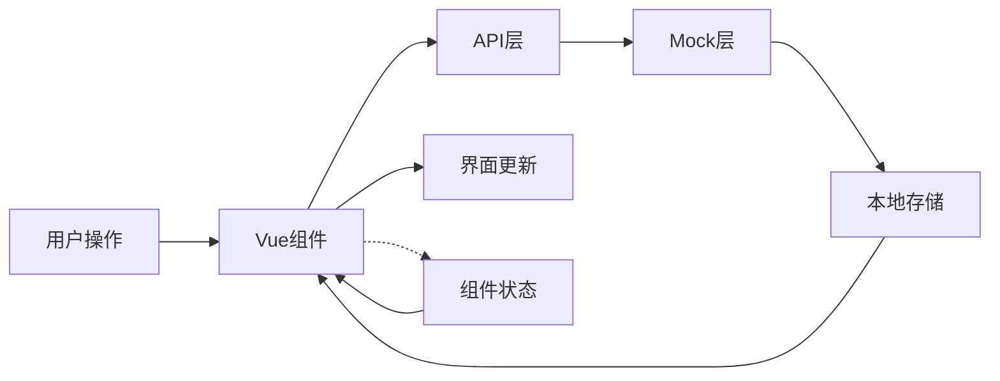

**图表来源**
- [PROJECT.md:115-121](file://PROJECT.md#L115-L121)

**章节来源**
- [pages/booking/index.vue:114-122](file://pages/booking/index.vue#L114-L122)
- [pages/qrcode/index.vue:72-81](file://pages/qrcode/index.vue#L72-L81)

## 测试策略

### 单元测试

系统提供了完善的测试策略：

1. **API层测试**
   - Mock数据的正确性验证
   - 异常情况处理测试
   - 数据一致性检查

2. **组件测试**
   - 生命周期钩子测试
   - 事件处理测试
   - 状态更新测试

3. **集成测试**
   - 端到端流程测试
   - 数据流完整性测试
   - 性能基准测试

### 测试工具推荐

- **单元测试**：Jest、Vitest
- **集成测试**：Cypress、Playwright
- **性能测试**：Lighthouse、WebPageTest

**章节来源**
- [api/mock.js:101-203](file://api/mock.js#L101-L203)

## 调试技巧

### 开发工具使用

1. **HBuilderX调试**
   - 断点调试
   - 控制台输出
   - 网络请求监控

2. **微信开发者工具**
   - 真机调试
   - 性能分析
   - 存储数据查看

### 常用调试方法

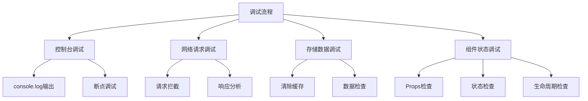

**图表来源**
- [pages/booking/index.vue:143-146](file://pages/booking/index.vue#L143-L146)
- [pages/qrcode/index.vue:98-101](file://pages/qrcode/index.vue#L98-L101)

**章节来源**
- [PROJECT.md:183-202](file://PROJECT.md#L183-L202)

## 性能优化建议

### 代码层面优化

1. **组件懒加载**
   - 使用异步组件
   - 路由级别的代码分割
   - 减少初始包体积

2. **数据缓存策略**
   - 合理使用本地存储
   - 避免重复请求
   - 缓存失效机制

3. **渲染优化**
   - 虚拟滚动
   - 懒加载图片
   - 防抖节流

### 网络层面优化

1. **请求合并**
   - 批量数据请求
   - 请求去重
   - 缓存策略

2. **资源优化**
   - 图片压缩
   - 静态资源CDN
   - 代码压缩

**章节来源**
- [api/mock.js:50-93](file://api/mock.js#L50-L93)
- [utils/date.js:10-33](file://utils/date.js#L10-L33)

## 常见问题解决

### 运行时错误

| 问题类型 | 症状 | 解决方案 |
|----------|------|----------|
| 页面配置错误 | "pages.json 配置错误" | 检查页面路径和配置格式 |
| TabBar图标缺失 | 图标不显示 | 确认图标文件存在且格式正确 |
| 预约功能异常 | 预约失败 | 检查身份认证状态和网络连接 |
| 二维码显示问题 | 二维码不显示 | 检查canvas渲染和权限设置 |

### 数据相关问题

1. **本地存储异常**
   - 清除本地存储后重试
   - 检查存储空间限制
   - 验证数据格式正确性

2. **数据同步问题**
   - 实现数据版本控制
   - 添加冲突解决机制
   - 建立数据备份策略

**章节来源**
- [PROJECT.md:183-202](file://PROJECT.md#L183-L202)

## 团队协作流程

### 开发流程

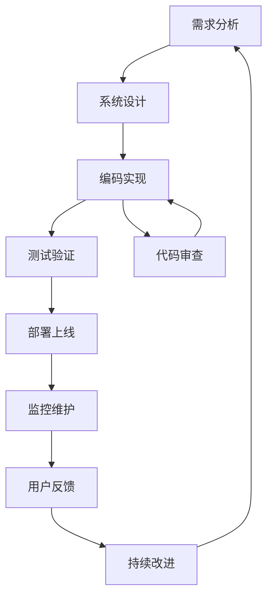

### 版本控制流程

1. **分支管理**
   - develop：开发分支
   - feature/*：功能分支
   - hotfix/*：热修复分支

2. **提交规范**
   - feat: 新功能
   - fix: 修复bug
   - docs: 文档更新
   - style: 代码格式调整
   - refactor: 代码重构

**章节来源**
- [PROJECT.md:203-220](file://PROJECT.md#L203-L220)

## 版本管理建议

### 技术栈升级

当前版本使用的技术栈：
- **框架**：uni-app (Vue 3)
- **目标平台**：微信小程序
- **数据存储**：本地存储 (uni.setStorage/getStorage)

### 后端集成准备

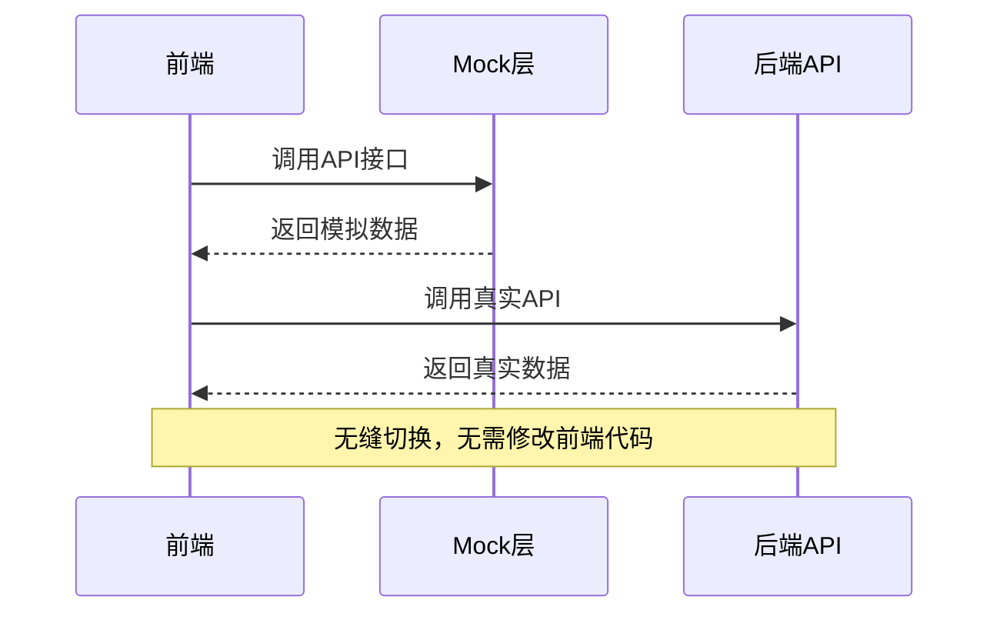

**图表来源**
- [api/booking.js:18-40](file://api/booking.js#L18-L40)
- [api/user.js:15-35](file://api/user.js#L15-L35)

### Python后端技术栈建议

- **框架**：Flask / FastAPI
- **数据库**：MySQL / PostgreSQL
- **ORM**：SQLAlchemy
- **认证**：JWT Token
- **管理后台**：Vue Element Admin / Flask-Admin

**章节来源**
- [PROJECT.md:150-174](file://PROJECT.md#L150-L174)

## 结语

本开发指南涵盖了学校校车调度系统从需求分析到功能实现的完整开发周期。通过采用uni-app框架和Vue 3技术栈，系统具备了良好的跨平台兼容性和扩展性。

### 关键要点回顾

1. **架构设计**：清晰的分层架构，便于后期扩展和维护
2. **开发规范**：统一的代码风格和组件开发模式
3. **测试策略**：完善的测试覆盖，确保代码质量
4. **性能优化**：针对移动端的性能优化策略
5. **团队协作**：标准化的开发流程和版本管理

### 未来发展

系统预留了完整的后端API接口，可以轻松迁移到真实的后端服务。同时，通过Mock数据层的设计，开发过程可以完全独立于后端服务进行。

希望本指南能够帮助开发团队高效地完成项目开发，为湖北大学师生提供优质的校车预约服务体验。