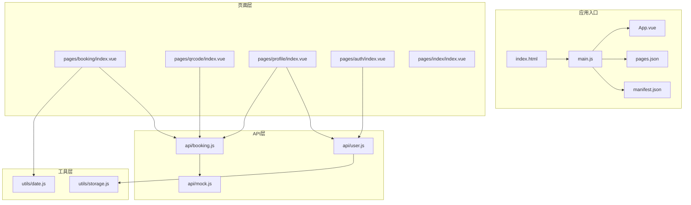
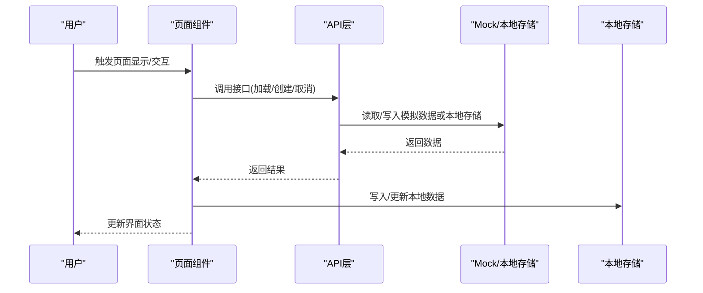
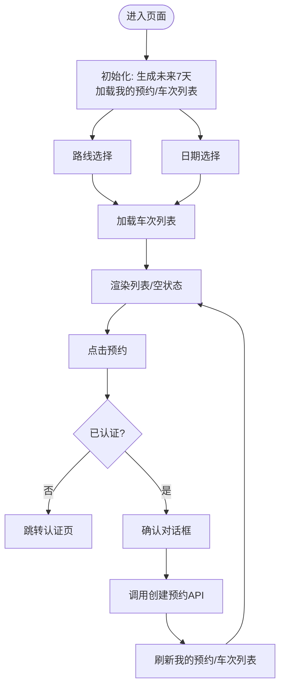
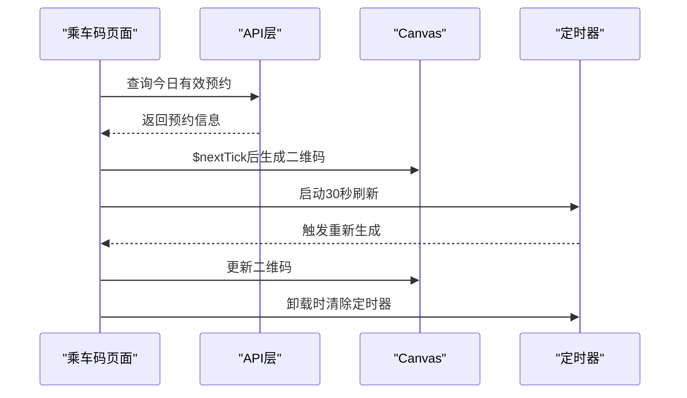
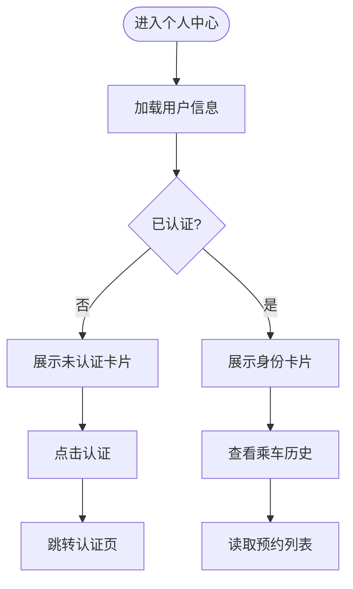
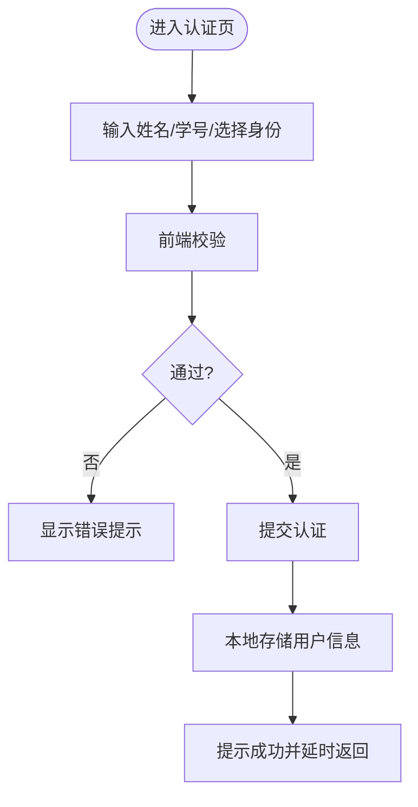
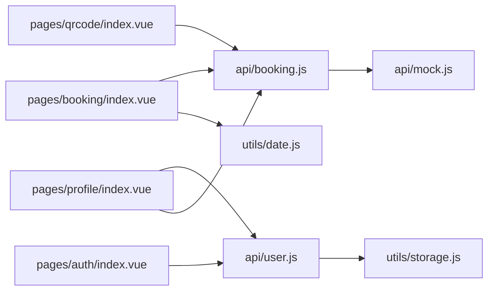

# 性能优化

<cite>
**本文引用的文件**
- [App.vue](file://App.vue)
- [main.js](file://main.js)
- [pages.json](file://pages.json)
- [manifest.json](file://manifest.json)
- [index.html](file://index.html)
- [uni.promisify.adaptor.js](file://uni.promisify.adaptor.js)
- [PROJECT.md](file://PROJECT.md)
- [pages/booking/index.vue](file://pages/booking/index.vue)
- [pages/auth/index.vue](file://pages/auth/index.vue)
- [pages/profile/index.vue](file://pages/profile/index.vue)
- [pages/qrcode/index.vue](file://pages/qrcode/index.vue)
- [pages/index/index.vue](file://pages/index/index.vue)
- [api/booking.js](file://api/booking.js)
- [api/user.js](file://api/user.js)
- [api/mock.js](file://api/mock.js)
- [utils/storage.js](file://utils/storage.js)
- [utils/date.js](file://utils/date.js)
</cite>

## 目录
1. [引言](#引言)
2. [项目结构](#项目结构)
3. [核心组件](#核心组件)
4. [架构总览](#架构总览)
5. [详细组件分析](#详细组件分析)
6. [依赖关系分析](#依赖关系分析)
7. [性能考量与优化建议](#性能考量与优化建议)
8. [故障排查指南](#故障排查指南)
9. [结论](#结论)
10. [附录](#附录)

## 引言
本指南围绕“学校校车调度系统”在 UniApp/Vue.js 平台上的性能优化展开，结合现有代码实现，给出可落地的优化策略，覆盖组件渲染、数据处理、网络请求、本地存储与同步、跨平台与包体控制、以及性能监控与分析等维度，帮助提升运行效率与用户体验。

## 项目结构
项目采用标准 UniApp 结构：根组件、入口文件、页面配置、清单配置、页面与 API 层、工具函数与静态资源。页面包含预约、乘车码、个人中心、身份认证四个核心页面；API 层以 mock 为主，预留后端接入；工具层提供本地存储与日期处理。

图示来源
- [main.js:1-22](file://main.js#L1-L22)
- [App.vue:1-32](file://App.vue#L1-L32)
- [pages.json:1-62](file://pages.json#L1-L62)
- [manifest.json:1-73](file://manifest.json#L1-L73)
- [index.html:1-21](file://index.html#L1-L21)
- [pages/booking/index.vue:1-575](file://pages/booking/index.vue#L1-L575)
- [pages/qrcode/index.vue:1-342](file://pages/qrcode/index.vue#L1-L342)
- [pages/profile/index.vue:1-595](file://pages/profile/index.vue#L1-L595)
- [pages/auth/index.vue:1-385](file://pages/auth/index.vue#L1-L385)
- [pages/index/index.vue:1-53](file://pages/index/index.vue#L1-L53)
- [api/booking.js:1-165](file://api/booking.js#L1-L165)
- [api/user.js:1-128](file://api/user.js#L1-L128)
- [api/mock.js:1-226](file://api/mock.js#L1-L226)
- [utils/storage.js:1-116](file://utils/storage.js#L1-L116)
- [utils/date.js:1-84](file://utils/date.js#L1-L84)

章节来源
- [PROJECT.md:41-67](file://PROJECT.md#L41-L67)
- [pages.json:1-62](file://pages.json#L1-L62)
- [manifest.json:1-73](file://manifest.json#L1-L73)

## 核心组件
- 预约页面（车辆预约与我的预约）：负责筛选路线与日期、加载车次列表、执行预约与取消、状态展示与交互。
- 乘车码页面：动态生成二维码、展示预约信息、定时刷新、引导说明。
- 个人中心页面：功能入口、身份认证入口、预约须知、客服反馈、乘车历史查看。
- 身份认证页面：表单校验、提交认证、本地存储用户信息。
- API 层：统一接口封装，当前使用 mock，预留后端接入。
- 工具层：本地存储封装、日期工具。

章节来源
- [pages/booking/index.vue:1-575](file://pages/booking/index.vue#L1-L575)
- [pages/qrcode/index.vue:1-342](file://pages/qrcode/index.vue#L1-L342)
- [pages/profile/index.vue:1-595](file://pages/profile/index.vue#L1-L595)
- [pages/auth/index.vue:1-385](file://pages/auth/index.vue#L1-L385)
- [api/booking.js:1-165](file://api/booking.js#L1-L165)
- [api/user.js:1-128](file://api/user.js#L1-L128)
- [utils/storage.js:1-116](file://utils/storage.js#L1-L116)
- [utils/date.js:1-84](file://utils/date.js#L1-L84)

## 架构总览
系统采用“页面组件 → API 层 → 本地存储”的数据流，组件在生命周期中触发数据加载与更新，页面间通过路由跳转与 TabBar 导航连接。

图示来源
- [pages/booking/index.vue:114-162](file://pages/booking/index.vue#L114-L162)
- [pages/qrcode/index.vue:84-101](file://pages/qrcode/index.vue#L84-L101)
- [pages/profile/index.vue:172-179](file://pages/profile/index.vue#L172-L179)
- [api/booking.js:14-163](file://api/booking.js#L14-L163)
- [api/user.js:12-100](file://api/user.js#L12-L100)
- [api/mock.js:49-225](file://api/mock.js#L49-L225)
- [utils/storage.js:10-114](file://utils/storage.js#L10-L114)

## 详细组件分析

### 预约页面（车辆预约）
- 渲染优化点
  - 使用横向滚动容器展示“我的预约”，避免纵向长列表重复渲染。
  - “车次列表”使用纵向滚动容器，配合固定高度，减少布局抖动。
  - 条件渲染：空状态与列表状态切换，降低无效 DOM。
- 交互与状态
  - 路线与日期选择联动触发列表刷新，注意避免频繁重复请求。
  - 预约按钮根据状态禁用，减少无效交互。
- 数据处理
  - 过滤“待出行”的预约，减少渲染项。
  - 本地存储中读取车次与预约数据，模拟网络延迟，便于后续接入真实后端。

图示来源
- [pages/booking/index.vue:114-162](file://pages/booking/index.vue#L114-L162)
- [pages/booking/index.vue:176-247](file://pages/booking/index.vue#L176-L247)
- [api/booking.js:14-102](file://api/booking.js#L14-L102)
- [api/mock.js:49-152](file://api/mock.js#L49-L152)

章节来源
- [pages/booking/index.vue:1-575](file://pages/booking/index.vue#L1-L575)
- [api/booking.js:1-165](file://api/booking.js#L1-L165)
- [api/mock.js:1-226](file://api/mock.js#L1-L226)

### 乘车码页面（二维码）
- 渲染优化点
  - 仅在存在有效预约时渲染二维码区域，避免无意义渲染。
  - 使用 Canvas 绘制二维码，按需生成与定时刷新，避免常驻复杂节点树。
- 生命周期与资源释放
  - 页面卸载时清理定时器，防止内存泄漏。
- 动画与刷新
  - 30 秒自动刷新，避免频繁重绘导致卡顿。

图示来源
- [pages/qrcode/index.vue:72-101](file://pages/qrcode/index.vue#L72-L101)
- [pages/qrcode/index.vue:104-175](file://pages/qrcode/index.vue#L104-L175)
- [api/booking.js:139-163](file://api/booking.js#L139-L163)

章节来源
- [pages/qrcode/index.vue:1-342](file://pages/qrcode/index.vue#L1-L342)
- [api/booking.js:1-165](file://api/booking.js#L1-L165)

### 个人中心页面
- 渲染优化点
  - 功能入口网格布局，避免复杂嵌套。
  - 弹窗采用条件渲染，减少常驻 DOM。
- 数据与交互
  - 加载用户信息，未认证时引导认证。
  - 乘车历史直接从预约列表读取，避免重复请求。

图示来源
- [pages/profile/index.vue:167-179](file://pages/profile/index.vue#L167-L179)
- [pages/profile/index.vue:207-218](file://pages/profile/index.vue#L207-L218)
- [api/user.js:12-13](file://api/user.js#L12-L13)
- [api/booking.js:78-82](file://api/booking.js#L78-L82)

章节来源
- [pages/profile/index.vue:1-595](file://pages/profile/index.vue#L1-L595)
- [api/user.js:1-128](file://api/user.js#L1-L128)
- [api/booking.js:1-165](file://api/booking.js#L1-L165)

### 身份认证页面
- 渲染优化点
  - 表单项较少，布局简单，渲染压力低。
  - 输入事件中及时清空错误提示，避免冗余 DOM。
- 数据与交互
  - 表单校验在提交前完成，减少无效请求。
  - 成功后延时返回，避免页面跳转抖动。

图示来源
- [pages/auth/index.vue:115-188](file://pages/auth/index.vue#L115-L188)
- [api/user.js:72-100](file://api/user.js#L72-L100)
- [utils/storage.js:10-37](file://utils/storage.js#L10-L37)

章节来源
- [pages/auth/index.vue:1-385](file://pages/auth/index.vue#L1-L385)
- [api/user.js:1-128](file://api/user.js#L1-L128)
- [utils/storage.js:1-116](file://utils/storage.js#L1-L116)

## 依赖关系分析
- 组件到 API：预约、乘车码、个人中心均依赖 API 层；API 层当前依赖 mock 与本地存储。
- API 到工具：用户 API 依赖本地存储工具；日期工具被预约页面使用。
- 入口与配置：入口文件区分 Vue2/Vue3；清单与页面配置决定构建与运行环境。

图示来源
- [pages/booking/index.vue:99-100](file://pages/booking/index.vue#L99-L100)
- [pages/qrcode/index.vue:61](file://pages/qrcode/index.vue#L61)
- [pages/profile/index.vue:153-154](file://pages/profile/index.vue#L153-L154)
- [pages/auth/index.vue:100](file://pages/auth/index.vue#L100)
- [api/booking.js:6](file://api/booking.js#L6)
- [api/user.js:6](file://api/user.js#L6)
- [utils/storage.js:1-116](file://utils/storage.js#L1-L116)
- [utils/date.js:100](file://utils/date.js#L100)

章节来源
- [main.js:14-22](file://main.js#L14-L22)
- [manifest.json:71](file://manifest.json#L71)
- [pages.json:1-62](file://pages.json#L1-L62)

## 性能考量与优化建议

### Vue.js 组件性能优化
- 组件懒加载
  - 对于非首屏使用的页面或复杂弹窗内容，可在路由层面按需引入，减少初始包体与首屏渲染压力。
  - 适用范围：个人中心中的“乘车历史”、“预约须知”、“客服反馈”等弹窗内容。
- 计算属性与缓存
  - 将“我的预约”过滤逻辑与“状态文本映射”等纯函数逻辑迁移为计算属性或本地缓存，避免每次渲染重复计算。
  - 适用范围：预约页面的状态文本映射、个人中心的状态文本映射。
- v-show 与 v-if 的选择
  - v-show 适合频繁切换且初始不需要渲染的元素（如弹窗）。
  - v-if 适合一次性渲染或极少出现的元素（如“无有效预约”提示）。
  - 适用范围：乘车码页面的“无有效预约”提示、个人中心的弹窗。

章节来源
- [pages/booking/index.vue:250-257](file://pages/booking/index.vue#L250-L257)
- [pages/profile/index.vue:196-246](file://pages/profile/index.vue#L196-L246)
- [pages/qrcode/index.vue:49-56](file://pages/qrcode/index.vue#L49-L56)

### UniApp 跨平台性能优化
- 条件编译
  - 使用条件编译针对不同平台（微信小程序、H5、App）做差异化处理，例如在 App 平台启用更高效的渲染策略，在小程序平台减少复杂节点。
- 资源压缩与包体积控制
  - 合理拆分页面与模块，避免一次性引入过多资源；对静态资源进行压缩与格式优化（如 WebP）。
  - 减少全局样式与冗余组件，避免重复注入。
- 分包策略
  - 将非首屏页面（如“乘车历史”）放入分包，降低主包体积，提升首屏加载速度。
- 运行时优化
  - 关闭不必要的统计与调试开关，减少运行时开销。

章节来源
- [manifest.json:1-73](file://manifest.json#L1-L73)
- [pages.json:1-62](file://pages.json#L1-L62)
- [PROJECT.md:107-112](file://PROJECT.md#L107-L112)

### 页面渲染优化
- 虚拟滚动
  - 若“我的预约”或“乘车历史”数据量增长，建议引入虚拟滚动组件，只渲染可视区域，显著降低 DOM 数量。
- 图片懒加载
  - 对于图标与背景图，优先使用 WebP 格式并在小程序平台开启懒加载能力。
- 动画性能优化
  - 避免在高频重排场景中使用 transform 以外的布局属性；合理使用 CSS 动画与过渡，减少 JS 驱动动画。

章节来源
- [pages/booking/index.vue:6, 55:6-55](file://pages/booking/index.vue#L6-L55)
- [pages/profile/index.vue:124-148](file://pages/profile/index.vue#L124-L148)
- [pages/qrcode/index.vue:194-196](file://pages/qrcode/index.vue#L194-L196)

### 数据处理优化
- 数组过滤与排序
  - 将“待出行”过滤与“按时间倒序”排序逻辑缓存或延迟到数据变更时再执行，避免每次渲染重复计算。
- 对象深拷贝
  - 在更新本地存储或进行状态合并时，使用浅拷贝或结构化克隆，减少深拷贝带来的性能损耗。
- 内存管理
  - 在页面卸载时清理定时器、解绑事件与取消未完成的异步任务，防止内存泄漏。

章节来源
- [pages/booking/index.vue:138-146](file://pages/booking/index.vue#L138-L146)
- [pages/qrcode/index.vue:76-81](file://pages/qrcode/index.vue#L76-L81)
- [api/mock.js:158-168](file://api/mock.js#L158-L168)

### 网络请求优化
- 请求合并与节流
  - 对“路线/日期”联动请求进行防抖/节流，避免频繁重复请求。
- 缓存策略
  - 对“车次列表”与“我的预约”设置短期缓存（如 1 分钟），减少重复拉取。
- 超时与降级
  - 为请求设置合理超时时间，失败时提供降级提示与重试机制。
- 本地存储同步
  - 在本地存储更新后，统一触发相关页面的局部刷新，避免全量刷新。

章节来源
- [api/booking.js:14-102](file://api/booking.js#L14-L102)
- [api/user.js:12-100](file://api/user.js#L12-L100)
- [api/mock.js:49-225](file://api/mock.js#L49-L225)

### 本地存储优化与数据同步
- 存储键值设计
  - 使用明确的键名（如 user_info、booking_list、bus_data），避免冲突与污染。
- 读写分离
  - 读取与写入分离，批量写入时使用事务式更新，减少多次 IO。
- 同步策略
  - 在用户认证、预约创建/取消、二维码刷新等关键动作后，统一触发相关页面的数据刷新。

章节来源
- [utils/storage.js:1-116](file://utils/storage.js#L1-L116)
- [api/user.js:88-99](file://api/user.js#L88-L99)
- [api/mock.js:134-147](file://api/mock.js#L134-L147)

### 性能监控与分析
- WeChat DevTools
  - 使用“性能面板”观察帧率、布局与重绘、脚本执行时间；关注长列表渲染与动画阶段的耗时。
- HBuilderX 分析
  - 使用“性能分析”功能定位慢函数与内存占用高峰；结合“真机调试”观察真实设备表现。
- 日志与埋点
  - 在关键流程（加载车次、创建预约、取消预约、二维码刷新）添加耗时日志，辅助定位瓶颈。

章节来源
- [PROJECT.md:88-95](file://PROJECT.md#L88-L95)

### 不同设备性能差异适配
- 低端机优化
  - 减少复杂阴影与渐变，简化动画；对长列表采用虚拟滚动；降低图片质量与数量。
- 高端机优化
  - 可适度增加动画细节与阴影，提升视觉体验；但仍需保持合理的渲染频率。
- 网络差异
  - 在弱网环境下启用更强的缓存与离线提示，避免频繁失败重试。

章节来源
- [pages/booking/index.vue:494-500](file://pages/booking/index.vue#L494-L500)
- [pages/qrcode/index.vue:104-141](file://pages/qrcode/index.vue#L104-L141)

## 故障排查指南
- 页面空白或渲染异常
  - 检查 pages.json 路径与页面文件是否存在；确认 manifest.json 中的模块与权限配置。
- 预约/认证失败
  - 查看控制台错误信息；检查本地存储是否被清理；确认 mock 数据是否正常返回。
- 二维码不显示
  - 检查 Canvas 渲染时机与尺寸；确认定时器是否被清理；建议集成专业二维码库替代示例实现。
- 性能卡顿
  - 使用 DevTools 分析帧率与重排；减少不必要的 v-if/v-show 切换；对长列表启用虚拟滚动。

章节来源
- [pages.json:1-62](file://pages.json#L1-L62)
- [manifest.json:1-73](file://manifest.json#L1-L73)
- [pages/qrcode/index.vue:76-81](file://pages/qrcode/index.vue#L76-L81)
- [PROJECT.md:183-202](file://PROJECT.md#L183-L202)

## 结论
通过在组件懒加载、计算属性缓存、v-show/v-if 合理选择、虚拟滚动、图片懒加载、动画优化、请求合并与缓存、本地存储同步、跨平台条件编译与包体控制、以及性能监控与设备适配等方面的系统性优化，可显著提升“学校校车调度系统”的运行效率与用户体验。建议在后续接入真实后端时，继续沿用 API 层抽象与本地存储封装，确保性能优化与业务演进的解耦。

## 附录
- 运行与调试
  - 使用 HBuilderX 打开项目，选择“运行到微信小程序模拟器”，在微信开发者工具中进行预览与调试。
- 后续接入后端
  - 在 API 层替换 mock 实现为真实后端请求，保持组件层接口不变，降低迁移成本。

章节来源
- [PROJECT.md:69-95](file://PROJECT.md#L69-L95)
- [PROJECT.md:169-174](file://PROJECT.md#L169-L174)