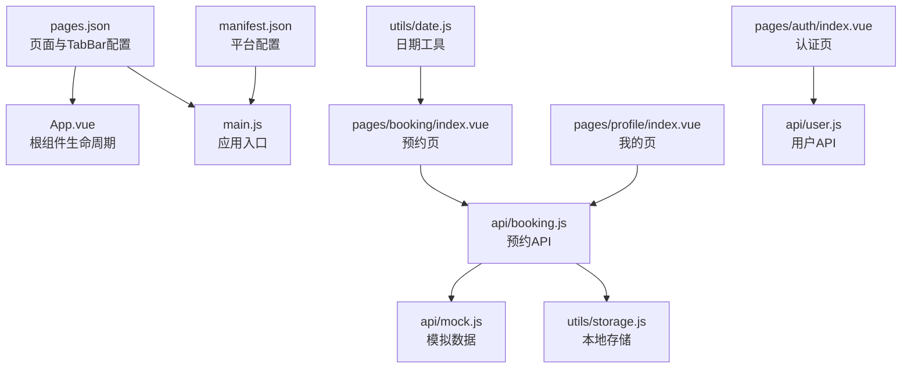
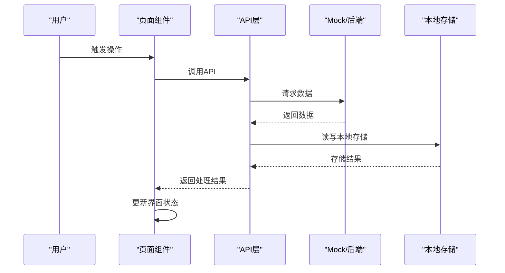
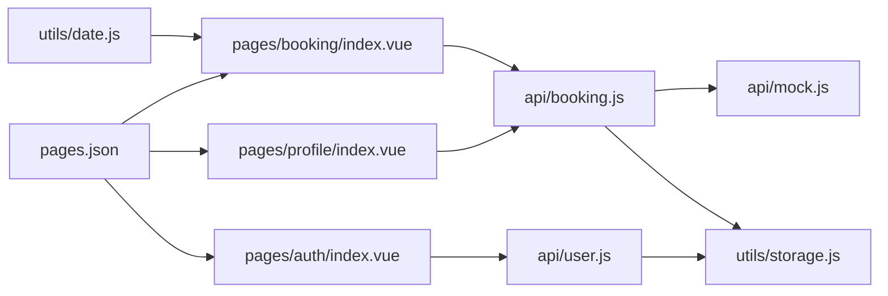
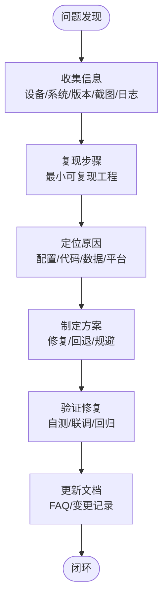

# 故障排除与FAQ

<cite>
**本文引用的文件**
- [pages.json](file://pages.json)
- [manifest.json](file://manifest.json)
- [main.js](file://main.js)
- [App.vue](file://App.vue)
- [utils/storage.js](file://utils/storage.js)
- [api/booking.js](file://api/booking.js)
- [api/user.js](file://api/user.js)
- [api/mock.js](file://api/mock.js)
- [utils/date.js](file://utils/date.js)
- [pages/booking/index.vue](file://pages/booking/index.vue)
- [pages/profile/index.vue](file://pages/profile/index.vue)
- [pages/auth/index.vue](file://pages/auth/index.vue)
- [PROJECT.md](file://PROJECT.md)
</cite>

## 目录
1. [简介](#简介)
2. [项目结构](#项目结构)
3. [核心组件](#核心组件)
4. [架构总览](#架构总览)
5. [详细组件分析](#详细组件分析)
6. [依赖关系分析](#依赖关系分析)
7. [性能考虑](#性能考虑)
8. [故障排除指南](#故障排除指南)
9. [结论](#结论)
10. [附录](#附录)

## 简介
本指南面向开发者，系统梳理本校园巴士调度系统在开发与调试阶段可能遇到的问题，并提供标准化的排查步骤、解决方案与预防建议。内容涵盖：
- 项目配置问题（pages.json、TabBar图标、应用启动）
- 数据存储与API调用问题（本地存储清理、网络请求失败、数据格式错误）
- 页面跳转与路由问题（页面找不到、参数传递错误、返回栈异常）
- 组件开发问题（组件通信失败、样式覆盖、事件绑定）
- 跨平台兼容性（iOS/Android差异、不同屏幕尺寸适配）
- 性能诊断与优化
- 问题反馈与解决流程

## 项目结构
项目采用 uni-app + Vue 3 的多端统一开发模式，页面按功能模块组织，API层与工具函数分离，便于后续对接后端与扩展。

图表来源
- [pages.json:1-62](file://pages.json#L1-L62)
- [App.vue:1-32](file://App.vue#L1-L32)
- [main.js:1-22](file://main.js#L1-L22)
- [manifest.json:1-73](file://manifest.json#L1-L73)
- [pages/booking/index.vue:1-575](file://pages/booking/index.vue#L1-L575)
- [pages/profile/index.vue:1-595](file://pages/profile/index.vue#L1-L595)
- [pages/auth/index.vue:1-385](file://pages/auth/index.vue#L1-L385)
- [api/booking.js:1-165](file://api/booking.js#L1-L165)
- [api/user.js:1-128](file://api/user.js#L1-L128)
- [api/mock.js:1-226](file://api/mock.js#L1-L226)
- [utils/storage.js:1-116](file://utils/storage.js#L1-L116)
- [utils/date.js:1-84](file://utils/date.js#L1-L84)

章节来源
- [PROJECT.md:41-67](file://PROJECT.md#L41-L67)

## 核心组件
- 页面配置与生命周期：pages.json、App.vue、main.js
- 数据访问层：api/booking.js、api/user.js、api/mock.js
- 本地存储：utils/storage.js
- 工具函数：utils/date.js
- 页面组件：pages/booking/index.vue、pages/profile/index.vue、pages/auth/index.vue

章节来源
- [pages.json:1-62](file://pages.json#L1-L62)
- [App.vue:1-32](file://App.vue#L1-L32)
- [main.js:1-22](file://main.js#L1-L22)
- [api/booking.js:1-165](file://api/booking.js#L1-L165)
- [api/user.js:1-128](file://api/user.js#L1-L128)
- [api/mock.js:1-226](file://api/mock.js#L1-L226)
- [utils/storage.js:1-116](file://utils/storage.js#L1-L116)
- [utils/date.js:1-84](file://utils/date.js#L1-L84)
- [pages/booking/index.vue:1-575](file://pages/booking/index.vue#L1-L575)
- [pages/profile/index.vue:1-595](file://pages/profile/index.vue#L1-L595)
- [pages/auth/index.vue:1-385](file://pages/auth/index.vue#L1-L385)

## 架构总览
系统采用“页面组件 → API层 → 本地存储”的数据流设计，便于后期替换为真实后端。

图表来源
- [pages/booking/index.vue:114-162](file://pages/booking/index.vue#L114-L162)
- [api/booking.js:14-40](file://api/booking.js#L14-L40)
- [api/mock.js:49-93](file://api/mock.js#L49-L93)
- [utils/storage.js:6-114](file://utils/storage.js#L6-L114)

## 详细组件分析

### 页面与导航配置
- pages.json 控制页面注册、全局样式与 TabBar 列表、图标路径与选中态图标路径。
- manifest.json 控制平台能力、权限、分包与多端配置。
- App.vue 提供应用生命周期钩子，便于全局初始化与日志输出。
- main.js 支持 Vue 2/3 双环境构建。

章节来源
- [pages.json:1-62](file://pages.json#L1-L62)
- [manifest.json:1-73](file://manifest.json#L1-L73)
- [App.vue:1-32](file://App.vue#L1-L32)
- [main.js:1-22](file://main.js#L1-L22)

### 预约页面（pages/booking/index.vue）
- 功能要点：我的预约展示、路线与日期筛选、车次列表、预约与取消流程。
- 关键交互：onShow 刷新数据、认证检查、模态确认、Toast/Loading 提示。
- 数据来源：API 层（mock）与本地存储。

章节来源
- [pages/booking/index.vue:114-296](file://pages/booking/index.vue#L114-L296)
- [api/booking.js:14-163](file://api/booking.js#L14-L163)
- [api/mock.js:49-203](file://api/mock.js#L49-L203)
- [utils/date.js:10-33](file://utils/date.js#L10-L33)

### 我的页面（pages/profile/index.vue）
- 功能要点：功能入口、身份信息展示、认证入口、预约须知、客服反馈、乘车历史。
- 关键交互：弹窗控制、历史数据加载、用户类型映射与时间格式化。

章节来源
- [pages/profile/index.vue:156-247](file://pages/profile/index.vue#L156-L247)
- [api/user.js:12-42](file://api/user.js#L12-L42)
- [api/booking.js:78-102](file://api/booking.js#L78-L102)

### 身份认证页面（pages/auth/index.vue）
- 功能要点：姓名/学号/身份类型输入、表单校验、提交认证、本地存储用户信息。
- 关键交互：输入联动、错误提示、提交状态、返回上一页。

章节来源
- [pages/auth/index.vue:102-189](file://pages/auth/index.vue#L102-L189)
- [api/user.js:72-100](file://api/user.js#L72-L100)

### API层与本地存储
- API 层：booking.js、user.js 对外暴露统一接口，当前使用 mock.js 与本地存储。
- 本地存储：封装 get/set/clear 方法，避免直接使用底层 API。

章节来源
- [api/booking.js:14-163](file://api/booking.js#L14-L163)
- [api/user.js:12-100](file://api/user.js#L12-L100)
- [api/mock.js:49-203](file://api/mock.js#L49-L203)
- [utils/storage.js:6-114](file://utils/storage.js#L6-L114)

## 依赖关系分析
- 页面组件依赖 API 层；API 层依赖工具函数与本地存储；本地存储依赖 uni-app 的存储接口。
- pages.json 决定页面注册与 TabBar 图标路径，直接影响页面可用性与图标显示。

图表来源
- [pages/booking/index.vue:99-100](file://pages/booking/index.vue#L99-L100)
- [pages/profile/index.vue:154-155](file://pages/profile/index.vue#L154-L155)
- [pages/auth/index.vue:100](file://pages/auth/index.vue#L100)
- [api/booking.js:6](file://api/booking.js#L6)
- [api/user.js:6](file://api/user.js#L6)
- [api/mock.js:1-226](file://api/mock.js#L1-L226)
- [utils/storage.js:1-116](file://utils/storage.js#L1-L116)
- [utils/date.js:1-84](file://utils/date.js#L1-L84)
- [pages.json:1-62](file://pages.json#L1-L62)

## 性能考虑
- 预约列表与车次列表使用滚动容器，减少重排与重绘。
- 本地存储读写使用异步 Promise 包装，避免阻塞主线程。
- Mock 数据模拟网络延迟，便于前端联调与性能压测。
- TabBar 图标建议使用 PNG 格式与合适尺寸，降低渲染开销。

章节来源
- [pages/booking/index.vue:463-465](file://pages/booking/index.vue#L463-L465)
- [utils/storage.js:6-114](file://utils/storage.js#L6-L114)
- [api/mock.js:50-92](file://api/mock.js#L50-L92)
- [PROJECT.md:98-101](file://PROJECT.md#L98-L101)

## 故障排除指南

### 一、项目配置问题

#### 1. pages.json 配置错误
- 症状：运行时报“页面路径不存在”“TabBar 图标不显示”等。
- 排查步骤：
  - 检查 pages.json 中的 path 是否与实际文件路径一致。
  - 确认 tabBar.list.pagePath 指向的页面是否存在。
  - 确认 iconPath/selectedIconPath 的相对路径正确且文件存在。
- 解决方案：
  - 修正路径大小写与斜杠。
  - 确保 static/icons 下包含对应图标文件。
  - 使用绝对路径或确保相对路径与 pages.json 一致。
- 预防措施：
  - 新增页面后同步更新 pages.json。
  - 使用 IDE 的文件路径智能提示与校验。

章节来源
- [pages.json:1-62](file://pages.json#L1-L62)
- [PROJECT.md:98-101](file://PROJECT.md#L98-L101)

#### 2. TabBar 图标显示问题
- 症状：TabBar 不显示图标或显示为默认占位图。
- 排查步骤：
  - 检查 static/icons/ 下是否存在对应图标文件。
  - 确认图标格式为 PNG，尺寸建议 81x81px。
  - 确认 pages.json 中 iconPath/selectedIconPath 路径正确。
- 解决方案：
  - 替换为真实图标文件，确保命名与 pages.json 一致。
  - 若使用相对路径，确保与 pages.json 的相对关系正确。
- 预防措施：
  - 统一图标命名规范与尺寸标准。

章节来源
- [pages.json:34-59](file://pages.json#L34-L59)
- [PROJECT.md:98-101](file://PROJECT.md#L98-L101)

#### 3. 应用启动失败
- 症状：HBuilderX 编译报错或微信开发者工具无法打开。
- 排查步骤：
  - 检查 main.js 的 Vue 版本条件编译是否正确。
  - 检查 manifest.json 的平台配置与权限声明。
  - 确认 App.vue 生命周期钩子未抛出异常。
- 解决方案：
  - 修复 main.js 条件编译语法。
  - 在 manifest.json 中添加必要权限或移除无效权限。
  - 在 App.vue 中移除或修复异常代码。
- 预防措施：
  - 使用官方模板与最新 HBuilderX 版本。

章节来源
- [main.js:1-22](file://main.js#L1-L22)
- [manifest.json:1-73](file://manifest.json#L1-L73)
- [App.vue:1-32](file://App.vue#L1-L32)

### 二、数据存储与API调用问题

#### 1. 本地存储清理
- 症状：数据异常、状态不一致、认证信息失效。
- 排查步骤：
  - 检查本地存储键值：user_info、booking_list、bus_data。
  - 使用 uni.clearStorage() 清理全部数据后重试。
- 解决方案：
  - 在调试模式下提供“清除缓存”入口。
  - 在关键流程前后做数据一致性校验。
- 预防措施：
  - 统一使用 utils/storage.js 封装的 API，避免直接调用底层接口。

章节来源
- [utils/storage.js:106-114](file://utils/storage.js#L106-L114)
- [api/mock.js:54-57](file://api/mock.js#L54-L57)
- [api/mock.js:105-107](file://api/mock.js#L105-L107)
- [PROJECT.md:183-197](file://PROJECT.md#L183-L197)

#### 2. 网络请求失败
- 症状：页面加载失败、Toast 提示“加载失败”。
- 排查步骤：
  - 检查 API 层是否使用 mock 或后端接口。
  - 在 pages/booking/index.vue 中查看 console 错误。
  - 确认网络权限与域名配置（manifest.json）。
- 解决方案：
  - 切换到后端接口时，确保 header 中携带 token。
  - 在 API 层增加统一的错误处理与重试机制。
- 预防措施：
  - 使用统一的拦截器与错误提示策略。

章节来源
- [pages/booking/index.vue:157-161](file://pages/booking/index.vue#L157-L161)
- [api/booking.js:18-40](file://api/booking.js#L18-L40)
- [manifest.json:24-41](file://manifest.json#L24-L41)

#### 3. 数据格式错误
- 症状：状态字段不匹配、日期格式异常、座位数计算错误。
- 排查步骤：
  - 检查 utils/date.js 的日期格式化与 isExpired 判断。
  - 检查 API 层返回的数据结构与字段命名。
  - 检查本地存储中的数据是否被篡改。
- 解决方案：
  - 在 API 层增加数据校验与默认值处理。
  - 在页面组件中对异常数据做降级处理。
- 预防措施：
  - 建立数据契约文档与单元测试。

章节来源
- [utils/date.js:41-83](file://utils/date.js#L41-L83)
- [api/mock.js:77-87](file://api/mock.js#L77-L87)
- [api/mock.js:210-224](file://api/mock.js#L210-L224)

### 三、页面跳转与路由问题

#### 1. 页面找不到
- 症状：navigateTo/navigateBack 报错“页面不存在”。
- 排查步骤：
  - 检查 pages.json 中是否注册该页面。
  - 检查路径是否以 “/” 开头且与 pages.json 一致。
- 解决方案：
  - 在 pages.json 中补充缺失页面。
  - 使用相对路径或与 pages.json 保持一致的绝对路径。
- 预防措施：
  - 统一路由常量与页面注册清单。

章节来源
- [pages/booking/index.vue:191-193](file://pages/booking/index.vue#L191-L193)
- [pages/profile/index.vue:191-193](file://pages/profile/index.vue#L191-L193)
- [pages.json:1-62](file://pages.json#L1-L62)

#### 2. 参数传递错误
- 症状：页面接收不到预期参数或参数类型不匹配。
- 排查步骤：
  - 检查 navigateTo 的 url 与 query 参数拼接。
  - 检查 onLoad/onShow 的参数解析逻辑。
- 解决方案：
  - 使用 JSON.stringify/parse 或统一序列化策略。
  - 在页面入口做参数校验与默认值处理。
- 预防措施：
  - 建立参数契约与类型约束。

章节来源
- [pages/booking/index.vue:114-122](file://pages/booking/index.vue#L114-L122)
- [pages/profile/index.vue:167-169](file://pages/profile/index.vue#L167-L169)

#### 3. 返回栈异常
- 症状：多次 navigateBack 后进入错误页面。
- 排查步骤：
  - 检查页面栈管理与 navigateBack 的调用时机。
  - 检查 TabBar 页面切换是否影响返回栈。
- 解决方案：
  - 使用 redirectTo 或 reLaunch 重置页面栈。
  - 在关键流程后清理不必要的页面栈。
- 预防措施：
  - 统一导航策略与页面栈管理。

章节来源
- [pages/auth/index.vue:174-176](file://pages/auth/index.vue#L174-L176)
- [pages/booking/index.vue:190-197](file://pages/booking/index.vue#L190-L197)

### 四、组件开发问题

#### 1. 组件通信失败
- 症状：父子组件传参无效、事件未触发。
- 排查步骤：
  - 检查 props 类型与默认值。
  - 检查 emit 事件名与参数传递。
- 解决方案：
  - 使用严格的数据契约与类型校验。
  - 在父组件监听事件并做错误处理。
- 预防措施：
  - 统一组件 API 设计与文档。

章节来源
- [pages/booking/index.vue:102-111](file://pages/booking/index.vue#L102-L111)
- [pages/profile/index.vue:156-164](file://pages/profile/index.vue#L156-L164)

#### 2. 样式覆盖
- 症状：样式不生效、被覆盖或响应式异常。
- 排查步骤：
  - 检查 scoped 样式与深度选择器。
  - 检查全局样式与主题变量。
- 解决方案：
  - 使用更精确的选择器或 ::v-deep。
  - 统一主题变量与样式命名规范。
- 预防措施：
  - 建立样式规范与审查清单。

章节来源
- [pages/booking/index.vue:300-575](file://pages/booking/index.vue#L300-L575)
- [pages/profile/index.vue:251-595](file://pages/profile/index.vue#L251-L595)
- [App.vue:15-31](file://App.vue#L15-L31)

#### 3. 事件绑定问题
- 症状：点击无反应、事件重复触发。
- 排查步骤：
  - 检查事件修饰符与阻止冒泡。
  - 检查按钮禁用状态与条件渲染。
- 解决方案：
  - 使用防抖/节流处理高频事件。
  - 在事件回调中加入必要的状态判断。
- 预防措施：
  - 统一事件处理规范与测试。

章节来源
- [pages/booking/index.vue:177-247](file://pages/booking/index.vue#L177-L247)
- [pages/auth/index.vue:155-187](file://pages/auth/index.vue#L155-L187)

### 五、跨平台兼容性问题

#### 1. iOS 与 Android 差异
- 症状：TabBar 图标显示异常、字体渲染差异、权限申请不同。
- 排查步骤：
  - 检查 manifest.json 中平台特定配置。
  - 检查静态资源路径与大小写。
- 解决方案：
  - 分别为 iOS/Android 配置图标与权限。
  - 使用条件编译处理平台差异。
- 预防措施：
  - 在 CI 中分别测试 iOS/Android。

章节来源
- [manifest.json:24-47](file://manifest.json#L24-L47)
- [pages.json:34-59](file://pages.json#L34-L59)

#### 2. 不同屏幕尺寸适配
- 症状：布局错位、文字溢出、按钮不可点。
- 排查步骤：
  - 检查 rpx 单位使用与媒体查询。
  - 检查滚动容器与弹性布局。
- 解决方案：
  - 使用 rpx 与 flex 布局。
  - 针对小屏设备调整间距与字号。
- 预防措施：
  - 建立设计稿与断点规范。

章节来源
- [pages/booking/index.vue:463-465](file://pages/booking/index.vue#L463-L465)
- [pages/profile/index.vue:463-465](file://pages/profile/index.vue#L463-L465)

### 六、性能问题诊断与优化

- 诊断手段：
  - 使用微信开发者工具的性能面板与网络面板。
  - 检查页面渲染耗时与内存占用。
- 优化建议：
  - 减少不必要的 setData 与重渲染。
  - 使用虚拟列表与懒加载。
  - 合理使用本地存储与缓存策略。
  - 优化图片与图标资源体积。

章节来源
- [utils/storage.js:6-114](file://utils/storage.js#L6-L114)
- [api/mock.js:50-92](file://api/mock.js#L50-L92)

### 七、问题反馈与解决流程（标准化）

章节来源
- [PROJECT.md:183-220](file://PROJECT.md#L183-L220)

## 结论
本指南围绕配置、数据、路由、组件、跨平台与性能六个维度，提供了系统化的故障排除方法与预防建议。建议在团队内建立统一的开发规范、测试流程与问题反馈机制，持续提升开发效率与产品质量。

## 附录

### 常用排查清单
- 页面路径与注册：pages.json
- TabBar 图标：static/icons/
- 本地存储：user_info、booking_list、bus_data
- API 接口：booking.js、user.js、mock.js
- 日期工具：utils/date.js
- 本地存储封装：utils/storage.js
- 平台配置：manifest.json
- 应用入口：main.js、App.vue

章节来源
- [pages.json:1-62](file://pages.json#L1-L62)
- [utils/storage.js:6-114](file://utils/storage.js#L6-L114)
- [api/booking.js:1-165](file://api/booking.js#L1-L165)
- [api/user.js:1-128](file://api/user.js#L1-L128)
- [api/mock.js:1-226](file://api/mock.js#L1-L226)
- [utils/date.js:1-84](file://utils/date.js#L1-L84)
- [manifest.json:1-73](file://manifest.json#L1-L73)
- [main.js:1-22](file://main.js#L1-L22)
- [App.vue:1-32](file://App.vue#L1-L32)