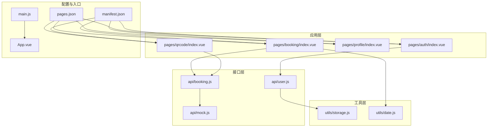
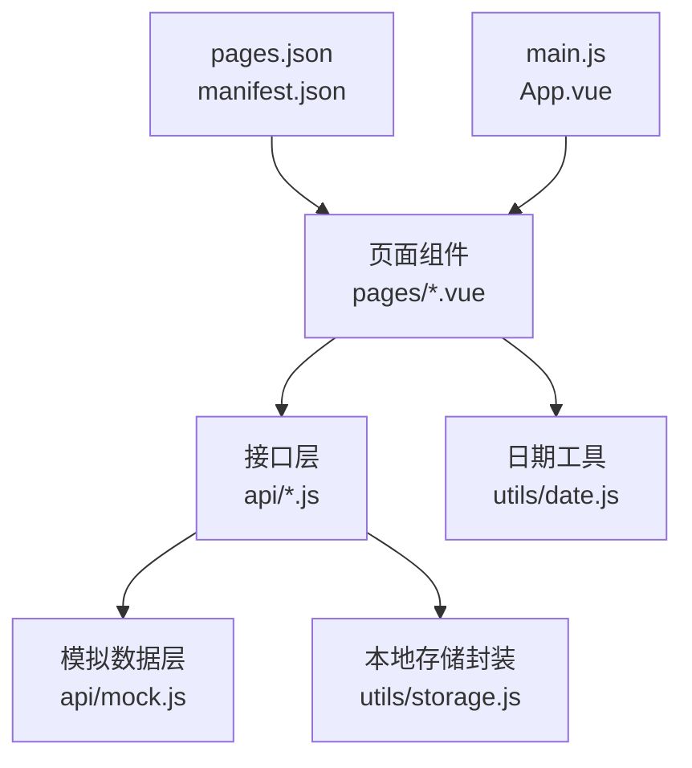
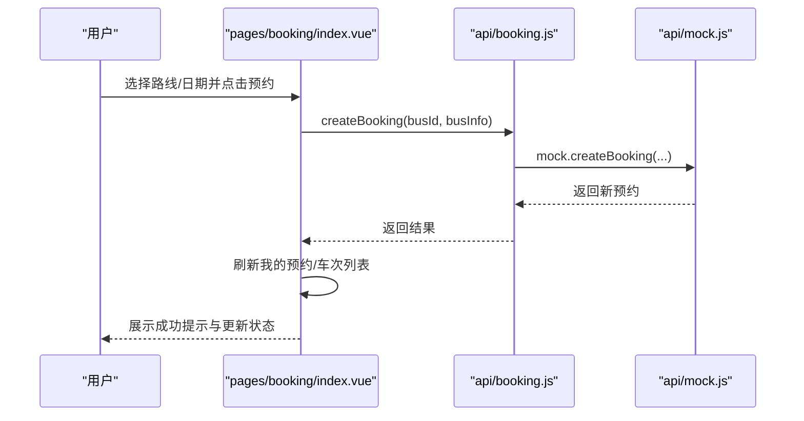
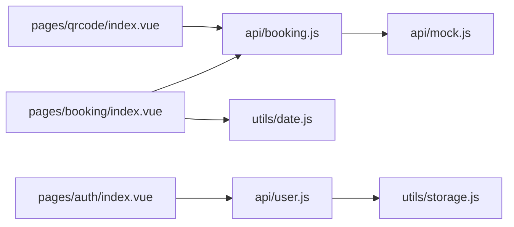

# 环境搭建

<cite>
**本文引用的文件**
- [PROJECT.md](file://PROJECT.md)
- [manifest.json](file://manifest.json)
- [pages.json](file://pages.json)
- [main.js](file://main.js)
- [App.vue](file://App.vue)
- [api/booking.js](file://api/booking.js)
- [api/user.js](file://api/user.js)
- [api/mock.js](file://api/mock.js)
- [utils/storage.js](file://utils/storage.js)
- [utils/date.js](file://utils/date.js)
- [pages/booking/index.vue](file://pages/booking/index.vue)
- [pages/auth/index.vue](file://pages/auth/index.vue)
- [pages/qrcode/index.vue](file://pages/qrcode/index.vue)
</cite>

## 目录
1. [引言](#引言)
2. [项目结构](#项目结构)
3. [核心组件](#核心组件)
4. [架构总览](#架构总览)
5. [详细组件分析](#详细组件分析)
6. [依赖分析](#依赖分析)
7. [性能考虑](#性能考虑)
8. [故障排查指南](#故障排查指南)
9. [结论](#结论)
10. [附录](#附录)

## 引言
本指南面向参与“学校校车调度系统”开发的工程师与测试人员，提供从零开始的完整开发环境搭建步骤，覆盖以下内容：
- HBuilderX 开发工具的安装与配置（版本要求、插件与项目导入）
- 微信开发者工具的下载、安装与配置
- Node.js 环境与 npm 的使用（如需本地依赖或脚手架）
- 项目克隆、依赖安装与首次运行流程
- 常见环境问题排查（路径配置、权限、平台差异等）
- 不同操作系统（Windows、macOS、Linux）的特定注意事项

本项目基于 uni-app 框架与 Vue 3，目标平台为微信小程序，采用本地存储与模拟数据层，便于快速启动与后续对接真实后端。

## 项目结构
项目采用 uni-app 的标准目录组织，核心目录与职责如下：
- pages：页面级组件，包含预约、乘车码、我的、身份认证等页面
- api：接口层，封装与后端交互的 API 方法，当前使用 mock 数据
- utils：通用工具函数，如日期处理与本地存储封装
- static：静态资源（如 TabBar 图标）
- 根配置：pages.json（页面与 TabBar 配置）、manifest.json（应用配置）、main.js（入口）、App.vue（根组件）

图表来源
- [pages.json:1-62](file://pages.json#L1-L62)
- [manifest.json:1-73](file://manifest.json#L1-L73)
- [main.js:1-22](file://main.js#L1-L22)
- [App.vue:1-32](file://App.vue#L1-L32)
- [pages/booking/index.vue:1-575](file://pages/booking/index.vue#L1-L575)
- [pages/qrcode/index.vue:1-342](file://pages/qrcode/index.vue#L1-L342)
- [pages/auth/index.vue:1-385](file://pages/auth/index.vue#L1-L385)
- [api/booking.js:1-165](file://api/booking.js#L1-L165)
- [api/user.js:1-128](file://api/user.js#L1-L128)
- [api/mock.js:1-226](file://api/mock.js#L1-L226)
- [utils/storage.js:1-116](file://utils/storage.js#L1-L116)
- [utils/date.js:1-84](file://utils/date.js#L1-L84)

章节来源
- [PROJECT.md:69-95](file://PROJECT.md#L69-L95)
- [pages.json:1-62](file://pages.json#L1-L62)
- [manifest.json:1-73](file://manifest.json#L1-L73)
- [main.js:1-22](file://main.js#L1-L22)
- [App.vue:1-32](file://App.vue#L1-L32)

## 核心组件
- 页面组件：预约页、乘车码页、我的页、身份认证页，负责用户交互与业务流程
- 接口层：统一暴露 getBusList、createBooking、getMyBookings、cancelBooking、authenticate 等方法，当前由 mock 实现，便于替换为真实后端
- 工具层：storage 封装本地存储；date 提供日期格式化与判断
- 配置层：pages.json 管理页面路由与 TabBar；manifest.json 管理应用与小程序平台配置；main.js/App.vue 为应用入口与根组件

章节来源
- [pages/booking/index.vue:98-297](file://pages/booking/index.vue#L98-L297)
- [pages/qrcode/index.vue:60-184](file://pages/qrcode/index.vue#L60-L184)
- [pages/auth/index.vue:99-189](file://pages/auth/index.vue#L99-L189)
- [api/booking.js:8-164](file://api/booking.js#L8-L164)
- [api/user.js:8-127](file://api/user.js#L8-L127)
- [utils/storage.js:6-115](file://utils/storage.js#L6-L115)
- [utils/date.js:10-84](file://utils/date.js#L10-L84)
- [pages.json:1-62](file://pages.json#L1-L62)
- [manifest.json:1-73](file://manifest.json#L1-L73)
- [main.js:1-22](file://main.js#L1-L22)
- [App.vue:1-32](file://App.vue#L1-L32)

## 架构总览
系统采用“页面组件 → 接口层 → 模拟数据/本地存储”的分层架构，便于后期替换为真实后端 API。

图表来源
- [pages/booking/index.vue:98-297](file://pages/booking/index.vue#L98-L297)
- [pages/qrcode/index.vue:60-184](file://pages/qrcode/index.vue#L60-L184)
- [pages/auth/index.vue:99-189](file://pages/auth/index.vue#L99-L189)
- [api/booking.js:1-165](file://api/booking.js#L1-L165)
- [api/user.js:1-128](file://api/user.js#L1-L128)
- [api/mock.js:1-226](file://api/mock.js#L1-L226)
- [utils/storage.js:1-116](file://utils/storage.js#L1-L116)
- [utils/date.js:1-84](file://utils/date.js#L1-L84)
- [pages.json:1-62](file://pages.json#L1-L62)
- [manifest.json:1-73](file://manifest.json#L1-L73)
- [main.js:1-22](file://main.js#L1-L22)
- [App.vue:1-32](file://App.vue#L1-L32)

## 详细组件分析

### HBuilderX 开发工具安装与配置
- 版本要求：HBuilderX 3.0+ 或 Vue CLI（项目使用 uni-app 框架）
- 插件与项目导入：通过“文件 → 导入 → 从本地目录导入”打开项目根目录
- 运行到微信小程序：在 HBuilderX 中点击“运行 → 运行到小程序模拟器 → 微信开发者工具”，首次运行需配置微信开发者工具路径

章节来源
- [PROJECT.md:71-95](file://PROJECT.md#L71-L95)

### 微信开发者工具安装与配置
- 下载与安装：从微信公众平台官网下载对应平台版本
- 首次运行：在 HBuilderX 中“运行到微信开发者工具”时，按提示配置工具路径
- 预览：HBuilderX 编译完成后自动打开微信开发者工具进行预览

章节来源
- [PROJECT.md:88-94](file://PROJECT.md#L88-L94)

### Node.js 与 npm 使用说明
- 本项目为 uni-app 小程序前端，通常无需额外安装 Node.js 与 npm 即可在 HBuilderX 中直接运行与调试
- 若需使用 npm 管理本地依赖或脚手架，请确保系统已安装 Node.js 与 npm，并在项目根目录执行依赖安装命令（若存在 package.json）

章节来源
- [PROJECT.md:71-73](file://PROJECT.md#L71-L73)

### 项目克隆、依赖安装与首次运行
- 克隆：使用 Git 克隆仓库到本地
- 打开：在 HBuilderX 中“文件 → 导入 → 从本地目录导入”选择项目根目录
- 首次运行：在 HBuilderX 中“运行 → 运行到小程序模拟器 → 微信开发者工具”，按提示配置微信开发者工具路径
- 预览：HBuilderX 自动编译并在微信开发者工具中打开小程序进行预览

章节来源
- [PROJECT.md:77-94](file://PROJECT.md#L77-L94)

### 页面与导航配置（pages.json）
- 页面注册：pages.json 中注册了预约、乘车码、我的、身份认证四个页面
- 全局样式：设置导航栏文字颜色、标题、背景色
- TabBar：配置三类 Tab（车辆预约、乘车码、我的），并声明图标路径（需准备 PNG 图标）

章节来源
- [pages.json:1-62](file://pages.json#L1-L62)

### 应用配置（manifest.json）
- 平台配置：针对 mp-weixin（微信小程序）进行 appid、URL 校验、组件化等设置
- 应用元信息：名称、版本、描述、vue 版本等

章节来源
- [manifest.json:1-73](file://manifest.json#L1-L73)

### 页面组件与数据流
- 预约页：加载未来 N 天日期、筛选路线与日期、拉取车次列表、发起预约、取消预约、展示我的预约
- 乘车码页：根据今日有效预约生成二维码，30 秒自动刷新
- 身份认证页：表单校验、本地存储用户信息

图表来源
- [pages/booking/index.vue:176-247](file://pages/booking/index.vue#L176-L247)
- [api/booking.js:47-73](file://api/booking.js#L47-L73)
- [api/mock.js:101-152](file://api/mock.js#L101-L152)

章节来源
- [pages/booking/index.vue:98-297](file://pages/booking/index.vue#L98-L297)
- [pages/qrcode/index.vue:60-184](file://pages/qrcode/index.vue#L60-L184)
- [pages/auth/index.vue:99-189](file://pages/auth/index.vue#L99-L189)
- [api/booking.js:1-165](file://api/booking.js#L1-L165)
- [api/user.js:1-128](file://api/user.js#L1-L128)
- [api/mock.js:1-226](file://api/mock.js#L1-L226)

## 依赖分析
- 组件耦合：页面组件仅通过接口层访问数据，接口层再调用 mock 或本地存储，降低页面与数据源的耦合度
- 外部依赖：项目未包含 package.json，因此未声明 npm 依赖；如需本地依赖，请在项目根目录添加 package.json 并执行安装

图表来源
- [pages/booking/index.vue:98-297](file://pages/booking/index.vue#L98-L297)
- [pages/qrcode/index.vue:60-184](file://pages/qrcode/index.vue#L60-L184)
- [pages/auth/index.vue:99-189](file://pages/auth/index.vue#L99-L189)
- [api/booking.js:1-165](file://api/booking.js#L1-L165)
- [api/user.js:1-128](file://api/user.js#L1-L128)
- [api/mock.js:1-226](file://api/mock.js#L1-L226)
- [utils/storage.js:1-116](file://utils/storage.js#L1-L116)
- [utils/date.js:1-84](file://utils/date.js#L1-L84)

章节来源
- [pages/booking/index.vue:98-297](file://pages/booking/index.vue#L98-L297)
- [pages/qrcode/index.vue:60-184](file://pages/qrcode/index.vue#L60-L184)
- [pages/auth/index.vue:99-189](file://pages/auth/index.vue#L99-L189)
- [api/booking.js:1-165](file://api/booking.js#L1-L165)
- [api/user.js:1-128](file://api/user.js#L1-L128)
- [api/mock.js:1-226](file://api/mock.js#L1-L226)
- [utils/storage.js:1-116](file://utils/storage.js#L1-L116)
- [utils/date.js:1-84](file://utils/date.js#L1-L84)

## 性能考虑
- 模拟数据延迟：mock 层对每个接口设置了短延迟以模拟网络请求，有助于联调阶段的交互体验
- 本地存储：使用本地存储减少网络依赖，但需注意存储上限与清理策略
- 页面滚动与渲染：预约页的日期与车次列表采用滚动容器，避免长列表渲染压力

章节来源
- [api/mock.js:50-92](file://api/mock.js#L50-L92)
- [api/mock.js:101-151](file://api/mock.js#L101-L151)
- [pages/booking/index.vue:54-94](file://pages/booking/index.vue#L54-L94)

## 故障排查指南
- pages.json 配置错误
  - 症状：运行时报错“pages.json 配置错误”
  - 排查：检查 pages.json 中页面路径是否正确、文件是否存在
- TabBar 图标缺失
  - 症状：TabBar 不显示图标
  - 排查：确认 static/icons 目录下存在对应 PNG 图标（建议尺寸 81x81px），并检查 iconPath 与 selectedIconPath 路径
- 预约功能不可用
  - 症状：无法预约或提示未认证
  - 排查：确认已完成身份认证；检查控制台错误；清除本地存储后重试
- 二维码不显示
  - 症状：乘车码页二维码空白
  - 排查：当前为简易 canvas 示例实现，建议集成专业二维码库；检查 canvas 组件渲染与定时刷新逻辑

章节来源
- [PROJECT.md:185-202](file://PROJECT.md#L185-L202)
- [pages.json:34-59](file://pages.json#L34-L59)
- [pages/qrcode/index.vue:103-141](file://pages/qrcode/index.vue#L103-L141)

## 结论
本指南提供了从工具安装、项目导入、首次运行到常见问题排查的全流程说明。项目采用 uni-app + Vue 3 架构，接口层与模拟数据层清晰分离，便于快速迭代与后续对接真实后端。建议在开发过程中关注页面配置与本地存储的兼容性，并在需要时引入专业二维码库提升用户体验。

## 附录

### 不同操作系统（Windows、macOS、Linux）特定配置说明
- Windows
  - HBuilderX 与微信开发者工具均支持 Windows，注意以管理员权限安装工具以避免权限问题
  - 路径分隔符使用反斜杠，确保 pages.json 与 manifest.json 中路径一致
- macOS
  - 使用 Homebrew 安装 Node.js（如需）：brew install node
  - 微信开发者工具安装后可通过 HBuilderX 的“运行到微信开发者工具”自动识别工具路径
- Linux
  - 建议使用官方提供的 DEB/RPM 包安装工具
  - 若使用 npm，请确保 npm 与 Node.js 版本兼容，并在项目根目录执行安装命令（若存在 package.json）

章节来源
- [PROJECT.md:71-73](file://PROJECT.md#L71-L73)