# 编码规范

<cite>
**本文档引用的文件**
- [App.vue](file://App.vue)
- [main.js](file://main.js)
- [pages.json](file://pages.json)
- [PROJECT.md](file://PROJECT.md)
- [manifest.json](file://manifest.json)
- [api/booking.js](file://api/booking.js)
- [api/user.js](file://api/user.js)
- [api/mock.js](file://api/mock.js)
- [utils/storage.js](file://utils/storage.js)
- [utils/date.js](file://utils/date.js)
- [pages/booking/index.vue](file://pages/booking/index.vue)
- [pages/auth/index.vue](file://pages/auth/index.vue)
- [pages/qrcode/index.vue](file://pages/qrcode/index.vue)
- [pages/profile/index.vue](file://pages/profile/index.vue)
</cite>

## 目录
1. [引言](#引言)
2. [项目结构](#项目结构)
3. [核心组件](#核心组件)
4. [架构概览](#架构概览)
5. [详细组件分析](#详细组件分析)
6. [依赖关系分析](#依赖关系分析)
7. [性能考虑](#性能考虑)
8. [故障排除指南](#故障排除指南)
9. [结论](#结论)
10. [附录](#附录)

## 引言

本编码规范旨在为学校校车调度系统提供统一的开发标准，确保代码的一致性、可维护性和可扩展性。该系统基于 uni-app 框架开发，支持多平台部署（微信小程序、H5、App等），采用 Vue.js 组件化开发模式。

本规范涵盖了以下关键领域：
- Vue.js 组件开发规范
- UniApp 框架特定开发规范
- JavaScript/ES6+ 编码规范
- CSS 样式编写规范
- API 接口设计规范
- Mock 数据编写标准
- 代码注释规范
- Git 提交消息格式
- 性能优化原则
- 内存管理最佳实践

## 项目结构

学校校车调度系统采用模块化的项目结构，清晰分离了不同功能领域的代码：

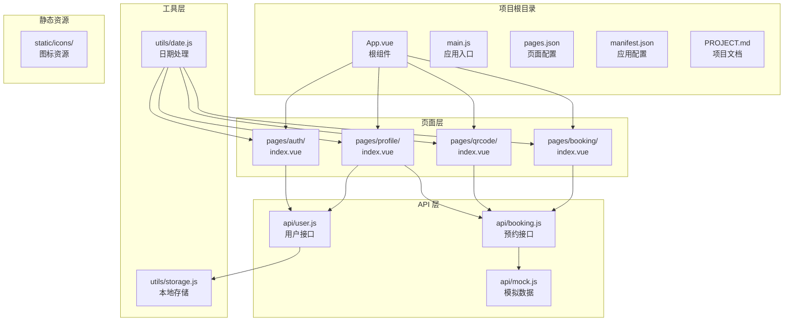

**图表来源**
- [PROJECT.md:41-67](file://PROJECT.md#L41-L67)
- [pages.json:1-62](file://pages.json#L1-L62)

**章节来源**
- [PROJECT.md:41-67](file://PROJECT.md#L41-L67)
- [pages.json:1-62](file://pages.json#L1-L62)

## 核心组件

### 应用入口组件

应用入口组件负责初始化应用配置和生命周期管理：

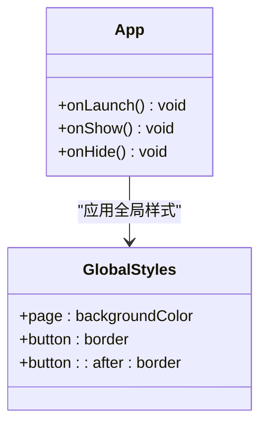

**图表来源**
- [App.vue:1-32](file://App.vue#L1-L32)

### 主应用入口

主入口文件支持 Vue 2 和 Vue 3 两种运行时环境：

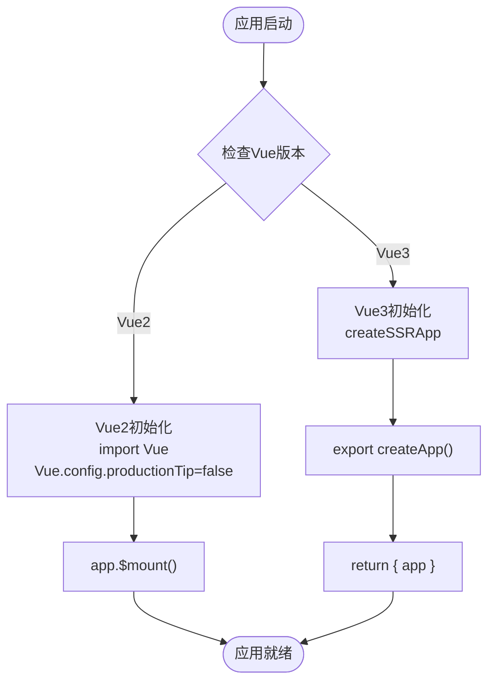

**图表来源**
- [main.js:1-22](file://main.js#L1-L22)

**章节来源**
- [App.vue:1-32](file://App.vue#L1-L32)
- [main.js:1-22](file://main.js#L1-L22)

## 架构概览

系统采用分层架构设计，实现了清晰的关注点分离：

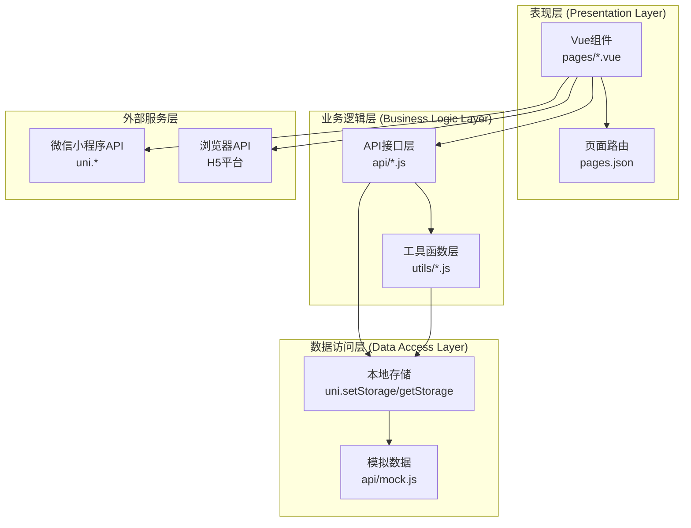

**图表来源**
- [PROJECT.md:113-134](file://PROJECT.md#L113-L134)
- [api/booking.js:1-165](file://api/booking.js#L1-L165)
- [api/user.js:1-128](file://api/user.js#L1-L128)

### 数据流设计

系统遵循单向数据流原则，确保数据变更的可追踪性：

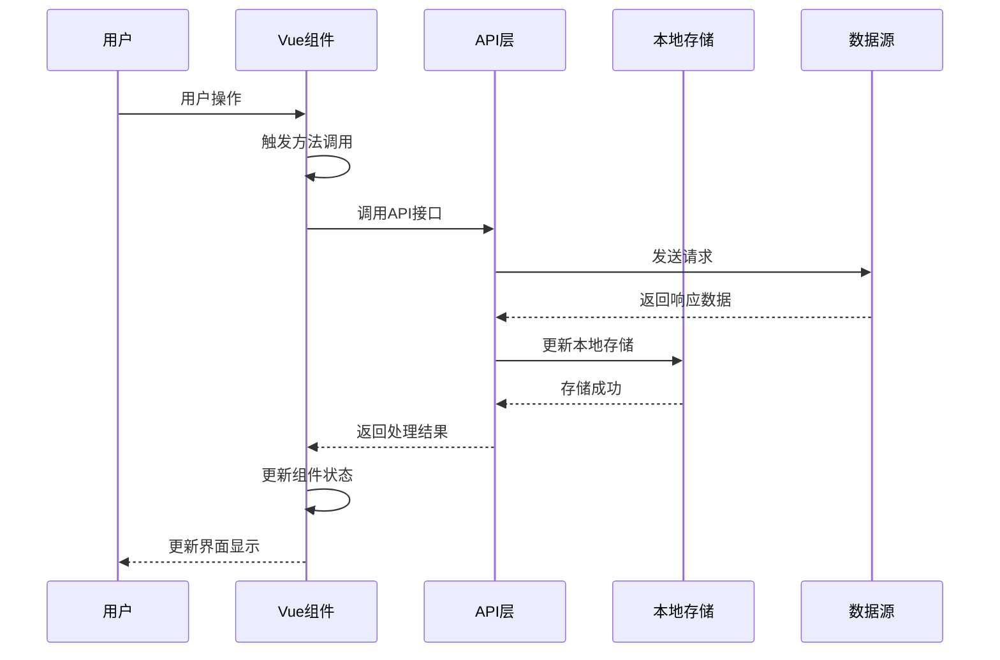

**图表来源**
- [PROJECT.md:115-121](file://PROJECT.md#L115-L121)
- [api/mock.js:49-93](file://api/mock.js#L49-L93)

**章节来源**
- [PROJECT.md:113-134](file://PROJECT.md#L113-L134)

## 详细组件分析

### 预约页面组件

预约页面是系统的核心功能组件，实现了完整的预约流程：

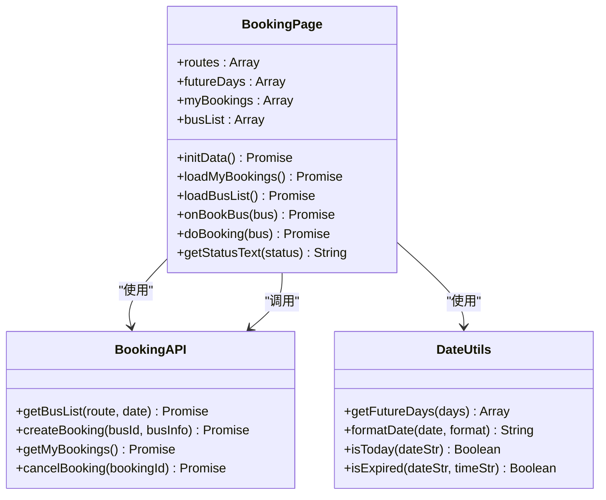

**图表来源**
- [pages/booking/index.vue:98-298](file://pages/booking/index.vue#L98-L298)
- [api/booking.js:8-165](file://api/booking.js#L8-L165)
- [utils/date.js:10-84](file://utils/date.js#L10-L84)

#### 组件生命周期管理

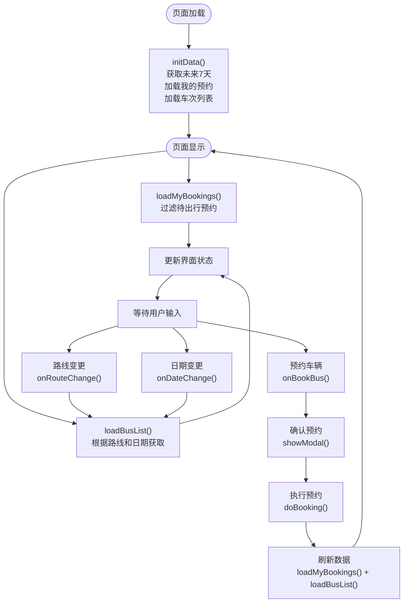

**图表来源**
- [pages/booking/index.vue:114-175](file://pages/booking/index.vue#L114-L175)
- [pages/booking/index.vue:177-247](file://pages/booking/index.vue#L177-L247)

**章节来源**
- [pages/booking/index.vue:98-298](file://pages/booking/index.vue#L98-L298)

### 身份认证组件

身份认证组件实现了用户身份验证功能：

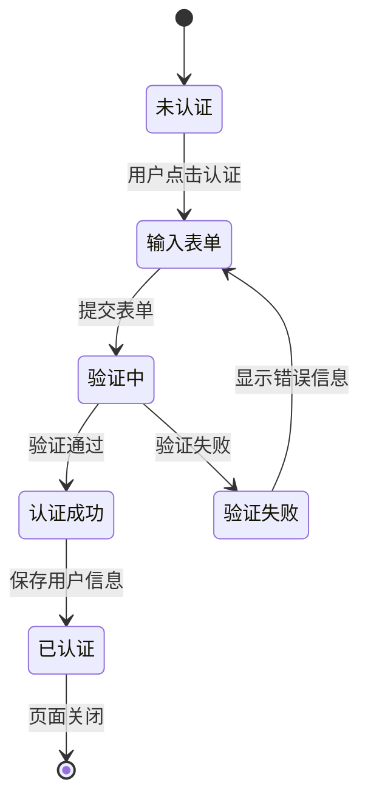

**图表来源**
- [pages/auth/index.vue:102-189](file://pages/auth/index.vue#L102-L189)

#### 表单验证流程

```mermaid
flowchart TD
Submit([提交表单]) --> Validate["validateForm()"]
Validate --> NameCheck{"姓名验证"}
NameCheck --> |通过| IdCheck{"学号验证"}
NameCheck --> |失败| ShowError["显示错误信息"]
IdCheck --> |通过| Success["调用认证API"]
IdCheck --> |失败| ShowError
Success --> SaveUser["保存用户信息"]
SaveUser --> Navigate["导航回上一页"]
ShowError --> Submit
Navigate --> [*]
```

**图表来源**
- [pages/auth/index.vue:135-187](file://pages/auth/index.vue#L135-L187)

**章节来源**
- [pages/auth/index.vue:99-189](file://pages/auth/index.vue#L99-L189)

### 乘车码组件

乘车码组件实现了动态二维码生成功能：

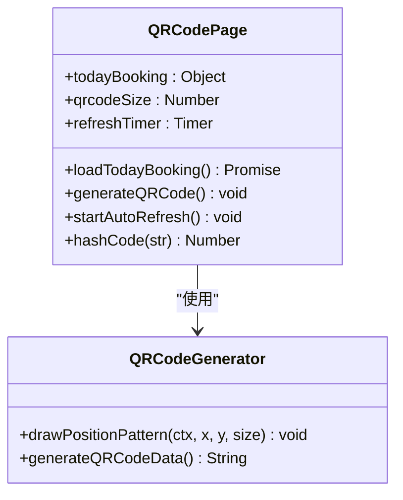

**图表来源**
- [pages/qrcode/index.vue:63-184](file://pages/qrcode/index.vue#L63-L184)

#### 二维码生成算法

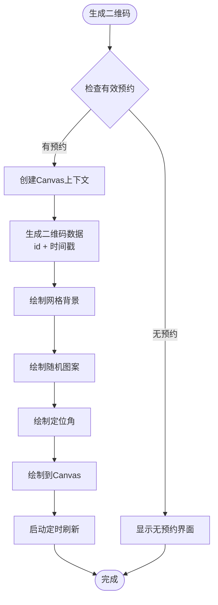

**图表来源**
- [pages/qrcode/index.vue:103-175](file://pages/qrcode/index.vue#L103-L175)

**章节来源**
- [pages/qrcode/index.vue:60-184](file://pages/qrcode/index.vue#L60-L184)

### 个人中心组件

个人中心组件整合了多个功能模块：

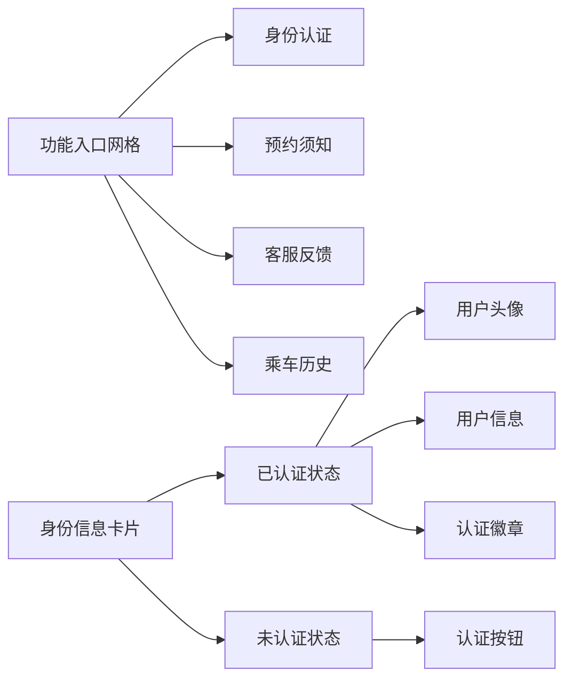

**图表来源**
- [pages/profile/index.vue:1-150](file://pages/profile/index.vue#L1-L150)

**章节来源**
- [pages/profile/index.vue:152-248](file://pages/profile/index.vue#L152-L248)

## 依赖关系分析

### 模块依赖图

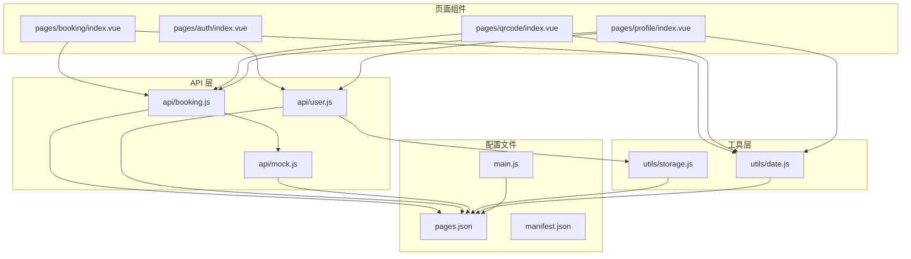

**图表来源**
- [pages/booking/index.vue:99-100](file://pages/booking/index.vue#L99-L100)
- [pages/auth/index.vue:100](file://pages/auth/index.vue#L100)
- [pages/qrcode/index.vue:61](file://pages/qrcode/index.vue#L61)
- [pages/profile/index.vue:153-154](file://pages/profile/index.vue#L153-L154)

### 数据依赖关系

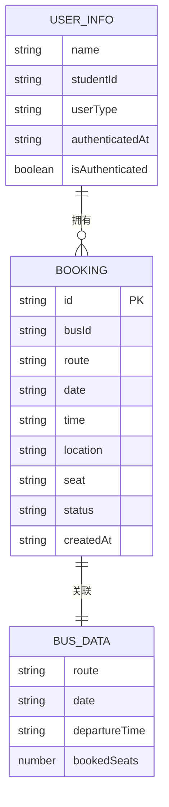

**图表来源**
- [api/mock.js:101-151](file://api/mock.js#L101-L151)
- [api/mock.js:158-169](file://api/mock.js#L158-L169)
- [utils/storage.js:10-36](file://utils/storage.js#L10-L36)

**章节来源**
- [api/mock.js:49-226](file://api/mock.js#L49-L226)
- [utils/storage.js:6-115](file://utils/storage.js#L6-L115)

## 性能考虑

### 内存管理最佳实践

1. **定时器清理**：在组件卸载时及时清理定时器，防止内存泄漏
2. **事件监听器**：组件销毁时移除事件监听器
3. **大数据处理**：对大量数据进行分页或虚拟滚动处理
4. **图片资源**：合理使用图片懒加载和缓存策略

### 异步处理优化

1. **Promise 链式调用**：避免回调地狱，提高代码可读性
2. **错误处理**：统一的错误处理机制，防止异常传播
3. **并发控制**：合理控制并发请求数量，避免服务器压力过大
4. **缓存策略**：实现合理的数据缓存机制，减少重复请求

### UI 性能优化

1. **组件懒加载**：对非关键路径的组件进行懒加载
2. **虚拟滚动**：对长列表使用虚拟滚动技术
3. **防抖节流**：对频繁触发的操作使用防抖节流
4. **CSS 优化**：避免复杂的 CSS 选择器，减少重绘重排

## 故障排除指南

### 常见问题诊断

#### 页面配置错误
- **症状**：应用启动时报错，页面无法正常显示
- **原因**：pages.json 配置不正确或页面路径错误
- **解决方案**：检查页面路径是否正确，确认文件存在

#### TabBar 图标显示问题
- **症状**：TabBar 不显示图标或图标不显示
- **原因**：图标文件缺失或路径错误
- **解决方案**：确认图标文件存在且路径正确，检查文件格式

#### 预约功能异常
- **症状**：预约功能无法使用或预约状态异常
- **原因**：身份认证未完成或本地存储数据异常
- **解决方案**：检查用户认证状态，清除本地存储后重试

#### 二维码生成失败
- **症状**：二维码无法正常显示
- **原因**：Canvas API 调用失败或权限问题
- **解决方案**：检查 Canvas 组件是否正确渲染，确认权限设置

**章节来源**
- [PROJECT.md:183-202](file://PROJECT.md#L183-L202)

## 结论

本编码规范为学校校车调度系统的开发提供了全面的指导原则。通过遵循这些规范，可以确保：

1. **代码一致性**：统一的代码风格和架构模式
2. **可维护性**：清晰的模块划分和职责分离
3. **可扩展性**：灵活的架构设计支持功能扩展
4. **跨平台兼容性**：基于 uni-app 的多平台支持
5. **性能优化**：合理的性能考虑和最佳实践

建议开发团队在日常开发中严格遵守这些规范，并根据项目发展情况进行持续改进。

## 附录

### Vue.js 组件开发规范

#### 组件命名约定
- 文件名使用帕斯卡命名法：`MyComponent.vue`
- 组件名称与文件名保持一致
- 复合组件使用连字符分隔：`my-component.vue`

#### 文件组织结构
- 单文件组件按功能组织：`components/feature/`
- 公共组件放置在 `components/common/`
- 页面组件放置在 `pages/` 目录下

#### 代码风格
- 使用 ES6+ 语法
- 采用单行声明模式
- 合理使用 TypeScript（可选）

### UniApp 框架开发规范

#### 跨平台兼容性
- 使用 uni-app 提供的跨平台 API
- 避免直接使用平台特定代码
- 在必要时使用条件编译

#### 平台特定代码处理
```javascript
// #ifndef VUE3
// Vue 2 特定代码
// #endif

// #ifdef VUE3
// Vue 3 特定代码
// #endif
```

### JavaScript/ES6+ 编码规范

#### 变量命名
- 常量使用全大写字母和下划线：`MAX_COUNT`
- 变量使用驼峰命名：`userName`
- 私有属性使用下划线前缀：`_privateMethod()`

#### 函数定义
- 使用箭头函数简化回调
- 合理使用 async/await
- 参数默认值的使用

#### 异步处理
- Promise 链式调用
- 错误处理的统一模式
- 并发控制和超时处理

#### 错误处理
- try-catch 块的合理使用
- 自定义错误类的定义
- 错误信息的国际化支持

### CSS 样式编写规范

#### 命名约定
- 使用 BEM 方法论：`.block__element--modifier`
- 组件样式使用 scoped
- 全局样式避免冲突

#### 样式组织
- 按功能模块组织样式
- 使用 CSS 变量统一颜色
- 响应式设计的实现

### API 接口设计规范

#### 接口命名
- 使用动词短语：`getUserInfo()`
- 统一的 CRUD 操作命名
- 错误处理的标准化

#### 请求参数
- 参数验证和类型检查
- 默认参数的设置
- 参数的文档化

#### 响应格式
- 统一的响应结构
- 错误码的定义
- 数据格式的标准化

### Mock 数据编写标准

#### 数据结构
- 模拟数据的完整结构
- 随机数据的生成策略
- 边界条件的数据处理

#### 测试数据
- 覆盖主要使用场景
- 异常情况的数据准备
- 性能测试的数据集

### 代码注释规范

#### 注释类型
- 文件头部注释：项目概述和作者信息
- 函数注释：参数、返回值、异常
- 复杂逻辑注释：算法说明和注意事项

#### 注释格式
- 使用 JSDoc 标准
- 中文注释为主
- 保持注释的更新

### Git 提交消息格式

#### 提交类型
- `feat:` 新功能
- `fix:` 修复 bug
- `docs:` 文档更新
- `style:` 代码格式调整
- `refactor:` 代码重构
- `test:` 测试相关
- `chore:` 构建过程或辅助工具变动

#### 提交格式
```
<type>(<scope>): <subject>
<BLANK LINE>
<body>
<BLANK LINE>
<footer>
```

### 性能优化原则

#### 内存管理
- 及时清理定时器和事件监听器
- 避免循环引用
- 合理使用垃圾回收

#### 网络优化
- 请求合并和去重
- 缓存策略的实现
- 网络错误的重试机制

#### UI 优化
- 组件懒加载
- 图片资源的优化
- 动画性能的考虑