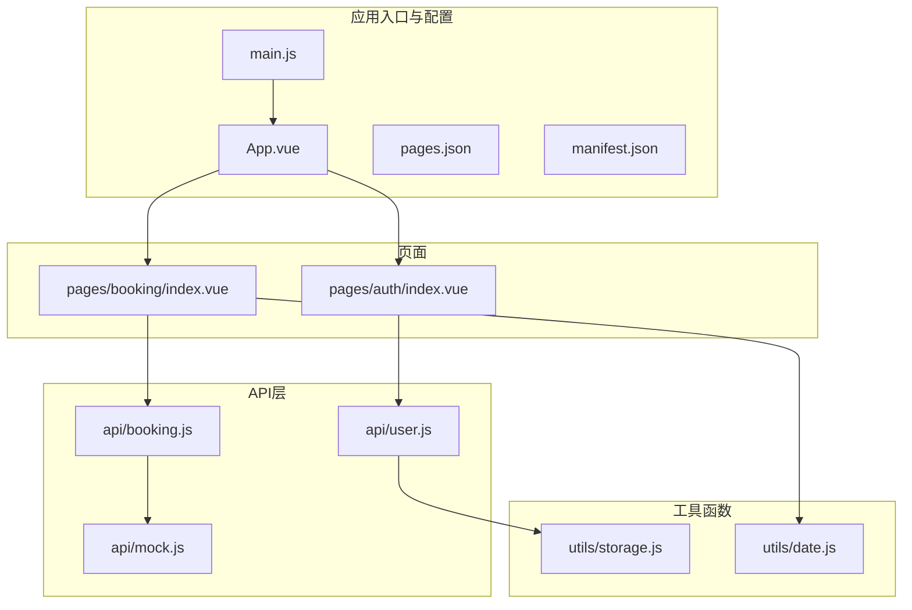
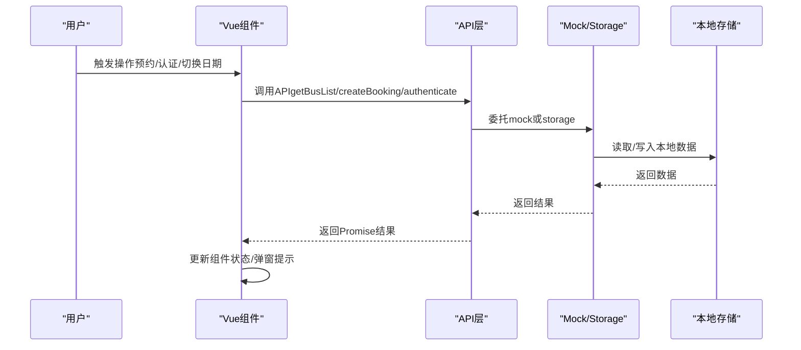
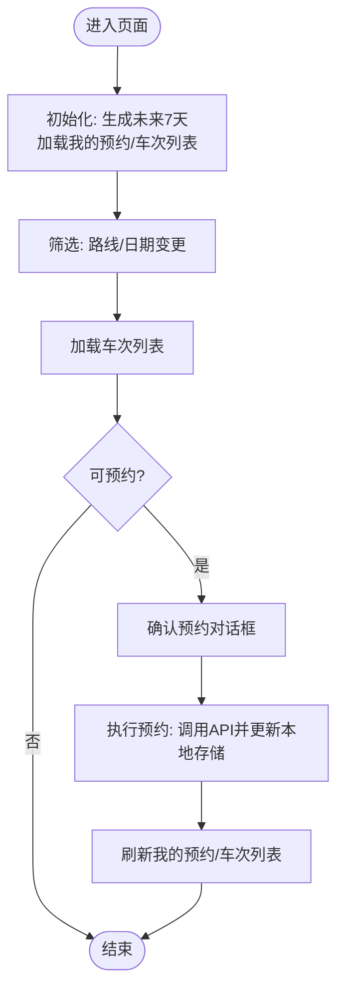
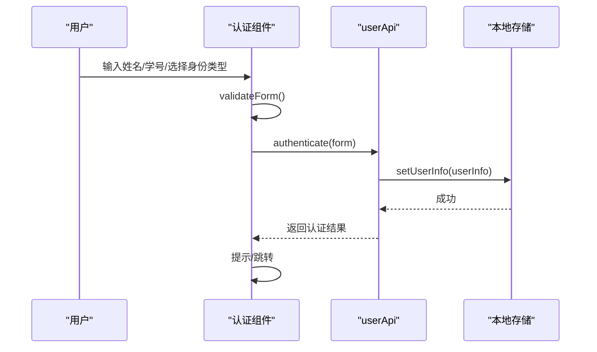
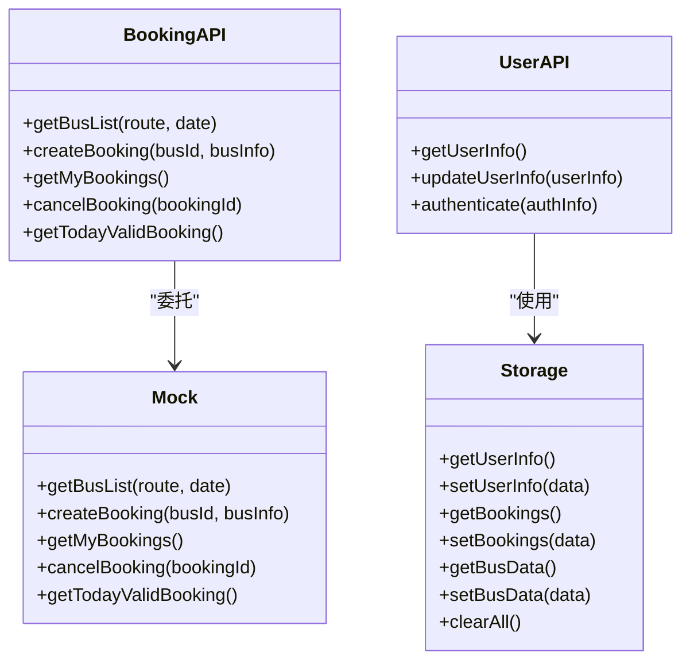
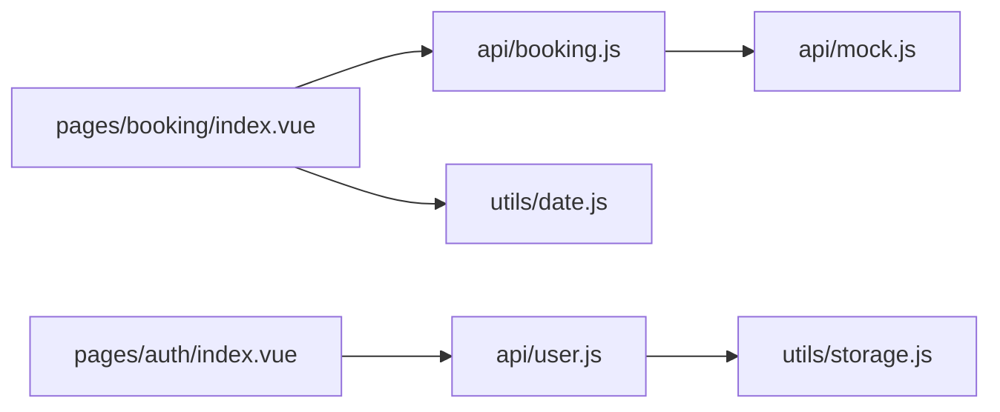

# 调试与测试

<cite>
**本文引用的文件**
- [App.vue](file://App.vue)
- [main.js](file://main.js)
- [pages.json](file://pages.json)
- [manifest.json](file://manifest.json)
- [utils/storage.js](file://utils/storage.js)
- [api/booking.js](file://api/booking.js)
- [api/user.js](file://api/user.js)
- [api/mock.js](file://api/mock.js)
- [pages/booking/index.vue](file://pages/booking/index.vue)
- [pages/auth/index.vue](file://pages/auth/index.vue)
- [utils/date.js](file://utils/date.js)
- [PROJECT.md](file://PROJECT.md)
</cite>

## 目录
1. [引言](#引言)
2. [项目结构](#项目结构)
3. [核心组件](#核心组件)
4. [架构总览](#架构总览)
5. [详细组件分析](#详细组件分析)
6. [依赖关系分析](#依赖关系分析)
7. [性能考虑](#性能考虑)
8. [故障排查指南](#故障排查指南)
9. [结论](#结论)
10. [附录](#附录)

## 引言
本指南聚焦于“调试与测试”主题，结合当前 uni-app 项目（基于 Vue 3）的实际代码，系统讲解以下内容：
- HBuilderX 内置调试工具：断点调试、变量监控、网络请求追踪
- 微信开发者工具：真机调试、控制台使用、性能分析
- Vue.js DevTools：安装与使用技巧（组件树、状态管理、事件追踪）
- 单元测试与集成测试：Mock 数据、测试用例设计
- 本地存储调试与数据持久化验证
- 常见问题诊断与解决方案（页面加载失败、API 调用异常、样式渲染问题等）
- 性能测试与内存泄漏检测最佳实践

## 项目结构
该项目采用 uni-app + Vue 3 的多页面架构，核心模块包括：
- 应用入口与全局配置：main.js、App.vue、pages.json、manifest.json
- 页面：pages/booking/index.vue、pages/auth/index.vue 等
- API 层：api/booking.js、api/user.js、api/mock.js
- 工具函数：utils/storage.js、utils/date.js
- 文档：PROJECT.md

图表来源
- [main.js:1-22](file://main.js#L1-L22)
- [App.vue:1-32](file://App.vue#L1-L32)
- [pages.json:1-62](file://pages.json#L1-L62)
- [manifest.json:1-73](file://manifest.json#L1-L73)
- [pages/booking/index.vue:1-575](file://pages/booking/index.vue#L1-L575)
- [pages/auth/index.vue:1-385](file://pages/auth/index.vue#L1-L385)
- [api/booking.js:1-165](file://api/booking.js#L1-L165)
- [api/user.js:1-128](file://api/user.js#L1-L128)
- [api/mock.js:1-226](file://api/mock.js#L1-L226)
- [utils/storage.js:1-116](file://utils/storage.js#L1-L116)
- [utils/date.js:1-84](file://utils/date.js#L1-L84)

章节来源
- [PROJECT.md:41-67](file://PROJECT.md#L41-L67)
- [pages.json:1-62](file://pages.json#L1-L62)
- [manifest.json:1-73](file://manifest.json#L1-L73)

## 核心组件
- 应用生命周期与全局样式：App.vue 提供 onLaunch/onShow/onHide 生命周期钩子与全局样式；main.js 支持 Vue 2/3 双模式挂载。
- 页面路由与 TabBar：pages.json 定义页面列表、导航栏与 TabBar 结构；manifest.json 配置平台能力与权限。
- 业务页面：
  - 车辆预约页：负责加载车次列表、我的预约、执行预约与取消预约。
  - 身份认证页：负责表单校验、本地认证与跳转。
- API 层与 Mock：booking.js、user.js 作为接口门面，当前统一委托给 mock.js 或 storage.js；预留后端接入路径。
- 工具函数：storage.js 封装本地存储；date.js 提供日期计算与格式化。

章节来源
- [App.vue:1-32](file://App.vue#L1-L32)
- [main.js:1-22](file://main.js#L1-L22)
- [pages.json:1-62](file://pages.json#L1-L62)
- [pages/booking/index.vue:98-298](file://pages/booking/index.vue#L98-L298)
- [pages/auth/index.vue:99-189](file://pages/auth/index.vue#L99-L189)
- [api/booking.js:1-165](file://api/booking.js#L1-L165)
- [api/user.js:1-128](file://api/user.js#L1-L128)
- [api/mock.js:1-226](file://api/mock.js#L1-L226)
- [utils/storage.js:1-116](file://utils/storage.js#L1-L116)
- [utils/date.js:1-84](file://utils/date.js#L1-L84)

## 架构总览
整体数据流遵循“用户操作 → Vue 组件 → API 层（mock） → 本地存储”的闭环，便于后续无缝对接后端。

图表来源
- [pages/booking/index.vue:138-247](file://pages/booking/index.vue#L138-L247)
- [pages/auth/index.vue:155-187](file://pages/auth/index.vue#L155-L187)
- [api/booking.js:14-163](file://api/booking.js#L14-L163)
- [api/user.js:72-100](file://api/user.js#L72-L100)
- [api/mock.js:49-225](file://api/mock.js#L49-L225)
- [utils/storage.js:6-114](file://utils/storage.js#L6-L114)

## 详细组件分析

### 车辆预约页面（booking/index.vue）
- 关键职责：加载我的预约、加载车次列表、执行预约、取消预约、状态展示与交互。
- 调试要点：
  - 断点：在 loadMyBookings、loadBusList、doBooking、showBookingDetail 等异步流程设置断点，观察参数与返回值。
  - 变量监控：监控 myBookings、busList、futureDays、selectedRouteIndex、selectedDateIndex 等响应式数据。
  - 网络/存储：关注 bookingApi.getBusList/createBooking 的调用链与本地存储更新（booking_list、bus_data）。
  - 交互：在 onRouteChange/onDateChange 中验证日期与路线筛选逻辑；在 onBookBus 中验证认证前置与 Modal 流程。

图表来源
- [pages/booking/index.vue:124-296](file://pages/booking/index.vue#L124-L296)
- [utils/date.js:10-33](file://utils/date.js#L10-L33)
- [api/booking.js:14-163](file://api/booking.js#L14-L163)
- [api/mock.js:49-152](file://api/mock.js#L49-L152)
- [utils/storage.js:6-114](file://utils/storage.js#L6-L114)

章节来源
- [pages/booking/index.vue:98-298](file://pages/booking/index.vue#L98-L298)
- [utils/date.js:10-33](file://utils/date.js#L10-L33)
- [api/booking.js:14-163](file://api/booking.js#L14-L163)
- [api/mock.js:49-152](file://api/mock.js#L49-L152)
- [utils/storage.js:6-114](file://utils/storage.js#L6-L114)

### 身份认证页面（auth/index.vue）
- 关键职责：表单输入、基础校验、调用认证 API 并本地存储用户信息。
- 调试要点：
  - 断点：在 validateForm、onSubmit、userApi.authenticate 处设置断点，检查错误分支与返回值。
  - 变量监控：监控 form.name、form.studentId、form.userType、errorMsg、submitting。
  - 本地存储：确认 user_info 是否写入成功；在认证成功后验证跳转逻辑。

图表来源
- [pages/auth/index.vue:135-187](file://pages/auth/index.vue#L135-L187)
- [api/user.js:72-100](file://api/user.js#L72-L100)
- [utils/storage.js:27-37](file://utils/storage.js#L27-L37)

章节来源
- [pages/auth/index.vue:99-189](file://pages/auth/index.vue#L99-L189)
- [api/user.js:72-100](file://api/user.js#L72-L100)
- [utils/storage.js:27-37](file://utils/storage.js#L27-L37)

### API 层与 Mock
- booking.js：封装 getBusList/createBooking/getMyBookings/cancelBooking/getTodayValidBooking，当前委托给 mock.js；预留后端接入注释。
- user.js：封装 getUserInfo/updateUserInfo/authenticate，当前使用 storage.js；authenticate 本地生成认证信息并写入本地存储。
- mock.js：提供 getBusList/createBooking/getMyBookings/cancelBooking/getTodayValidBooking 的完整模拟实现，包含随机座位数、预约状态与本地存储更新。

图表来源
- [api/booking.js:8-164](file://api/booking.js#L8-L164)
- [api/user.js:8-127](file://api/user.js#L8-L127)
- [api/mock.js:49-225](file://api/mock.js#L49-L225)
- [utils/storage.js:6-114](file://utils/storage.js#L6-L114)

章节来源
- [api/booking.js:1-165](file://api/booking.js#L1-L165)
- [api/user.js:1-128](file://api/user.js#L1-L128)
- [api/mock.js:1-226](file://api/mock.js#L1-L226)
- [utils/storage.js:1-116](file://utils/storage.js#L1-L116)

## 依赖关系分析
- 组件到 API：booking/index.vue 依赖 booking.js；auth/index.vue 依赖 user.js。
- API 到 Mock/Storage：booking.js 委托 mock.js；user.js 使用 storage.js。
- 工具函数：booking/index.vue 使用 utils/date.js 生成未来日期；全局样式与生命周期由 App.vue/App.vue 控制。

图表来源
- [pages/booking/index.vue:99-100](file://pages/booking/index.vue#L99-L100)
- [pages/auth/index.vue:100](file://pages/auth/index.vue#L100)
- [api/booking.js:6](file://api/booking.js#L6)
- [api/user.js:6](file://api/user.js#L6)
- [utils/date.js:10-33](file://utils/date.js#L10-L33)

章节来源
- [pages/booking/index.vue:98-298](file://pages/booking/index.vue#L98-L298)
- [pages/auth/index.vue:99-189](file://pages/auth/index.vue#L99-L189)
- [api/booking.js:1-165](file://api/booking.js#L1-L165)
- [api/user.js:1-128](file://api/user.js#L1-L128)
- [utils/date.js:1-84](file://utils/date.js#L1-L84)

## 性能考虑
- 异步调用与 Loading：在执行预约等耗时操作时显示 loading，避免重复点击；完成后及时隐藏。
- 列表渲染：对长列表使用虚拟滚动或分页（当前为简单滚动视图，注意大数据量时的性能）。
- 本地存储访问：批量读写时尽量合并，减少频繁 setStorageSync。
- 状态更新：仅在必要时触发组件更新，避免不必要的响应式数据变更。
- 网络延迟模拟：mock 中使用 setTimeout 模拟网络延迟，便于前端联调与性能评估。

章节来源
- [pages/booking/index.vue:213-247](file://pages/booking/index.vue#L213-L247)
- [api/mock.js:50-151](file://api/mock.js#L50-L151)

## 故障排查指南

### 页面加载失败
- 检查 pages.json 中页面路径与文件是否存在；确保 pages/booking/index.vue、pages/auth/index.vue 等均存在。
- 检查 manifest.json 中平台配置与权限声明是否正确。
- 在 HBuilderX 控制台查看编译错误与运行日志。

章节来源
- [pages.json:1-62](file://pages.json#L1-L62)
- [manifest.json:1-73](file://manifest.json#L1-L73)
- [PROJECT.md:183-188](file://PROJECT.md#L183-L188)

### API 调用异常
- booking.js/user.js 中的后端接入注释已预留，若启用后端，请检查：
  - 请求 URL、Header（如 Authorization）、返回码与消息体结构。
  - 在 mock 与后端切换时，保持接口签名一致，避免组件层改动。
- 若仍使用 mock，检查本地存储键名与数据结构一致性（user_info、booking_list、bus_data）。

章节来源
- [api/booking.js:18-39](file://api/booking.js#L18-L39)
- [api/user.js:15-34](file://api/user.js#L15-L34)
- [api/mock.js:54-147](file://api/mock.js#L54-L147)
- [utils/storage.js:10-114](file://utils/storage.js#L10-L114)

### 样式渲染问题
- 检查 App.vue 中全局样式与页面 scoped 样式冲突。
- 在微信开发者工具中使用“设备像素比”、“自适应布局”等选项辅助排错。
- 对复杂布局使用 Flex/Grid，避免过度嵌套导致的渲染抖动。

章节来源
- [App.vue:15-31](file://App.vue#L15-L31)
- [pages/booking/index.vue:300-575](file://pages/booking/index.vue#L300-L575)
- [pages/auth/index.vue:192-385](file://pages/auth/index.vue#L192-L385)

### 本地存储调试与数据持久化验证
- 使用微信开发者工具的“Storage”面板查看 user_info、booking_list、bus_data 的值与变化。
- 在 App.vue 的 onLaunch/onShow/onHide 中添加日志，确认应用生命周期与存储读写时机。
- 使用 storage.js 的 clearAll 方法进行重置测试，验证初始化流程。

章节来源
- [utils/storage.js:6-114](file://utils/storage.js#L6-L114)
- [App.vue:3-11](file://App.vue#L3-L11)
- [api/mock.js:105-202](file://api/mock.js#L105-L202)

### 常见问题与解决方案
- TabBar 图标不显示：检查 static/icons 下的图标文件是否存在且命名正确。
- 预约功能不可用：确认已完成身份认证；若本地存储异常，可清除后重试。
- 二维码不显示：当前为简易实现，建议集成专业二维码库。

章节来源
- [PROJECT.md:189-201](file://PROJECT.md#L189-L201)

## 结论
本项目以清晰的分层架构（页面 → API → Mock/Storage）为基础，便于快速定位问题与扩展后端。通过合理运用 HBuilderX、微信开发者工具与 Vue.js DevTools，结合本地存储与网络请求的调试手段，能够高效解决页面加载、API 调用与样式渲染等问题。建议在后续开发中逐步引入单元测试与集成测试，配合 Mock 数据与断点调试，持续提升质量与稳定性。

## 附录

### HBuilderX 内置调试工具使用
- 断点调试：在 pages/booking/index.vue 与 pages/auth/index.vue 的 methods 中设置断点，观察参数与返回值。
- 变量监控：在“调试器”面板中监视响应式数据（如 myBookings、busList、form 等）。
- 网络请求追踪：在“网络”面板查看 uni.request 的调用情况（若启用后端），或在 mock 中观察本地存储更新。
- 真机调试：通过“运行”菜单选择“运行到小程序模拟器/真机”，在设备上直接复现问题。

章节来源
- [pages/booking/index.vue:124-296](file://pages/booking/index.vue#L124-L296)
- [pages/auth/index.vue:135-187](file://pages/auth/index.vue#L135-L187)
- [PROJECT.md:88-94](file://PROJECT.md#L88-L94)

### 微信开发者工具调试
- 控制台：使用 console.log 输出关键变量与流程节点，结合断点定位异常。
- 性能分析：使用“性能”面板观察帧率、内存占用与 GC 活动。
- 真机调试：连接手机，实时预览与调试，便于发现样式与交互差异。
- 存储面板：查看 user_info、booking_list、bus_data 的变化，验证数据持久化。

章节来源
- [utils/storage.js:6-114](file://utils/storage.js#L6-L114)
- [PROJECT.md:88-94](file://PROJECT.md#L88-L94)

### Vue.js DevTools 安装与使用
- 安装：在浏览器扩展商店搜索并安装 Vue DevTools。
- 使用技巧：
  - 组件树：查看 pages/booking/index.vue 与 pages/auth/index.vue 的父子关系与 props/state。
  - 状态管理：观察 myBookings、busList、form 等响应式数据的变更轨迹。
  - 事件追踪：在交互流程中捕获事件派发与处理过程，辅助定位异步流程问题。

章节来源
- [pages/booking/index.vue:98-298](file://pages/booking/index.vue#L98-L298)
- [pages/auth/index.vue:99-189](file://pages/auth/index.vue#L99-L189)

### 单元测试与集成测试编写指南
- 测试策略：
  - 单元测试：针对 utils/date.js、utils/storage.js 的纯函数进行断言测试。
  - 集成测试：使用 mock.js 模拟 API 行为，覆盖 booking.js 与 user.js 的主要分支（成功/失败、边界条件）。
- Mock 数据：
  - 使用 api/mock.js 的数据结构与逻辑，构造输入输出期望。
  - 对本地存储场景，使用 uni.setStorageSync/uni.getStorageSync 的行为进行断言。
- 测试用例设计：
  - 覆盖正常路径、异常路径、边界值（空数据、超限长度、非法格式）。
  - 对异步流程，使用 Promise 断言与超时控制。

章节来源
- [utils/date.js:10-84](file://utils/date.js#L10-L84)
- [utils/storage.js:6-114](file://utils/storage.js#L6-L114)
- [api/mock.js:49-225](file://api/mock.js#L49-L225)
- [api/booking.js:14-163](file://api/booking.js#L14-L163)
- [api/user.js:72-100](file://api/user.js#L72-L100)

### 本地存储调试与数据持久化验证
- 常用键名：user_info、booking_list、bus_data。
- 调试步骤：
  - 在 App.vue 生命周期中打印存储状态。
  - 在页面中增加“清空缓存”按钮，调用 storage.clearAll() 验证初始化。
  - 在微信开发者工具的 Storage 面板中核对键值与结构。

章节来源
- [utils/storage.js:6-114](file://utils/storage.js#L6-L114)
- [App.vue:3-11](file://App.vue#L3-L11)
- [api/mock.js:105-202](file://api/mock.js#L105-L202)

### 性能测试与内存泄漏检测最佳实践
- 性能测试：
  - 使用微信开发者工具“性能”面板监测帧率与内存峰值。
  - 对长列表渲染进行节流与懒加载优化。
- 内存泄漏检测：
  - 避免在组件销毁后仍持有定时器或事件监听器。
  - 在 onUnload/onHide 中清理计时器与订阅。
  - 使用 DevTools 的内存快照对比，定位未释放的对象。

章节来源
- [pages/booking/index.vue:118-122](file://pages/booking/index.vue#L118-L122)
- [pages/auth/index.vue:115-189](file://pages/auth/index.vue#L115-L189)