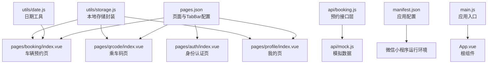
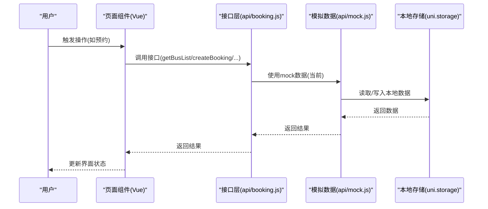
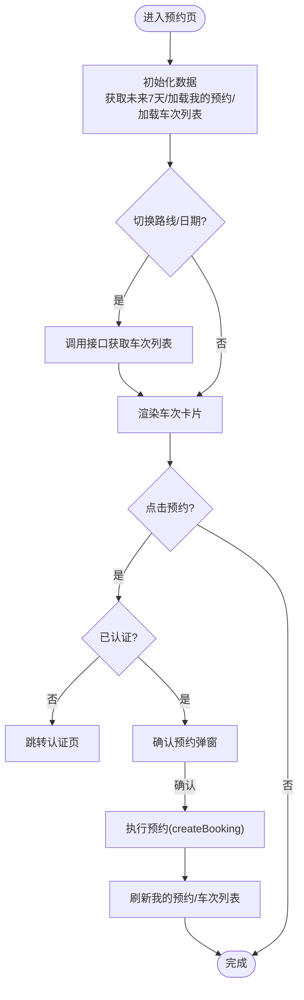
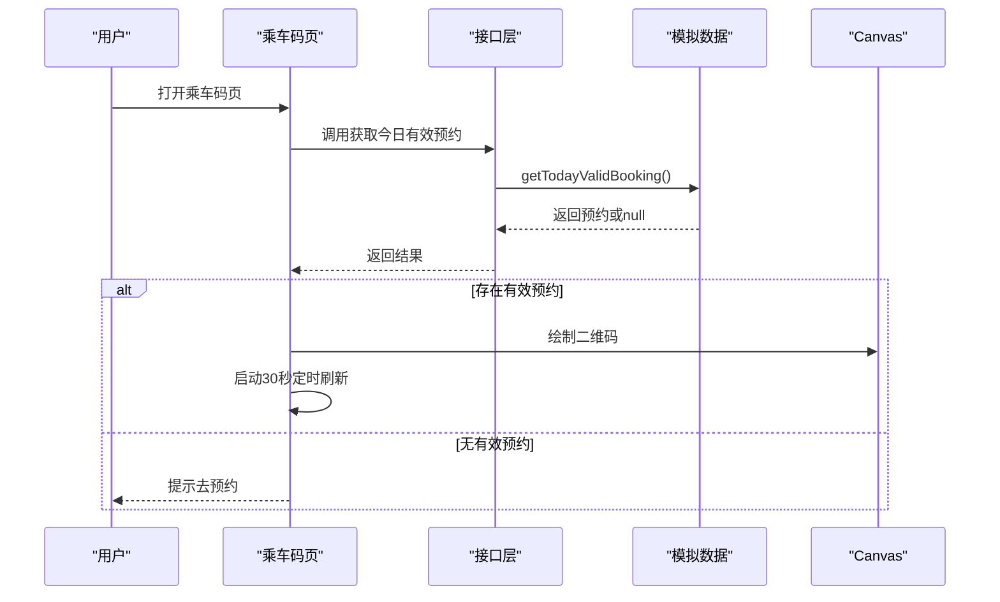
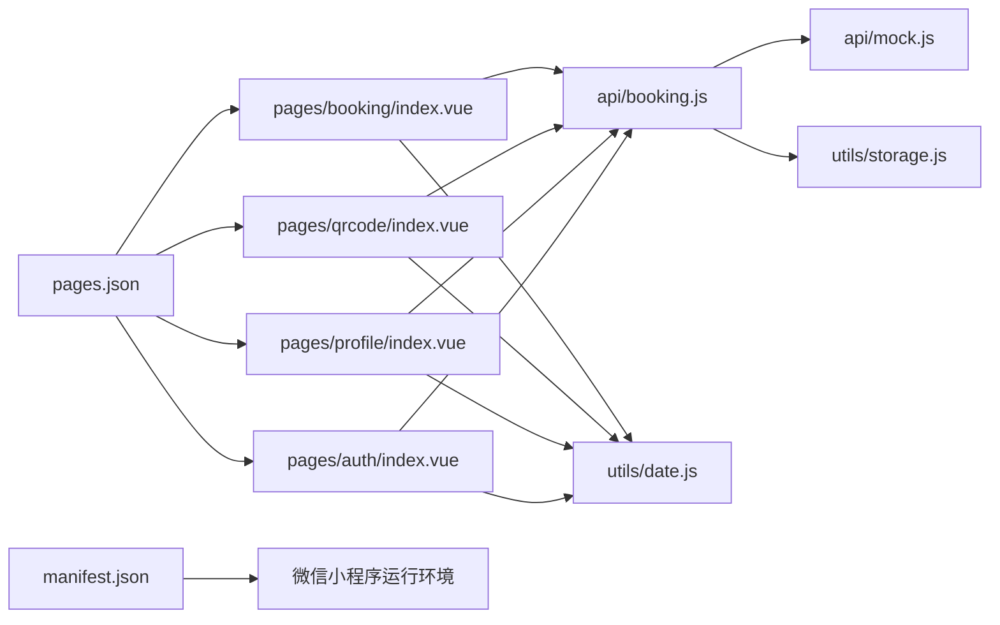

# 快速开始

<cite>
**本文引用的文件**
- [PROJECT.md](file://PROJECT.md)
- [manifest.json](file://manifest.json)
- [pages.json](file://pages.json)
- [main.js](file://main.js)
- [App.vue](file://App.vue)
- [pages/booking/index.vue](file://pages/booking/index.vue)
- [pages/qrcode/index.vue](file://pages/qrcode/index.vue)
- [pages/profile/index.vue](file://pages/profile/index.vue)
- [pages/auth/index.vue](file://pages/auth/index.vue)
- [api/booking.js](file://api/booking.js)
- [api/mock.js](file://api/mock.js)
- [utils/date.js](file://utils/date.js)
- [utils/storage.js](file://utils/storage.js)
</cite>

## 目录
1. [简介](#简介)
2. [项目结构](#项目结构)
3. [核心组件](#核心组件)
4. [架构总览](#架构总览)
5. [详细组件分析](#详细组件分析)
6. [依赖关系分析](#依赖关系分析)
7. [性能与可用性建议](#性能与可用性建议)
8. [故障排查指南](#故障排查指南)
9. [结论](#结论)
10. [附录：从零到运行的完整流程](#附录从零到运行的完整流程)

## 简介
本项目是基于 uni-app 框架开发的“湖北大学校车预约”微信小程序，面向湖北大学师生提供便捷的校车查询、预约、乘车管理服务。项目采用 Vue 3 + uni-app 的技术栈，目标平台为微信小程序；数据存储采用本地存储（uni.setStorage/getStorage），UI 采用自定义组件实现。

## 项目结构
项目采用按功能模块划分的目录组织方式：
- pages：页面级组件，包含预约、乘车码、个人中心、身份认证等页面
- api：接口层，封装数据访问逻辑，当前使用 mock 数据，便于后期替换为真实后端
- utils：通用工具函数，如日期处理、本地存储封装
- static：静态资源，如 TabBar 图标
- 根目录配置文件：pages.json（页面路由与 TabBar 配置）、manifest.json（应用配置）、main.js（入口）、App.vue（根组件）

图表来源
- [pages.json:1-62](file://pages.json#L1-L62)
- [pages/booking/index.vue:1-575](file://pages/booking/index.vue#L1-L575)
- [pages/qrcode/index.vue:1-342](file://pages/qrcode/index.vue#L1-L342)
- [pages/profile/index.vue:1-595](file://pages/profile/index.vue#L1-L595)
- [pages/auth/index.vue:1-385](file://pages/auth/index.vue#L1-L385)
- [api/booking.js:1-165](file://api/booking.js#L1-L165)
- [api/mock.js:1-226](file://api/mock.js#L1-L226)
- [utils/date.js:1-84](file://utils/date.js#L1-L84)
- [utils/storage.js:1-116](file://utils/storage.js#L1-L116)
- [manifest.json:1-73](file://manifest.json#L1-L73)
- [main.js:1-22](file://main.js#L1-L22)
- [App.vue:1-32](file://App.vue#L1-L32)

章节来源
- [PROJECT.md:41-67](file://PROJECT.md#L41-L67)
- [pages.json:1-62](file://pages.json#L1-L62)
- [manifest.json:1-73](file://manifest.json#L1-L73)

## 核心组件
- 页面组件：预约页、乘车码页、个人中心页、身份认证页
- 接口层：统一通过 api 层调用，当前使用 mock 数据，便于后期替换为真实后端
- 工具函数：日期处理、本地存储封装
- 应用配置：pages.json 定义页面路由与 TabBar；manifest.json 定义小程序应用配置

章节来源
- [pages/booking/index.vue:1-575](file://pages/booking/index.vue#L1-L575)
- [pages/qrcode/index.vue:1-342](file://pages/qrcode/index.vue#L1-L342)
- [pages/profile/index.vue:1-595](file://pages/profile/index.vue#L1-L595)
- [pages/auth/index.vue:1-385](file://pages/auth/index.vue#L1-L385)
- [api/booking.js:1-165](file://api/booking.js#L1-L165)
- [api/mock.js:1-226](file://api/mock.js#L1-L226)
- [utils/date.js:1-84](file://utils/date.js#L1-L84)
- [utils/storage.js:1-116](file://utils/storage.js#L1-L116)
- [pages.json:1-62](file://pages.json#L1-L62)
- [manifest.json:1-73](file://manifest.json#L1-L73)

## 架构总览
整体架构遵循“页面组件 → 接口层 → 本地存储”的数据流设计，便于后期替换为真实后端 API。

图表来源
- [pages/booking/index.vue:114-162](file://pages/booking/index.vue#L114-L162)
- [api/booking.js:14-40](file://api/booking.js#L14-L40)
- [api/mock.js:49-93](file://api/mock.js#L49-L93)
- [utils/storage.js:1-116](file://utils/storage.js#L1-L116)

章节来源
- [PROJECT.md:115-134](file://PROJECT.md#L115-L134)

## 详细组件分析

### 预约页面（pages/booking/index.vue）
- 功能概览
  - 我的预约：横向滚动展示待出行的预约
  - 车辆预约：路线选择、未来7天日期选择、车次列表（出发时间、剩余座位、候车位置）、一键预约
- 关键交互
  - 路线与日期切换触发车次列表刷新
  - 预约前检查身份认证状态，未认证则跳转认证页
  - 预约成功后刷新我的预约与车次列表
- 数据流
  - 通过 api/booking.js 调用 mock 数据
  - 本地存储 booking_list、bus_data 管理预约与座位状态

图表来源
- [pages/booking/index.vue:114-296](file://pages/booking/index.vue#L114-L296)
- [api/booking.js:47-80](file://api/booking.js#L47-L80)
- [api/mock.js:101-151](file://api/mock.js#L101-L151)

章节来源
- [pages/booking/index.vue:1-575](file://pages/booking/index.vue#L1-L575)
- [api/booking.js:1-165](file://api/booking.js#L1-L165)
- [api/mock.js:1-226](file://api/mock.js#L1-L226)
- [utils/date.js:1-84](file://utils/date.js#L1-L84)

### 乘车码页面（pages/qrcode/index.vue）
- 功能概览
  - 若存在今日有效预约，则生成二维码并每30秒自动刷新
  - 展示预约信息（路线、日期时间、候车位置、座位号）
  - 无有效预约时引导跳转预约
- 关键交互
  - 页面显示时加载今日有效预约，若存在则绘制二维码并启动定时刷新
  - 页面卸载时清理定时器，避免内存泄漏

图表来源
- [pages/qrcode/index.vue:72-183](file://pages/qrcode/index.vue#L72-L183)
- [api/booking.js:139-163](file://api/booking.js#L139-L163)
- [api/mock.js:209-225](file://api/mock.js#L209-L225)

章节来源
- [pages/qrcode/index.vue:1-342](file://pages/qrcode/index.vue#L1-L342)
- [api/booking.js:1-165](file://api/booking.js#L1-L165)
- [api/mock.js:1-226](file://api/mock.js#L1-L226)

### 个人中心页面（pages/profile/index.vue）
- 功能概览
  - 功能入口：身份认证、预约须知、客服反馈、乘车历史
  - 身份信息展示：认证状态、姓名、学号/工号、认证时间
  - 弹窗：预约须知、客服联系方式、乘车历史列表
- 关键交互
  - 未认证时引导认证
  - 点击“乘车历史”拉取我的预约列表并展示

章节来源
- [pages/profile/index.vue:1-595](file://pages/profile/index.vue#L1-L595)
- [api/booking.js:78-102](file://api/booking.js#L78-L102)

### 身份认证页面（pages/auth/index.vue）
- 功能概览
  - 姓名、学号/工号输入，身份类型选择（学生/教职工）
  - 表单校验与错误提示
  - 提交认证后返回上一页
- 关键交互
  - 输入过滤与校验，提交时调用 userApi.authenticate 并提示结果

章节来源
- [pages/auth/index.vue:1-385](file://pages/auth/index.vue#L1-L385)

### 接口层与模拟数据（api/booking.js、api/mock.js）
- 接口层职责
  - 对外暴露 getBusList、createBooking、getMyBookings、cancelBooking、getTodayValidBooking 等方法
  - 当前统一委托给 mock.js 提供数据，便于后期替换为真实后端
- 模拟数据能力
  - 两条路线的基础车次数据
  - 随机生成车次 ID、预约 ID、座位号
  - 基于本地存储维护预约列表与车次占用情况
  - 支持取消预约并恢复座位

章节来源
- [api/booking.js:1-165](file://api/booking.js#L1-L165)
- [api/mock.js:1-226](file://api/mock.js#L1-L226)

### 工具函数（utils/date.js、utils/storage.js）
- 日期工具
  - 生成未来 N 天日期数组，支持格式化与过期判断
- 本地存储封装
  - 封装用户信息、预约列表、车次数据的存取，便于后期替换为后端 API

章节来源
- [utils/date.js:1-84](file://utils/date.js#L1-L84)
- [utils/storage.js:1-116](file://utils/storage.js#L1-L116)

## 依赖关系分析
- 页面组件依赖接口层与工具函数
- 接口层依赖模拟数据与本地存储
- 应用配置 pages.json 决定页面路由与 TabBar
- manifest.json 决定小程序运行环境与权限

图表来源
- [pages/booking/index.vue:1-575](file://pages/booking/index.vue#L1-L575)
- [pages/qrcode/index.vue:1-342](file://pages/qrcode/index.vue#L1-L342)
- [pages/profile/index.vue:1-595](file://pages/profile/index.vue#L1-L595)
- [pages/auth/index.vue:1-385](file://pages/auth/index.vue#L1-L385)
- [api/booking.js:1-165](file://api/booking.js#L1-L165)
- [api/mock.js:1-226](file://api/mock.js#L1-L226)
- [utils/date.js:1-84](file://utils/date.js#L1-L84)
- [utils/storage.js:1-116](file://utils/storage.js#L1-L116)
- [pages.json:1-62](file://pages.json#L1-L62)
- [manifest.json:1-73](file://manifest.json#L1-L73)

章节来源
- [pages.json:1-62](file://pages.json#L1-L62)
- [manifest.json:1-73](file://manifest.json#L1-L73)

## 性能与可用性建议
- 二维码生成
  - 当前为简易 canvas 示例，建议集成成熟的二维码库（如 uQRCode）以提升稳定性与兼容性
- 数据刷新
  - 乘车码页每30秒刷新一次，注意在页面卸载时及时清理定时器，避免内存泄漏
- 本地存储
  - 使用统一的 storage 工具函数封装，便于后期替换为后端 API
- 页面渲染
  - 预约页的车次列表采用虚拟滚动与状态分类展示，保持良好的交互体验

[本节为通用建议，不直接分析具体文件]

## 故障排查指南
- 运行时报错 “pages.json 配置错误”
  - 检查 pages.json 中的路径是否正确，确保所有页面文件都已创建
- TabBar 不显示图标
  - 检查 static/icons/ 目录下是否存在对应图标文件，图标必须是 PNG 格式，建议尺寸为 81x81px
- 预约功能无法使用
  - 检查是否已完成身份认证；查看控制台是否有错误信息；可尝试清除本地存储后重试
- 二维码不显示
  - 当前是简易实现，建议集成专业的二维码库；检查 canvas 组件是否正确渲染

章节来源
- [PROJECT.md:183-202](file://PROJECT.md#L183-L202)

## 结论
本项目以 uni-app 为基础，构建了完整的校车预约小程序原型，具备清晰的页面结构、完善的接口层与本地存储机制。通过 mock 数据与统一接口层设计，项目易于扩展为真实后端对接。按照本文提供的快速开始流程，开发者可快速完成环境搭建与项目运行。

[本节为总结性内容，不直接分析具体文件]

## 附录：从零到运行的完整流程

### 环境要求
- HBuilderX 3.0+ 或 Vue CLI
- 微信开发者工具

章节来源
- [PROJECT.md:71-74](file://PROJECT.md#L71-L74)

### 安装步骤
1. 克隆项目
   - 使用 Git 克隆仓库到本地，进入项目目录
2. 使用 HBuilderX 打开项目
   - 下载并安装 HBuilderX
   - 通过“文件 -> 导入 -> 从本地目录导入”选择项目目录
3. 运行到微信小程序
   - 在 HBuilderX 中点击“运行” -> “运行到小程序模拟器” -> “微信开发者工具”
   - 首次运行需要在设置中配置微信开发者工具的路径
4. 在微信开发者工具中预览
   - HBuilderX 会自动编译并打开微信开发者工具
   - 在微信开发者工具中可以实时预览效果

章节来源
- [PROJECT.md:75-95](file://PROJECT.md#L75-L95)

### IDE 配置要点
- HBuilderX
  - 首次运行需在设置中配置微信开发者工具路径
  - 项目导入后可直接点击“运行”按钮
- 微信开发者工具
  - 用于预览与调试，支持真机调试与热更新

章节来源
- [PROJECT.md:88-94](file://PROJECT.md#L88-L94)

### 项目配置说明
- 页面与 TabBar 配置
  - pages.json 定义了四个页面与 TabBar 列表，包含标题、颜色与图标路径
  - 图标路径位于 static/icons/，需准备三组图标（普通/选中）
- 应用配置
  - manifest.json 定义了应用名称、版本、小程序特有配置（如 appid、setting）以及 Vue 版本

章节来源
- [pages.json:1-62](file://pages.json#L1-L62)
- [manifest.json:1-73](file://manifest.json#L1-L73)

### 常见问题与解决方案
- TabBar 图标缺失
  - 替换 static/icons/ 下的占位图标为真实 PNG 图标（建议尺寸 81x81px）
- 二维码显示异常
  - 建议集成成熟的二维码库（如 uQRCode），或检查 canvas 绘制逻辑
- 预约功能不可用
  - 确认已完成身份认证；如失败，清除本地存储后重试

章节来源
- [PROJECT.md:96-112](file://PROJECT.md#L96-L112)
- [PROJECT.md:183-202](file://PROJECT.md#L183-L202)

### 后续扩展建议
- 后端接入
  - 在 api/ 目录下替换为真实后端 API，保持组件层不变
  - 参考文档中的后端技术栈与核心接口定义
- UI 优化
  - 丰富页面样式与交互细节，提升用户体验
- 功能增强
  - 增加消息推送、历史统计、客服系统等功能

章节来源
- [PROJECT.md:150-174](file://PROJECT.md#L150-L174)