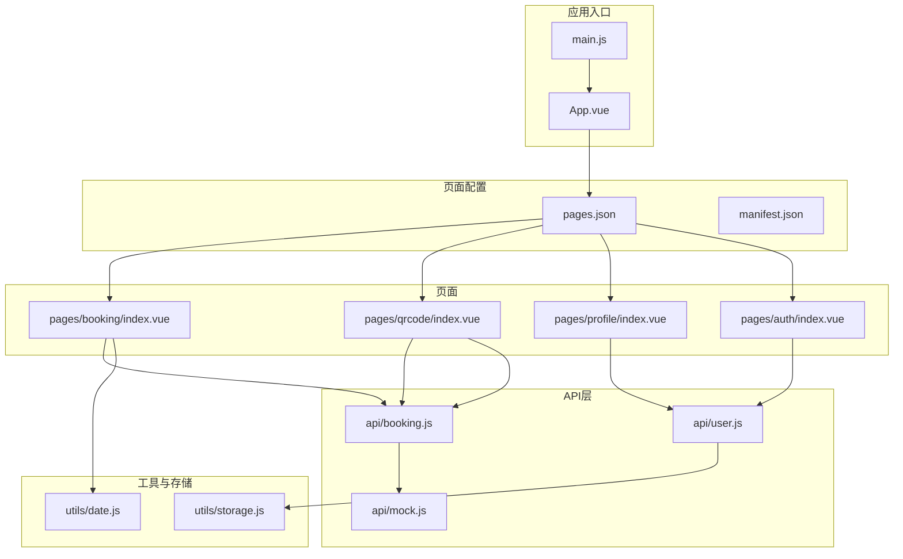
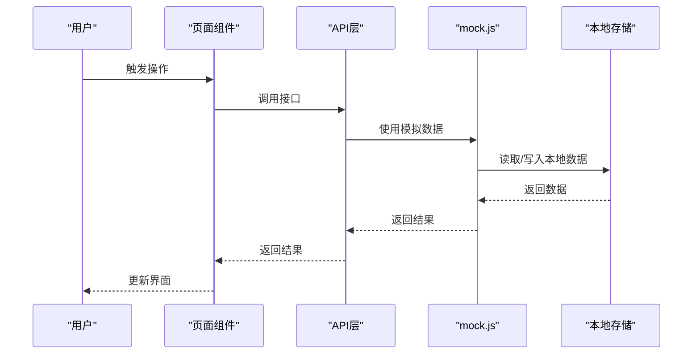
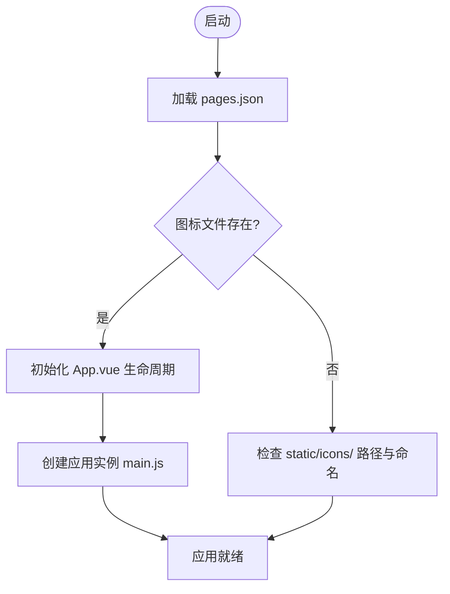
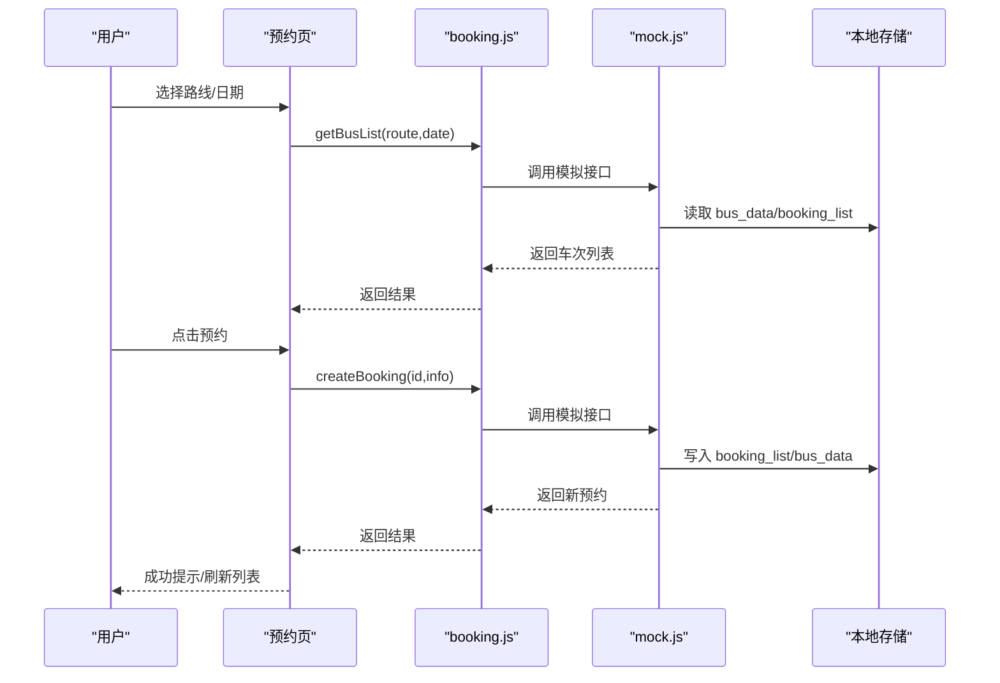
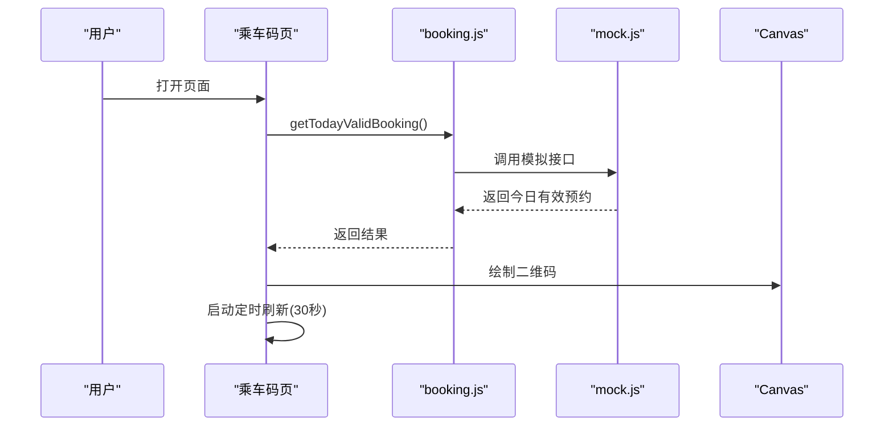
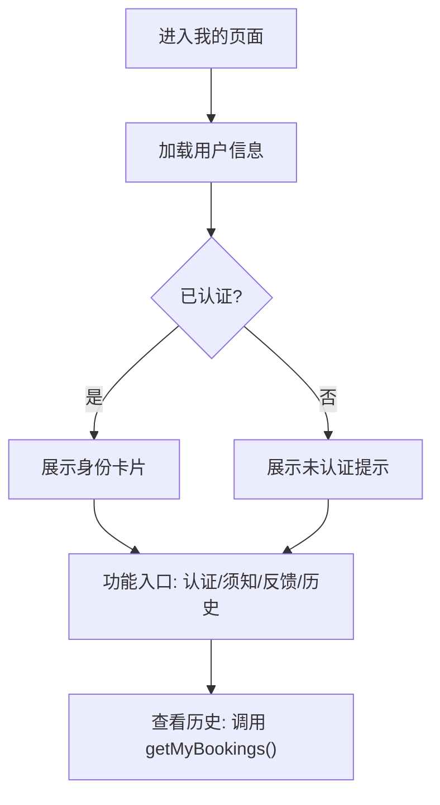
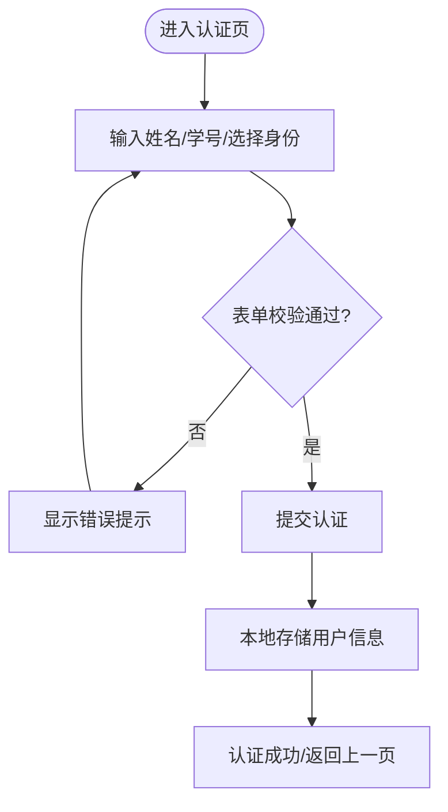
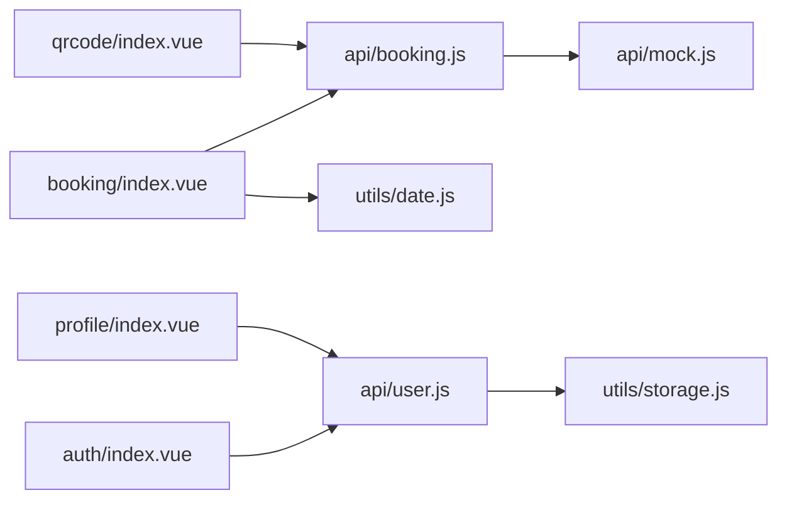

# 故障排除

<cite>
**本文引用的文件**
- [App.vue](file://App.vue)
- [main.js](file://main.js)
- [pages.json](file://pages.json)
- [manifest.json](file://manifest.json)
- [utils/storage.js](file://utils/storage.js)
- [utils/date.js](file://utils/date.js)
- [api/booking.js](file://api/booking.js)
- [api/user.js](file://api/user.js)
- [api/mock.js](file://api/mock.js)
- [pages/booking/index.vue](file://pages/booking/index.vue)
- [pages/auth/index.vue](file://pages/auth/index.vue)
- [pages/profile/index.vue](file://pages/profile/index.vue)
- [pages/qrcode/index.vue](file://pages/qrcode/index.vue)
- [PROJECT.md](file://PROJECT.md)
</cite>

## 目录
1. [简介](#简介)
2. [项目结构](#项目结构)
3. [核心组件](#核心组件)
4. [架构总览](#架构总览)
5. [详细组件分析](#详细组件分析)
6. [依赖关系分析](#依赖关系分析)
7. [性能考虑](#性能考虑)
8. [故障排除指南](#故障排除指南)
9. [结论](#结论)
10. [附录](#附录)

## 简介
本故障排除文档面向学校校车调度系统（基于 uni-app 的微信小程序）的开发与使用人员，系统性梳理常见运行时问题与解决方案，覆盖页面配置错误、图标显示问题、预约功能异常、网络请求失败、数据同步问题、本地存储清理与状态重置、性能问题分析与优化建议，并提供循序渐进的调试流程与定位技巧，帮助不同技术背景的用户快速定位并解决问题。

## 项目结构
系统采用 uni-app/Vue 3 架构，页面通过 pages.json 配置，API 层统一抽象，本地存储封装在 utils/storage.js 中，核心页面包括：车辆预约、乘车码、我的、身份认证。

图表来源
- [main.js:1-22](file://main.js#L1-L22)
- [App.vue:1-32](file://App.vue#L1-L32)
- [pages.json:1-62](file://pages.json#L1-L62)
- [manifest.json:1-73](file://manifest.json#L1-L73)
- [pages/booking/index.vue:1-575](file://pages/booking/index.vue#L1-L575)
- [pages/qrcode/index.vue:1-342](file://pages/qrcode/index.vue#L1-L342)
- [pages/profile/index.vue:1-595](file://pages/profile/index.vue#L1-L595)
- [pages/auth/index.vue:1-385](file://pages/auth/index.vue#L1-L385)
- [api/booking.js:1-165](file://api/booking.js#L1-L165)
- [api/user.js:1-128](file://api/user.js#L1-L128)
- [api/mock.js:1-226](file://api/mock.js#L1-L226)
- [utils/date.js:1-84](file://utils/date.js#L1-L84)
- [utils/storage.js:1-116](file://utils/storage.js#L1-L116)

章节来源
- [PROJECT.md:41-67](file://PROJECT.md#L41-L67)
- [pages.json:1-62](file://pages.json#L1-L62)
- [manifest.json:1-73](file://manifest.json#L1-L73)

## 核心组件
- 页面配置与生命周期：App.vue、main.js、pages.json、manifest.json
- API 层：booking.js、user.js、mock.js
- 工具与存储：storage.js、date.js
- 页面：booking/index.vue、qrcode/index.vue、profile/index.vue、auth/index.vue

章节来源
- [App.vue:1-32](file://App.vue#L1-L32)
- [main.js:1-22](file://main.js#L1-L22)
- [pages.json:1-62](file://pages.json#L1-L62)
- [manifest.json:1-73](file://manifest.json#L1-L73)
- [utils/storage.js:1-116](file://utils/storage.js#L1-L116)
- [utils/date.js:1-84](file://utils/date.js#L1-L84)
- [api/booking.js:1-165](file://api/booking.js#L1-L165)
- [api/user.js:1-128](file://api/user.js#L1-L128)
- [api/mock.js:1-226](file://api/mock.js#L1-L226)
- [pages/booking/index.vue:1-575](file://pages/booking/index.vue#L1-L575)
- [pages/qrcode/index.vue:1-342](file://pages/qrcode/index.vue#L1-L342)
- [pages/profile/index.vue:1-595](file://pages/profile/index.vue#L1-L595)
- [pages/auth/index.vue:1-385](file://pages/auth/index.vue#L1-L385)

## 架构总览
系统采用“页面组件 → API 层 → 本地存储”的数据流设计，便于后期替换为真实后端接口。页面通过 uni-app API 与本地存储交互，API 层提供统一的接口封装，mock.js 提供离线测试数据。

图表来源
- [pages/booking/index.vue:149-162](file://pages/booking/index.vue#L149-L162)
- [api/booking.js:14-40](file://api/booking.js#L14-L40)
- [api/mock.js:49-93](file://api/mock.js#L49-L93)
- [utils/storage.js:10-22](file://utils/storage.js#L10-L22)

章节来源
- [PROJECT.md:113-134](file://PROJECT.md#L113-L134)
- [api/booking.js:1-165](file://api/booking.js#L1-L165)
- [api/mock.js:1-226](file://api/mock.js#L1-L226)
- [utils/storage.js:1-116](file://utils/storage.js#L1-L116)

## 详细组件分析

### 页面配置与生命周期（pages.json、manifest.json、App.vue、main.js）
- 页面注册与导航栏配置集中在 pages.json；TabBar 图标路径与名称需与 static/icons 下文件一致。
- manifest.json 控制平台能力与权限，确保微信小程序环境正确。
- App.vue 提供应用生命周期钩子，main.js 负责应用实例创建与 Vue 版本适配。

图表来源
- [pages.json:34-59](file://pages.json#L34-L59)
- [App.vue:1-32](file://App.vue#L1-L32)
- [main.js:1-22](file://main.js#L1-L22)

章节来源
- [pages.json:1-62](file://pages.json#L1-L62)
- [manifest.json:1-73](file://manifest.json#L1-L73)
- [App.vue:1-32](file://App.vue#L1-L32)
- [main.js:1-22](file://main.js#L1-L22)

### 预约功能（pages/booking/index.vue、api/booking.js、api/mock.js）
- 页面负责筛选路线与日期、展示车次列表、执行预约与取消、跳转认证。
- API 层封装 getBusList、createBooking、getMyBookings、cancelBooking、getTodayValidBooking。
- mock.js 提供模拟数据与业务逻辑（座位计算、预约冲突检测、状态更新）。

图表来源
- [pages/booking/index.vue:177-247](file://pages/booking/index.vue#L177-L247)
- [api/booking.js:14-40](file://api/booking.js#L14-L40)
- [api/mock.js:101-152](file://api/mock.js#L101-L152)
- [utils/storage.js:42-69](file://utils/storage.js#L42-L69)

章节来源
- [pages/booking/index.vue:1-575](file://pages/booking/index.vue#L1-L575)
- [api/booking.js:1-165](file://api/booking.js#L1-L165)
- [api/mock.js:1-226](file://api/mock.js#L1-L226)
- [utils/storage.js:1-116](file://utils/storage.js#L1-L116)

### 乘车码功能（pages/qrcode/index.vue、api/booking.js、api/mock.js）
- 页面根据今日有效预约生成二维码，支持定时刷新。
- 依赖 getTodayValidBooking 获取当前有效预约。

图表来源
- [pages/qrcode/index.vue:84-101](file://pages/qrcode/index.vue#L84-L101)
- [api/booking.js:139-163](file://api/booking.js#L139-L163)
- [api/mock.js:209-225](file://api/mock.js#L209-L225)

章节来源
- [pages/qrcode/index.vue:1-342](file://pages/qrcode/index.vue#L1-L342)
- [api/booking.js:1-165](file://api/booking.js#L1-L165)
- [api/mock.js:1-226](file://api/mock.js#L1-L226)

### 我的页面（pages/profile/index.vue、api/user.js、api/booking.js）
- 展示用户认证状态与信息，提供预约须知、客服反馈、乘车历史等功能入口。
- 依赖 user.js 获取/更新用户信息，依赖 booking.js 获取历史预约。

图表来源
- [pages/profile/index.vue:172-218](file://pages/profile/index.vue#L172-L218)
- [api/user.js:12-35](file://api/user.js#L12-L35)
- [api/booking.js:78-102](file://api/booking.js#L78-L102)

章节来源
- [pages/profile/index.vue:1-595](file://pages/profile/index.vue#L1-L595)
- [api/user.js:1-128](file://api/user.js#L1-L128)
- [api/booking.js:1-165](file://api/booking.js#L1-L165)

### 身份认证（pages/auth/index.vue、api/user.js）
- 表单校验姓名、学号/工号，选择身份类型，提交后本地存储认证信息。
- 未认证用户无法预约。

图表来源
- [pages/auth/index.vue:115-188](file://pages/auth/index.vue#L115-L188)
- [api/user.js:72-101](file://api/user.js#L72-L101)

章节来源
- [pages/auth/index.vue:1-385](file://pages/auth/index.vue#L1-L385)
- [api/user.js:1-128](file://api/user.js#L1-L128)

## 依赖关系分析
- 页面组件依赖 API 层，API 层依赖 mock.js 或本地存储。
- 本地存储键名：user_info、booking_list、bus_data。
- 日期工具提供未来 N 天、格式化、过期判断等辅助。

图表来源
- [pages/booking/index.vue:99-100](file://pages/booking/index.vue#L99-L100)
- [pages/qrcode/index.vue:61](file://pages/qrcode/index.vue#L61)
- [pages/profile/index.vue:153-154](file://pages/profile/index.vue#L153-L154)
- [pages/auth/index.vue:100](file://pages/auth/index.vue#L100)
- [api/booking.js:6](file://api/booking.js#L6)
- [api/user.js:6](file://api/user.js#L6)
- [utils/storage.js:1-116](file://utils/storage.js#L1-L116)
- [utils/date.js:1-84](file://utils/date.js#L1-L84)

章节来源
- [pages/booking/index.vue:1-575](file://pages/booking/index.vue#L1-L575)
- [pages/qrcode/index.vue:1-342](file://pages/qrcode/index.vue#L1-L342)
- [pages/profile/index.vue:1-595](file://pages/profile/index.vue#L1-L595)
- [pages/auth/index.vue:1-385](file://pages/auth/index.vue#L1-L385)
- [api/booking.js:1-165](file://api/booking.js#L1-L165)
- [api/user.js:1-128](file://api/user.js#L1-L128)
- [api/mock.js:1-226](file://api/mock.js#L1-L226)
- [utils/storage.js:1-116](file://utils/storage.js#L1-L116)
- [utils/date.js:1-84](file://utils/date.js#L1-L84)

## 性能考虑
- 模拟数据带有延迟（setTimeout），在真实后端接入时应移除或调整。
- 页面滚动与频繁刷新（如二维码 30 秒刷新）需注意内存与渲染压力。
- 本地存储读写建议批量合并，避免频繁 IO。
- 图标与二维码绘制建议使用成熟库替代简易 canvas 实现，提升稳定性与性能。

章节来源
- [api/mock.js:50-92](file://api/mock.js#L50-L92)
- [pages/qrcode/index.vue:164-175](file://pages/qrcode/index.vue#L164-L175)
- [PROJECT.md:107-112](file://PROJECT.md#L107-L112)

## 故障排除指南

### 一、页面配置错误
- 症状：运行时报错“pages.json 配置错误”或页面无法显示。
- 排查步骤：
  1) 检查 pages.json 中的 path 是否与实际文件路径一致。
  2) 确认页面文件确实存在于对应目录。
  3) 检查 tabBar 的 iconPath 与 selectedIconPath 是否指向 static/icons/ 下存在的 PNG 文件。
  4) 确认全局导航栏标题与颜色设置符合预期。
- 解决方案：
  - 修正路径大小写与拼写。
  - 补齐缺失的图标文件（建议尺寸 81x81px）。
  - 使用 manifest.json 中的平台配置确保权限与模块启用正确。

章节来源
- [PROJECT.md:185-188](file://PROJECT.md#L185-L188)
- [PROJECT.md:189-193](file://PROJECT.md#L189-L193)
- [pages.json:1-62](file://pages.json#L1-L62)
- [manifest.json:1-73](file://manifest.json#L1-L73)

### 二、图标显示问题
- 症状：TabBar 不显示图标或图标不显示。
- 排查步骤：
  1) 检查 static/icons/ 下是否存在以下文件：booking.png、booking-active.png、qrcode.png、qrcode-active.png、profile.png、profile-active.png。
  2) 确认文件格式为 PNG，尺寸建议 81x81px。
  3) 确认 pages.json 中的 iconPath 与 selectedIconPath 与文件名一致。
- 解决方案：
  - 替换为真实图标文件，确保命名与路径完全匹配。
  - 若仍不显示，尝试清理微信开发者工具缓存后重新编译。

章节来源
- [PROJECT.md:98-106](file://PROJECT.md#L98-L106)
- [pages.json:43-57](file://pages.json#L43-L57)

### 三、预约功能异常
- 症状：无法加载车次列表、无法创建预约、无法取消预约。
- 排查步骤：
  1) 检查用户是否已完成身份认证（未认证则无法预约）。
  2) 在预约页控制台查看错误日志（loadBusList 捕获的错误）。
  3) 检查本地存储中的 user_info、booking_list、bus_data 是否存在且格式正确。
  4) 确认 mock 数据是否正常返回（getBusList、createBooking、cancelBooking）。
- 解决方案：
  - 先完成身份认证，再进行预约。
  - 清理本地存储后重试：调用 uni.clearStorage()。
  - 检查 pages/booking/index.vue 中的错误提示与 Toast。

章节来源
- [pages/booking/index.vue:177-247](file://pages/booking/index.vue#L177-L247)
- [pages/booking/index.vue:149-162](file://pages/booking/index.vue#L149-L162)
- [api/booking.js:14-40](file://api/booking.js#L14-L40)
- [api/mock.js:101-152](file://api/mock.js#L101-L152)
- [utils/storage.js:106-114](file://utils/storage.js#L106-L114)

### 四、二维码不显示或刷新异常
- 症状：二维码不显示、不刷新或布局异常。
- 排查步骤：
  1) 确认今日有效预约存在（getTodayValidBooking）。
  2) 检查 Canvas 组件是否正确渲染，尺寸与样式是否合理。
  3) 确认定时器是否启动（30 秒刷新）。
- 解决方案：
  - 建议集成成熟的二维码库（如 uQRCode），替代简易 canvas 实现。
  - 确保在 onUnload 中清理定时器，避免内存泄漏。
  - 检查页面样式与 canvas 尺寸设置。

章节来源
- [pages/qrcode/index.vue:84-101](file://pages/qrcode/index.vue#L84-L101)
- [pages/qrcode/index.vue:164-175](file://pages/qrcode/index.vue#L164-L175)
- [PROJECT.md:107-112](file://PROJECT.md#L107-L112)

### 五、网络请求失败与接口调用异常
- 症状：页面加载失败、Toast 提示“加载失败”或“预约失败”。
- 排查步骤：
  1) 当前使用 mock 数据，若切换为真实后端，请检查 api/booking.js 与 api/user.js 中的注释代码是否启用。
  2) 确认请求头 Authorization 与 token 存储逻辑（当前 mock 未使用 token）。
  3) 检查后端接口连通性与返回格式。
- 解决方案：
  1) 在 api/booking.js 与 api/user.js 中取消注释后端实现，替换 url 与 header。
  2) 确保后端返回标准响应结构（含 code/message/data）。
  3) 在前端捕获并处理 fail/reject 情况，统一提示用户。

章节来源
- [api/booking.js:18-40](file://api/booking.js#L18-L40)
- [api/user.js:15-35](file://api/user.js#L15-L35)
- [PROJECT.md:169-174](file://PROJECT.md#L169-L174)

### 六、数据同步问题
- 症状：预约状态不同步、座位数显示异常、历史记录不更新。
- 排查步骤：
  1) 检查 bus_data 与 booking_list 的本地存储结构是否正确。
  2) 确认 createBooking 与 cancelBooking 是否正确更新 bus_data 与 booking_list。
  3) 确认 getBusList 是否正确读取并计算剩余座位。
- 解决方案：
  - 在 createBooking 中确保 bus_data[dateKey][time]++。
  - 在 cancelBooking 中确保 bus_data[dateKey][time]--。
  - 在 getBusList 中根据 booking_list 过滤 pending 状态以标记已预约。

章节来源
- [api/mock.js:137-148](file://api/mock.js#L137-L148)
- [api/mock.js:189-196](file://api/mock.js#L189-L196)
- [api/mock.js:60-88](file://api/mock.js#L60-L88)

### 七、本地存储清理与状态重置
- 常见场景：用户信息丢失、预约数据异常、图标不显示。
- 方法：
  1) 清空所有本地数据：调用 uni.clearStorage()。
  2) 分别读取与写入 user_info、booking_list、bus_data，核对结构与字段。
  3) 在 utils/storage.js 中使用封装方法进行读写，便于后续替换为后端 API。
- 注意：清空后需重新认证与重新加载数据。

章节来源
- [utils/storage.js:106-114](file://utils/storage.js#L106-L114)
- [utils/storage.js:10-22](file://utils/storage.js#L10-L22)
- [utils/storage.js:42-69](file://utils/storage.js#L42-L69)
- [utils/storage.js:74-101](file://utils/storage.js#L74-L101)

### 八、性能问题分析与优化建议
- 现象：页面卡顿、加载缓慢、二维码频繁刷新导致掉帧。
- 建议：
  1) 减少 setTimeout 模拟延迟，接入真实后端时移除或缩短。
  2) 合理使用虚拟滚动与懒加载，减少一次性渲染量。
  3) 二维码刷新频率可按需调整，或在页面隐藏时暂停刷新。
  4) 使用成熟的二维码库替代简易 canvas，提升稳定性与性能。
  5) 对本地存储读写进行批处理，避免频繁 IO。

章节来源
- [api/mock.js:50-92](file://api/mock.js#L50-L92)
- [pages/qrcode/index.vue:164-175](file://pages/qrcode/index.vue#L164-L175)
- [PROJECT.md:107-112](file://PROJECT.md#L107-L112)

### 九、调试流程与问题定位技巧
- 基础流程：
  1) 打开微信开发者工具，查看 Console 日志。
  2) 在关键函数处添加 console.log 输出，确认数据流向。
  3) 使用断点调试，逐步跟踪 API 调用与本地存储读写。
- 页面级定位：
  - 预约页：关注 loadBusList、doBooking、showBookingDetail。
  - 乘车码页：关注 loadTodayBooking、generateQRCode、定时刷新。
  - 我的页：关注 loadUserInfo、onHistory。
  - 认证页：关注 validateForm、onSubmit。
- API 层定位：
  - booking.js 与 user.js 的 mock 实现与本地存储交互。
  - storage.js 的封装方法与错误处理。
- 常用技巧：
  - 使用 uni.showToast 与 uni.showModal 提示用户。
  - 在页面 onUnload 中清理定时器与事件监听。
  - 对日期与时间进行格式化与过期判断，避免逻辑错误。

章节来源
- [pages/booking/index.vue:149-295](file://pages/booking/index.vue#L149-L295)
- [pages/qrcode/index.vue:84-183](file://pages/qrcode/index.vue#L84-L183)
- [pages/profile/index.vue:172-247](file://pages/profile/index.vue#L172-L247)
- [pages/auth/index.vue:115-188](file://pages/auth/index.vue#L115-L188)
- [api/booking.js:14-163](file://api/booking.js#L14-L163)
- [api/user.js:72-127](file://api/user.js#L72-L127)
- [utils/storage.js:10-114](file://utils/storage.js#L10-L114)
- [utils/date.js:10-84](file://utils/date.js#L10-L84)

## 结论
本故障排除文档围绕页面配置、图标显示、预约功能、网络请求、数据同步、本地存储清理与性能优化等方面，提供了系统化的排查思路与解决方案。建议在开发与维护过程中遵循统一的调试流程，结合日志与断点定位问题，并在接入真实后端时保持 API 层的解耦设计，以便平滑迁移与扩展。

## 附录
- 关键文件与职责概览：
  - pages.json：页面注册与 TabBar 配置
  - manifest.json：平台能力与权限配置
  - App.vue/main.js：应用生命周期与实例创建
  - api/booking.js、api/user.js：接口封装与 mock 实现
  - utils/storage.js：本地存储封装
  - utils/date.js：日期工具函数
  - pages/booking/index.vue、pages/qrcode/index.vue、pages/profile/index.vue、pages/auth/index.vue：页面组件与交互逻辑

章节来源
- [PROJECT.md:41-67](file://PROJECT.md#L41-L67)
- [pages.json:1-62](file://pages.json#L1-L62)
- [manifest.json:1-73](file://manifest.json#L1-L73)
- [App.vue:1-32](file://App.vue#L1-L32)
- [main.js:1-22](file://main.js#L1-L22)
- [api/booking.js:1-165](file://api/booking.js#L1-L165)
- [api/user.js:1-128](file://api/user.js#L1-L128)
- [utils/storage.js:1-116](file://utils/storage.js#L1-L116)
- [utils/date.js:1-84](file://utils/date.js#L1-L84)
- [pages/booking/index.vue:1-575](file://pages/booking/index.vue#L1-L575)
- [pages/qrcode/index.vue:1-342](file://pages/qrcode/index.vue#L1-L342)
- [pages/profile/index.vue:1-595](file://pages/profile/index.vue#L1-L595)
- [pages/auth/index.vue:1-385](file://pages/auth/index.vue#L1-L385)