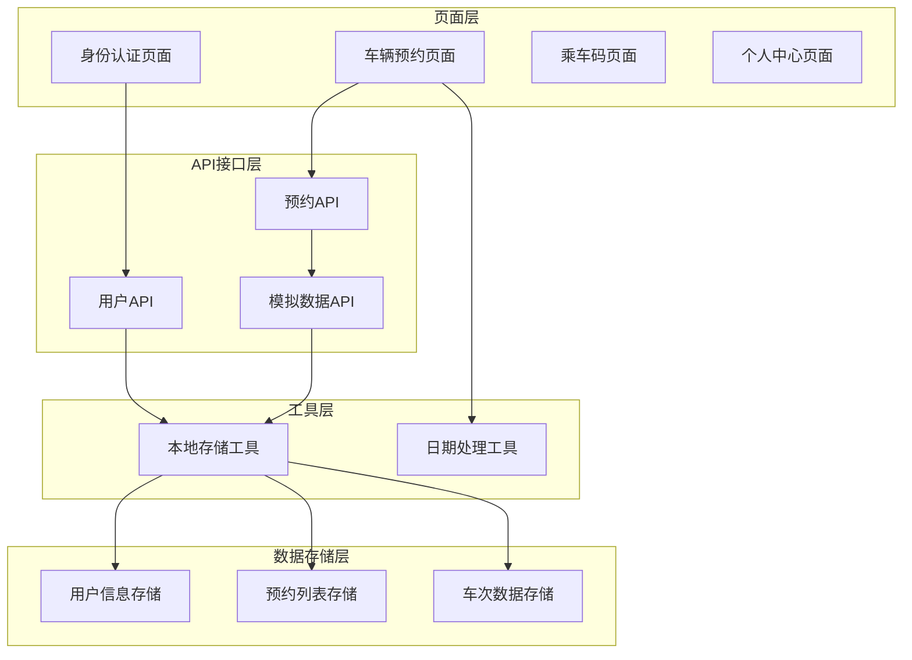
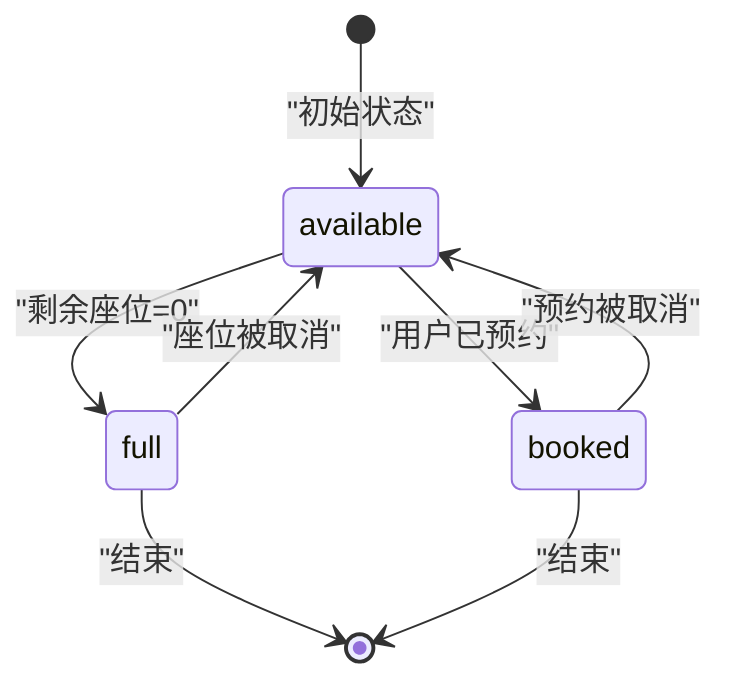
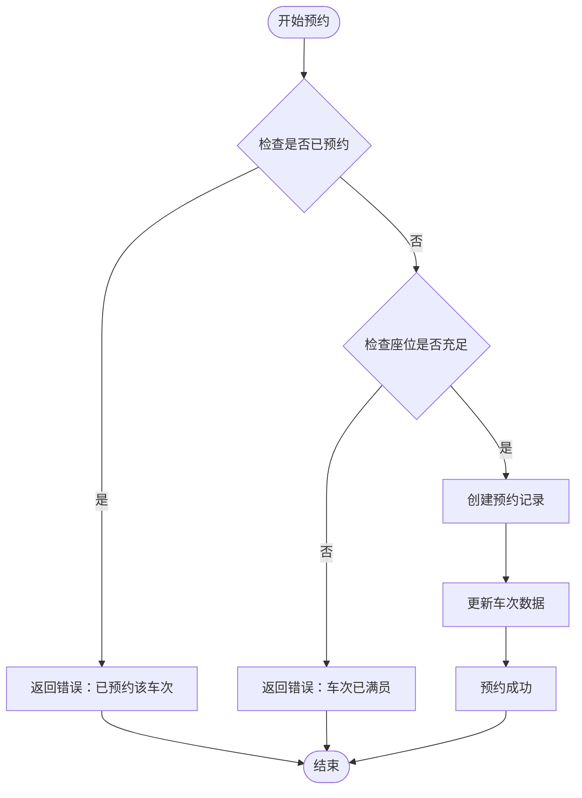
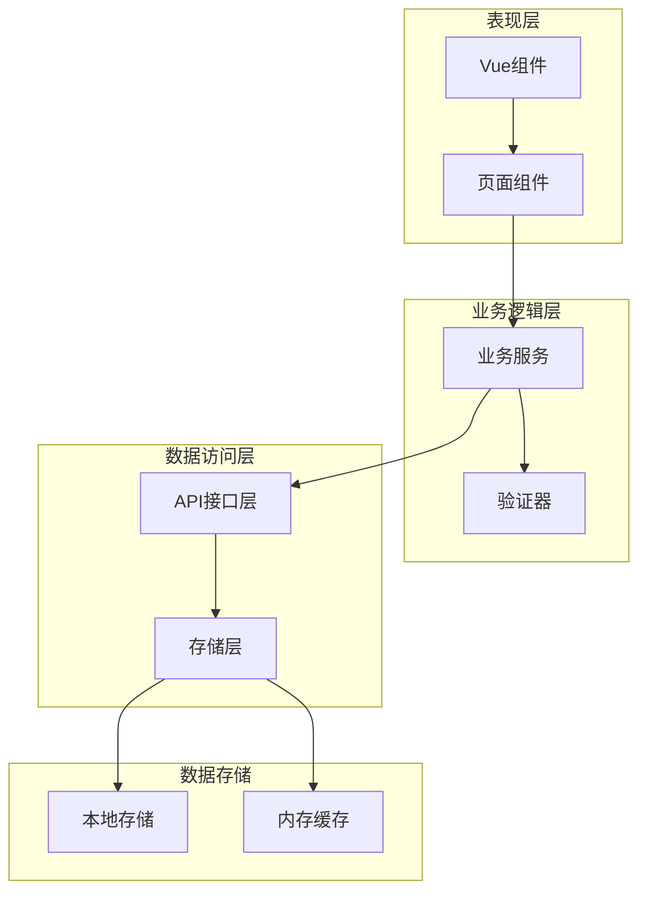
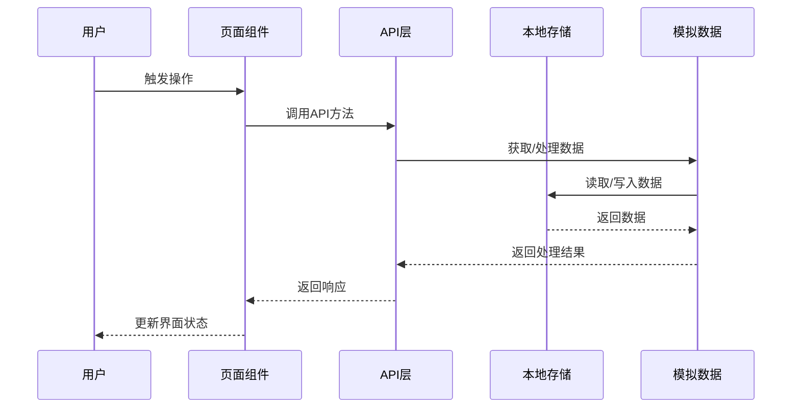
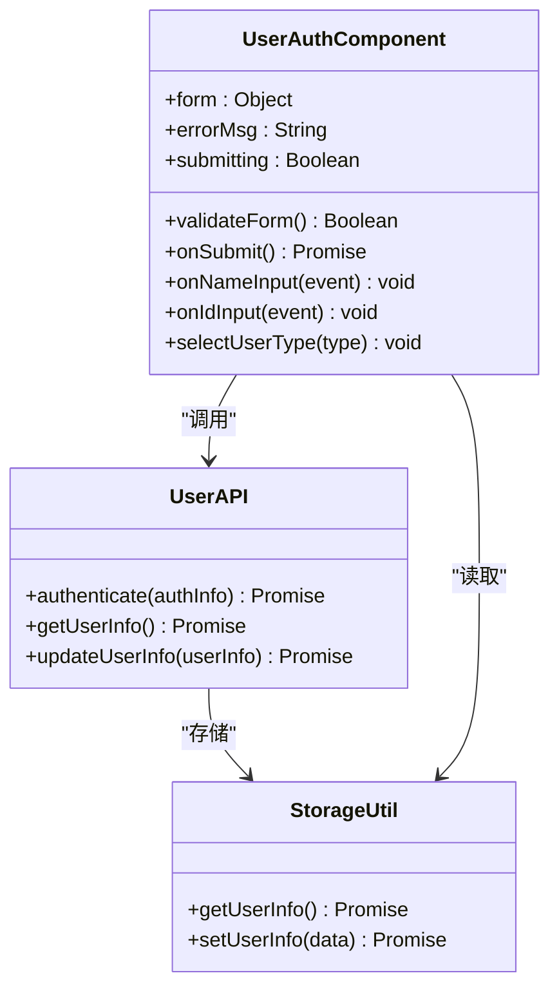
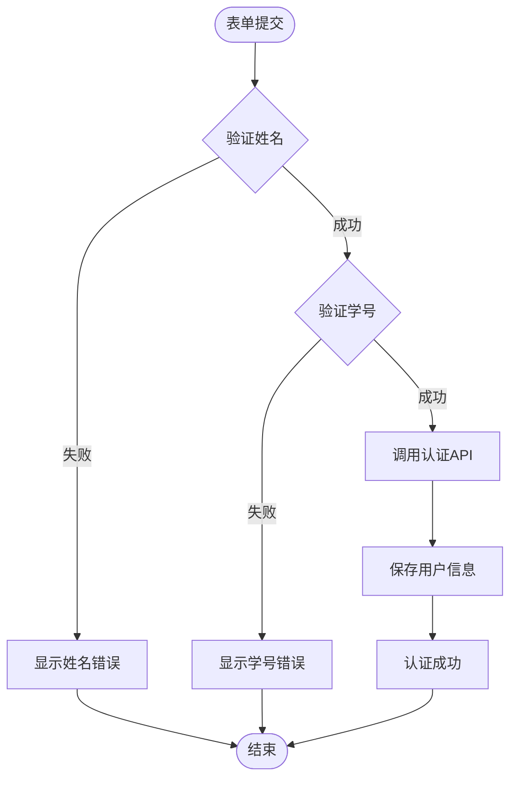
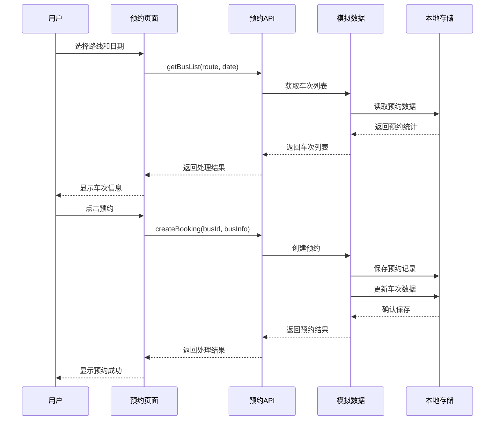
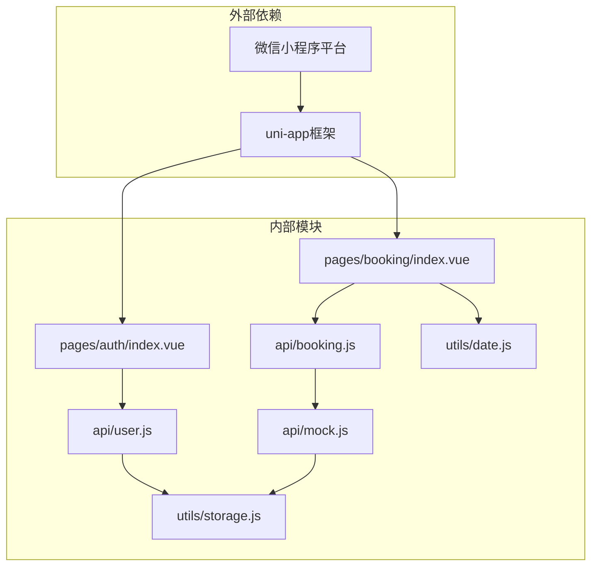
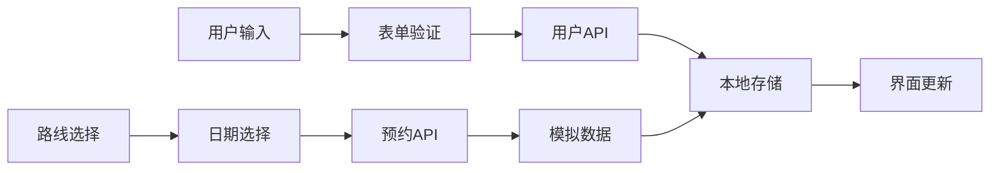

# 数据模型设计

<cite>
**本文档引用的文件**
- [api/user.js](file://api/user.js)
- [api/booking.js](file://api/booking.js)
- [api/mock.js](file://api/mock.js)
- [utils/storage.js](file://utils/storage.js)
- [utils/date.js](file://utils/date.js)
- [pages/auth/index.vue](file://pages/auth/index.vue)
- [pages/booking/index.vue](file://pages/booking/index.vue)
- [PROJECT.md](file://PROJECT.md)
</cite>

## 目录
1. [引言](#引言)
2. [项目结构](#项目结构)
3. [核心数据模型](#核心数据模型)
4. [架构概览](#架构概览)
5. [详细组件分析](#详细组件分析)
6. [依赖关系分析](#依赖关系分析)
7. [性能考量](#性能考量)
8. [故障排除指南](#故障排除指南)
9. [结论](#结论)
10. [附录](#附录)

## 引言

本文件详细阐述了学校校车调度系统中的核心数据模型设计。该系统基于 uni-app 框架开发，采用本地存储策略，为湖北大学师生提供便捷的校车查询、预约、乘车管理服务。系统当前使用本地存储和模拟数据进行演示，预留了与后端 API 的无缝对接接口。

## 项目结构

系统采用模块化的文件组织结构，主要分为以下几个层次：



**图表来源**
- [PROJECT.md:41-67](file://PROJECT.md#L41-L67)
- [api/user.js:1-128](file://api/user.js#L1-L128)
- [api/booking.js:1-165](file://api/booking.js#L1-L165)

**章节来源**
- [PROJECT.md:41-67](file://PROJECT.md#L41-L67)
- [PROJECT.md:113-142](file://PROJECT.md#L113-L142)

## 核心数据模型

### 用户数据模型

用户数据模型是系统的基础数据结构，用于存储用户的身份认证信息和基本信息。

#### 字段定义

| 字段名 | 数据类型 | 描述 | 业务规则 |
|--------|----------|------|----------|
| isAuthenticated | Boolean | 认证状态 | 必填，标识用户是否已通过认证 |
| name | String | 用户姓名 | 必填，长度≥2个字符，仅允许中文字符 |
| studentId | String | 学号/工号 | 必填，长度≥6位，支持数字和字母 |
| userType | String | 身份类型 | 必填，枚举值：'student'/'teacher' |
| authenticatedAt | String | 认证时间 | ISO 8601格式的时间戳 |

#### 数据类型和约束

```mermaid
erDiagram
USER_MODEL {
boolean isAuthenticated PK
string name
string studentId
enum userType
datetime authenticatedAt
}
VALIDATION_RULES {
string name_min_length: >= 2
string studentId_min_length: >= 6
enum userType_values: student|teacher
string date_format: ISO 8601
}
USER_MODEL ||--|| VALIDATION_RULES : "遵循"
```

**图表来源**
- [api/user.js:88-95](file://api/user.js#L88-L95)
- [pages/auth/index.vue:136-152](file://pages/auth/index.vue#L136-L152)

#### 业务规则

1. **姓名验证**：必须为非空字符串，长度至少2个字符
2. **学号验证**：必须为非空字符串，长度至少6位
3. **身份类型**：仅允许 'student' 或 'teacher' 两种值
4. **时间戳**：使用 ISO 8601 格式存储认证时间

**章节来源**
- [api/user.js:77-100](file://api/user.js#L77-L100)
- [pages/auth/index.vue:136-152](file://pages/auth/index.vue#L136-L152)

### 车次数据模型

车次数据模型描述了校车的路线信息、时间安排和座位状态。

#### 字段定义

| 字段名 | 数据类型 | 描述 | 业务规则 |
|--------|----------|------|----------|
| id | String | 车次唯一标识 | 自动生成，格式：BUS_{CW/WC}_{YYYYMMDD}_{HHMM} |
| route | String | 路线名称 | 枚举值：'长江新区至武昌'/'武昌至长江新区' |
| date | String | 出发日期 | YYYY-MM-DD 格式 |
| departureTime | String | 出发时间 | HH:mm 格式 |
| totalSeats | Number | 总座位数 | 固定值45座 |
| bookedSeats | Number | 已预约座位数 | 非负整数 |
| remainingSeats | Number | 剩余座位数 | totalSeats - bookedSeats |
| location | String | 上车地点 | 对应路线的固定地点 |
| status | String | 车次状态 | 'available'/'full'/'booked' |

#### 状态转换图



**图表来源**
- [api/mock.js:65-87](file://api/mock.js#L65-L87)
- [api/mock.js:23-34](file://api/mock.js#L23-L34)

#### 业务规则

1. **座位管理**：总座位数固定为45座
2. **状态计算**：根据剩余座位数动态计算状态
3. **唯一标识**：使用路由、日期、时间组合生成唯一ID
4. **数据一致性**：座位数变化时同步更新车次数据

**章节来源**
- [api/mock.js:49-93](file://api/mock.js#L49-L93)
- [api/mock.js:22-41](file://api/mock.js#L22-L41)

### 预约数据模型

预约数据模型记录了用户的预约信息和状态管理。

#### 字段定义

| 字段名 | 数据类型 | 描述 | 业务规则 |
|--------|----------|------|----------|
| id | String | 预约唯一标识 | 自动生成，格式：BK_{timestamp}_{random} |
| busId | String | 关联车次ID | 外键关联车次模型 |
| route | String | 路线名称 | 与车次保持一致 |
| date | String | 预约日期 | YYYY-MM-DD 格式 |
| dateDisplay | String | 显示用日期 | 用户友好的日期格式 |
| time | String | 出发时间 | HH:mm 格式 |
| location | String | 上车地点 | 与车次保持一致 |
| seat | String | 分配座位号 | 格式：{列}{行}，如 A01 |
| status | String | 预约状态 | 'pending'/'completed'/'cancelled' |
| createdAt | String | 创建时间 | ISO 8601格式时间戳 |

#### 状态流程图



**图表来源**
- [api/mock.js:101-151](file://api/mock.js#L101-L151)
- [api/mock.js:29-41](file://api/mock.js#L29-L41)

#### 业务规则

1. **唯一性约束**：每个用户对同一车次只能有一个待出行的预约
2. **座位分配**：随机分配座位号，格式为字母+数字组合
3. **状态管理**：支持待出行、已完成、已取消三种状态
4. **时间戳**：精确记录创建时间用于排序和审计

**章节来源**
- [api/mock.js:101-151](file://api/mock.js#L101-L151)
- [api/booking.js:47-73](file://api/booking.js#L47-L73)

## 架构概览

系统采用分层架构设计，确保数据模型的清晰分离和可维护性。



**图表来源**
- [PROJECT.md:115-134](file://PROJECT.md#L115-L134)
- [api/user.js:1-128](file://api/user.js#L1-L128)
- [api/booking.js:1-165](file://api/booking.js#L1-L165)

### 数据流设计

系统采用异步数据流模式，确保用户体验的流畅性：



**图表来源**
- [PROJECT.md:115-121](file://PROJECT.md#L115-L121)
- [api/mock.js:49-93](file://api/mock.js#L49-L93)

## 详细组件分析

### 用户认证组件

用户认证组件负责处理用户的身份验证和信息管理。

#### 数据模型交互



**图表来源**
- [pages/auth/index.vue:102-189](file://pages/auth/index.vue#L102-L189)
- [api/user.js:72-126](file://api/user.js#L72-L126)
- [utils/storage.js:10-37](file://utils/storage.js#L10-L37)

#### 表单验证流程



**图表来源**
- [pages/auth/index.vue:136-152](file://pages/auth/index.vue#L136-L152)
- [api/user.js:77-100](file://api/user.js#L77-L100)

**章节来源**
- [pages/auth/index.vue:102-189](file://pages/auth/index.vue#L102-L189)
- [api/user.js:72-126](file://api/user.js#L72-L126)

### 车辆预约组件

车辆预约组件提供车次查询、预约管理和状态跟踪功能。

#### 预约流程



**图表来源**
- [pages/booking/index.vue:148-162](file://pages/booking/index.vue#L148-L162)
- [api/booking.js:47-73](file://api/booking.js#L47-L73)
- [api/mock.js:101-151](file://api/mock.js#L101-L151)

#### 数据存储策略

系统采用本地存储策略，使用 uni-app 的本地存储 API 进行数据持久化：

| 存储键名 | 数据类型 | 描述 | 生命周期 |
|----------|----------|------|----------|
| user_info | Object | 用户认证信息 | 应用生命周期内 |
| booking_list | Array | 预约记录列表 | 应用生命周期内 |
| bus_data | Object | 车次预约统计数据 | 应用生命周期内 |

**章节来源**
- [pages/booking/index.vue:176-247](file://pages/booking/index.vue#L176-L247)
- [api/booking.js:47-134](file://api/booking.js#L47-L134)
- [utils/storage.js:6-115](file://utils/storage.js#L6-L115)

## 依赖关系分析

系统各组件之间的依赖关系清晰明确，遵循单一职责原则。



**图表来源**
- [main.js:1-22](file://main.js#L1-L22)
- [App.vue:1-32](file://App.vue#L1-L32)

### 数据依赖链



**图表来源**
- [pages/auth/index.vue:136-152](file://pages/auth/index.vue#L136-L152)
- [pages/booking/index.vue:164-174](file://pages/booking/index.vue#L164-L174)

**章节来源**
- [main.js:1-22](file://main.js#L1-L22)
- [App.vue:1-32](file://App.vue#L1-L32)

## 性能考量

### 数据访问优化

1. **批量数据获取**：使用一次性获取多个车次信息，减少网络请求次数
2. **本地缓存策略**：利用本地存储避免重复的数据请求
3. **异步处理**：所有数据操作采用异步模式，避免阻塞UI线程

### 内存管理

1. **数据清理**：页面卸载时及时清理不必要的数据引用
2. **状态管理**：合理使用Vue的响应式数据，避免内存泄漏
3. **定时器管理**：及时清理定时器和事件监听器

### 网络优化

1. **模拟延迟**：在开发阶段添加合理的网络延迟模拟
2. **错误处理**：完善的错误处理机制，提升用户体验
3. **重试机制**：在网络异常时提供重试选项

## 故障排除指南

### 常见问题及解决方案

#### 用户认证问题

**问题**：认证失败或提示信息显示错误
- 检查姓名长度是否小于2个字符
- 确认学号/工号长度是否小于6位
- 验证身份类型选择是否正确

**解决方案**：
1. 在表单验证中添加更详细的错误提示
2. 实现输入格式的实时验证
3. 提供示例数据帮助用户理解格式要求

#### 预约功能问题

**问题**：无法创建预约或显示"已满员"
- 检查用户是否已完成身份认证
- 验证车次状态是否为available
- 确认座位数是否大于0

**解决方案**：
1. 在预约前检查用户认证状态
2. 实时更新车次状态显示
3. 提供座位选择的视觉反馈

#### 数据同步问题

**问题**：预约状态不同步或数据丢失
- 检查本地存储权限设置
- 验证数据序列化和反序列化过程
- 确认数据更新的原子性

**解决方案**：
1. 实现数据变更的事务性操作
2. 添加数据完整性检查
3. 提供数据恢复机制

**章节来源**
- [pages/auth/index.vue:178-187](file://pages/auth/index.vue#L178-L187)
- [pages/booking/index.vue:182-198](file://pages/booking/index.vue#L182-L198)
- [PROJECT.md:183-202](file://PROJECT.md#L183-L202)

## 结论

本数据模型设计充分考虑了学校校车调度系统的业务需求和技术特点。通过清晰的数据结构定义、严格的业务规则约束和灵活的存储策略，系统能够有效支撑用户认证、车次查询、预约管理等核心功能。

系统的主要优势包括：
1. **模块化设计**：清晰的分层架构便于维护和扩展
2. **数据一致性**：完善的验证机制确保数据质量
3. **用户体验**：流畅的异步数据处理提升用户满意度
4. **可扩展性**：预留的后端接口便于系统升级

随着系统的发展，建议重点关注数据迁移、性能优化和安全加固等方面，以满足更大规模的应用需求。

## 附录

### 数据模型演进历史

**v1.0.0 (2024-04-09)**
- 初始版本发布
- 实现基础的用户认证和预约功能
- 采用本地存储策略
- 预留后端API接口

### 扩展性考虑

#### 后端集成准备

1. **API接口标准化**：统一RESTful API设计
2. **认证机制**：集成JWT Token认证
3. **数据库设计**：设计合理的数据表结构
4. **缓存策略**：实现多级缓存机制

#### 功能扩展方向

1. **通知系统**：集成消息推送功能
2. **数据分析**：添加预约统计和报表功能
3. **权限管理**：实现多角色权限控制
4. **移动端适配**：优化移动端用户体验