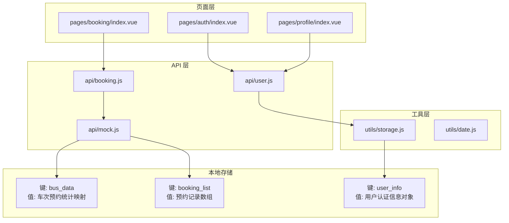
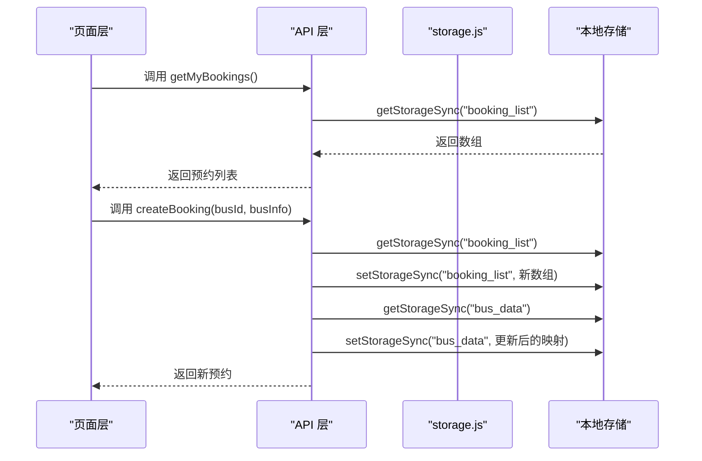
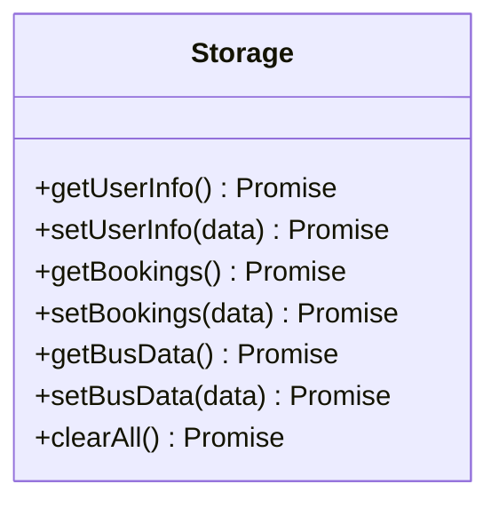
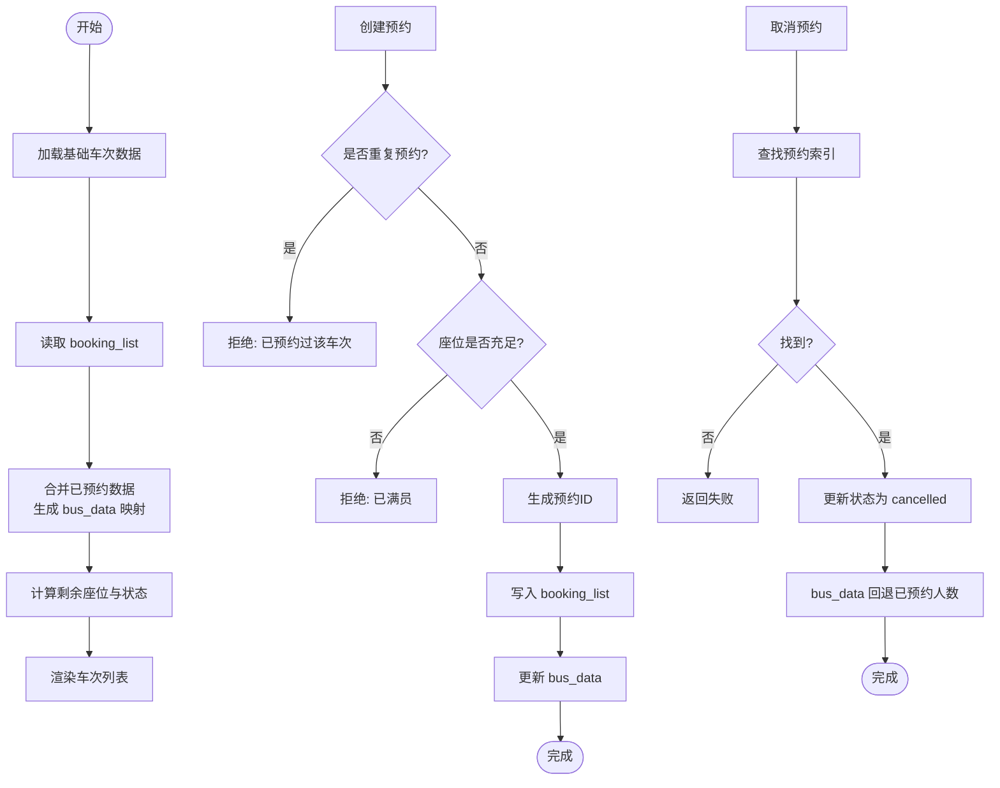
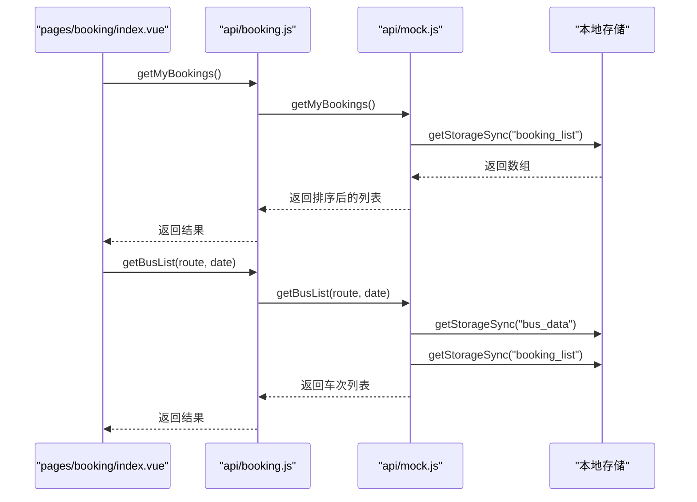
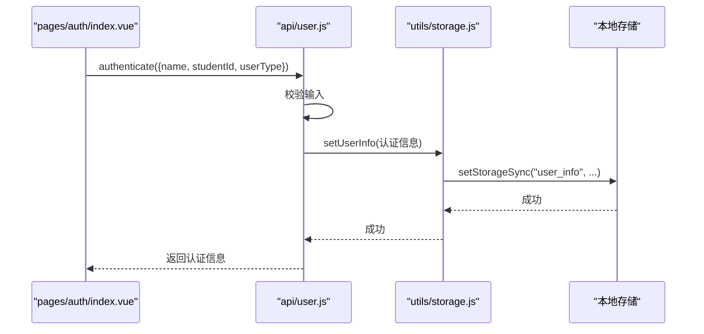
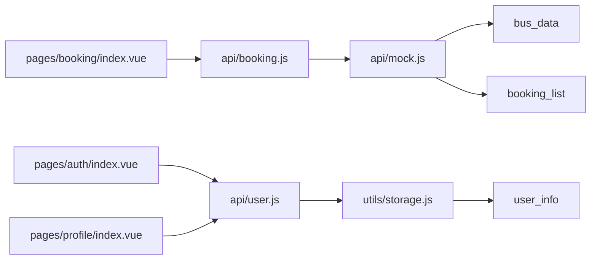

# 本地存储数据结构

<cite>
**本文档引用的文件**
- [utils/storage.js](file://utils/storage.js)
- [api/mock.js](file://api/mock.js)
- [api/user.js](file://api/user.js)
- [pages/booking/index.vue](file://pages/booking/index.vue)
- [pages/auth/index.vue](file://pages/auth/index.vue)
- [pages/profile/index.vue](file://pages/profile/index.vue)
- [utils/date.js](file://utils/date.js)
- [main.js](file://main.js)
- [App.vue](file://App.vue)
</cite>

## 目录
1. [引言](#引言)
2. [项目结构](#项目结构)
3. [核心组件](#核心组件)
4. [架构总览](#架构总览)
5. [详细组件分析](#详细组件分析)
6. [依赖关系分析](#依赖关系分析)
7. [性能考量](#性能考量)
8. [故障排查指南](#故障排查指南)
9. [结论](#结论)
10. [附录](#附录)

## 引言
本文件系统性梳理校园巴士调度系统中的本地存储数据结构与持久化策略，重点覆盖以下方面：
- 键值对结构设计：bus_data、booking_list、user_info 等关键存储键的命名规范与数据格式
- 数据序列化与反序列化：基于 uni-app 的本地存储封装与 JSON 序列化
- 缓存策略与过期机制：内存缓存与持久化存储的协调
- 数据迁移与升级：向后兼容性保障方案
- 数据安全与隐私保护：敏感信息处理策略

## 项目结构
系统采用 uni-app 多端框架，前端页面通过 API 层调用本地存储工具，形成清晰的数据流：
- 页面层：booking、auth、profile 等页面负责用户交互与业务流程
- API 层：booking、user 等模块封装数据访问逻辑
- 工具层：storage.js 提供统一的本地存储封装
- 数据层：本地存储（uni.setStorageSync/getStorageSync）承载持久化数据

图表来源
- [pages/booking/index.vue:114-135](file://pages/booking/index.vue#L114-L135)
- [pages/auth/index.vue:155-187](file://pages/auth/index.vue#L155-L187)
- [pages/profile/index.vue:171-179](file://pages/profile/index.vue#L171-L179)
- [api/booking.js:14-40](file://api/booking.js#L14-L40)
- [api/user.js:12-42](file://api/user.js#L12-L42)
- [api/mock.js:49-93](file://api/mock.js#L49-L93)
- [utils/storage.js:6-114](file://utils/storage.js#L6-L114)

章节来源
- [main.js:1-22](file://main.js#L1-L22)
- [App.vue:1-32](file://App.vue#L1-L32)

## 核心组件
本节聚焦本地存储的关键键值对结构与数据模型，以及序列化/反序列化机制。

- bus_data
  - 作用：按“路线_日期”维度记录每趟车次的已预约人数，用于车次列表渲染与座位状态判断
  - 结构：对象字典，键为“路线_日期”，值为“发车时刻 -> 已预约人数”的映射
  - 示例键名：'长江新区至武昌_2025-04-05'
  - 示例值：{ '07:30': 12, '09:00': 45, ... }
  - 写入时机：创建预约时更新；取消预约时回退
  - 读取时机：生成车次列表时合并基础车次与已预约数据

- booking_list
  - 作用：存储用户的全部预约记录，支持查询、筛选与状态管理
  - 结构：数组，元素为预约对象
  - 字段要点：id、busId、route、date、dateDisplay、time、location、seat、status、createdAt
  - 状态：pending（待出行）、completed（已完成）、cancelled（已取消）
  - 写入时机：创建预约、取消预约
  - 读取时机：我的预约、车次列表状态判断、今日有效预约

- user_info
  - 作用：存储用户认证信息，决定预约权限
  - 结构：对象，包含认证状态、姓名、学号/工号、身份类型、认证时间等
  - 写入时机：完成身份认证
  - 读取时机：预约前权限检查、个人资料展示

章节来源
- [utils/storage.js:6-114](file://utils/storage.js#L6-L114)
- [api/mock.js:49-151](file://api/mock.js#L49-L151)
- [api/user.js:88-99](file://api/user.js#L88-L99)

## 架构总览
本地存储在系统中的角色与交互如下：
- 统一封装：storage.js 对 uni 的 setStorageSync/getStorageSync 进行封装，便于替换与扩展
- 数据来源：mock.js 在当前阶段提供模拟数据，实际项目可替换为后端 API
- 页面驱动：页面通过 API 层读写本地存储，实现数据持久化与状态同步

图表来源
- [pages/booking/index.vue:138-162](file://pages/booking/index.vue#L138-L162)
- [api/booking.js:78-102](file://api/booking.js#L78-L102)
- [api/mock.js:101-151](file://api/mock.js#L101-L151)
- [utils/storage.js:42-69](file://utils/storage.js#L42-L69)

## 详细组件分析

### 本地存储工具类（storage.js）
- 设计目标：封装 uni 的本地存储 API，提供 Promise 化接口，便于替换为后端服务
- 关键方法：
  - getUserInfo()/setUserInfo()：读写 user_info
  - getBookings()/setBookings()：读写 booking_list
  - getBusData()/setBusData()：读写 bus_data
  - clearAll()：清空所有本地数据
- 错误处理：读取失败时返回默认值（如空数组），避免异常中断
- 序列化机制：直接传入对象给 uni.setStorageSync，底层由 uni 框架进行序列化/反序列化

图表来源
- [utils/storage.js:6-114](file://utils/storage.js#L6-L114)

章节来源
- [utils/storage.js:6-114](file://utils/storage.js#L6-L114)

### 预约数据生成与更新（api/mock.js）
- 车次列表生成：基于基础车次数据与 bus_data 合成最终列表，计算剩余座位与状态
- 预约创建：校验重复预约与座位余量，生成唯一预约 ID，写入 booking_list，并更新 bus_data
- 预约取消：更新状态为 cancelled，并回退 bus_data 中的已预约人数
- 今日有效预约：根据当前日期筛选 pending 状态的预约

图表来源
- [api/mock.js:49-93](file://api/mock.js#L49-L93)
- [api/mock.js:101-151](file://api/mock.js#L101-L151)
- [api/mock.js:176-203](file://api/mock.js#L176-L203)

章节来源
- [api/mock.js:49-151](file://api/mock.js#L49-L151)
- [api/mock.js:176-203](file://api/mock.js#L176-L203)

### 页面交互与数据联动（pages/booking/index.vue）
- 生命周期：onLoad 初始化，onShow 刷新数据
- 数据加载：分别加载我的预约与车次列表
- 权限控制：预约前检查 user_info 的认证状态
- 用户操作：确认预约、取消预约、查看详情

图表来源
- [pages/booking/index.vue:114-162](file://pages/booking/index.vue#L114-L162)
- [api/booking.js:14-40](file://api/booking.js#L14-L40)
- [api/mock.js:49-93](file://api/mock.js#L49-L93)

章节来源
- [pages/booking/index.vue:114-162](file://pages/booking/index.vue#L114-L162)

### 用户认证与个人信息（pages/auth/index.vue、api/user.js）
- 认证流程：表单校验 -> 生成认证信息 -> 写入 user_info
- 页面展示：profile 页面读取 user_info 并展示认证状态与详情
- 安全注意：当前为本地存储，后续接入后端时需确保 token 与敏感信息的安全传输

图表来源
- [pages/auth/index.vue:155-187](file://pages/auth/index.vue#L155-L187)
- [api/user.js:72-100](file://api/user.js#L72-L100)
- [utils/storage.js:27-37](file://utils/storage.js#L27-L37)

章节来源
- [pages/auth/index.vue:155-187](file://pages/auth/index.vue#L155-L187)
- [api/user.js:72-100](file://api/user.js#L72-L100)

## 依赖关系分析
- 页面层依赖 API 层，API 层依赖工具层与本地存储
- API 层与工具层之间通过 storage.js 解耦，便于替换为后端服务
- 本地存储键之间存在隐式依赖：bus_data 与 booking_list 共同决定车次状态

图表来源
- [pages/booking/index.vue:99-100](file://pages/booking/index.vue#L99-L100)
- [pages/auth/index.vue](file://pages/auth/index.vue#L100)
- [pages/profile/index.vue:153-154](file://pages/profile/index.vue#L153-L154)
- [api/booking.js](file://api/booking.js#L6)
- [api/user.js](file://api/user.js#L6)
- [utils/storage.js:6-114](file://utils/storage.js#L6-L114)

章节来源
- [pages/booking/index.vue:99-100](file://pages/booking/index.vue#L99-L100)
- [pages/auth/index.vue](file://pages/auth/index.vue#L100)
- [pages/profile/index.vue:153-154](file://pages/profile/index.vue#L153-L154)
- [api/booking.js](file://api/booking.js#L6)
- [api/user.js](file://api/user.js#L6)
- [utils/storage.js:6-114](file://utils/storage.js#L6-L114)

## 性能考量
- 读写粒度：当前以整键读写为主，适合小规模数据；若数据增长，建议分页或增量更新
- 序列化成本：对象直接传入 uni 存储，序列化开销较小；避免频繁大对象写入
- 缓存策略：页面 onShow 时刷新数据，保证一致性；可在页面内维护轻量内存缓存，减少重复读取
- 并发控制：同一键的并发写入需谨慎，必要时引入队列或锁机制

## 故障排查指南
- 读取失败
  - 现象：读取 user_info/booking_list/bus_data 返回空或 null
  - 排查：确认键名拼写与数据初始化；检查 storage.js 的 fail 分支是否被触发
  - 参考路径：[utils/storage.js:10-22](file://utils/storage.js#L10-L22)、[utils/storage.js:42-54](file://utils/storage.js#L42-L54)、[utils/storage.js:74-86](file://utils/storage.js#L74-L86)

- 预约重复
  - 现象：提示已预约过该车次
  - 排查：检查 booking_list 中是否存在相同 busId 且状态为 pending 的记录
  - 参考路径：[api/mock.js:104-111](file://api/mock.js#L104-L111)

- 座位不足
  - 现象：提示已满员
  - 排查：核对 bus_data 中对应时刻的已预约人数与总座位数
  - 参考路径：[api/mock.js:114-117](file://api/mock.js#L114-L117)

- 认证失败
  - 现象：表单校验错误或认证接口报错
  - 排查：检查输入长度与格式；确认 user_info 是否正确写入
  - 参考路径：[pages/auth/index.vue:136-152](file://pages/auth/index.vue#L136-L152)、[api/user.js:78-86](file://api/user.js#L78-L86)、[api/user.js:97-99](file://api/user.js#L97-L99)

## 结论
本系统通过统一的本地存储封装与清晰的键值对结构，实现了预约、车次与用户信息的本地持久化。当前以 mock 数据驱动，具备良好的可扩展性，便于后续接入后端 API。建议在演进过程中关注数据一致性、性能优化与安全加固。

## 附录

### 数据模型与字段定义
- bus_data
  - 键：'路线_日期'
  - 值：{ '发车时刻': 已预约人数 }
- booking_list
  - 元素：预约对象
  - 关键字段：id、busId、route、date、dateDisplay、time、location、seat、status、createdAt
- user_info
  - 关键字段：isAuthenticated、name、studentId、userType、authenticatedAt

### 序列化与版本兼容
- 选择 JSON：通过 uni 存储对象，底层由 uni 框架进行序列化/反序列化
- 版本兼容：新增字段时应提供默认值；删除字段时保留兼容读取逻辑；迁移时提供版本号字段

### 缓存与过期策略
- 内存缓存：页面内维护轻量缓存，结合 onShow 刷新
- 持久化存储：以键为单位的读写，避免跨键事务
- 过期机制：当前未实现；可引入时间戳字段与定期清理任务

### 数据迁移与升级
- 向后兼容：新增字段时提供默认值；旧字段废弃时保留只读兼容
- 迁移流程：启动时检测版本号，执行一次性迁移脚本，更新键值与结构
- 升级路径：先写入新结构，再删除旧结构，确保原子性

### 安全与隐私
- 敏感信息：user_info 中包含姓名、学号/工号等，当前仅本地存储
- 后续强化：接入后端时使用 HTTPS、Token 认证与加密传输；本地存储中避免存储明文敏感信息