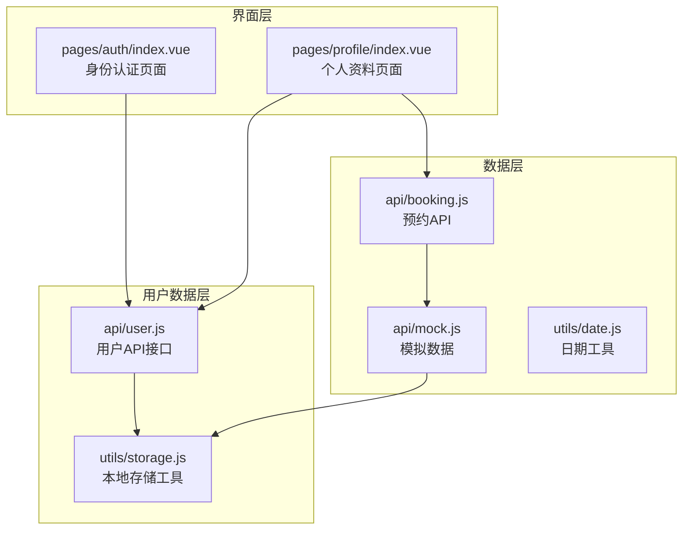
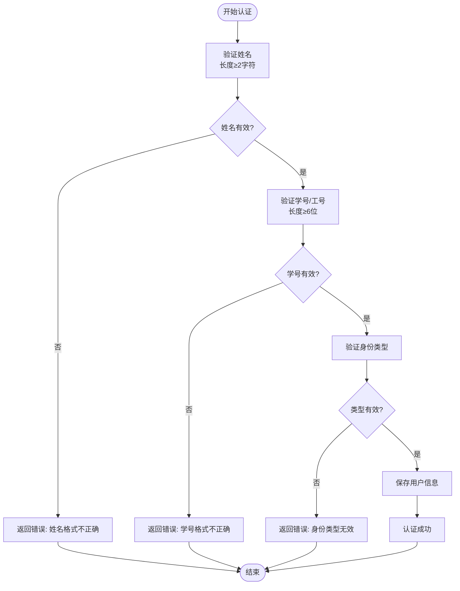
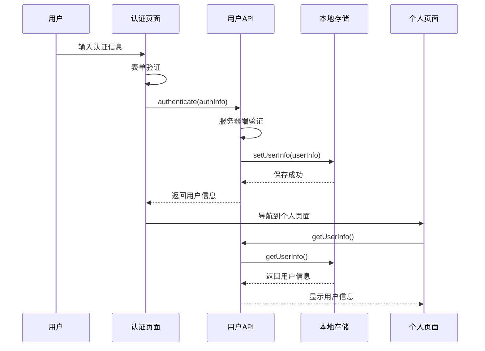
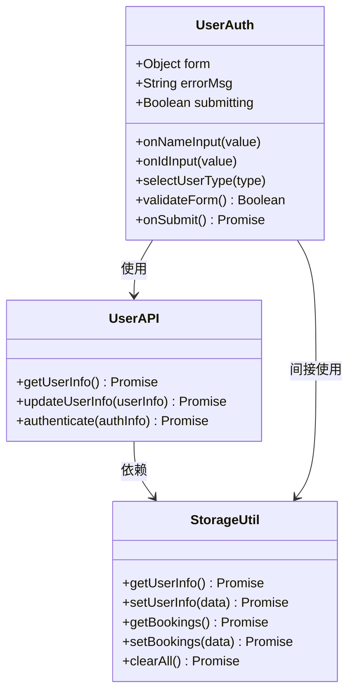
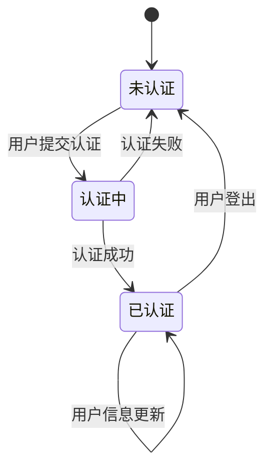
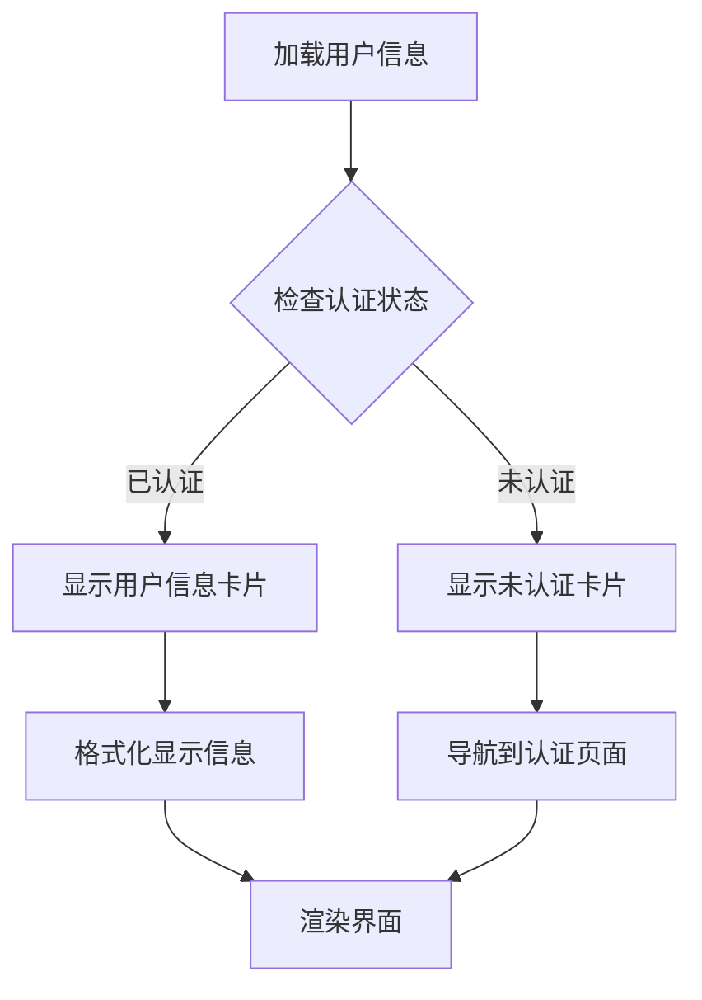
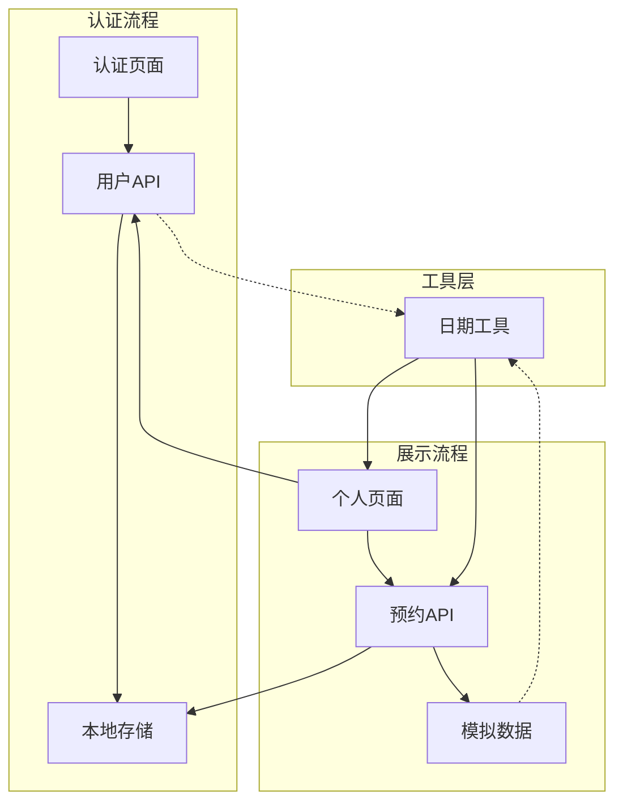

# 用户数据模型

<cite>
**本文档引用的文件**
- [api/user.js](file://api/user.js)
- [utils/storage.js](file://utils/storage.js)
- [pages/auth/index.vue](file://pages/auth/index.vue)
- [pages/profile/index.vue](file://pages/profile/index.vue)
- [api/booking.js](file://api/booking.js)
- [api/mock.js](file://api/mock.js)
- [utils/date.js](file://utils/date.js)
</cite>

## 目录
1. [简介](#简介)
2. [项目结构](#项目结构)
3. [核心组件](#核心组件)
4. [架构概览](#架构概览)
5. [详细组件分析](#详细组件分析)
6. [依赖关系分析](#依赖关系分析)
7. [性能考虑](#性能考虑)
8. [故障排除指南](#故障排除指南)
9. [结论](#结论)

## 简介

本文档详细描述了校园巴士调度系统中的用户数据模型。该系统采用UniApp框架开发，实现了基于Web Storage的本地用户数据存储机制。用户数据模型包含身份认证信息、用户标识信息和认证状态管理等核心功能。

## 项目结构

系统采用模块化架构设计，用户数据相关的核心文件分布如下：

**图表来源**
- [api/user.js:1-128](file://api/user.js#L1-L128)
- [utils/storage.js:1-116](file://utils/storage.js#L1-L116)
- [pages/auth/index.vue:1-385](file://pages/auth/index.vue#L1-L385)
- [pages/profile/index.vue:1-595](file://pages/profile/index.vue#L1-L595)

**章节来源**
- [api/user.js:1-128](file://api/user.js#L1-L128)
- [utils/storage.js:1-116](file://utils/storage.js#L1-L116)
- [pages/auth/index.vue:1-385](file://pages/auth/index.vue#L1-L385)
- [pages/profile/index.vue:1-595](file://pages/profile/index.vue#L1-L595)

## 核心组件

### 用户数据模型定义

系统中的用户数据模型采用简洁的对象结构，包含以下核心字段：

| 字段名 | 数据类型 | 必填 | 验证规则 | 业务含义 |
|--------|----------|------|----------|----------|
| isAuthenticated | Boolean | 是 | 固定值true | 认证状态标识 |
| name | String | 是 | 长度≥2字符，去除空白 | 用户真实姓名 |
| studentId | String | 是 | 长度≥6位，数字字母组合 | 学号或工号 |
| userType | String | 是 | 'student'或'teacher' | 身份类型 |
| authenticatedAt | String | 是 | ISO 8601日期字符串 | 认证时间戳 |

### 数据验证规则

系统实现了多层次的数据验证机制：

**图表来源**
- [api/user.js:72-100](file://api/user.js#L72-L100)
- [pages/auth/index.vue:136-152](file://pages/auth/index.vue#L136-L152)

**章节来源**
- [api/user.js:72-100](file://api/user.js#L72-L100)
- [pages/auth/index.vue:136-152](file://pages/auth/index.vue#L136-L152)

## 架构概览

系统采用分层架构设计，用户数据流经多个处理阶段：

**图表来源**
- [pages/auth/index.vue:154-187](file://pages/auth/index.vue#L154-L187)
- [api/user.js:72-100](file://api/user.js#L72-L100)
- [utils/storage.js:10-37](file://utils/storage.js#L10-L37)

**章节来源**
- [pages/auth/index.vue:154-187](file://pages/auth/index.vue#L154-L187)
- [api/user.js:72-100](file://api/user.js#L72-L100)
- [utils/storage.js:10-37](file://utils/storage.js#L10-L37)

## 详细组件分析

### 用户认证组件

用户认证组件负责处理用户的身份验证流程，包含完整的前端验证和后端交互逻辑。

#### 认证流程类图

**图表来源**
- [pages/auth/index.vue:102-189](file://pages/auth/index.vue#L102-L189)
- [api/user.js:8-127](file://api/user.js#L8-L127)
- [utils/storage.js:6-115](file://utils/storage.js#L6-L115)

#### 认证状态管理

系统实现了完整的认证状态管理机制：

**图表来源**
- [api/user.js:88-100](file://api/user.js#L88-L100)
- [pages/profile/index.vue:38-75](file://pages/profile/index.vue#L38-L75)

### 用户信息展示组件

个人资料页面负责展示用户的认证信息和相关功能入口。

#### 用户信息显示流程

**图表来源**
- [pages/profile/index.vue:172-179](file://pages/profile/index.vue#L172-L179)
- [pages/profile/index.vue:38-75](file://pages/profile/index.vue#L38-L75)

**章节来源**
- [pages/profile/index.vue:172-179](file://pages/profile/index.vue#L172-L179)
- [pages/profile/index.vue:38-75](file://pages/profile/index.vue#L38-L75)

### 数据持久化策略

系统采用Web Storage作为本地数据持久化方案，提供了统一的存储接口：

#### 存储接口设计

| 方法名 | 参数 | 返回值 | 用途 |
|--------|------|--------|------|
| getUserInfo() | 无 | Promise | 获取用户信息 |
| setUserInfo(data) | Object | Promise | 保存用户信息 |
| getBookings() | 无 | Promise | 获取预约列表 |
| setBookings(data) | Array | Promise | 保存预约列表 |
| getBusData() | 无 | Promise | 获取车次数据 |
| setBusData(data) | Object | Promise | 保存车次数据 |
| clearAll() | 无 | Promise | 清空所有数据 |

**章节来源**
- [utils/storage.js:6-115](file://utils/storage.js#L6-L115)

## 依赖关系分析

系统各组件之间的依赖关系清晰明确，遵循单一职责原则：

**图表来源**
- [pages/auth/index.vue:100](file://pages/auth/index.vue#L100)
- [pages/profile/index.vue:153-154](file://pages/profile/index.vue#L153-L154)
- [api/user.js:6](file://api/user.js#L6)
- [api/booking.js:6](file://api/booking.js#L6)

**章节来源**
- [pages/auth/index.vue:100](file://pages/auth/index.vue#L100)
- [pages/profile/index.vue:153-154](file://pages/profile/index.vue#L153-L154)
- [api/user.js:6](file://api/user.js#L6)
- [api/booking.js:6](file://api/booking.js#L6)

## 性能考虑

系统在设计时充分考虑了性能优化：

### 存储性能优化
- 使用Promise封装异步操作，避免阻塞UI线程
- 本地存储采用Web Storage API，访问速度快
- 批量操作支持，减少存储调用次数

### 界面性能优化
- 组件懒加载，按需加载认证页面
- 数据缓存机制，避免重复请求
- 合理的DOM操作，减少重绘重排

### 数据验证优化
- 前端即时验证，减少无效请求
- 防抖处理，避免频繁验证触发
- 格式化处理，确保数据一致性

## 故障排除指南

### 常见问题及解决方案

#### 认证失败问题
**症状**: 用户提交认证信息后返回错误
**可能原因**:
- 姓名长度不足2个字符
- 学号/工号长度不足6位
- 身份类型参数错误

**解决方法**:
1. 检查前端表单验证规则
2. 确认后端API接口正常
3. 验证本地存储权限

#### 数据加载失败
**症状**: 个人页面无法显示用户信息
**可能原因**:
- 本地存储数据损坏
- 网络请求超时
- API接口异常

**解决方法**:
1. 清空本地存储数据
2. 检查网络连接状态
3. 重新登录认证

#### 数据同步问题
**症状**: 用户信息更新后未及时反映
**可能原因**:
- 缓存未刷新
- 异步操作顺序错误
- 页面生命周期管理不当

**解决方法**:
1. 实现手动刷新机制
2. 使用事件总线通知更新
3. 优化页面生命周期钩子

**章节来源**
- [pages/auth/index.vue:178-186](file://pages/auth/index.vue#L178-L186)
- [utils/storage.js:10-21](file://utils/storage.js#L10-L21)

## 结论

本用户数据模型设计合理，实现了以下核心特性：

1. **完整性**: 包含用户身份认证、标识信息和状态管理的完整数据结构
2. **安全性**: 实现了多层数据验证和错误处理机制
3. **可扩展性**: 采用模块化设计，便于后续集成真实后端API
4. **用户体验**: 提供友好的认证流程和信息展示界面
5. **性能优化**: 采用本地存储和异步处理，保证应用响应速度

系统当前采用本地存储方案，为后续集成真实后端服务提供了良好的基础。通过统一的API接口设计，可以平滑地从本地存储迁移到云端数据库，而无需修改上层业务逻辑。