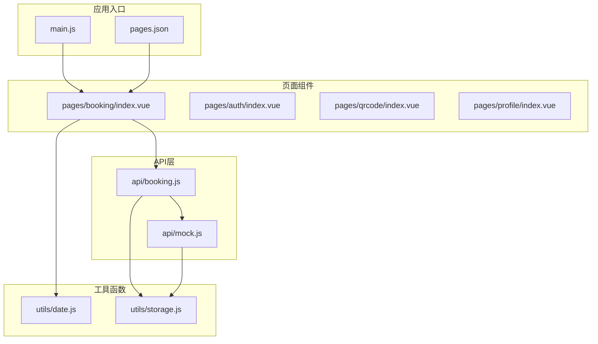
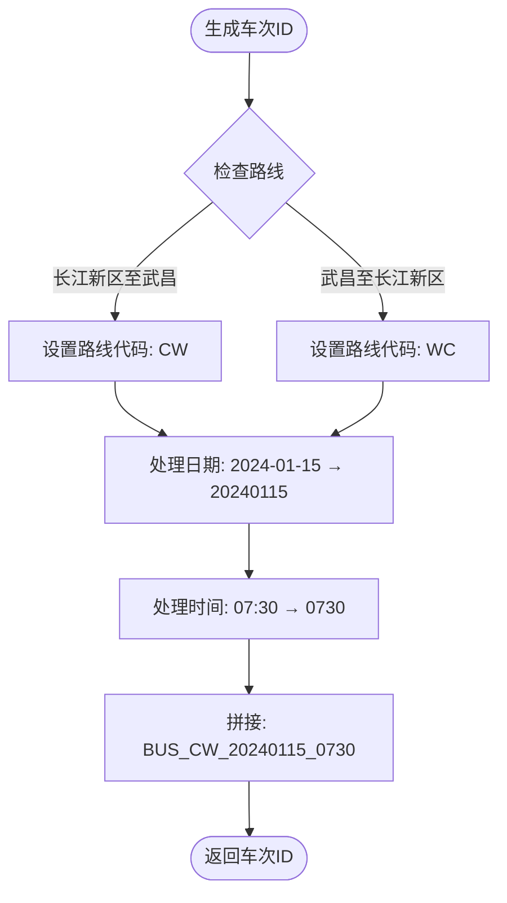
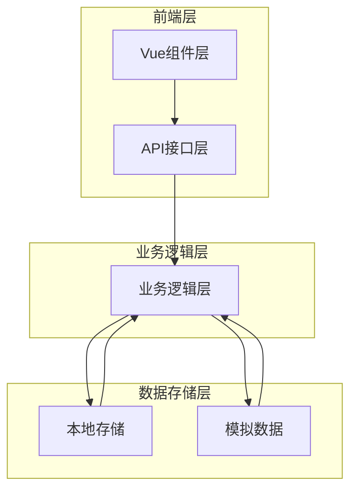
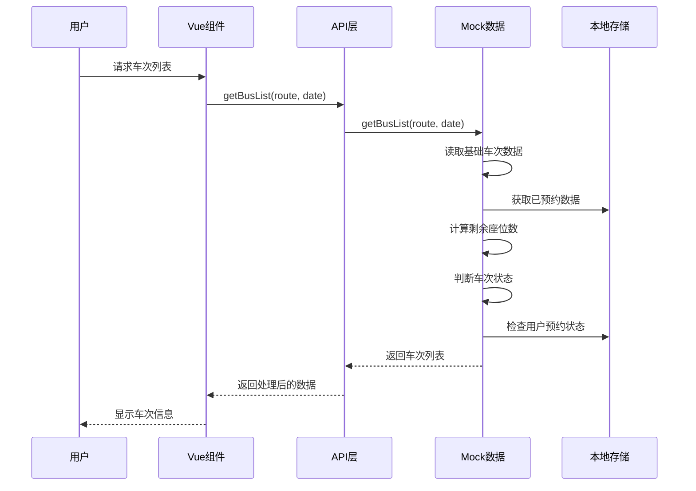
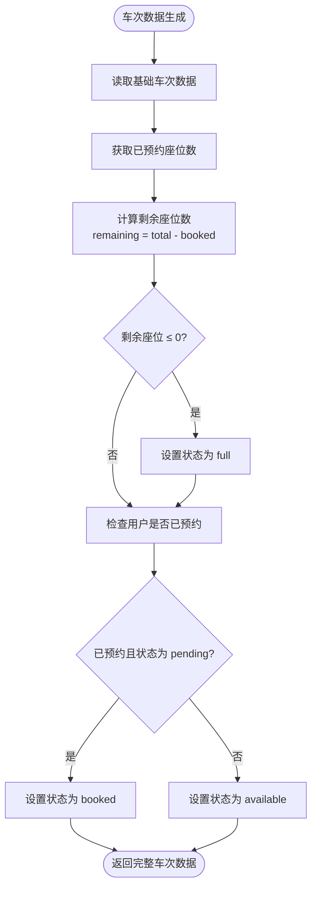
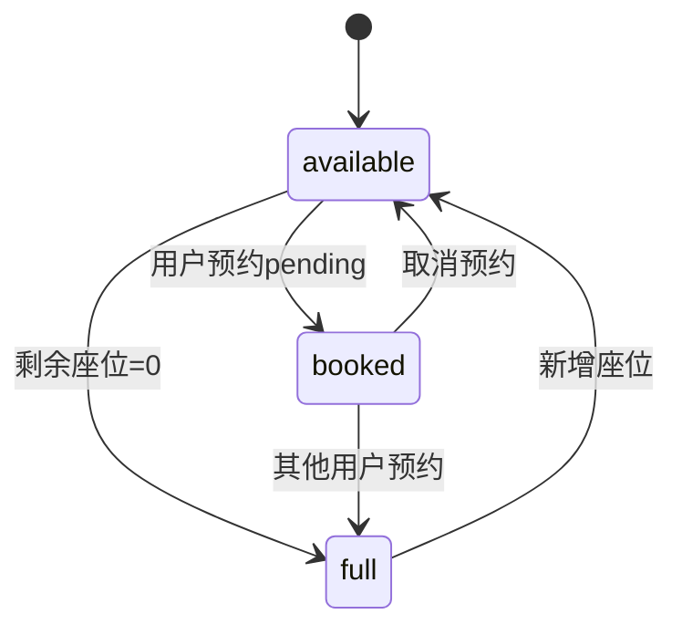
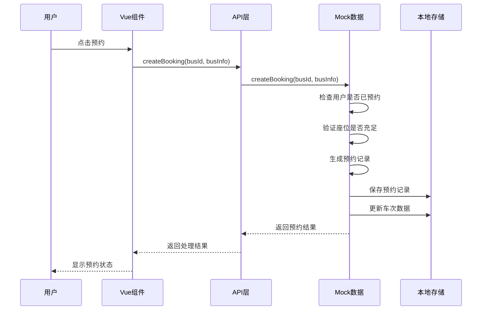
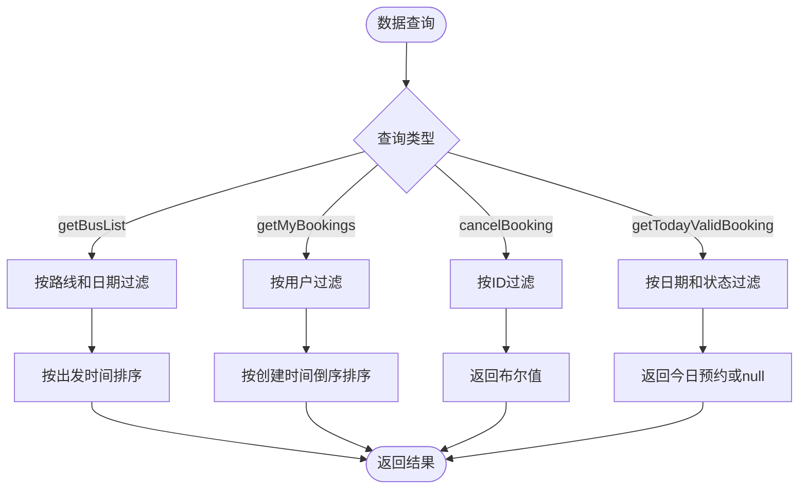
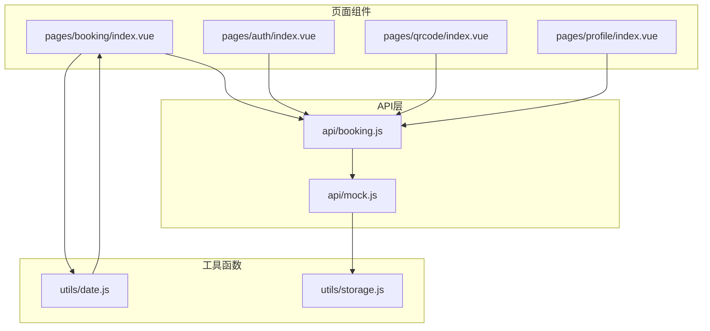

# 车次数据模型

<cite>
**本文引用的文件**
- [main.js](file://main.js)
- [pages.json](file://pages.json)
- [api/mock.js](file://api/mock.js)
- [api/booking.js](file://api/booking.js)
- [pages/booking/index.vue](file://pages/booking/index.vue)
- [utils/date.js](file://utils/date.js)
- [utils/storage.js](file://utils/storage.js)
- [PROJECT.md](file://PROJECT.md)
- [pages/auth/index.vue](file://pages/auth/index.vue)
- [pages/qrcode/index.vue](file://pages/qrcode/index.vue)
- [pages/profile/index.vue](file://pages/profile/index.vue)
</cite>

## 目录
1. [引言](#引言)
2. [项目结构](#项目结构)
3. [核心组件](#核心组件)
4. [架构概览](#架构概览)
5. [详细组件分析](#详细组件分析)
6. [依赖关系分析](#依赖关系分析)
7. [性能考虑](#性能考虑)
8. [故障排除指南](#故障排除指南)
9. [结论](#结论)

## 引言

本文件详细说明校园巴士调度系统中的车次数据模型，包括车次实体的完整数据结构、字段定义、生成规则以及相关业务逻辑。该系统基于 uni-app 框架开发，采用本地存储模拟后端数据，提供校车查询、预约、乘车管理等核心功能。

## 项目结构

系统采用模块化的文件组织方式，主要包含以下目录结构：

**图表来源**
- [main.js:1-22](file://main.js#L1-L22)
- [pages.json:1-62](file://pages.json#L1-L62)
- [api/booking.js:1-165](file://api/booking.js#L1-L165)
- [api/mock.js:1-226](file://api/mock.js#L1-L226)

**章节来源**
- [PROJECT.md:41-67](file://PROJECT.md#L41-L67)
- [main.js:1-22](file://main.js#L1-L22)
- [pages.json:1-62](file://pages.json#L1-L62)

## 核心组件

### 车次数据模型定义

系统中的车次实体包含以下核心字段：

| 字段名 | 类型 | 描述 | 示例值 |
|--------|------|------|--------|
| id | String | 车次唯一标识符 | BUS_CW_20240115_0730 |
| route | String | 路线名称 | "长江新区至武昌" |
| date | String | 出发日期 | "2024-01-15" |
| departureTime | String | 出发时间 | "07:30" |
| location | String | 出发地点 | "长江新区南大门" |
| totalSeats | Number | 总座位数 | 45 |
| bookedSeats | Number | 已预约座位数 | 23 |
| remainingSeats | Number | 剩余座位数 | 22 |
| status | String | 车次状态 | "available" |

### 车次标识生成规则

车次 ID 采用统一的命名规范，格式为：`BUS_{路线代码}_{日期代码}_{时间代码}`

**图表来源**
- [api/mock.js:22-27](file://api/mock.js#L22-L27)

**章节来源**
- [api/mock.js:22-27](file://api/mock.js#L22-L27)
- [api/mock.js:49-93](file://api/mock.js#L49-L93)

## 架构概览

系统采用分层架构设计，确保前后端分离和数据一致性：

**图表来源**
- [api/booking.js:8-165](file://api/booking.js#L8-L165)
- [api/mock.js:49-226](file://api/mock.js#L49-L226)

系统的核心数据流遵循以下模式：
1. 用户操作触发 Vue 组件事件
2. 组件调用 API 层方法
3. API 层通过 mock.js 处理业务逻辑
4. 数据存储在本地存储中
5. 组件状态根据响应结果更新

**章节来源**
- [PROJECT.md:115-121](file://PROJECT.md#L115-L121)
- [api/booking.js:8-165](file://api/booking.js#L8-L165)

## 详细组件分析

### 车次数据生成与处理

#### 车次列表生成流程

**图表来源**
- [api/booking.js:14-16](file://api/booking.js#L14-L16)
- [api/mock.js:49-93](file://api/mock.js#L49-L93)

#### 座位管理计算逻辑

座位管理涉及多个字段的动态计算：

**图表来源**
- [api/mock.js:59-88](file://api/mock.js#L59-L88)

**章节来源**
- [api/mock.js:49-93](file://api/mock.js#L49-L93)

### 车次状态管理

#### 状态判断条件

车次状态分为三种：available（可预约）、full（已满员）、booked（已预约）

| 状态 | 判断条件 | 优先级 |
|------|----------|--------|
| available | 剩余座位 > 0 且 用户未预约 | 最低优先级 |
| full | 剩余座位 ≤ 0 | 中等优先级 |
| booked | 用户已预约且状态为 pending | 最高优先级 |

#### 状态更新机制

**图表来源**
- [api/mock.js:65-76](file://api/mock.js#L65-L76)

**章节来源**
- [api/mock.js:65-76](file://api/mock.js#L65-L76)

### 预约流程处理

#### 预约创建流程

**图表来源**
- [api/booking.js:47-49](file://api/booking.js#L47-L49)
- [api/mock.js:101-152](file://api/mock.js#L101-L152)

**章节来源**
- [api/mock.js:101-152](file://api/mock.js#L101-L152)

### 数据查询、过滤和排序

#### 查询接口定义

系统提供多种查询方式来获取车次数据：

| 查询类型 | 参数 | 返回值 | 用途 |
|----------|------|--------|------|
| getBusList | route(String), date(String) | Promise<Array> | 获取指定路线和日期的车次列表 |
| getMyBookings | 无参数 | Promise<Array> | 获取当前用户的预约列表 |
| cancelBooking | bookingId(String) | Promise<Boolean> | 取消指定的预约 |
| getTodayValidBooking | 无参数 | Promise<Object\|Null> | 获取今日有效的预约 |

#### 过滤和排序逻辑

**图表来源**
- [api/mock.js:158-169](file://api/mock.js#L158-L169)
- [api/mock.js:209-225](file://api/mock.js#L209-L225)

**章节来源**
- [api/booking.js:14-165](file://api/booking.js#L14-L165)
- [api/mock.js:158-169](file://api/mock.js#L158-L169)

## 依赖关系分析

### 组件间依赖关系

**图表来源**
- [pages/booking/index.vue:99-100](file://pages/booking/index.vue#L99-L100)
- [api/booking.js:6](file://api/booking.js#L6)
- [utils/date.js:10-33](file://utils/date.js#L10-L33)

### 数据依赖链

系统中的数据流呈现清晰的依赖关系：

1. **页面组件**依赖于**API层**提供的接口
2. **API层**依赖于**Mock数据**处理业务逻辑
3. **Mock数据**依赖于**本地存储**进行数据持久化
4. **日期工具**为页面组件提供日期处理功能

**章节来源**
- [pages/booking/index.vue:99-100](file://pages/booking/index.vue#L99-L100)
- [api/booking.js:6](file://api/booking.js#L6)
- [utils/date.js:10-33](file://utils/date.js#L10-L33)

## 性能考虑

### 数据缓存策略

系统采用本地存储作为数据缓存机制，具有以下特点：

- **存储容量**：微信小程序本地存储限制为10MB
- **访问速度**：本地存储访问速度快，避免网络延迟
- **数据持久性**：数据持久保存，重启应用后仍可用

### 性能优化建议

1. **批量数据处理**：对于大量车次数据，建议采用分页加载
2. **状态缓存**：缓存用户认证状态，减少重复验证
3. **数据压缩**：对大数据量进行压缩存储
4. **异步处理**：使用异步操作避免阻塞UI线程

## 故障排除指南

### 常见问题及解决方案

#### 车次状态异常

**问题现象**：车次状态显示不正确
**可能原因**：
- 本地存储数据损坏
- 预约状态更新失败
- 缓存数据不同步

**解决步骤**：
1. 清除本地存储数据
2. 重新加载车次列表
3. 检查网络连接状态

#### 预约功能异常

**问题现象**：无法创建或取消预约
**可能原因**：
- 用户未完成身份认证
- 服务器连接失败
- 数据库操作异常

**解决步骤**：
1. 检查用户认证状态
2. 验证网络连接
3. 查看控制台错误信息

**章节来源**
- [PROJECT.md:183-201](file://PROJECT.md#L183-L201)

### 调试工具使用

系统提供了完善的调试和监控机制：

1. **控制台输出**：所有错误信息都会输出到控制台
2. **状态检查**：可以通过本地存储检查数据状态
3. **网络监控**：使用微信开发者工具的网络面板监控请求

## 结论

本车次数据模型设计合理，实现了以下核心功能：

1. **完整的数据结构**：包含了车次的所有必要信息字段
2. **清晰的标识规则**：采用统一的命名规范确保数据唯一性
3. **智能的状态管理**：通过多条件判断实现准确的状态更新
4. **灵活的查询接口**：支持多种查询、过滤和排序方式
5. **可靠的存储机制**：基于本地存储确保数据持久性和性能

系统采用模块化设计，便于后续扩展和维护。通过合理的架构设计和数据流管理，为用户提供流畅的校车预约体验。