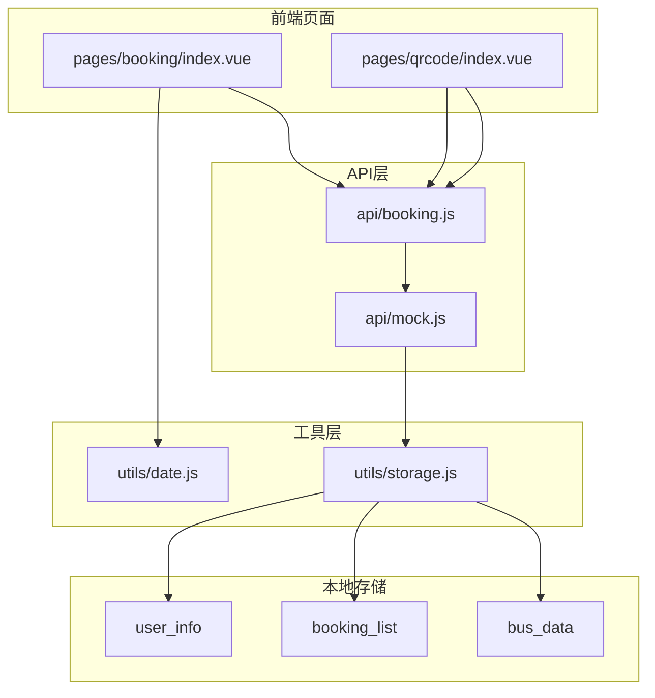
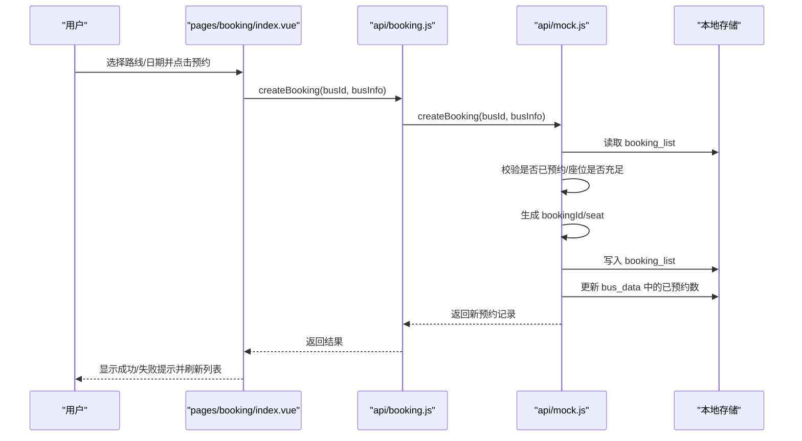
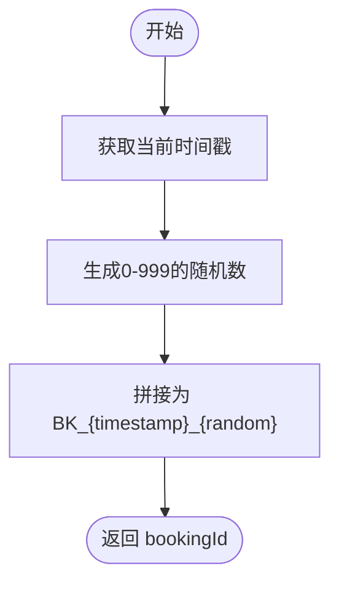
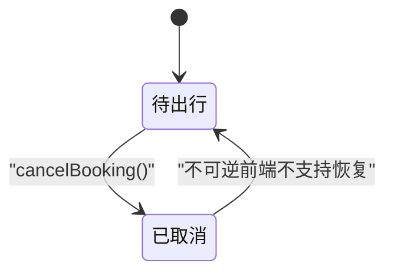
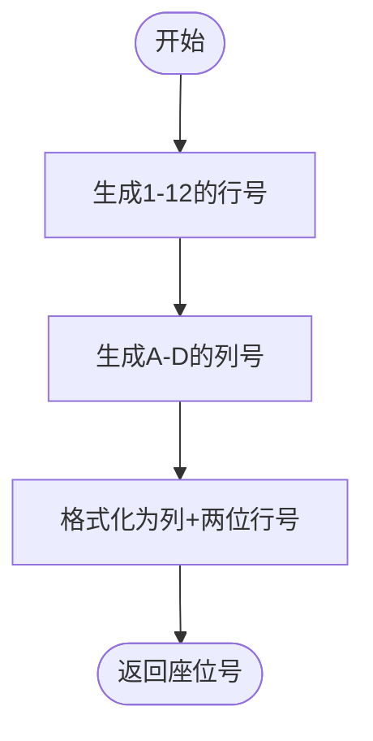
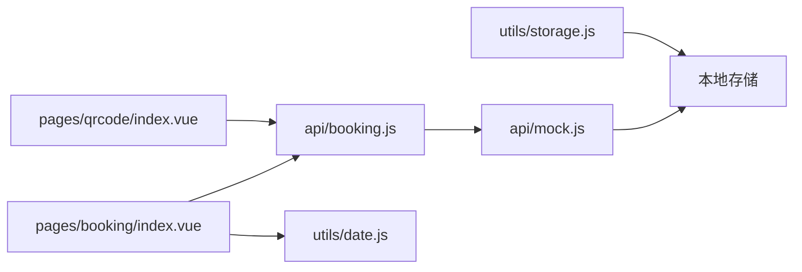

# 预约数据模型

<cite>
**本文档引用的文件**
- [api/booking.js](file://api/booking.js)
- [api/mock.js](file://api/mock.js)
- [pages/booking/index.vue](file://pages/booking/index.vue)
- [utils/date.js](file://utils/date.js)
- [utils/storage.js](file://utils/storage.js)
- [pages/qrcode/index.vue](file://pages/qrcode/index.vue)
- [PROJECT.md](file://PROJECT.md)
</cite>

## 目录
1. [引言](#引言)
2. [项目结构](#项目结构)
3. [核心组件](#核心组件)
4. [架构总览](#架构总览)
5. [详细组件分析](#详细组件分析)
6. [依赖分析](#依赖分析)
7. [性能考虑](#性能考虑)
8. [故障排除指南](#故障排除指南)
9. [结论](#结论)
10. [附录](#附录)

## 引言
本文件系统性梳理校园巴士调度系统中的“预约数据模型”，聚焦以下关键点：
- 预约实体的完整数据结构与业务字段
- 预约标识（bookingId）的生成算法与唯一性保障
- 预约状态（pending、cancelled）的生命周期与转换规则
- 座位分配机制：座位号生成规则与唯一性约束
- 预约时间戳的存储格式与时区处理
- 预约与车次、用户的关联关系与外键约束
- CRUD 操作示例与数据一致性保障机制

## 项目结构
系统采用 uni-app + Vue 3 架构，数据流通过 API 层（mock）与本地存储（uni.storage）实现，便于后期无缝对接后端服务。

图表来源
- [pages/booking/index.vue:114-135](file://pages/booking/index.vue#L114-L135)
- [pages/qrcode/index.vue:84-101](file://pages/qrcode/index.vue#L84-L101)
- [api/booking.js:8-165](file://api/booking.js#L8-L165)
- [api/mock.js:49-225](file://api/mock.js#L49-L225)
- [utils/storage.js:6-116](file://utils/storage.js#L6-L116)

章节来源
- [PROJECT.md:41-67](file://PROJECT.md#L41-L67)
- [PROJECT.md:113-141](file://PROJECT.md#L113-L141)

## 核心组件
- 预约 API 层：封装车次查询、预约创建、我的预约、取消预约、今日有效预约等接口，当前使用 mock 实现，预留后端接入。
- 预约业务逻辑：在 mock 中实现预约 ID 生成、座位号生成、状态管理、座位余量控制、本地存储更新。
- 页面交互：预约页面负责筛选路线与日期、展示车次与状态、发起预约；乘车码页面负责展示今日有效预约与二维码刷新。
- 工具函数：日期工具用于生成未来 N 天；本地存储工具封装读写。

章节来源
- [api/booking.js:8-165](file://api/booking.js#L8-L165)
- [api/mock.js:29-41](file://api/mock.js#L29-L41)
- [pages/booking/index.vue:124-296](file://pages/booking/index.vue#L124-L296)
- [pages/qrcode/index.vue:83-183](file://pages/qrcode/index.vue#L83-L183)
- [utils/date.js:10-33](file://utils/date.js#L10-L33)
- [utils/storage.js:6-116](file://utils/storage.js#L6-L116)

## 架构总览
预约数据模型在前端以本地存储为核心载体，通过 API 层统一对外暴露方法，便于后续替换为真实后端。

图表来源
- [pages/booking/index.vue:176-247](file://pages/booking/index.vue#L176-L247)
- [api/booking.js:47-73](file://api/booking.js#L47-L73)
- [api/mock.js:101-152](file://api/mock.js#L101-L152)

## 详细组件分析

### 预约实体数据结构
预约实体在 mock 中以对象形式存在，包含以下字段：
- id：预约标识（bookingId）
- busId：车次标识
- route：路线名称
- date：预约日期（YYYY-MM-DD）
- dateDisplay：展示用日期（可能包含星期）
- time：出发时间（HH:mm）
- location：候车地点
- seat：座位号（形如 A01、B12 等）
- status：预约状态（pending、cancelled）
- createdAt：创建时间戳（ISO 8601）

字段来源
- [api/mock.js:120-131](file://api/mock.js#L120-L131)

章节来源
- [api/mock.js:120-131](file://api/mock.js#L120-L131)

### 预约标识（bookingId）生成算法与唯一性保障
- 生成策略：由时间戳与随机数拼接组成，确保在单机环境下几乎不可能重复。
- 唯一性保障：由于使用毫秒级时间戳与有限范围的随机数，冲突概率极低；若需更强保障，可在后端引入分布式唯一 ID 生成器（如雪花算法）。

算法流程图

图表来源
- [api/mock.js:29-34](file://api/mock.js#L29-L34)

章节来源
- [api/mock.js:29-34](file://api/mock.js#L29-L34)

### 预约状态生命周期与转换规则
- 状态枚举：pending（待出行）、cancelled（已取消）、未在当前实现中使用的 completed（已完成）。
- 生命周期：
  - 创建：创建时初始状态为 pending。
  - 取消：调用取消接口后，状态变更为 cancelled，并恢复对应车次的座位计数。
- 状态转换图

图表来源
- [api/mock.js:186-187](file://api/mock.js#L186-L187)
- [pages/booking/index.vue:268-294](file://pages/booking/index.vue#L268-L294)

章节来源
- [api/mock.js:186-187](file://api/mock.js#L186-L187)
- [pages/booking/index.vue:268-294](file://pages/booking/index.vue#L268-L294)

### 座位分配机制与唯一性约束
- 座位号生成：列（A-D）+ 行（01-12），共 48 个座位组合。
- 唯一性约束：
  - 前端层面：座位号为随机生成，不保证全局唯一；同一车次同时间点不同用户可能获得相同座位号。
  - 一致性保障：当前实现通过本地存储维护 bus_data 的已预约数，避免超卖；但座位号本身不参与并发控制。
- 座位号生成流程图

图表来源
- [api/mock.js:36-41](file://api/mock.js#L36-L41)

章节来源
- [api/mock.js:36-41](file://api/mock.js#L36-L41)

### 预约时间戳存储格式与时区处理
- 存储格式：ISO 8601 字符串（new Date().toISOString()）。
- 时区处理：前端未做显式时区转换，使用设备本地时区；建议后端统一存储 UTC 并按客户端时区展示。
- 今日有效预约匹配：通过比较 date 字段与当前日期字符串，支持“年-月-日”或“月-日”片段匹配。

章节来源
- [api/mock.js:130](file://api/mock.js#L130)
- [api/mock.js:213-219](file://api/mock.js#L213-L219)

### 预约与车次、用户的关联关系与外键约束
- 与车次的关系：
  - busId 关联车次；车次列表通过 busId 生成规则（路线编码+日期编码+时间编码）构建。
  - 本地存储中 bus_data 以“路线_日期”为键，值为“出发时间->已预约数”的映射，用于座位余量计算与状态判断。
- 与用户的关联：
  - 预约记录不直接包含用户 ID；当前通过本地存储 user_info 标识认证状态。
  - 预约列表按创建时间倒序展示，仅显示状态为 pending 的记录。
- 外键约束：
  - 前端未实现数据库外键约束；通过业务逻辑（如唯一性检查、余量检查）保证一致性。

章节来源
- [api/mock.js:22-27](file://api/mock.js#L22-L27)
- [api/mock.js:138-147](file://api/mock.js#L138-L147)
- [pages/booking/index.vue:138-146](file://pages/booking/index.vue#L138-L146)

### CRUD 操作示例与数据一致性
- 创建预约（createBooking）
  - 输入：busId、busInfo（含路线、日期、时间、地点、剩余座位等）
  - 校验：是否存在同车次且状态为 pending 的预约；剩余座位是否大于 0
  - 生成：bookingId、seat
  - 更新：写入 booking_list；更新 bus_data 对应车次的已预约数
- 查询我的预约（getMyBookings）
  - 读取 booking_list，按 createdAt 倒序排序
- 取消预约（cancelBooking）
  - 将状态改为 cancelled，并回退 bus_data 中的已预约数
- 今日有效预约（getTodayValidBooking）
  - 从 booking_list 中查找状态为 pending 且日期为今天的预约

一致性保障机制
- 本地原子性：单次操作在 mock 内部顺序执行，避免部分更新。
- 余量控制：通过 bus_data 的整数计数防止超卖。
- 状态隔离：仅对 pending 状态的预约进行取消与座位回退。

章节来源
- [api/booking.js:47-163](file://api/booking.js#L47-L163)
- [api/mock.js:101-152](file://api/mock.js#L101-L152)
- [api/mock.js:176-203](file://api/mock.js#L176-L203)
- [api/mock.js:209-225](file://api/mock.js#L209-L225)

## 依赖分析
- 页面依赖 API 层：预约页面与乘车码页面均调用 booking API。
- API 层依赖 mock：当前实现位于 mock.js。
- mock 依赖本地存储：通过 uni.setStorage/getStorage 读写 user_info、booking_list、bus_data。
- 工具层依赖：日期工具用于生成未来 N 天；本地存储工具封装读写。

图表来源
- [pages/booking/index.vue:99-100](file://pages/booking/index.vue#L99-L100)
- [pages/qrcode/index.vue:61](file://pages/qrcode/index.vue#L61)
- [api/booking.js:6](file://api/booking.js#L6)
- [api/mock.js:54-57](file://api/mock.js#L54-L57)
- [utils/storage.js:6-116](file://utils/storage.js#L6-L116)

章节来源
- [pages/booking/index.vue:99-100](file://pages/booking/index.vue#L99-L100)
- [pages/qrcode/index.vue:61](file://pages/qrcode/index.vue#L61)
- [api/booking.js:6](file://api/booking.js#L6)
- [api/mock.js:54-57](file://api/mock.js#L54-L57)
- [utils/storage.js:6-116](file://utils/storage.js#L6-L116)

## 性能考虑
- 前端渲染：车次列表与我的预约列表均在页面内一次性渲染，数据量较小时性能良好。
- 本地存储：使用 uni.setStorage/getStorage，读写为同步阻塞，建议避免频繁写入；当前实现已通过批量更新减少写入次数。
- 网络模拟：mock 中使用 setTimeout 模拟网络延迟，实际后端应优化响应时间与缓存策略。
- 二维码刷新：乘车码页面每 30 秒刷新一次，避免频繁重绘；建议在页面隐藏时暂停定时器。

## 故障排除指南
- 预约失败：检查是否已存在同车次的 pending 预约、座位是否已满；查看控制台错误信息。
- 无法取消：确认 bookingId 是否正确、是否已过期或非 pending 状态。
- 今日有效预约为空：确认当天是否存在 pending 状态的预约，且日期格式匹配。
- 本地存储异常：清除本地存储后重试；检查浏览器/小程序沙盒权限。

章节来源
- [api/mock.js:104-117](file://api/mock.js#L104-L117)
- [api/mock.js:179-200](file://api/mock.js#L179-L200)
- [api/mock.js:215-219](file://api/mock.js#L215-L219)
- [PROJECT.md:194-197](file://PROJECT.md#L194-L197)

## 结论
本系统在前端实现了完整的预约数据模型与业务流程，通过本地存储与 mock API 提供了良好的开发体验与扩展性。预约标识、座位号、状态管理与时间戳均具备清晰的实现策略；座位唯一性在当前前端实现中通过随机生成与余量控制达成基本一致。建议后续在后端引入分布式唯一 ID、座位号唯一性约束与统一时区处理，进一步提升系统可靠性与可维护性。

## 附录
- 本地存储键名
  - user_info：用户身份信息
  - booking_list：预约记录列表
  - bus_data：车次预约数据（结构见“与车次的关系”）
- 后端接入建议
  - 替换 api/booking.js 中的 mock 调用为真实后端 API
  - 添加鉴权头（Authorization）与错误处理
  - 统一时间戳存储为 UTC，前端按用户时区展示

章节来源
- [PROJECT.md:138-141](file://PROJECT.md#L138-L141)
- [PROJECT.md:150-174](file://PROJECT.md#L150-L174)