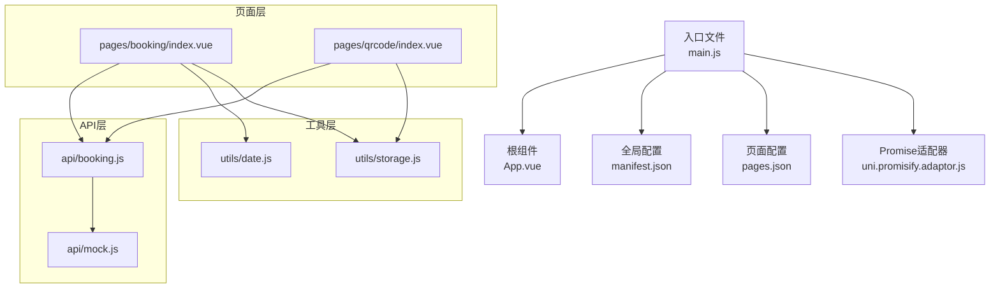
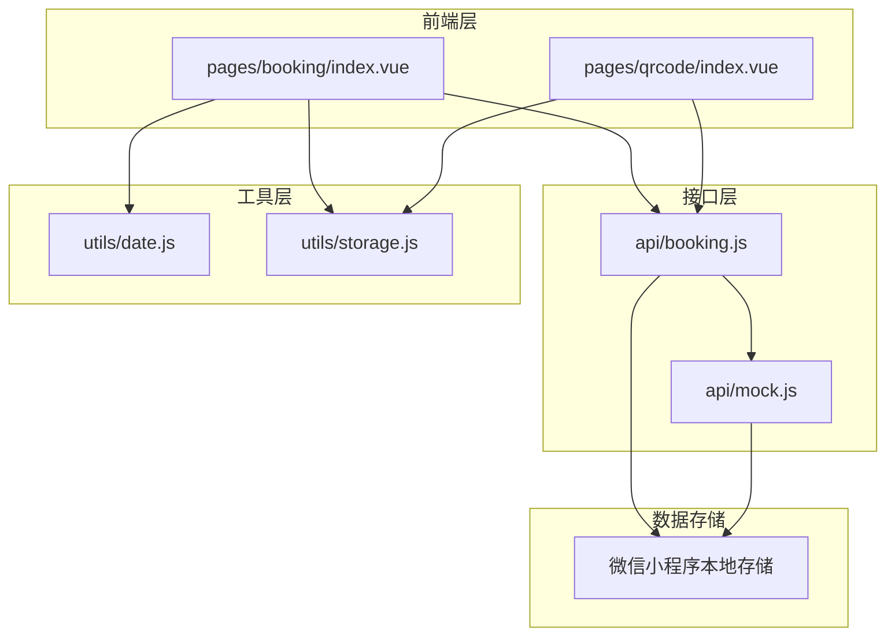
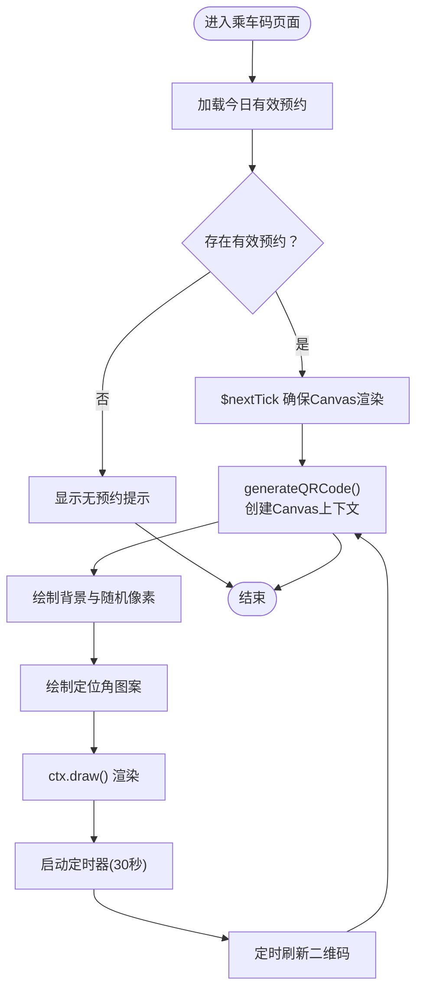
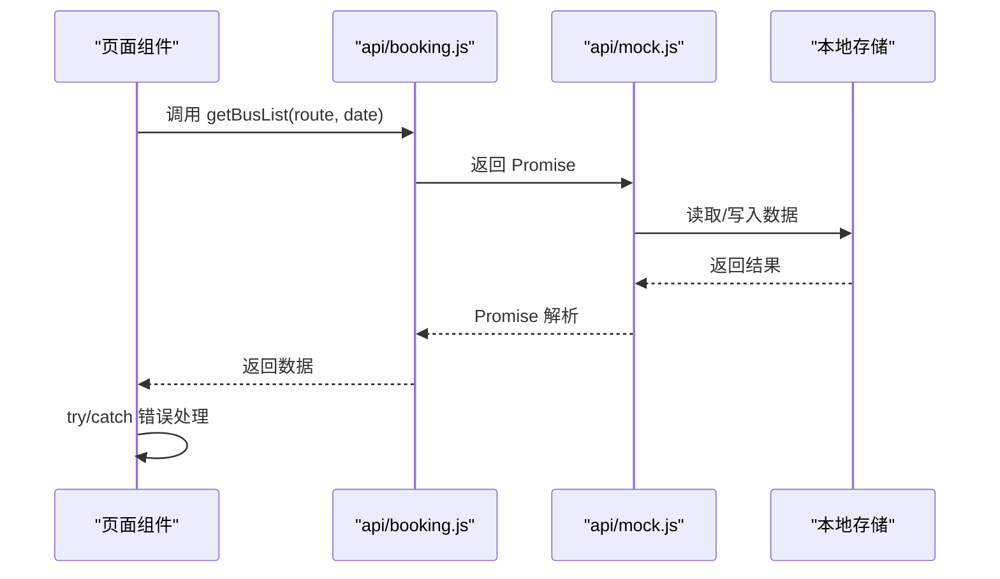
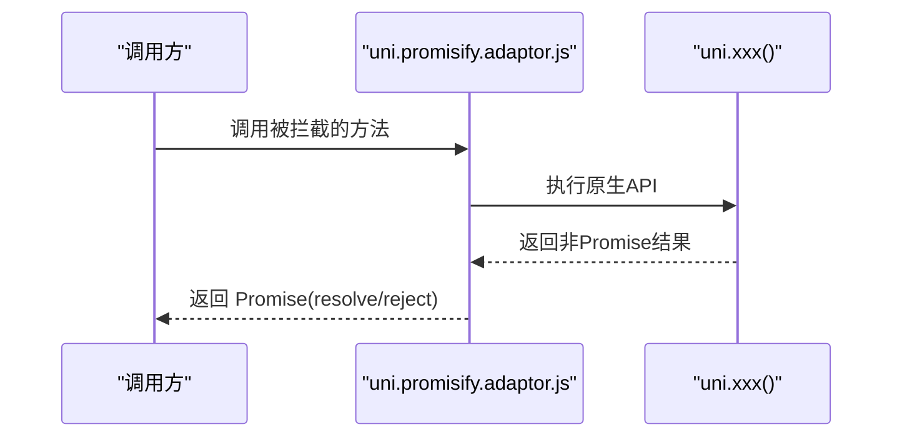
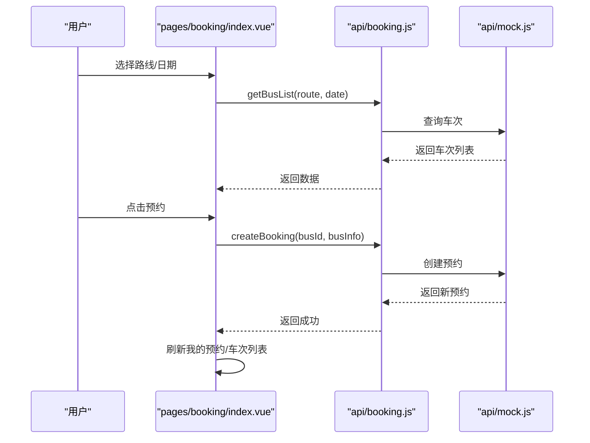
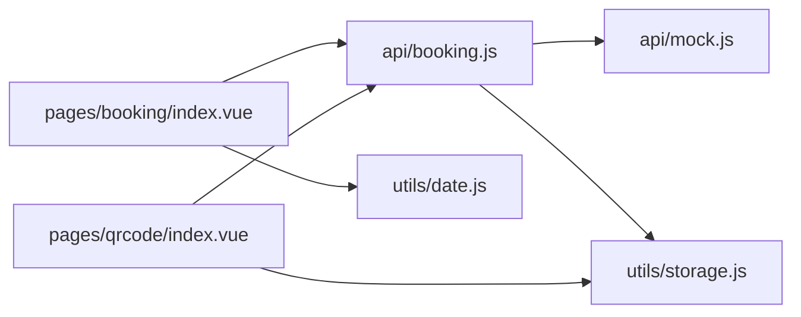

# 技术栈选型

<cite>
**本文引用的文件**
- [main.js](file://main.js)
- [App.vue](file://App.vue)
- [pages.json](file://pages.json)
- [manifest.json](file://manifest.json)
- [uni.promisify.adaptor.js](file://uni.promisify.adaptor.js)
- [pages/booking/index.vue](file://pages/booking/index.vue)
- [pages/qrcode/index.vue](file://pages/qrcode/index.vue)
- [api/booking.js](file://api/booking.js)
- [api/mock.js](file://api/mock.js)
- [utils/date.js](file://utils/date.js)
- [utils/storage.js](file://utils/storage.js)
- [PROJECT.md](file://PROJECT.md)
</cite>

## 目录
1. [引言](#引言)
2. [项目结构](#项目结构)
3. [核心组件](#核心组件)
4. [架构总览](#架构总览)
5. [详细组件分析](#详细组件分析)
6. [依赖关系分析](#依赖关系分析)
7. [性能考量](#性能考量)
8. [故障排查指南](#故障排查指南)
9. [结论](#结论)
10. [附录](#附录)

## 引言
本技术栈选型文档围绕“学校校车调度系统”展开，聚焦于UniApp框架、Vue.js MVVM模型、uni-ui组件库（在manifest与pages.json中体现）、Canvas API在二维码生成中的应用、Promise异步处理机制以及适配器模式在API层的设计。通过对项目源码的深入分析，阐明技术选型的依据、优势与约束，并给出版本兼容性与升级路径建议，帮助读者全面理解该系统的实现思路与扩展方向。

## 项目结构
项目采用典型的uni-app多端统一开发结构，页面按功能模块划分，API与工具函数分层组织，入口与全局配置集中管理，便于跨平台部署与维护。

图表来源
- [main.js:1-22](file://main.js#L1-L22)
- [App.vue:1-32](file://App.vue#L1-L32)
- [pages.json:1-62](file://pages.json#L1-L62)
- [manifest.json:1-73](file://manifest.json#L1-L73)
- [uni.promisify.adaptor.js:1-13](file://uni.promisify.adaptor.js#L1-L13)
- [pages/booking/index.vue:1-575](file://pages/booking/index.vue#L1-L575)
- [pages/qrcode/index.vue:1-342](file://pages/qrcode/index.vue#L1-L342)
- [api/booking.js:1-165](file://api/booking.js#L1-L165)
- [api/mock.js:1-226](file://api/mock.js#L1-L226)
- [utils/date.js:1-84](file://utils/date.js#L1-L84)
- [utils/storage.js:1-116](file://utils/storage.js#L1-L116)

章节来源
- [PROJECT.md:41-67](file://PROJECT.md#L41-L67)
- [pages.json:1-62](file://pages.json#L1-L62)
- [manifest.json:1-73](file://manifest.json#L1-L73)

## 核心组件
- UniApp框架：统一多端开发，支持微信小程序、App等平台；manifest中明确声明Vue版本为3，入口文件同时兼容Vue2/Vue3构建。
- Vue.js MVVM：页面组件以MVVM模式组织，数据驱动视图更新，生命周期钩子负责初始化与刷新。
- uni-ui组件库：manifest与pages.json中启用usingComponents，页面配置中使用picker、scroll-view等组件，体现uni-ui生态的使用。
- Canvas API：乘车码页面通过Canvas绘制二维码，结合定时刷新实现动态二维码。
- Promise异步处理：API层与工具层广泛使用Promise封装异步操作，提升可读性与可维护性。
- 适配器模式：API层通过适配器将uni原生API返回值转换为Promise，统一异步风格。

章节来源
- [main.js:14-22](file://main.js#L14-L22)
- [manifest.json:71](file://manifest.json#L71)
- [pages.json:28-59](file://pages.json#L28-L59)
- [pages/qrcode/index.vue:8-141](file://pages/qrcode/index.vue#L8-L141)
- [api/booking.js:14-163](file://api/booking.js#L14-L163)
- [utils/storage.js:10-114](file://utils/storage.js#L10-L114)
- [uni.promisify.adaptor.js:1-13](file://uni.promisify.adaptor.js#L1-L13)

## 架构总览
系统采用“页面组件 → API层 → 本地存储”的数据流设计，API层当前使用mock数据，预留后端对接接口，便于平滑迁移。

图表来源
- [pages/booking/index.vue:99-296](file://pages/booking/index.vue#L99-L296)
- [pages/qrcode/index.vue:61-183](file://pages/qrcode/index.vue#L61-L183)
- [api/booking.js:6-164](file://api/booking.js#L6-L164)
- [api/mock.js:49-225](file://api/mock.js#L49-L225)
- [utils/date.js:10-84](file://utils/date.js#L10-L84)
- [utils/storage.js:6-115](file://utils/storage.js#L6-L115)

## 详细组件分析

### UniApp框架与跨平台特性
- 入口文件同时兼容Vue2/Vue3构建，manifest中声明Vue版本为3，确保现代开发体验与生态兼容。
- manifest配置包含各平台特性开关与权限声明，体现跨平台部署能力。
- pages.json集中管理页面路由、导航栏与TabBar，保证多端一致的用户体验。

章节来源
- [main.js:3-22](file://main.js#L3-L22)
- [manifest.json:1-73](file://manifest.json#L1-L73)
- [pages.json:1-62](file://pages.json#L1-L62)

### Vue.js MVVM框架选择理由
- 数据驱动视图：页面组件通过data与methods管理状态，模板中直接绑定数据，降低DOM操作复杂度。
- 生命周期钩子：onLoad/onShow等钩子用于初始化与刷新，确保页面切换时数据一致性。
- 组件化开发：页面按功能拆分，利于团队协作与代码复用。

章节来源
- [pages/booking/index.vue:102-122](file://pages/booking/index.vue#L102-L122)
- [pages/booking/index.vue:124-296](file://pages/booking/index.vue#L124-L296)
- [pages/qrcode/index.vue:63-81](file://pages/qrcode/index.vue#L63-L81)
- [pages/qrcode/index.vue:83-183](file://pages/qrcode/index.vue#L83-L183)

### uni-ui组件库的应用价值
- picker与scroll-view：在预约页面中用于路线与日期筛选、滚动展示，提升交互效率。
- usingComponents启用：manifest与pages.json中开启组件化支持，便于引入第三方组件库。
- TabBar与图标：pages.json中配置TabBar与图标路径，统一底部导航体验。

章节来源
- [pages/booking/index.vue:30-51](file://pages/booking/index.vue#L30-L51)
- [pages.json:34-59](file://pages.json#L34-L59)
- [manifest.json:10](file://manifest.json#L10)
- [manifest.json:52-67](file://manifest.json#L52-L67)

### Canvas API在二维码生成中的作用
- Canvas绘制：乘车码页面通过Canvas绘制简易二维码，包含背景填充、随机像素点与定位角图案。
- 定时刷新：每30秒自动刷新二维码，增强安全性与时效性。
- 示例与建议：项目注释建议集成专业二维码库（如uQRCode），以获得更稳定的生成质量。

图表来源
- [pages/qrcode/index.vue:84-183](file://pages/qrcode/index.vue#L84-L183)
- [pages/qrcode/index.vue:104-141](file://pages/qrcode/index.vue#L104-L141)
- [pages/qrcode/index.vue:164-175](file://pages/qrcode/index.vue#L164-L175)

章节来源
- [pages/qrcode/index.vue:8-141](file://pages/qrcode/index.vue#L8-L141)
- [pages/qrcode/index.vue:164-175](file://pages/qrcode/index.vue#L164-L175)
- [PROJECT.md:107-112](file://PROJECT.md#L107-L112)

### Promise异步处理机制
- API层封装：booking.js对mock.js的调用均返回Promise，便于async/await使用。
- 工具层封装：storage.js将本地存储操作封装为Promise，统一异步风格。
- 错误处理：页面组件中使用try/catch与uni.showToast进行错误提示，提升用户体验。

图表来源
- [api/booking.js:14-40](file://api/booking.js#L14-L40)
- [api/mock.js:49-93](file://api/mock.js#L49-L93)
- [utils/storage.js:10-37](file://utils/storage.js#L10-L37)

章节来源
- [api/booking.js:14-163](file://api/booking.js#L14-L163)
- [api/mock.js:49-225](file://api/mock.js#L49-L225)
- [utils/storage.js:6-115](file://utils/storage.js#L6-L115)
- [pages/booking/index.vue:138-162](file://pages/booking/index.vue#L138-L162)

### 适配器模式的应用
- 适配器职责：uni.promisify.adaptor.js将uni原生API返回值转换为标准Promise，统一回调风格。
- 适用场景：当底层API返回值结构不一致时，通过适配器屏蔽差异，简化上层调用。

图表来源
- [uni.promisify.adaptor.js:1-13](file://uni.promisify.adaptor.js#L1-L13)

章节来源
- [uni.promisify.adaptor.js:1-13](file://uni.promisify.adaptor.js#L1-L13)

### 页面与业务流程
- 车辆预约页面：支持路线与日期筛选、车次列表展示、预约与取消流程，集成身份认证检查。
- 乘车码页面：根据今日有效预约生成动态二维码，定时刷新并展示预约信息与使用说明。

图表来源
- [pages/booking/index.vue:124-247](file://pages/booking/index.vue#L124-L247)
- [api/booking.js:14-73](file://api/booking.js#L14-L73)
- [api/mock.js:49-152](file://api/mock.js#L49-L152)

章节来源
- [pages/booking/index.vue:124-247](file://pages/booking/index.vue#L124-L247)
- [api/booking.js:14-73](file://api/booking.js#L14-L73)
- [api/mock.js:49-152](file://api/mock.js#L49-L152)

## 依赖关系分析
- 组件依赖：页面组件依赖API层与工具层；API层依赖mock数据与本地存储。
- 平台依赖：manifest与pages.json配置平台特性与页面路由，影响最终产物形态。
- 异步依赖：Promise封装贯穿API与工具层，统一异步风格，降低耦合。

图表来源
- [pages/booking/index.vue:99-296](file://pages/booking/index.vue#L99-L296)
- [pages/qrcode/index.vue:61-183](file://pages/qrcode/index.vue#L61-L183)
- [api/booking.js:6-164](file://api/booking.js#L6-L164)
- [api/mock.js:49-225](file://api/mock.js#L49-L225)
- [utils/date.js:10-84](file://utils/date.js#L10-L84)
- [utils/storage.js:6-115](file://utils/storage.js#L6-L115)

章节来源
- [pages/booking/index.vue:99-296](file://pages/booking/index.vue#L99-L296)
- [pages/qrcode/index.vue:61-183](file://pages/qrcode/index.vue#L61-L183)
- [api/booking.js:6-164](file://api/booking.js#L6-L164)
- [api/mock.js:49-225](file://api/mock.js#L49-L225)
- [utils/date.js:10-84](file://utils/date.js#L10-L84)
- [utils/storage.js:6-115](file://utils/storage.js#L6-L115)

## 性能考量
- 异步优化：通过Promise封装减少回调嵌套，提升可维护性；合理使用$nextTick确保Canvas渲染时机。
- 数据缓存：本地存储用于缓存车次与预约数据，减少重复请求；注意清理策略避免数据膨胀。
- UI渲染：使用scroll-view与sticky布局提升滚动性能；避免频繁重绘与大尺寸图片。
- 平台差异：不同平台对Canvas与网络请求的性能表现存在差异，建议在目标平台进行专项测试。

## 故障排查指南
- 页面配置错误：检查pages.json路径与TabBar配置，确保页面文件存在且路径正确。
- TabBar图标缺失：确认static/icons目录下存在对应PNG图标，尺寸建议81x81px。
- 预约功能异常：检查身份认证状态与本地存储；清除本地存储后重试。
- 二维码不显示：当前为示例实现，建议集成专业二维码库；检查Canvas组件渲染与定时刷新逻辑。

章节来源
- [PROJECT.md:185-202](file://PROJECT.md#L185-L202)
- [pages/qrcode/index.vue:104-141](file://pages/qrcode/index.vue#L104-L141)

## 结论
本项目以UniApp为核心，结合Vue.js MVVM模型与uni-ui组件库，实现了跨平台的校车预约与乘车码功能。通过Promise封装与适配器模式，统一了异步调用风格，提升了可维护性。Canvas API用于动态二维码生成，配合定时刷新保障安全与时效。整体架构清晰、扩展性强，具备良好的升级路径与迁移后端的能力。

## 附录

### 版本兼容性与升级路径建议
- Vue版本：manifest中声明Vue 3，入口文件同时兼容Vue2/Vue3构建，建议逐步迁移至Vue 3生态。
- 平台配置：manifest中针对不同平台（App-plus、mp-weixin等）设置组件化与权限，升级时需同步调整。
- API迁移：API层预留后端对接接口，建议按模块逐步替换mock实现，保持组件层不变。
- UI组件：继续使用uni-ui组件库，关注平台差异与新版本特性，适时升级以获得更好的兼容性。

章节来源
- [main.js:14-22](file://main.js#L14-L22)
- [manifest.json:71](file://manifest.json#L71)
- [manifest.json:9-48](file://manifest.json#L9-L48)
- [api/booking.js:18-72](file://api/booking.js#L18-L72)