# 整体架构概览

<cite>
**本文档引用的文件**
- [App.vue](file://App.vue)
- [main.js](file://main.js)
- [pages.json](file://pages.json)
- [PROJECT.md](file://PROJECT.md)
- [api/booking.js](file://api/booking.js)
- [api/user.js](file://api/user.js)
- [api/mock.js](file://api/mock.js)
- [utils/storage.js](file://utils/storage.js)
- [utils/date.js](file://utils/date.js)
- [pages/booking/index.vue](file://pages/booking/index.vue)
- [pages/auth/index.vue](file://pages/auth/index.vue)
- [pages/profile/index.vue](file://pages/profile/index.vue)
- [pages/qrcode/index.vue](file://pages/qrcode/index.vue)
</cite>

## 目录
1. [项目概述](#项目概述)
2. [技术架构总览](#技术架构总览)
3. [分层设计理念](#分层设计理念)
4. [MVVM架构实现](#mvvm架构实现)
5. [组件化开发模式](#组件化开发模式)
6. [系统边界与数据流](#系统边界与数据流)
7. [核心组件分析](#核心组件分析)
8. [架构优势与最佳实践](#架构优势与最佳实践)
9. [总结](#总结)

## 项目概述

学校校车调度系统是一个基于uni-app框架开发的跨平台应用，专门为湖北大学师生提供便捷的校车查询、预约、乘车管理服务。该系统采用Vue.js作为核心框架，支持微信小程序等多平台部署，实现了统一的代码管理和跨平台兼容性。

### 核心功能模块

系统包含四大核心功能模块：
- **车辆预约模块**：提供车次查询、预约管理、座位选择等功能
- **乘车码模块**：生成动态二维码、展示乘车信息、支持自动刷新
- **个人中心模块**：用户认证、个人信息管理、历史记录查询
- **身份认证模块**：用户身份验证、信息录入、权限管理

## 技术架构总览

### 跨平台架构模式

系统采用uni-app的跨平台架构模式，通过一套代码实现多平台部署：

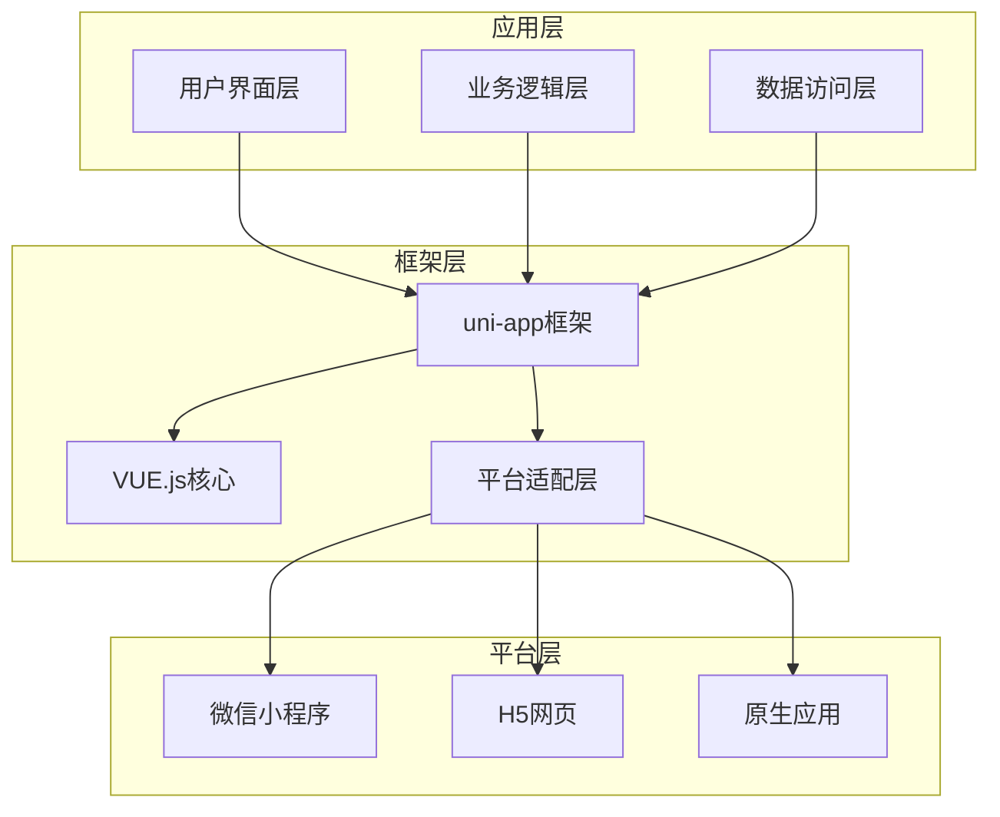

**图表来源**
- [main.js:1-22](file://main.js#L1-L22)
- [App.vue:1-32](file://App.vue#L1-L32)

### 技术栈架构

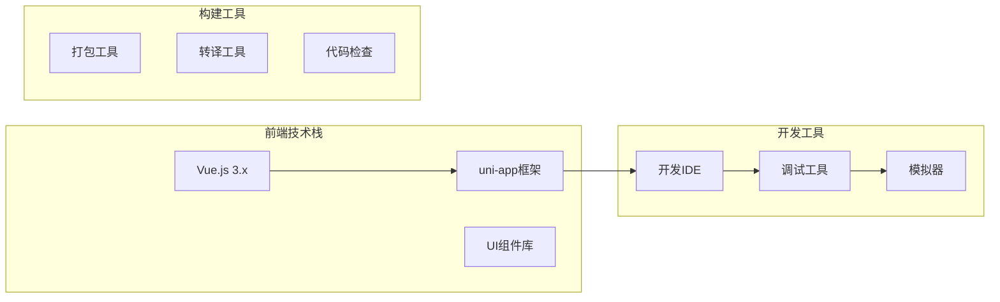

**图表来源**
- [PROJECT.md:6-11](file://PROJECT.md#L6-L11)

## 分层设计理念

### 三层架构设计

系统采用经典的三层架构模式，明确划分各层职责：

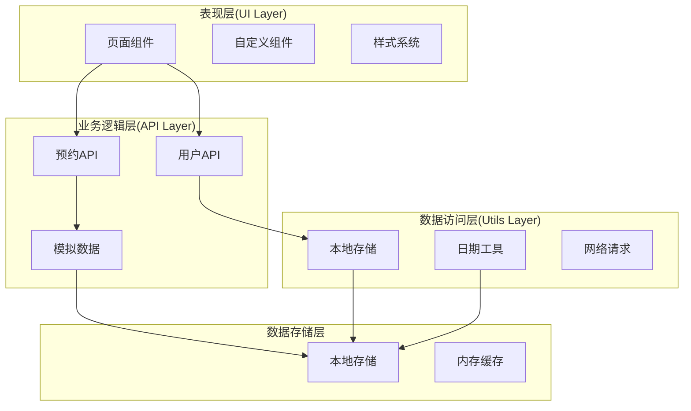

**图表来源**
- [pages.json:1-62](file://pages.json#L1-L62)
- [api/booking.js:1-165](file://api/booking.js#L1-L165)
- [api/user.js:1-128](file://api/user.js#L1-L128)

### 层间职责划分

**UI层（页面组件）**
- 负责用户界面展示和用户交互
- 管理组件状态和生命周期
- 处理用户输入和事件响应

**业务逻辑层（API接口）**
- 封装业务规则和流程控制
- 提供统一的数据访问接口
- 实现业务验证和数据转换

**数据访问层（工具函数）**
- 封装底层数据操作
- 提供数据持久化能力
- 实现数据格式化和处理

## MVVM架构实现

### Vue.js MVVM模式

系统基于Vue.js的MVVM（Model-View-ViewModel）架构模式：

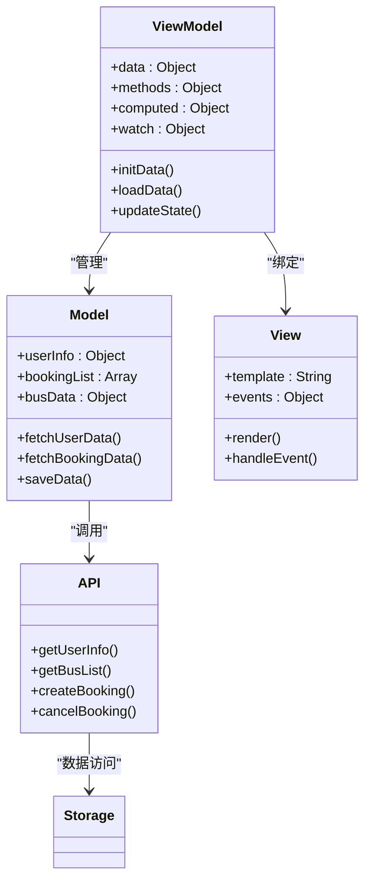

**图表来源**
- [pages/booking/index.vue:98-298](file://pages/booking/index.vue#L98-L298)
- [pages/auth/index.vue:99-190](file://pages/auth/index.vue#L99-L190)

### 数据绑定机制

系统通过Vue的响应式数据绑定实现MVVM模式：

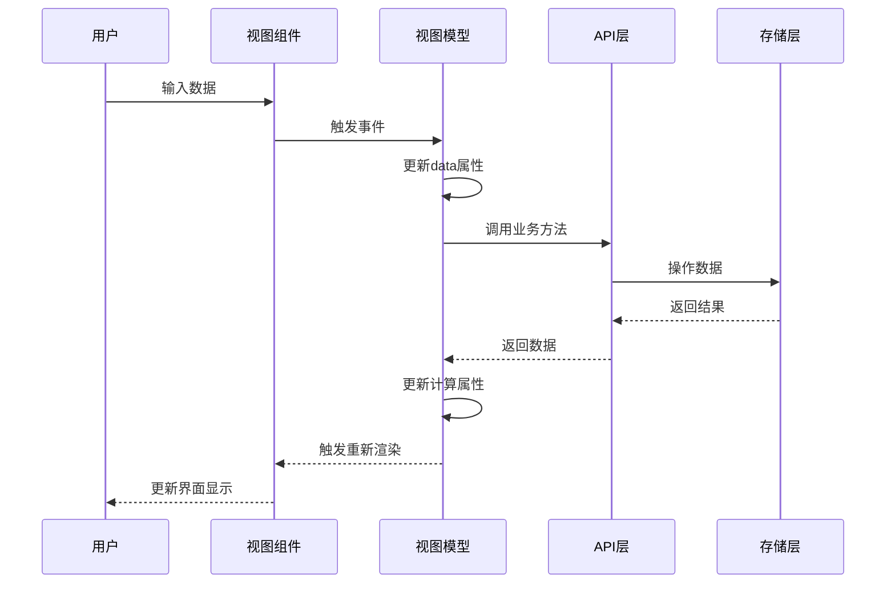

**图表来源**
- [pages/booking/index.vue:124-296](file://pages/booking/index.vue#L124-L296)
- [api/booking.js:14-163](file://api/booking.js#L14-L163)

## 组件化开发模式

### 页面组件组织结构

系统采用组件化开发模式，将页面拆分为多个可复用的组件：

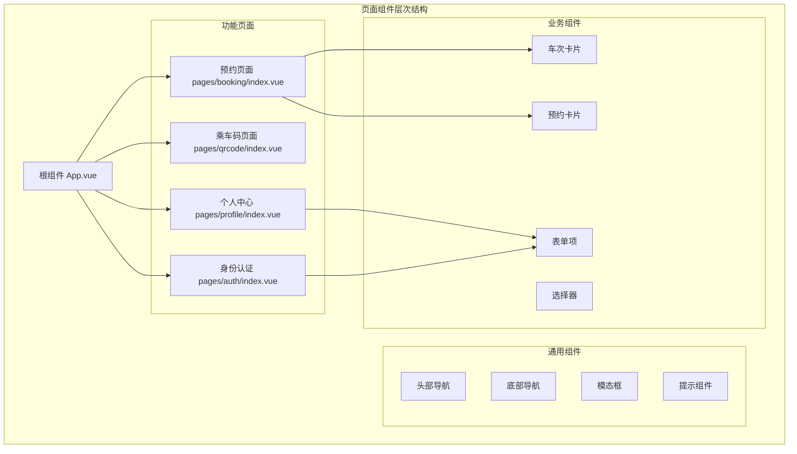

**图表来源**
- [pages.json:2-27](file://pages.json#L2-L27)
- [pages/booking/index.vue:1-96](file://pages/booking/index.vue#L1-L96)

### 组件复用机制

系统通过以下机制实现组件复用：

1. **Props传递**：通过props参数传递数据和配置
2. **事件通信**：通过$emit触发自定义事件
3. **插槽系统**：支持内容分发和模板定制
4. **混入机制**：共享通用逻辑和方法

### 组件生命周期管理

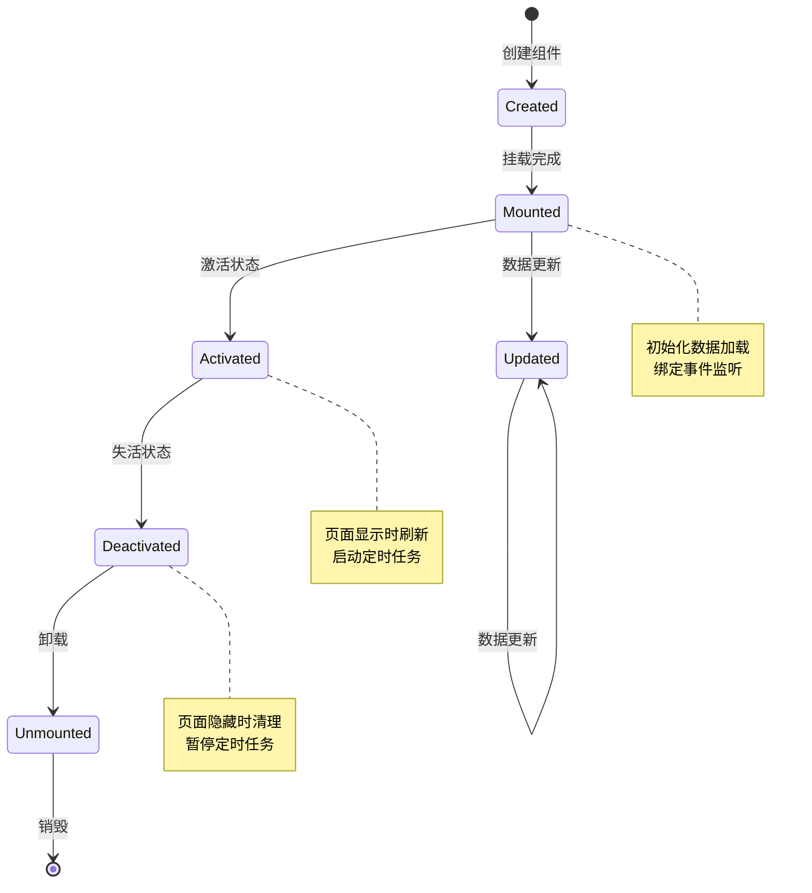

**图表来源**
- [pages/booking/index.vue:114-122](file://pages/booking/index.vue#L114-L122)
- [pages/qrcode/index.vue:72-81](file://pages/qrcode/index.vue#L72-L81)

## 系统边界与数据流

### 系统边界图

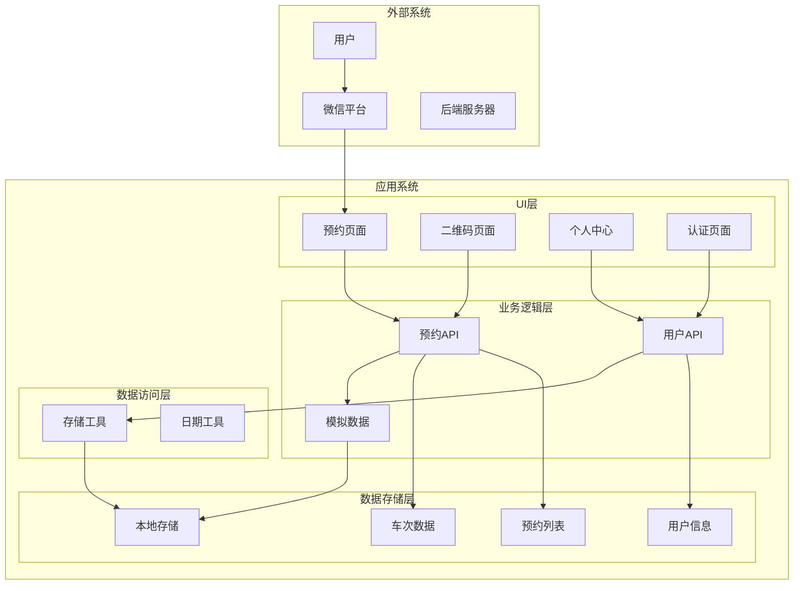

**图表来源**
- [pages.json:34-59](file://pages.json#L34-L59)
- [api/mock.js:49-225](file://api/mock.js#L49-L225)

### 数据流向分析

系统采用单向数据流设计，确保数据的一致性和可预测性：

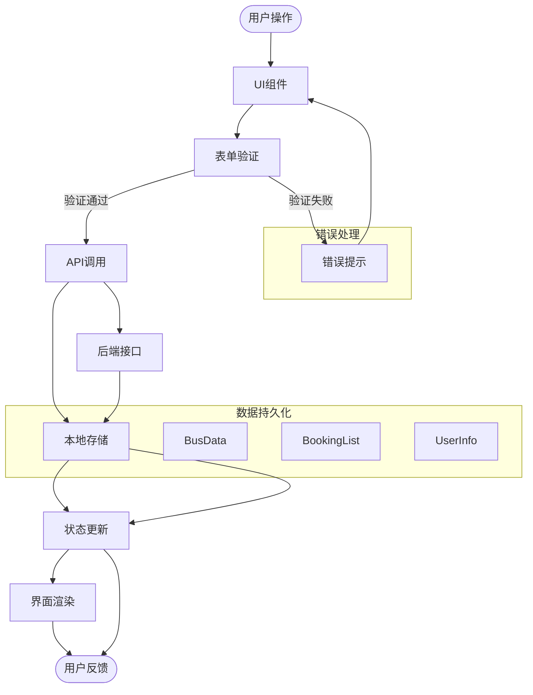

**图表来源**
- [pages/booking/index.vue:176-247](file://pages/booking/index.vue#L176-L247)
- [api/booking.js:47-133](file://api/booking.js#L47-L133)

## 核心组件分析

### 预约页面组件

预约页面是系统的核心功能组件，实现了完整的预约流程：

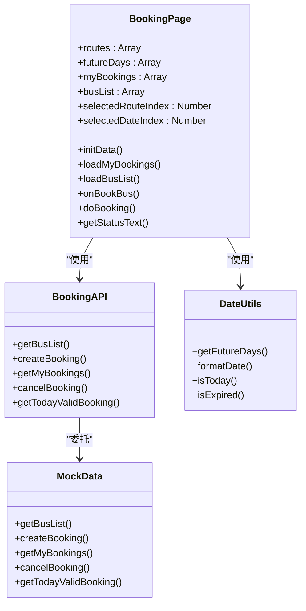

**图表来源**
- [pages/booking/index.vue:98-298](file://pages/booking/index.vue#L98-L298)
- [api/booking.js:8-164](file://api/booking.js#L8-L164)
- [utils/date.js:10-84](file://utils/date.js#L10-L84)

### 认证页面组件

身份认证页面实现了用户身份验证功能：

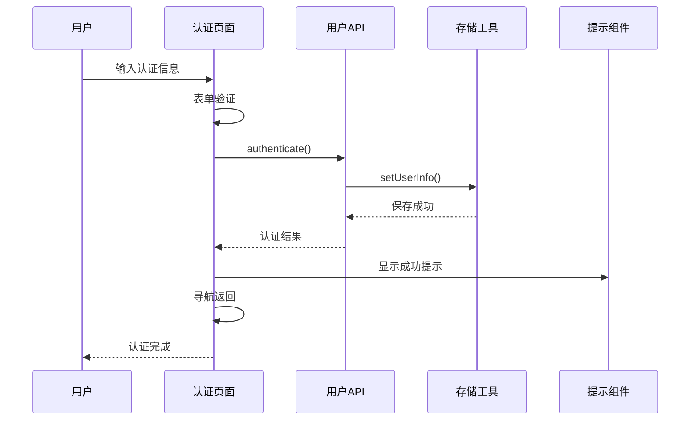

**图表来源**
- [pages/auth/index.vue:154-187](file://pages/auth/index.vue#L154-L187)
- [api/user.js:72-101](file://api/user.js#L72-L101)

### 二维码页面组件

乘车码页面实现了动态二维码生成功能：

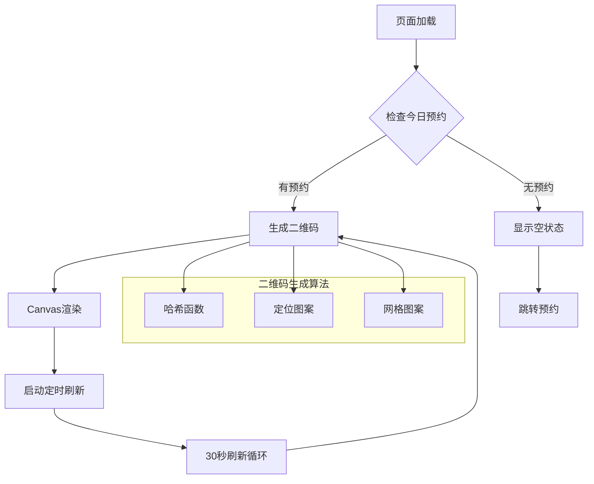

**图表来源**
- [pages/qrcode/index.vue:84-183](file://pages/qrcode/index.vue#L84-L183)

## 架构优势与最佳实践

### 跨平台优势

1. **代码复用率高**：一套代码支持多平台部署
2. **开发效率提升**：统一的开发体验和工具链
3. **维护成本降低**：集中管理，减少重复工作
4. **用户体验一致**：保持平台特性的统一性

### 分层架构优势

1. **职责分离清晰**：各层职责明确，便于维护
2. **可测试性强**：每层都可以独立测试
3. **可扩展性好**：易于添加新功能和修改现有功能
4. **可移植性强**：底层实现可以灵活替换

### MVVM模式优势

1. **数据驱动界面**：自动更新界面，减少手动DOM操作
2. **双向数据绑定**：简化表单处理和数据同步
3. **组件化开发**：提高代码复用和可维护性
4. **响应式更新**：智能追踪数据变化，精确更新界面

### 最佳实践建议

1. **API层抽象**：保持API接口稳定，便于后期替换
2. **状态管理**：合理组织组件状态，避免状态污染
3. **错误处理**：完善的错误处理和用户提示机制
4. **性能优化**：合理的数据缓存和懒加载策略
5. **代码规范**：统一的代码风格和命名约定

## 总结

学校校车调度系统采用先进的uni-app跨平台架构，结合MVVM设计模式，实现了高度模块化的组件化开发。系统通过清晰的分层设计、严格的职责划分和优雅的MVVM实现，为用户提供了一致、流畅的使用体验。

### 主要成就

- **架构设计合理**：三层架构清晰，职责分离明确
- **技术选型恰当**：uni-app + Vue.js组合适合项目需求
- **组件化程度高**：页面组件可复用，维护成本低
- **扩展性强**：预留后端接口，便于后续功能扩展

### 发展方向

1. **后端集成**：完成Python后端服务的对接
2. **功能完善**：增加更多业务功能和用户交互
3. **性能优化**：提升应用性能和用户体验
4. **安全增强**：加强数据安全和用户隐私保护

该系统为类似校园服务应用提供了良好的技术参考和实施范例，具有较高的实用价值和推广意义。