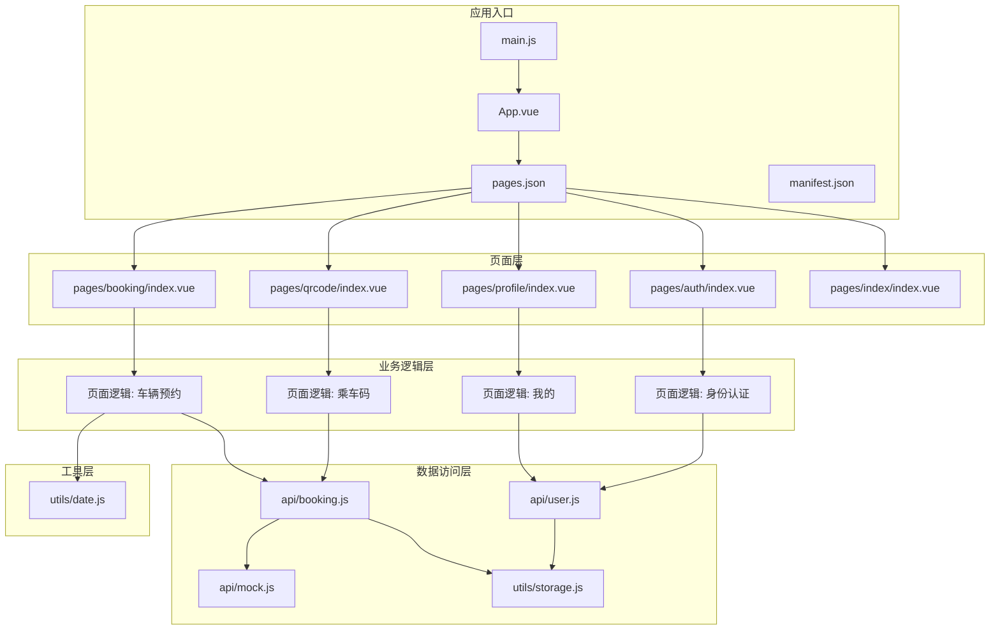
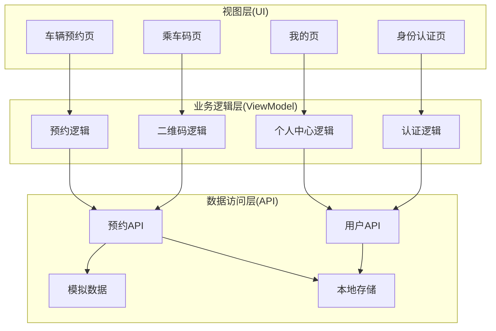
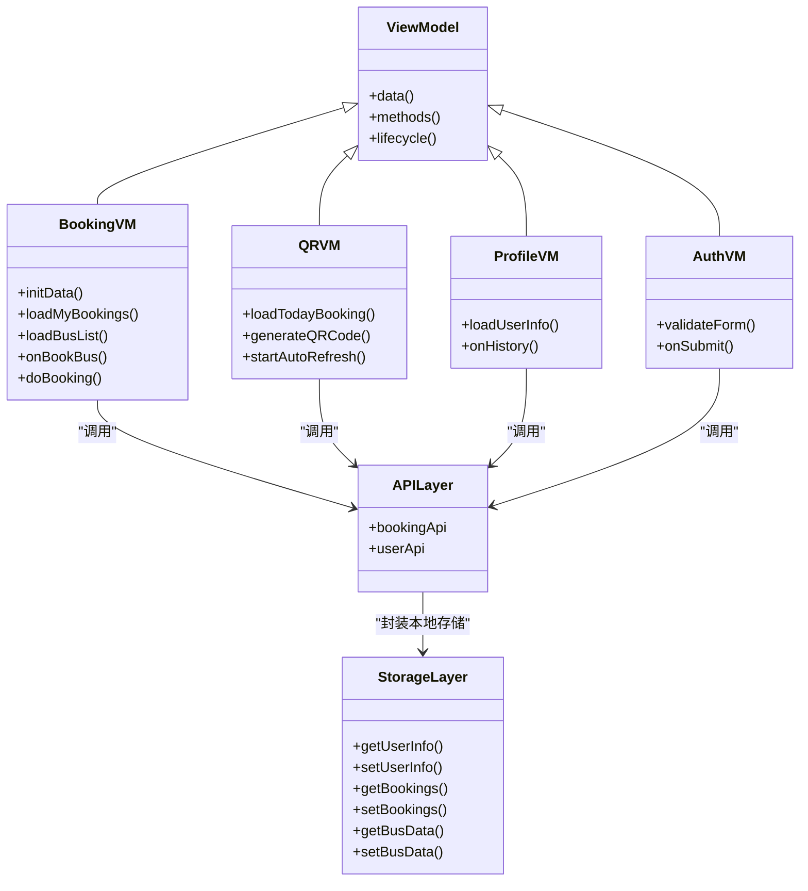
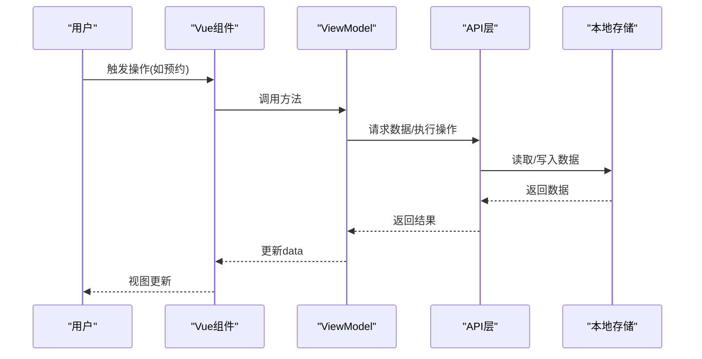
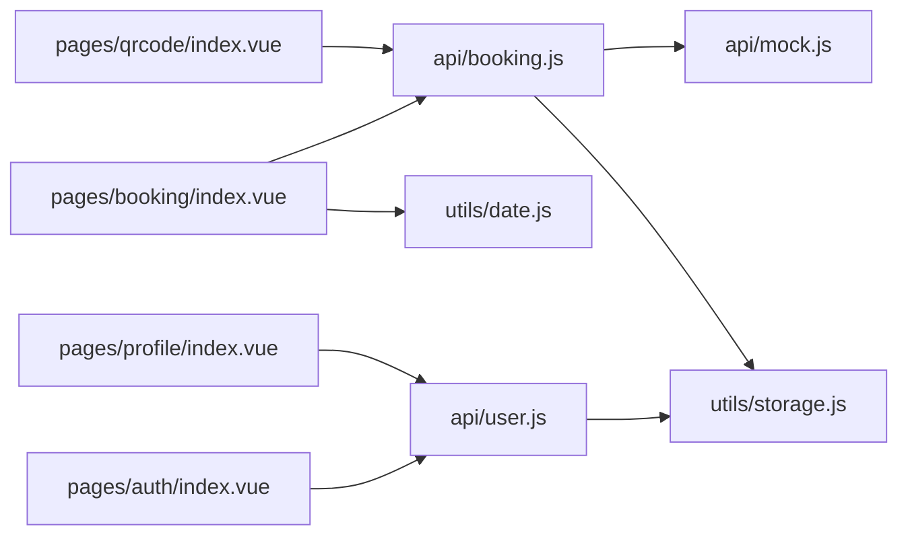
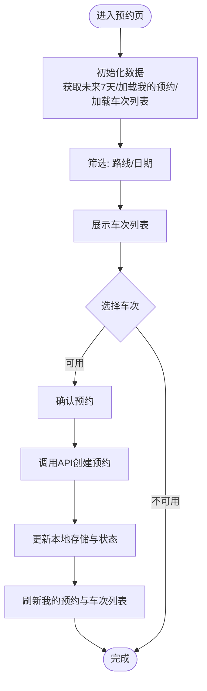
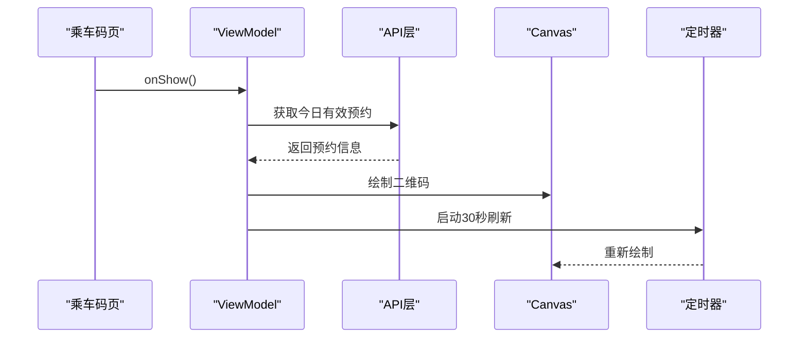
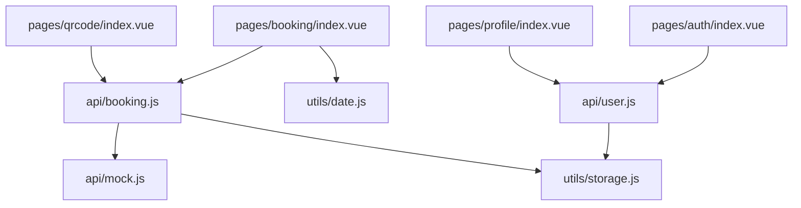
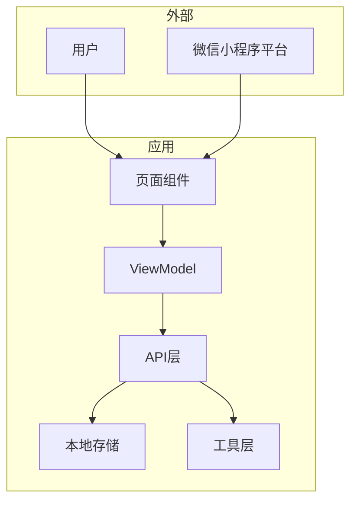

# 系统架构设计

<cite>
**本文引用的文件**
- [App.vue](file://App.vue)
- [main.js](file://main.js)
- [pages.json](file://pages.json)
- [PROJECT.md](file://PROJECT.md)
- [manifest.json](file://manifest.json)
- [api/booking.js](file://api/booking.js)
- [api/user.js](file://api/user.js)
- [api/mock.js](file://api/mock.js)
- [utils/storage.js](file://utils/storage.js)
- [utils/date.js](file://utils/date.js)
- [pages/booking/index.vue](file://pages/booking/index.vue)
- [pages/auth/index.vue](file://pages/auth/index.vue)
- [pages/qrcode/index.vue](file://pages/qrcode/index.vue)
- [pages/profile/index.vue](file://pages/profile/index.vue)
- [pages/index/index.vue](file://pages/index/index.vue)
</cite>

## 目录
1. [引言](#引言)
2. [项目结构](#项目结构)
3. [核心组件](#核心组件)
4. [架构总览](#架构总览)
5. [详细组件分析](#详细组件分析)
6. [依赖分析](#依赖分析)
7. [性能考虑](#性能考虑)
8. [故障排查指南](#故障排查指南)
9. [结论](#结论)
10. [附录](#附录)

## 引言
本系统为基于 uni-app 的跨平台小程序应用，服务于湖北大学师生的校车预约与乘车管理。系统采用 MVVM 架构（Model-View-ViewModel），以 Vue.js 为核心，结合 uni-app 的多端编译能力，实现一套代码适配微信小程序等平台。系统遵循分层设计：UI 层负责视图与交互；业务逻辑层封装页面级业务；数据访问层统一抽象 API 与本地存储；工具层提供日期与存储等通用能力。

## 项目结构
项目采用按功能域划分的目录组织方式，页面按功能模块拆分，API 与工具分别集中管理，便于扩展与维护。

**图表来源**
- [main.js:1-22](file://main.js#L1-L22)
- [App.vue:1-32](file://App.vue#L1-L32)
- [pages.json:1-62](file://pages.json#L1-L62)
- [manifest.json:1-73](file://manifest.json#L1-L73)
- [pages/booking/index.vue:1-575](file://pages/booking/index.vue#L1-L575)
- [pages/qrcode/index.vue:1-342](file://pages/qrcode/index.vue#L1-L342)
- [pages/profile/index.vue:1-595](file://pages/profile/index.vue#L1-L595)
- [pages/auth/index.vue:1-385](file://pages/auth/index.vue#L1-L385)
- [api/booking.js:1-165](file://api/booking.js#L1-L165)
- [api/user.js:1-128](file://api/user.js#L1-L128)
- [api/mock.js:1-226](file://api/mock.js#L1-L226)
- [utils/storage.js:1-116](file://utils/storage.js#L1-L116)
- [utils/date.js:1-84](file://utils/date.js#L1-L84)

**章节来源**
- [PROJECT.md:41-67](file://PROJECT.md#L41-L67)
- [pages.json:1-62](file://pages.json#L1-L62)

## 核心组件
- 应用入口与生命周期
  - 入口文件负责根据 Vue 版本条件编译创建应用实例，并挂载根组件。
  - 根组件负责全局样式与应用生命周期钩子。
- 页面配置与导航
  - 页面注册与 tabBar 配置集中在 pages.json，声明导航标题、样式与 tab 列表。
  - manifest.json 提供平台特定配置与权限声明。
- 页面组件
  - 车辆预约页：展示我的预约与车次列表，支持路线与日期筛选、预约与取消。
  - 乘车码页：展示今日有效预约并生成动态二维码，定时刷新。
  - 我的页：展示身份信息、功能入口与历史记录，提供弹窗交互。
  - 身份认证页：表单校验与本地存储认证信息。
- API 层与工具层
  - API 层对 mock 与本地存储进行抽象，便于后续接入真实后端。
  - 工具层提供日期格式化、本地存储封装与简单校验。

**章节来源**
- [main.js:1-22](file://main.js#L1-L22)
- [App.vue:1-32](file://App.vue#L1-L32)
- [pages.json:1-62](file://pages.json#L1-L62)
- [manifest.json:1-73](file://manifest.json#L1-L73)
- [pages/booking/index.vue:1-575](file://pages/booking/index.vue#L1-L575)
- [pages/qrcode/index.vue:1-342](file://pages/qrcode/index.vue#L1-L342)
- [pages/profile/index.vue:1-595](file://pages/profile/index.vue#L1-L595)
- [pages/auth/index.vue:1-385](file://pages/auth/index.vue#L1-L385)
- [api/booking.js:1-165](file://api/booking.js#L1-L165)
- [api/user.js:1-128](file://api/user.js#L1-L128)
- [api/mock.js:1-226](file://api/mock.js#L1-L226)
- [utils/date.js:1-84](file://utils/date.js#L1-L84)
- [utils/storage.js:1-116](file://utils/storage.js#L1-L116)

## 架构总览
系统采用 MVVM 分层与组件化设计，数据从 API 层流向 UI 层，状态通过组件内部 data 与本地存储协同管理。API 层通过 mock 与本地存储实现数据持久化，预留真实后端接入点。

**图表来源**
- [pages/booking/index.vue:1-575](file://pages/booking/index.vue#L1-L575)
- [pages/qrcode/index.vue:1-342](file://pages/qrcode/index.vue#L1-L342)
- [pages/profile/index.vue:1-595](file://pages/profile/index.vue#L1-L595)
- [pages/auth/index.vue:1-385](file://pages/auth/index.vue#L1-L385)
- [api/booking.js:1-165](file://api/booking.js#L1-L165)
- [api/user.js:1-128](file://api/user.js#L1-L128)
- [api/mock.js:1-226](file://api/mock.js#L1-L226)
- [utils/storage.js:1-116](file://utils/storage.js#L1-L116)

## 详细组件分析

### MVVM 架构在 Vue.js 中的应用
- Model（模型）
  - 本地存储封装：统一读写 user_info、booking_list、bus_data。
  - 模拟数据：提供车次、预约、取消等完整流程的数据支撑。
- View（视图）
  - 页面模板负责结构与展示，绑定事件与状态。
- ViewModel（视图模型）
  - 组件 methods 与生命周期处理业务逻辑，调用 API 层并更新 data。

**图表来源**
- [pages/booking/index.vue:98-297](file://pages/booking/index.vue#L98-L297)
- [pages/qrcode/index.vue:60-184](file://pages/qrcode/index.vue#L60-L184)
- [pages/profile/index.vue:152-248](file://pages/profile/index.vue#L152-L248)
- [pages/auth/index.vue:99-189](file://pages/auth/index.vue#L99-L189)
- [api/booking.js:8-164](file://api/booking.js#L8-L164)
- [api/user.js:8-127](file://api/user.js#L8-L127)
- [utils/storage.js:6-115](file://utils/storage.js#L6-L115)

**章节来源**
- [pages/booking/index.vue:98-297](file://pages/booking/index.vue#L98-L297)
- [pages/qrcode/index.vue:60-184](file://pages/qrcode/index.vue#L60-L184)
- [pages/profile/index.vue:152-248](file://pages/profile/index.vue#L152-L248)
- [pages/auth/index.vue:99-189](file://pages/auth/index.vue#L99-L189)
- [utils/storage.js:6-115](file://utils/storage.js#L6-L115)

### 数据流与状态管理
- 数据流
  - 用户操作触发组件方法，组件调用 API 层（当前为 mock 与本地存储），更新本地状态与存储，驱动视图刷新。
- 状态管理
  - 组件内部 data 管理 UI 状态；本地存储承载用户与业务数据；API 层提供统一接口，便于替换为真实后端。

**图表来源**
- [pages/booking/index.vue:176-247](file://pages/booking/index.vue#L176-L247)
- [api/booking.js:14-163](file://api/booking.js#L14-L163)
- [api/mock.js:49-151](file://api/mock.js#L49-L151)
- [utils/storage.js:10-114](file://utils/storage.js#L10-L114)

**章节来源**
- [PROJECT.md:115-134](file://PROJECT.md#L115-L134)
- [pages/booking/index.vue:176-247](file://pages/booking/index.vue#L176-L247)
- [api/booking.js:14-163](file://api/booking.js#L14-L163)
- [api/mock.js:49-151](file://api/mock.js#L49-L151)
- [utils/storage.js:10-114](file://utils/storage.js#L10-L114)

### 组件化开发与模块化组织
- 组件化
  - 页面组件独立封装模板、样式与逻辑，通过 props 与事件解耦。
- 模块化
  - API 层与工具层模块化，便于替换与扩展；页面间通过路由跳转协作。

**图表来源**
- [pages/booking/index.vue:99-100](file://pages/booking/index.vue#L99-L100)
- [pages/qrcode/index.vue:61](file://pages/qrcode/index.vue#L61)
- [pages/profile/index.vue:153-154](file://pages/profile/index.vue#L153-L154)
- [pages/auth/index.vue:100](file://pages/auth/index.vue#L100)
- [api/booking.js:6](file://api/booking.js#L6)
- [api/user.js:6](file://api/user.js#L6)
- [api/mock.js:1-4](file://api/mock.js#L1-L4)
- [utils/storage.js:1-4](file://utils/storage.js#L1-L4)
- [utils/date.js:1-4](file://utils/date.js#L1-L4)

**章节来源**
- [pages/booking/index.vue:98-297](file://pages/booking/index.vue#L98-L297)
- [pages/qrcode/index.vue:60-184](file://pages/qrcode/index.vue#L60-L184)
- [pages/profile/index.vue:152-248](file://pages/profile/index.vue#L152-L248)
- [pages/auth/index.vue:99-189](file://pages/auth/index.vue#L99-L189)
- [api/booking.js:1-165](file://api/booking.js#L1-L165)
- [api/user.js:1-128](file://api/user.js#L1-L128)
- [api/mock.js:1-226](file://api/mock.js#L1-L226)
- [utils/date.js:1-84](file://utils/date.js#L1-L84)
- [utils/storage.js:1-116](file://utils/storage.js#L1-L116)

### 关键流程分析

#### 车辆预约流程

**图表来源**
- [pages/booking/index.vue:124-174](file://pages/booking/index.vue#L124-L174)
- [pages/booking/index.vue:176-247](file://pages/booking/index.vue#L176-L247)
- [api/booking.js:47-73](file://api/booking.js#L47-L73)
- [api/mock.js:101-151](file://api/mock.js#L101-L151)
- [utils/date.js:10-33](file://utils/date.js#L10-L33)

**章节来源**
- [pages/booking/index.vue:124-247](file://pages/booking/index.vue#L124-L247)
- [api/booking.js:47-73](file://api/booking.js#L47-L73)
- [api/mock.js:101-151](file://api/mock.js#L101-L151)
- [utils/date.js:10-33](file://utils/date.js#L10-L33)

#### 乘车码生成与刷新

**图表来源**
- [pages/qrcode/index.vue:72-101](file://pages/qrcode/index.vue#L72-L101)
- [pages/qrcode/index.vue:103-175](file://pages/qrcode/index.vue#L103-L175)
- [api/booking.js:139-163](file://api/booking.js#L139-L163)
- [api/mock.js:209-225](file://api/mock.js#L209-L225)

**章节来源**
- [pages/qrcode/index.vue:72-184](file://pages/qrcode/index.vue#L72-L184)
- [api/booking.js:139-163](file://api/booking.js#L139-L163)
- [api/mock.js:209-225](file://api/mock.js#L209-L225)

## 依赖分析
- 组件耦合
  - 页面组件依赖 API 层；API 层依赖工具层与本地存储；工具层相互独立。
- 外部依赖
  - uni-app 运行时与平台 API（如本地存储、Canvas）。
- 可能的循环依赖
  - 当前结构清晰，API 层与工具层为单向依赖，未发现循环。

**图表来源**
- [pages/booking/index.vue:99-100](file://pages/booking/index.vue#L99-L100)
- [pages/qrcode/index.vue:61](file://pages/qrcode/index.vue#L61)
- [pages/profile/index.vue:153-154](file://pages/profile/index.vue#L153-L154)
- [pages/auth/index.vue:100](file://pages/auth/index.vue#L100)
- [api/booking.js:6](file://api/booking.js#L6)
- [api/user.js:6](file://api/user.js#L6)
- [api/mock.js:1-4](file://api/mock.js#L1-L4)
- [utils/storage.js:1-4](file://utils/storage.js#L1-L4)
- [utils/date.js:1-4](file://utils/date.js#L1-L4)

**章节来源**
- [pages/booking/index.vue:98-297](file://pages/booking/index.vue#L98-L297)
- [pages/qrcode/index.vue:60-184](file://pages/qrcode/index.vue#L60-L184)
- [pages/profile/index.vue:152-248](file://pages/profile/index.vue#L152-L248)
- [pages/auth/index.vue:99-189](file://pages/auth/index.vue#L99-L189)
- [api/booking.js:1-165](file://api/booking.js#L1-L165)
- [api/user.js:1-128](file://api/user.js#L1-L128)
- [api/mock.js:1-226](file://api/mock.js#L1-L226)
- [utils/date.js:1-84](file://utils/date.js#L1-L84)
- [utils/storage.js:1-116](file://utils/storage.js#L1-L116)

## 性能考虑
- 网络与渲染
  - 当前使用模拟数据与本地存储，减少网络请求开销；Canvas 绘制二维码时注意尺寸与刷新频率。
- 状态更新
  - 合理使用组件局部状态与本地存储，避免不必要的全量刷新。
- 代码分割与懒加载
  - 页面级路由已按模块拆分，利于按需加载与缓存。

[本节为通用指导，无需列出具体文件来源]

## 故障排查指南
- 页面配置错误
  - 检查 pages.json 路径与页面文件是否存在。
- TabBar 图标缺失
  - 确认 static/icons 下存在对应 PNG 图标且尺寸合适。
- 预约功能异常
  - 确认已完成身份认证；检查本地存储 user_info；必要时清理存储后重试。
- 二维码不显示
  - 当前为简易 canvas 示例，建议集成专业二维码库；检查 canvas 渲染与定时刷新。

**章节来源**
- [PROJECT.md:185-201](file://PROJECT.md#L185-L201)

## 结论
本系统以 uni-app 为基础，采用 MVVM 分层与组件化设计，通过 API 层与工具层的模块化组织，实现了清晰的职责划分与良好的扩展性。当前以 mock 与本地存储支撑完整业务闭环，预留真实后端接入路径，具备平滑迁移能力。建议后续引入真实后端、完善认证与错误处理、优化渲染性能与用户体验。

[本节为总结性内容，无需列出具体文件来源]

## 附录

### 系统边界图

**图表来源**
- [pages/booking/index.vue:1-575](file://pages/booking/index.vue#L1-L575)
- [pages/qrcode/index.vue:1-342](file://pages/qrcode/index.vue#L1-L342)
- [pages/profile/index.vue:1-595](file://pages/profile/index.vue#L1-L595)
- [pages/auth/index.vue:1-385](file://pages/auth/index.vue#L1-L385)
- [api/booking.js:1-165](file://api/booking.js#L1-L165)
- [api/user.js:1-128](file://api/user.js#L1-L128)
- [api/mock.js:1-226](file://api/mock.js#L1-L226)
- [utils/storage.js:1-116](file://utils/storage.js#L1-L116)
- [utils/date.js:1-84](file://utils/date.js#L1-L84)

### 技术选型说明
- 框架与平台
  - uni-app：一套代码多端编译，覆盖小程序、Web 等平台。
  - Vue 3：响应式数据与组合式 API，提升开发体验。
- UI 方案
  - 自定义组件与原生样式，保证一致性与可控性。
- 数据存储
  - 本地存储：满足当前需求；预留后端接入点，便于迁移。

**章节来源**
- [PROJECT.md:6-11](file://PROJECT.md#L6-L11)
- [manifest.json:71](file://manifest.json#L71)