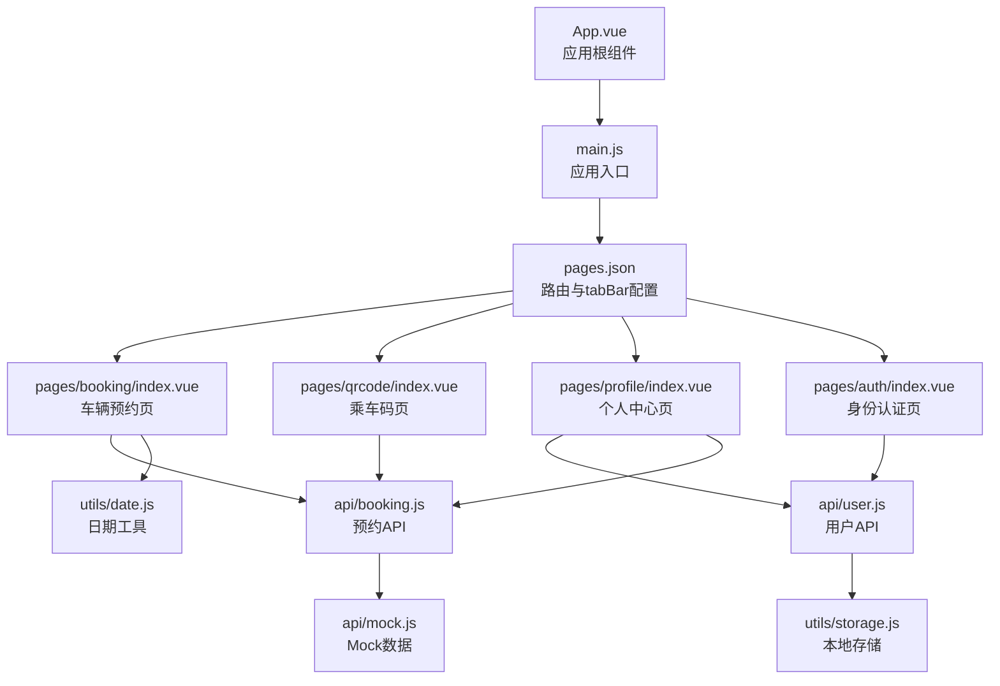
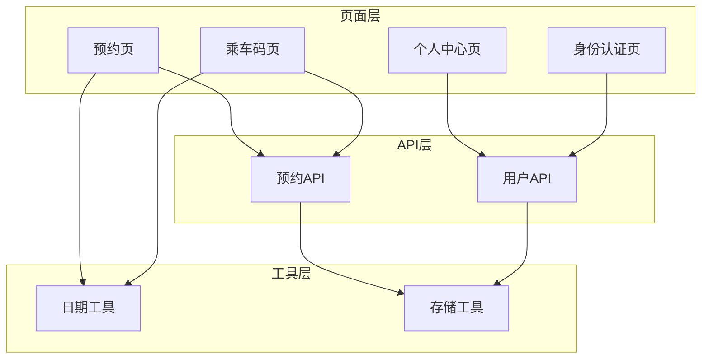
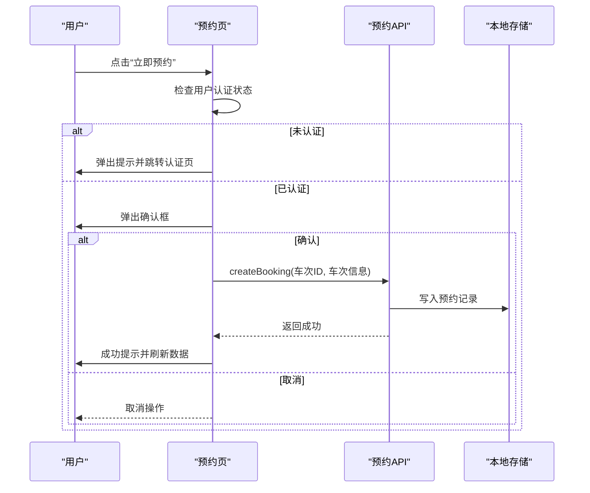
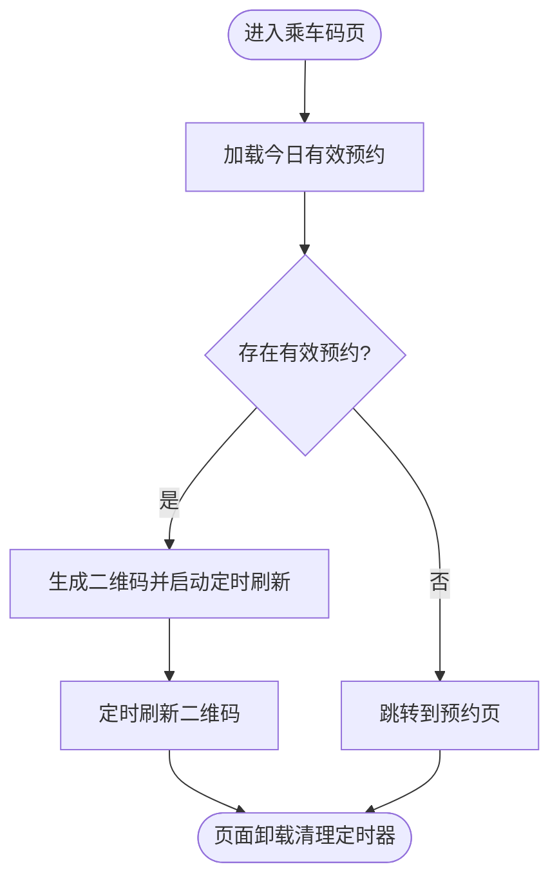
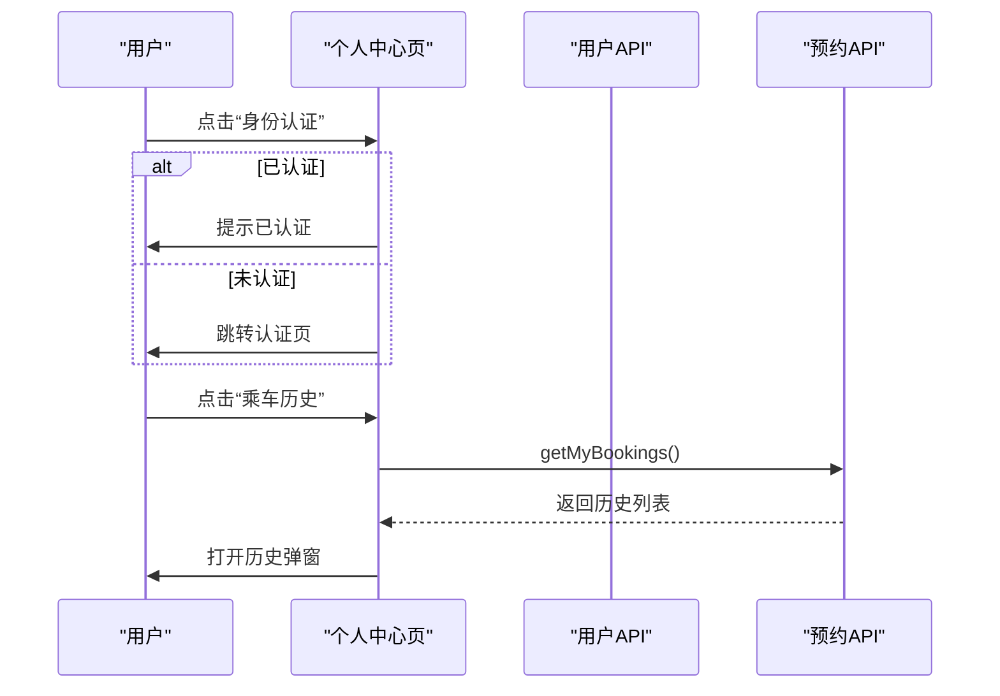
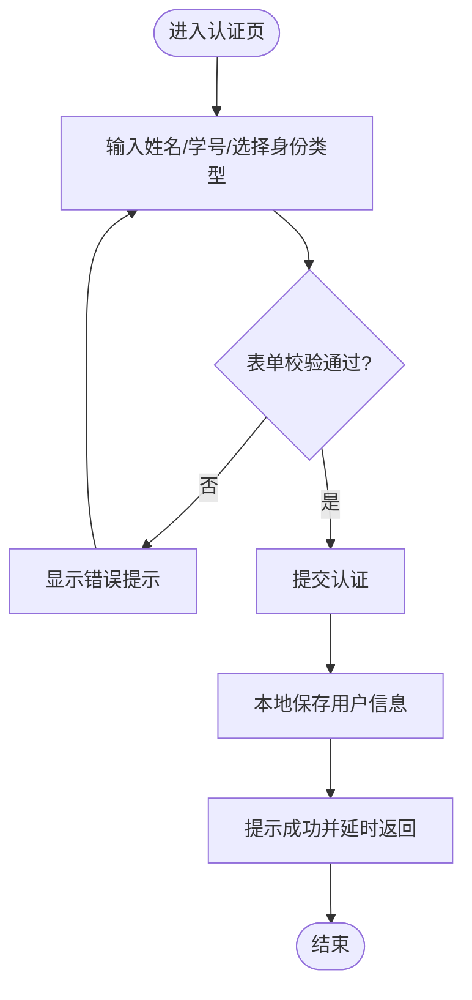
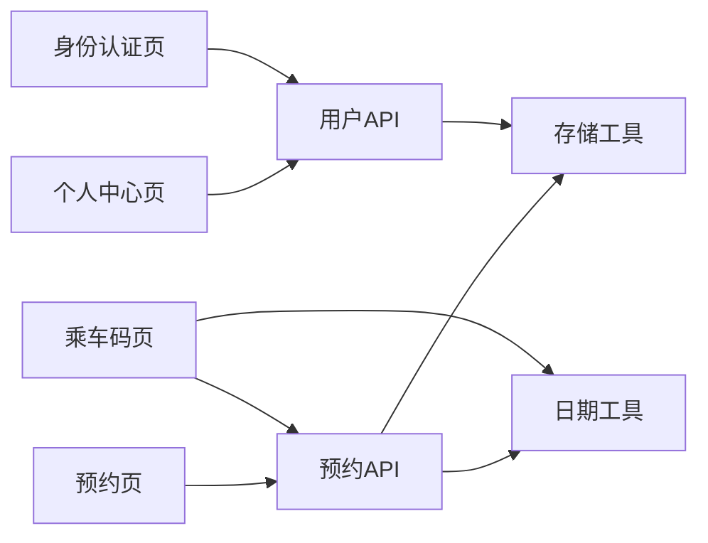

# 组件交互关系

<cite>
**本文引用的文件**
- [App.vue](file://App.vue)
- [main.js](file://main.js)
- [pages.json](file://pages.json)
- [pages/index/index.vue](file://pages/index/index.vue)
- [pages/booking/index.vue](file://pages/booking/index.vue)
- [pages/profile/index.vue](file://pages/profile/index.vue)
- [pages/qrcode/index.vue](file://pages/qrcode/index.vue)
- [pages/auth/index.vue](file://pages/auth/index.vue)
- [api/booking.js](file://api/booking.js)
- [api/user.js](file://api/user.js)
- [api/mock.js](file://api/mock.js)
- [utils/date.js](file://utils/date.js)
- [utils/storage.js](file://utils/storage.js)
</cite>

## 目录
1. [简介](#简介)
2. [项目结构](#项目结构)
3. [核心组件](#核心组件)
4. [架构总览](#架构总览)
5. [详细组件分析](#详细组件分析)
6. [依赖分析](#依赖分析)
7. [性能考虑](#性能考虑)
8. [故障排查指南](#故障排查指南)
9. [结论](#结论)
10. [附录](#附录)

## 简介
本文件聚焦于学校校车调度系统的页面组件交互关系，系统采用 uni-app 框架构建，包含预约、乘车码、个人中心、身份认证等页面。文档将从组件层级、数据流、事件传递、路由跳转、生命周期管理与状态同步等方面，系统梳理组件间的协作模式，并给出可复用与可扩展的组件化最佳实践。

## 项目结构
系统采用 uni-app 的页面级组织方式，页面在 pages 目录下按功能模块划分；API 层与工具层分别封装业务逻辑与通用能力；全局配置在 pages.json 中定义导航栏、tabBar 与路由表。

图表来源
- [pages.json:1-62](file://pages.json#L1-L62)
- [pages/booking/index.vue:1-575](file://pages/booking/index.vue#L1-L575)
- [pages/qrcode/index.vue:1-342](file://pages/qrcode/index.vue#L1-L342)
- [pages/profile/index.vue:1-595](file://pages/profile/index.vue#L1-L595)
- [pages/auth/index.vue:1-385](file://pages/auth/index.vue#L1-L385)
- [api/booking.js:1-165](file://api/booking.js#L1-L165)
- [api/user.js:1-128](file://api/user.js#L1-L128)
- [api/mock.js:1-226](file://api/mock.js#L1-L226)
- [utils/date.js:1-84](file://utils/date.js#L1-L84)
- [utils/storage.js:1-116](file://utils/storage.js#L1-L116)

章节来源
- [pages.json:1-62](file://pages.json#L1-L62)
- [main.js:1-22](file://main.js#L1-L22)

## 核心组件
- 预约页（pages/booking/index.vue）：负责展示“我的预约”和“车辆预约”两大板块，支持路线筛选、日期切换、车次列表查询、预约与取消操作。
- 乘车码页（pages/qrcode/index.vue）：展示当日有效预约并生成二维码，支持自动刷新与跳转预约。
- 个人中心页（pages/profile/index.vue）：提供认证入口、预约须知、客服反馈、乘车历史查看等功能。
- 身份认证页（pages/auth/index.vue）：表单收集用户真实信息，完成本地认证并返回上一页。
- API 层（api/booking.js、api/user.js、api/mock.js）：封装数据访问与业务逻辑，当前使用本地存储与 Mock 数据，便于前后端解耦与后期替换。
- 工具层（utils/date.js、utils/storage.js）：提供日期格式化、本地存储封装等通用能力。

章节来源
- [pages/booking/index.vue:1-575](file://pages/booking/index.vue#L1-L575)
- [pages/qrcode/index.vue:1-342](file://pages/qrcode/index.vue#L1-L342)
- [pages/profile/index.vue:1-595](file://pages/profile/index.vue#L1-L595)
- [pages/auth/index.vue:1-385](file://pages/auth/index.vue#L1-L385)
- [api/booking.js:1-165](file://api/booking.js#L1-L165)
- [api/user.js:1-128](file://api/user.js#L1-L128)
- [api/mock.js:1-226](file://api/mock.js#L1-L226)
- [utils/date.js:1-84](file://utils/date.js#L1-L84)
- [utils/storage.js:1-116](file://utils/storage.js#L1-L116)

## 架构总览
系统采用“页面组件 + API 层 + 工具层”的分层架构：
- 页面组件负责视图渲染与用户交互；
- API 层统一对外部数据源的访问，当前以本地存储与 Mock 数据为主；
- 工具层提供日期、存储等通用能力；
- 路由通过 pages.json 配置，支持 tab 切换与页面跳转。

图表来源
- [pages/booking/index.vue:1-575](file://pages/booking/index.vue#L1-L575)
- [pages/qrcode/index.vue:1-342](file://pages/qrcode/index.vue#L1-L342)
- [pages/profile/index.vue:1-595](file://pages/profile/index.vue#L1-L595)
- [pages/auth/index.vue:1-385](file://pages/auth/index.vue#L1-L385)
- [api/booking.js:1-165](file://api/booking.js#L1-L165)
- [api/user.js:1-128](file://api/user.js#L1-L128)
- [utils/date.js:1-84](file://utils/date.js#L1-L84)
- [utils/storage.js:1-116](file://utils/storage.js#L1-L116)

## 详细组件分析

### 预约页（pages/booking/index.vue）
- 组件职责
  - 展示“我的预约”卡片列表，点击查看详情并支持取消；
  - 提供路线与日期筛选，动态加载车次列表；
  - 触发预约流程，前置身份认证检查，确认后调用 API 创建预约；
  - 生命周期：onLoad 初始化数据，onShow 每次显示刷新数据。
- 数据流
  - 通过 API 层获取“我的预约”和“车次列表”，使用本地存储缓存；
  - 日期工具提供未来 N 天的日期数组，供筛选使用。
- 事件与交互
  - picker/change、date-item 点击、按钮点击等事件驱动数据更新；
  - 调用 uni.navigateTo 进行页面跳转，调用 uni.showModal、uni.showToast、uni.showLoading 进行交互反馈。
- 关键方法路径
  - [initData:126-135](file://pages/booking/index.vue#L126-L135)
  - [loadMyBookings:138-146](file://pages/booking/index.vue#L138-L146)
  - [loadBusList:149-162](file://pages/booking/index.vue#L149-L162)
  - [onRouteChange/onDateChange:165-174](file://pages/booking/index.vue#L165-L174)
  - [onBookBus/doBooking:177-247](file://pages/booking/index.vue#L177-L247)
  - [showBookingDetail:260-295](file://pages/booking/index.vue#L260-L295)

图表来源
- [pages/booking/index.vue:177-247](file://pages/booking/index.vue#L177-L247)
- [api/booking.js:47-73](file://api/booking.js#L47-L73)
- [api/mock.js:101-152](file://api/mock.js#L101-L152)

章节来源
- [pages/booking/index.vue:1-575](file://pages/booking/index.vue#L1-L575)
- [utils/date.js:10-33](file://utils/date.js#L10-L33)
- [api/booking.js:1-165](file://api/booking.js#L1-L165)
- [api/mock.js:1-226](file://api/mock.js#L1-L226)

### 乘车码页（pages/qrcode/index.vue）
- 组件职责
  - 加载当日有效预约，若存在则生成二维码并定时刷新；
  - 若无有效预约，引导跳转预约页。
- 生命周期与状态
  - onShow 加载今日预约，$nextTick 后生成二维码；
  - onUnload 清理定时器，避免内存泄漏。
- 事件与交互
  - 通过 uni.switchTab 切换到预约页；
  - canvas 绘制二维码（示例实现），注意实际项目建议使用成熟二维码库。
- 关键方法路径
  - [loadTodayBooking:85-101](file://pages/qrcode/index.vue#L85-L101)
  - [generateQRCode/startAutoRefresh:104-175](file://pages/qrcode/index.vue#L104-L175)
  - [goToBooking:178-182](file://pages/qrcode/index.vue#L178-L182)

图表来源
- [pages/qrcode/index.vue:72-182](file://pages/qrcode/index.vue#L72-L182)
- [api/booking.js:139-163](file://api/booking.js#L139-L163)
- [api/mock.js:209-225](file://api/mock.js#L209-L225)

章节来源
- [pages/qrcode/index.vue:1-342](file://pages/qrcode/index.vue#L1-L342)
- [api/booking.js:1-165](file://api/booking.js#L1-L165)
- [api/mock.js:1-226](file://api/mock.js#L1-L226)

### 个人中心页（pages/profile/index.vue）
- 组件职责
  - 展示用户认证状态与基本信息；
  - 提供“身份认证”“预约须知”“客服反馈”“乘车历史”等入口；
  - 通过 API 获取用户信息与历史预约列表。
- 交互与状态
  - onShow 加载用户信息；
  - 弹窗模态框用于展示须知、反馈与历史。
- 关键方法路径
  - [loadUserInfo:173-179](file://pages/profile/index.vue#L173-L179)
  - [onAuth/onNotice/onFeedback/onHistory:182-218](file://pages/profile/index.vue#L182-L218)

图表来源
- [pages/profile/index.vue:182-218](file://pages/profile/index.vue#L182-L218)
- [api/user.js:12-35](file://api/user.js#L12-L35)
- [api/booking.js:78-102](file://api/booking.js#L78-L102)
- [api/mock.js:158-169](file://api/mock.js#L158-L169)

章节来源
- [pages/profile/index.vue:1-595](file://pages/profile/index.vue#L1-L595)
- [api/user.js:1-128](file://api/user.js#L1-L128)
- [api/booking.js:1-165](file://api/booking.js#L1-L165)
- [api/mock.js:1-226](file://api/mock.js#L1-L226)

### 身份认证页（pages/auth/index.vue）
- 组件职责
  - 表单收集姓名、学号/工号、身份类型；
  - 前端基础校验，通过后调用用户 API 完成本地认证；
  - 认证成功后延时返回上一页。
- 交互与状态
  - 输入事件实时清空错误提示；
  - 提交按钮禁用状态防止重复提交；
  - 错误提示统一展示。
- 关键方法路径
  - [validateForm/onSubmit:136-187](file://pages/auth/index.vue#L136-L187)

图表来源
- [pages/auth/index.vue:115-187](file://pages/auth/index.vue#L115-L187)
- [api/user.js:72-101](file://api/user.js#L72-L101)
- [utils/storage.js:27-37](file://utils/storage.js#L27-L37)

章节来源
- [pages/auth/index.vue:1-385](file://pages/auth/index.vue#L1-L385)
- [api/user.js:1-128](file://api/user.js#L1-L128)
- [utils/storage.js:1-116](file://utils/storage.js#L1-L116)

## 依赖分析
- 页面与 API 的依赖
  - 预约页依赖预约 API，用于获取车次列表、创建预约、取消预约与今日有效预约；
  - 乘车码页依赖预约 API 获取今日有效预约；
  - 个人中心页依赖用户 API 获取用户信息，并依赖预约 API 获取历史；
  - 身份认证页依赖用户 API 完成认证。
- API 与工具的依赖
  - 预约 API 与用户 API 均依赖本地存储工具进行数据持久化；
  - 预约页依赖日期工具生成未来日期列表。
- Mock 数据与本地存储
  - Mock 数据通过本地存储读写车次与预约数据，保证离线可用与状态一致。

图表来源
- [pages/booking/index.vue:99-100](file://pages/booking/index.vue#L99-L100)
- [pages/qrcode/index.vue](file://pages/qrcode/index.vue#L61)
- [pages/profile/index.vue](file://pages/profile/index.vue#L154)
- [pages/auth/index.vue](file://pages/auth/index.vue#L100)
- [api/booking.js](file://api/booking.js#L6)
- [api/user.js](file://api/user.js#L6)
- [utils/date.js:10-33](file://utils/date.js#L10-L33)
- [utils/storage.js:1-116](file://utils/storage.js#L1-L116)
- [api/mock.js:1-226](file://api/mock.js#L1-L226)

章节来源
- [api/booking.js:1-165](file://api/booking.js#L1-L165)
- [api/user.js:1-128](file://api/user.js#L1-L128)
- [api/mock.js:1-226](file://api/mock.js#L1-L226)
- [utils/date.js:1-84](file://utils/date.js#L1-L84)
- [utils/storage.js:1-116](file://utils/storage.js#L1-L116)

## 性能考虑
- 数据加载与刷新
  - 预约页在 onShow 中刷新数据，确保用户每次进入页面看到最新状态；
  - 乘车码页在 onUnload 清理定时器，避免后台任务持续运行导致资源浪费。
- 网络与渲染
  - API 层使用 Promise 包装异步请求，便于统一错误处理与加载状态控制；
  - 预约页对车次状态进行本地判断，减少不必要的网络请求。
- 本地存储
  - 通过本地存储缓存用户信息、预约列表与车次数据，降低后端压力并提升响应速度。

[本节为通用指导，不直接分析具体文件]

## 故障排查指南
- 预约失败
  - 检查车次状态与座位数，确认是否已满员或已预约；
  - 查看 API 返回的错误消息，确认网络请求是否成功。
- 无法生成二维码
  - 确认今日有效预约是否存在；
  - 检查 canvas 绘制逻辑与定时刷新是否正常执行。
- 认证失败
  - 校验表单字段长度与格式；
  - 查看本地存储是否正确写入用户信息。
- 页面跳转异常
  - 确认 pages.json 中的路由配置与页面路径一致；
  - 检查 uni.navigateTo/switchTab 的目标路径是否正确。

章节来源
- [pages/booking/index.vue:177-247](file://pages/booking/index.vue#L177-L247)
- [pages/qrcode/index.vue:72-182](file://pages/qrcode/index.vue#L72-L182)
- [pages/auth/index.vue:136-187](file://pages/auth/index.vue#L136-L187)
- [pages.json:1-62](file://pages.json#L1-L62)

## 结论
本系统通过清晰的页面分层与 API 抽象，实现了预约、乘车码、个人中心与认证等核心功能的稳定交互。组件间通过 props（如日期数组）、事件（如 picker/change、按钮点击）、路由（navigateTo/switchTab）与本地存储实现数据与状态的同步。建议后续逐步替换 Mock 数据为真实后端 API，并引入更完善的错误处理与状态管理方案，以进一步提升系统的可靠性与可维护性。

[本节为总结性内容，不直接分析具体文件]

## 附录

### 页面路由与参数传递
- 预约页跳转认证页：使用页面跳转，携带目标页面路径；
- 乘车码页切换预约页：使用 tab 切换；
- 认证成功后返回上一页：使用 navigateBack。
- 参数传递：当前页面未使用路由参数，主要通过本地存储共享状态。

章节来源
- [pages/booking/index.vue:191-196](file://pages/booking/index.vue#L191-L196)
- [pages/qrcode/index.vue:179-182](file://pages/qrcode/index.vue#L179-L182)
- [pages/auth/index.vue:174-176](file://pages/auth/index.vue#L174-L176)
- [pages.json:34-59](file://pages.json#L34-L59)

### 组件生命周期与状态同步
- 预约页：onLoad 初始化，onShow 刷新；
- 乘车码页：onShow 加载，onUnload 清理；
- 个人中心页：onShow 加载用户信息；
- 状态同步：通过本地存储与 API 层统一管理，确保多页面状态一致。

章节来源
- [pages/booking/index.vue:114-122](file://pages/booking/index.vue#L114-L122)
- [pages/qrcode/index.vue:72-81](file://pages/qrcode/index.vue#L72-L81)
- [pages/profile/index.vue:167-169](file://pages/profile/index.vue#L167-L169)

### 组件通信与复用实践
- Props 传递：日期工具生成的日期数组通过 data 传入组件；
- 事件触发：picker/change、点击事件、按钮事件驱动数据更新；
- 插槽使用：当前页面未使用具名插槽，建议在复杂布局中引入以增强可复用性；
- 组件复用：将通用 UI 片段（如状态标签、按钮、模态框）抽象为可复用组件，提升一致性与可维护性；
- 最佳实践：保持单一职责、明确数据流向、统一错误处理、合理使用本地存储与 API 层。

[本节为通用指导，不直接分析具体文件]