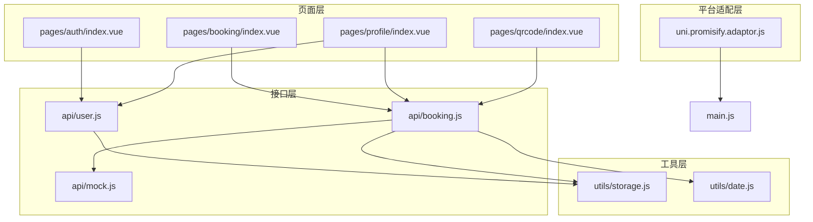
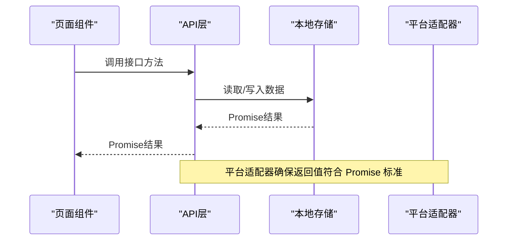
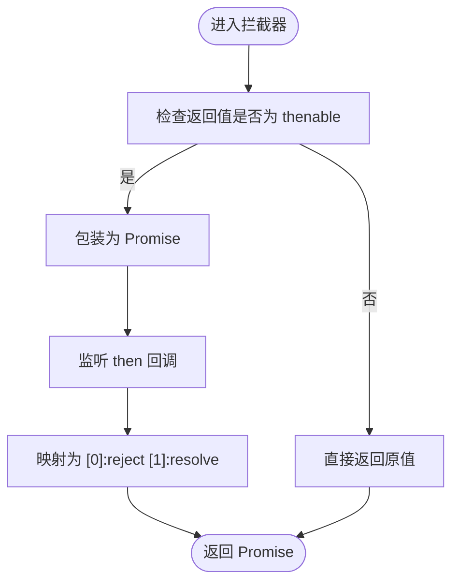
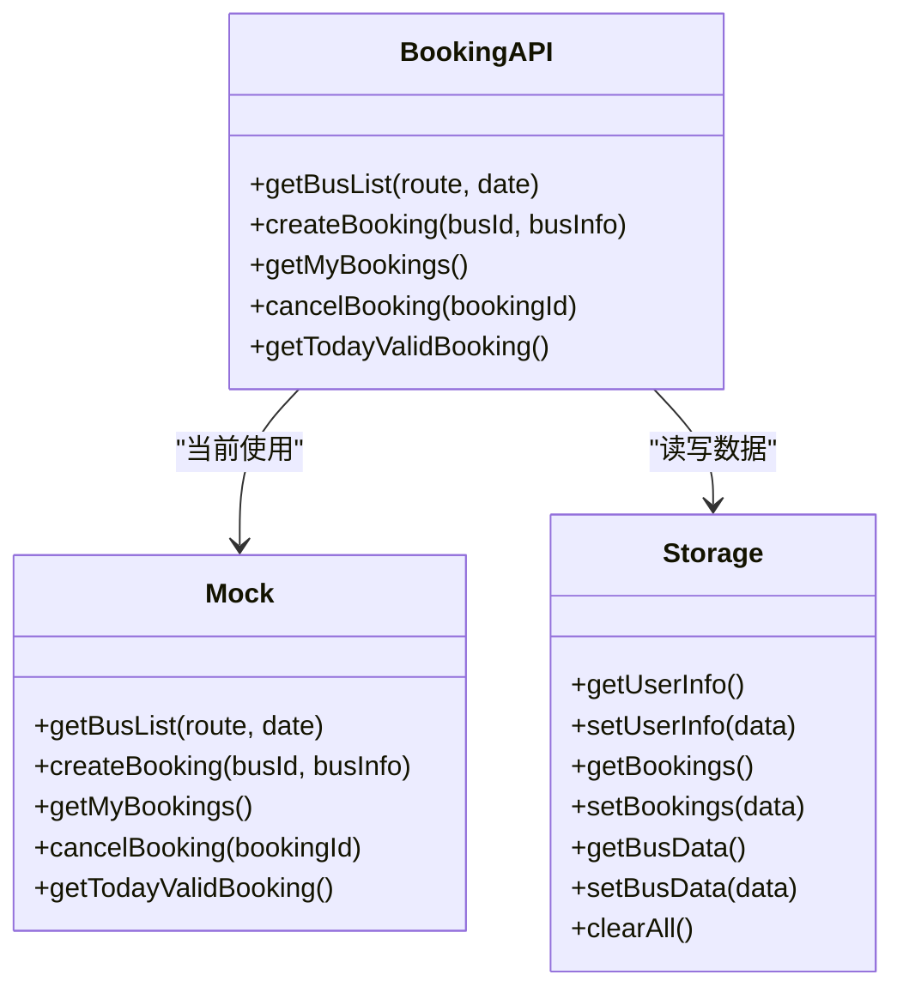
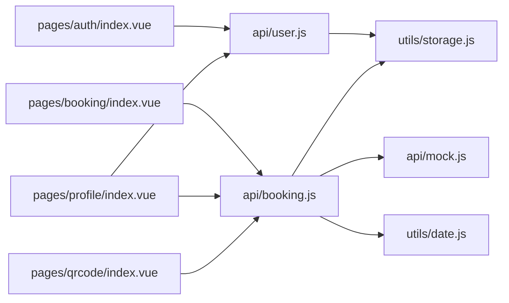
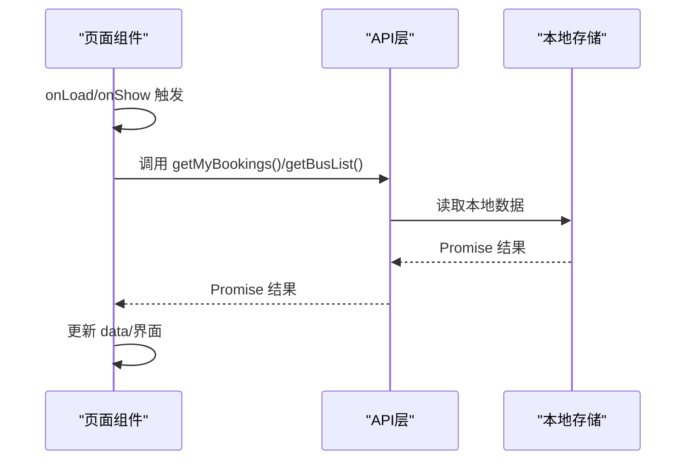
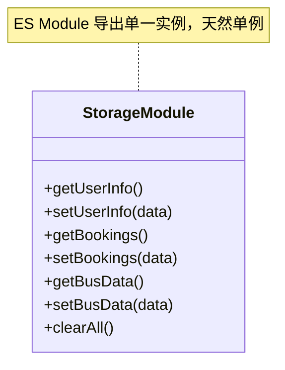
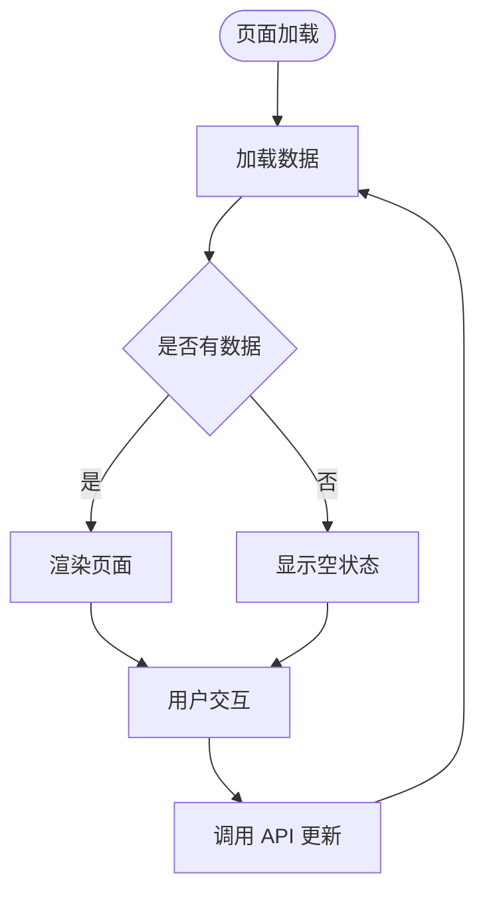
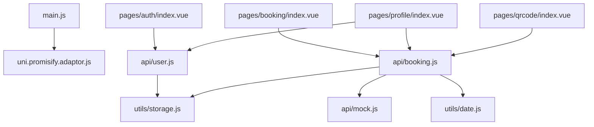

# 设计模式应用

<cite>
**本文档引用的文件**
- [uni.promisify.adaptor.js](file://uni.promisify.adaptor.js)
- [main.js](file://main.js)
- [api/booking.js](file://api/booking.js)
- [api/user.js](file://api/user.js)
- [api/mock.js](file://api/mock.js)
- [utils/storage.js](file://utils/storage.js)
- [utils/date.js](file://utils/date.js)
- [pages/auth/index.vue](file://pages/auth/index.vue)
- [pages/booking/index.vue](file://pages/booking/index.vue)
- [pages/profile/index.vue](file://pages/profile/index.vue)
- [pages/qrcode/index.vue](file://pages/qrcode/index.vue)
- [PROJECT.md](file://PROJECT.md)
</cite>

## 目录
1. [引言](#引言)
2. [项目结构](#项目结构)
3. [核心组件](#核心组件)
4. [架构总览](#架构总览)
5. [详细组件分析](#详细组件分析)
6. [依赖关系分析](#依赖关系分析)
7. [性能考虑](#性能考虑)
8. [故障排查指南](#故障排查指南)
9. [结论](#结论)

## 引言
本项目是一个基于 uni-app 的校车调度系统，采用模块化与分层设计，便于后期替换为真实后端 API。本文档聚焦于项目中体现的设计模式，包括适配器模式、策略模式、模块化设计、观察者模式（事件驱动）以及单例模式（本地存储封装），并结合具体文件路径给出分析与最佳实践建议，帮助开发者理解与应用这些设计思想。

## 项目结构
项目采用“页面-接口层-工具层”的分层组织：
- 页面层：各业务页面（认证、预约、个人中心、乘车码）
- 接口层：api 目录下的模块化 API 封装
- 工具层：utils 目录下的通用工具函数
- 平台适配层：uni.promisify.adaptor.js 对 uni API 的统一适配

图表来源
- [main.js:1-22](file://main.js#L1-L22)
- [uni.promisify.adaptor.js:1-13](file://uni.promisify.adaptor.js#L1-L13)
- [api/booking.js:1-165](file://api/booking.js#L1-L165)
- [api/user.js:1-128](file://api/user.js#L1-L128)
- [api/mock.js:1-226](file://api/mock.js#L1-L226)
- [utils/storage.js:1-116](file://utils/storage.js#L1-L116)
- [utils/date.js:1-84](file://utils/date.js#L1-L84)

章节来源
- [PROJECT.md:41-67](file://PROJECT.md#L41-L67)
- [main.js:1-22](file://main.js#L1-L22)

## 核心组件
- 适配器模式：通过 uni.promisify.adaptor.js 统一处理 uni API 返回值，将其转换为 Promise 标准形态，屏蔽平台差异。
- 策略模式：在 API 层通过导出对象的方法实现“策略”，组件调用时根据场景切换不同策略（mock 与后端 API），保持调用方不变。
- 模块化设计：API 层与工具层以 ES Module 形式导出，便于替换与扩展；页面层仅依赖接口层。
- 观察者模式：页面生命周期（如 onShow/onLoad）与组件事件（如点击、选择器变更）构成事件驱动的交互模型。
- 单例模式：本地存储封装以模块形式导出单一实例，避免重复初始化与跨模块状态不一致。

章节来源
- [uni.promisify.adaptor.js:1-13](file://uni.promisify.adaptor.js#L1-L13)
- [api/booking.js:1-165](file://api/booking.js#L1-L165)
- [api/user.js:1-128](file://api/user.js#L1-L128)
- [utils/storage.js:1-116](file://utils/storage.js#L1-L116)
- [pages/booking/index.vue:114-122](file://pages/booking/index.vue#L114-L122)
- [pages/auth/index.vue:155-187](file://pages/auth/index.vue#L155-L187)

## 架构总览
系统遵循“页面-接口-工具-平台适配”的分层架构，页面通过 API 层访问数据，API 层内部可选择 mock 或后端实现，工具层提供通用能力，平台适配层统一 Promise 化。

图表来源
- [pages/booking/index.vue:138-162](file://pages/booking/index.vue#L138-L162)
- [api/booking.js:14-40](file://api/booking.js#L14-L40)
- [utils/storage.js:10-37](file://utils/storage.js#L10-L37)
- [uni.promisify.adaptor.js:1-13](file://uni.promisify.adaptor.js#L1-L13)

## 详细组件分析

### 适配器模式：uni.promisify.adaptor.js
- 作用：拦截 uni API 的返回值，统一转换为 Promise 标准形态，使调用方无需关心底层平台差异。
- 关键点：
  - 检测返回值是否为具有 then 的对象/函数；
  - 若是，则包装为标准 Promise；
  - 将错误/成功结果映射为 reject/resolve。
- 应用场景：在 main.js 中引入，全局生效，保证后续 API 调用返回值一致性。

图表来源
- [uni.promisify.adaptor.js:1-13](file://uni.promisify.adaptor.js#L1-L13)
- [main.js:5](file://main.js#L5)

章节来源
- [uni.promisify.adaptor.js:1-13](file://uni.promisify.adaptor.js#L1-L13)
- [main.js:1-22](file://main.js#L1-L22)

最佳实践
- 在引入平台适配器后，统一使用 Promise 风格调用，避免混用回调与 Promise。
- 保持适配器的最小职责，仅做形态转换，不参与业务逻辑。

---

### 策略模式：API 层的多实现切换
- 体现：API 层导出对象方法，当前通过 mock 实现，预留后端实现注释，组件调用方无需感知实现变化。
- 典型场景：
  - 预约列表获取：getBusList
  - 创建预约：createBooking
  - 获取我的预约：getMyBookings
  - 身份认证：authenticate
- 优势：组件只依赖接口契约，实现可替换，便于测试与演进。

图表来源
- [api/booking.js:8-165](file://api/booking.js#L8-L165)
- [api/mock.js:49-226](file://api/mock.js#L49-L226)
- [utils/storage.js:6-116](file://utils/storage.js#L6-L116)

章节来源
- [api/booking.js:1-165](file://api/booking.js#L1-L165)
- [api/user.js:1-128](file://api/user.js#L1-L128)
- [api/mock.js:1-226](file://api/mock.js#L1-L226)
- [utils/storage.js:1-116](file://utils/storage.js#L1-L116)

最佳实践
- 在 API 层保留“当前实现”与“后端实现”的注释对比，便于快速切换；
- 统一错误处理与返回格式，保证组件消费的一致性。

---

### 模块化设计：API 层与工具函数
- API 层：按功能拆分为 booking.js 与 user.js，分别导出方法集合，页面通过 import 使用。
- 工具层：storage.js 封装本地存储，date.js 提供日期处理，页面通过 import 使用。
- 优势：高内聚低耦合，易于替换与测试。

图表来源
- [pages/auth/index.vue:100](file://pages/auth/index.vue#L100)
- [pages/booking/index.vue:99](file://pages/booking/index.vue#L99)
- [pages/profile/index.vue:154](file://pages/profile/index.vue#L154)
- [pages/qrcode/index.vue:61](file://pages/qrcode/index.vue#L61)
- [api/booking.js:6](file://api/booking.js#L6)
- [api/user.js:6](file://api/user.js#L6)
- [utils/storage.js:6](file://utils/storage.js#L6)
- [utils/date.js:10](file://utils/date.js#L10)

章节来源
- [pages/auth/index.vue:100](file://pages/auth/index.vue#L100)
- [pages/booking/index.vue:99](file://pages/booking/index.vue#L99)
- [pages/profile/index.vue:154](file://pages/profile/index.vue#L154)
- [pages/qrcode/index.vue:61](file://pages/qrcode/index.vue#L61)
- [api/booking.js:1-165](file://api/booking.js#L1-L165)
- [api/user.js:1-128](file://api/user.js#L1-L128)
- [utils/storage.js:1-116](file://utils/storage.js#L1-L116)
- [utils/date.js:1-84](file://utils/date.js#L1-L84)

最佳实践
- API 层仅暴露方法签名，隐藏实现细节；
- 工具函数尽量纯函数化，减少副作用，便于单元测试。

---

### 观察者模式：组件事件与生命周期
- 生命周期事件：页面 onShow/onLoad 触发数据刷新与状态更新；
- 用户交互事件：表单输入、按钮点击、选择器变更等；
- 事件驱动：页面通过 API 层发起异步请求，收到结果后更新视图。

图表来源
- [pages/booking/index.vue:114-122](file://pages/booking/index.vue#L114-L122)
- [pages/booking/index.vue:138-162](file://pages/booking/index.vue#L138-L162)
- [pages/auth/index.vue:155-187](file://pages/auth/index.vue#L155-L187)

章节来源
- [pages/booking/index.vue:114-122](file://pages/booking/index.vue#L114-L122)
- [pages/booking/index.vue:138-162](file://pages/booking/index.vue#L138-L162)
- [pages/auth/index.vue:155-187](file://pages/auth/index.vue#L155-L187)

最佳实践
- 在 onShow 中刷新数据，避免页面隐藏再显示时的数据陈旧；
- 使用 try/catch 与 finally 控制 loading 状态，提升用户体验。

---

### 单例模式：本地存储封装
- 体现：utils/storage.js 以 ES Module 导出一个包含多个方法的对象，页面多次 import 使用同一实例；
- 优势：避免重复初始化，统一命名空间，减少跨模块状态不一致风险。

图表来源
- [utils/storage.js:6-116](file://utils/storage.js#L6-L116)

章节来源
- [utils/storage.js:1-116](file://utils/storage.js#L1-L116)

最佳实践
- 将所有本地存储操作集中在该模块，避免分散在多处；
- 对敏感字段（如 token）在后端接入时改为安全存储策略。

---

### 页面状态管理与策略模式应用
- 页面状态：认证页、预约页、个人中心页、乘车码页，各自维护独立的状态树；
- 策略选择：页面根据用户行为与数据状态动态切换 UI 与交互策略（如“可预约/已满/已预约/待出行”等）；
- 状态驱动：通过 API 层返回的 Promise 结果更新页面 data，触发视图渲染。

图表来源
- [pages/booking/index.vue:138-162](file://pages/booking/index.vue#L138-L162)
- [pages/profile/index.vue:172-179](file://pages/profile/index.vue#L172-L179)

章节来源
- [pages/booking/index.vue:138-162](file://pages/booking/index.vue#L138-L162)
- [pages/profile/index.vue:172-179](file://pages/profile/index.vue#L172-L179)

## 依赖关系分析
- 页面依赖 API 层，API 层依赖工具层与 mock；
- main.js 引入平台适配器，确保 Promise 化；
- 页面间通过路由导航与共享状态（本地存储）间接通信。

图表来源
- [main.js:1-22](file://main.js#L1-L22)
- [pages/auth/index.vue:100](file://pages/auth/index.vue#L100)
- [pages/booking/index.vue:99](file://pages/booking/index.vue#L99)
- [pages/profile/index.vue:154](file://pages/profile/index.vue#L154)
- [pages/qrcode/index.vue:61](file://pages/qrcode/index.vue#L61)
- [api/booking.js:6](file://api/booking.js#L6)
- [api/user.js:6](file://api/user.js#L6)
- [utils/storage.js:6](file://utils/storage.js#L6)
- [utils/date.js:10](file://utils/date.js#L10)

章节来源
- [main.js:1-22](file://main.js#L1-L22)
- [PROJECT.md:123-134](file://PROJECT.md#L123-L134)

## 性能考虑
- 数据懒加载：页面 onShow 时才加载数据，避免首屏压力；
- 本地缓存：优先使用本地存储，减少网络请求；
- 预约状态计算：在 mock 层根据本地存储计算剩余座位与状态，降低后端压力；
- 二维码刷新：30 秒刷新一次，平衡时效与性能。

[本节为通用指导，不直接分析具体文件]

## 故障排查指南
- 适配器问题：若 Promise 化异常，检查返回值形态与拦截条件；
- API 切换：确认 API 层已注释掉 mock 并启用后端实现；
- 本地存储：清除无效数据后重试，或检查 key 是否正确；
- 页面状态：确认 onShow/onLoad 是否触发数据刷新。

章节来源
- [uni.promisify.adaptor.js:1-13](file://uni.promisify.adaptor.js#L1-L13)
- [api/booking.js:14-40](file://api/booking.js#L14-L40)
- [utils/storage.js:106-114](file://utils/storage.js#L106-L114)
- [pages/booking/index.vue:118-122](file://pages/booking/index.vue#L118-L122)

## 结论
本项目通过适配器模式统一平台差异、通过策略模式实现 API 的可替换性、通过模块化设计实现清晰的分层与职责分离、通过观察者模式驱动页面交互，并通过单例模式封装本地存储，形成了一套可演进、可维护、可测试的架构。建议在后续接入后端时，保持 API 层契约不变，逐步替换实现，确保前端代码零改动即可完成迁移。