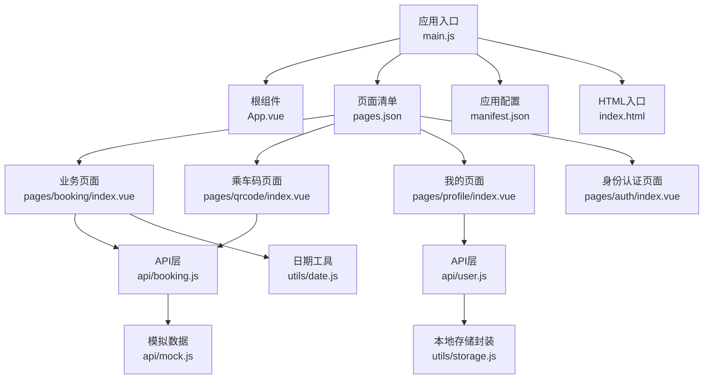
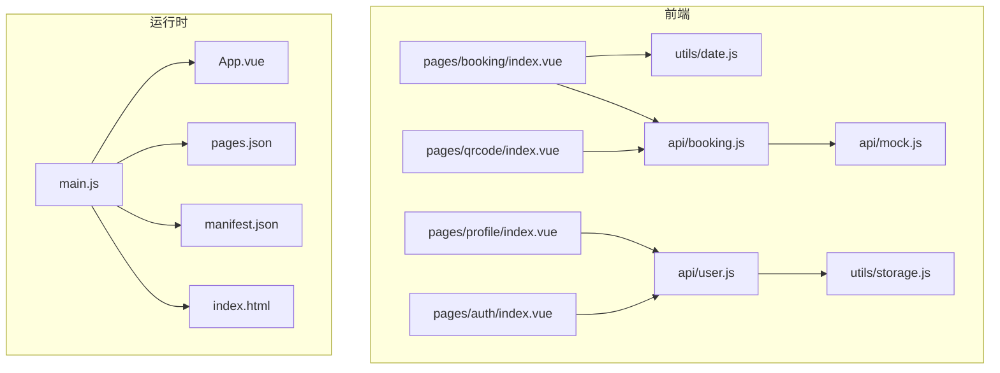
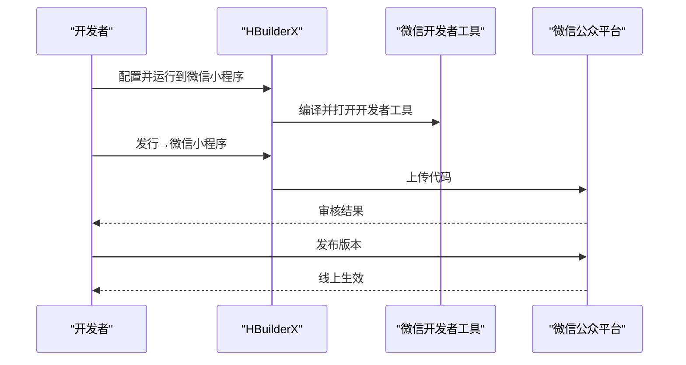
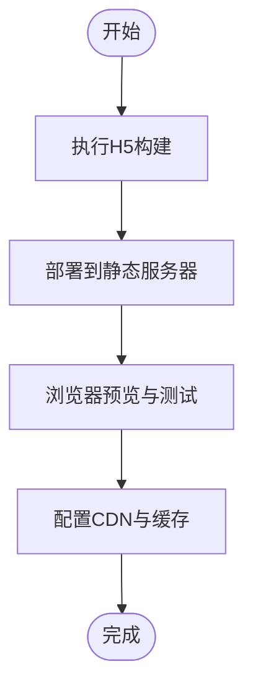
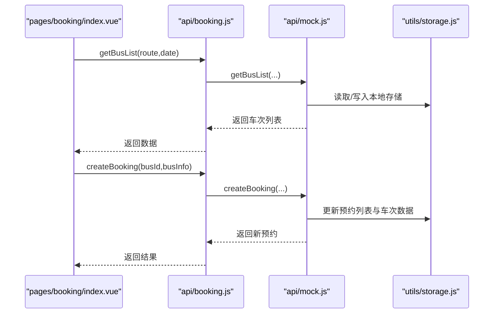
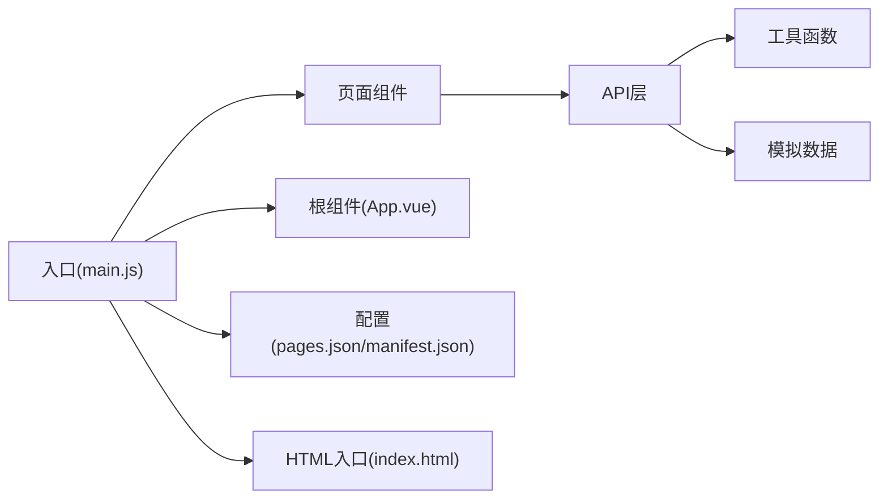

# 部署指南

<cite>
**本文引用的文件**
- [manifest.json](file://manifest.json)
- [pages.json](file://pages.json)
- [main.js](file://main.js)
- [PROJECT.md](file://PROJECT.md)
- [App.vue](file://App.vue)
- [index.html](file://index.html)
- [api/booking.js](file://api/booking.js)
- [api/user.js](file://api/user.js)
- [api/mock.js](file://api/mock.js)
- [utils/storage.js](file://utils/storage.js)
- [utils/date.js](file://utils/date.js)
- [pages/booking/index.vue](file://pages/booking/index.vue)
- [pages/auth/index.vue](file://pages/auth/index.vue)
- [pages/qrcode/index.vue](file://pages/qrcode/index.vue)
- [pages/profile/index.vue](file://pages/profile/index.vue)
- [pages/index/index.vue](file://pages/index/index.vue)
</cite>

## 目录
1. [引言](#引言)
2. [项目结构](#项目结构)
3. [核心组件](#核心组件)
4. [架构总览](#架构总览)
5. [详细组件分析](#详细组件分析)
6. [依赖分析](#依赖分析)
7. [性能考虑](#性能考虑)
8. [故障排查指南](#故障排查指南)
9. [结论](#结论)
10. [附录](#附录)

## 引言
本指南面向运维与开发团队，提供学校校车调度系统在多平台（微信小程序、H5）的完整部署流程与配置要求。内容涵盖：
- 微信小程序发布流程：本地开发、真机调试、上传审核、版本管理与线上发布
- H5 平台构建配置与部署要求
- 不同平台的适配策略与兼容性处理
- 构建优化、资源压缩与性能调优
- 部署前测试验证、部署后监控与维护策略
- 常见部署问题排查与解决方案
- 生产环境部署的运维建议

## 项目结构
项目采用 uni-app 多端统一工程，核心文件如下：
- 应用配置：manifest.json（平台发布信息、权限、模块）
- 页面路由与全局样式：pages.json（页面清单、导航栏、tabBar、uniId路由）
- 入口与运行时：main.js（Vue 2/3 兼容入口）、App.vue（应用生命周期与全局样式）
- HTML 入口：index.html（H5 构建入口）
- 页面组件：pages/booking、pages/qrcode、pages/profile、pages/auth
- API 层：api/booking.js、api/user.js、api/mock.js（模拟数据）
- 工具函数：utils/storage.js（本地存储封装）、utils/date.js（日期工具）

图表来源
- [main.js:1-22](file://main.js#L1-L22)
- [App.vue:1-32](file://App.vue#L1-L32)
- [pages.json:1-62](file://pages.json#L1-L62)
- [manifest.json:1-73](file://manifest.json#L1-L73)
- [index.html:1-21](file://index.html#L1-L21)
- [pages/booking/index.vue:1-575](file://pages/booking/index.vue#L1-L575)
- [pages/qrcode/index.vue:1-342](file://pages/qrcode/index.vue#L1-L342)
- [pages/profile/index.vue:1-595](file://pages/profile/index.vue#L1-L595)
- [pages/auth/index.vue:1-385](file://pages/auth/index.vue#L1-L385)
- [api/booking.js:1-165](file://api/booking.js#L1-L165)
- [api/user.js:1-128](file://api/user.js#L1-L128)
- [api/mock.js:1-226](file://api/mock.js#L1-L226)
- [utils/storage.js:1-116](file://utils/storage.js#L1-L116)
- [utils/date.js:1-84](file://utils/date.js#L1-L84)

章节来源
- [PROJECT.md:41-67](file://PROJECT.md#L41-L67)
- [pages.json:1-62](file://pages.json#L1-L62)
- [manifest.json:1-73](file://manifest.json#L1-L73)
- [main.js:1-22](file://main.js#L1-L22)
- [index.html:1-21](file://index.html#L1-L21)

## 核心组件
- 应用配置 manifest.json
  - 包含 app 名称、版本、权限声明、平台特定配置（Android/iOS/小程序）
  - mp-weixin 小程序配置项（appid、安全设置、组件化）
- 页面配置 pages.json
  - 页面路径、导航栏标题、全局样式、tabBar 图标与颜色
- API 层
  - booking.js：车次列表、创建预约、我的预约、取消预约、今日有效预约
  - user.js：用户信息、更新信息、身份认证
  - mock.js：模拟数据（车次、预约、座位号、本地存储）
- 工具函数
  - storage.js：封装本地存储读写与清理
  - date.js：未来N天日期数组、格式化、到期判断

章节来源
- [manifest.json:52-58](file://manifest.json#L52-L58)
- [pages.json:28-59](file://pages.json#L28-L59)
- [api/booking.js:8-165](file://api/booking.js#L8-L165)
- [api/user.js:8-128](file://api/user.js#L8-L128)
- [api/mock.js:49-226](file://api/mock.js#L49-L226)
- [utils/storage.js:6-116](file://utils/storage.js#L6-L116)
- [utils/date.js:10-84](file://utils/date.js#L10-L84)

## 架构总览
系统采用“页面组件 → API 层 → 本地存储/模拟数据”的数据流设计，便于后续替换为真实后端。

图表来源
- [pages/booking/index.vue:98-297](file://pages/booking/index.vue#L98-L297)
- [pages/qrcode/index.vue:60-184](file://pages/qrcode/index.vue#L60-L184)
- [pages/profile/index.vue:152-248](file://pages/profile/index.vue#L152-L248)
- [pages/auth/index.vue:99-189](file://pages/auth/index.vue#L99-L189)
- [api/booking.js:6-165](file://api/booking.js#L6-L165)
- [api/user.js:6-128](file://api/user.js#L6-L128)
- [api/mock.js:1-226](file://api/mock.js#L1-L226)
- [utils/date.js:1-84](file://utils/date.js#L1-L84)
- [utils/storage.js:1-116](file://utils/storage.js#L1-L116)
- [main.js:1-22](file://main.js#L1-L22)
- [App.vue:1-32](file://App.vue#L1-L32)
- [pages.json:1-62](file://pages.json#L1-L62)
- [manifest.json:1-73](file://manifest.json#L1-L73)
- [index.html:1-21](file://index.html#L1-L21)

## 详细组件分析

### 微信小程序发布流程
- 本地开发与预览
  - 使用 HBuilderX 打开项目，连接微信开发者工具进行预览与调试
  - 首次运行需在 HBuilderX 中配置微信开发者工具路径
- 小程序配置
  - mp-weixin 节点中的 appid 需在微信公众平台注册后填写
  - setting.urlCheck 建议关闭以避免本地联调时的域名校验问题
- 上传与审核
  - 在 HBuilderX 中选择“发行”→“小程序”
  - 勾选“微信小程序”，按向导完成上传
  - 登录微信公众平台进行小程序审核
- 版本管理与线上发布
  - 通过 HBuilderX 的“版本管理”功能创建版本标签
  - 审核通过后在微信公众平台“发布版本”中提交线上
- 本地存储与数据迁移
  - 项目使用本地存储保存用户信息、预约列表、车次数据
  - 小程序版本升级时注意本地存储键名变更的兼容策略

图表来源
- [PROJECT.md:88-94](file://PROJECT.md#L88-L94)
- [manifest.json:52-58](file://manifest.json#L52-L58)

章节来源
- [PROJECT.md:88-94](file://PROJECT.md#L88-L94)
- [manifest.json:52-58](file://manifest.json#L52-L58)

### H5 平台构建与部署
- 构建配置
  - index.html 为 H5 入口，包含 viewport 与模块加载脚本
  - main.js 支持 Vue 3 SSR App 创建，H5 构建时由 uni-app 默认处理
- 本地预览
  - 在 HBuilderX 中选择“运行”→“运行到浏览器”，或使用命令行构建后在静态服务器访问
- 部署要求
  - 服务器需支持静态资源托管与缓存策略
  - 建议开启 gzip/br 压缩与 HTTPS
  - 配置 CDN 与回源规则，确保 index.html 与资源路径一致
- 路由与图标
  - pages.json 中 tabBar 图标路径需在 H5 环境可访问
  - 若使用动态图标，确保构建后路径正确

图表来源
- [index.html:1-21](file://index.html#L1-L21)
- [main.js:14-22](file://main.js#L14-L22)
- [pages.json:34-59](file://pages.json#L34-L59)

章节来源
- [index.html:1-21](file://index.html#L1-L21)
- [main.js:14-22](file://main.js#L14-L22)
- [pages.json:34-59](file://pages.json#L34-L59)

### 页面与数据流（以预约页面为例）
- 页面职责
  - 预约筛选（路线、日期）、车次列表展示、预约确认与取消
- 数据流
  - 组件调用 API 层（booking.js），内部使用 mock.js 生成/更新数据
  - 本地存储（storage.js）持久化用户与预约信息
- 交互流程

图表来源
- [pages/booking/index.vue:148-247](file://pages/booking/index.vue#L148-L247)
- [api/booking.js:14-163](file://api/booking.js#L14-L163)
- [api/mock.js:49-152](file://api/mock.js#L49-L152)
- [utils/storage.js:10-114](file://utils/storage.js#L10-L114)

章节来源
- [pages/booking/index.vue:148-247](file://pages/booking/index.vue#L148-L247)
- [api/booking.js:14-163](file://api/booking.js#L14-L163)
- [api/mock.js:49-152](file://api/mock.js#L49-L152)
- [utils/storage.js:10-114](file://utils/storage.js#L10-L114)

### 适配策略与兼容性处理
- 小程序端
  - 使用 usingComponents:true，启用自定义组件
  - setting.urlCheck:false 降低本地联调门槛
  - 权限与模块在 app-plus/android/permissions 中声明
- H5 端
  - index.html 中 viewport 与 viewport-fit 自动注入
  - 静态资源路径与 icon 路径需保证 H5 可访问
- 跨端一致性
  - 通过 API 层抽象数据访问，减少跨端差异
  - 本地存储键名保持稳定，避免升级导致的数据丢失

章节来源
- [manifest.json:52-58](file://manifest.json#L52-L58)
- [manifest.json:22-47](file://manifest.json#L22-L47)
- [index.html:3-11](file://index.html#L3-L11)
- [pages.json:34-59](file://pages.json#L34-L59)

## 依赖分析
- 组件耦合
  - 页面组件依赖 API 层；API 层依赖工具函数与模拟数据
  - main.js 作为统一入口，App.vue 提供全局样式与生命周期
- 外部依赖
  - uni-app 运行时与平台 API（微信小程序本地存储、请求）
  - H5 构建由 uni-app 默认处理，无需额外打包配置

图表来源
- [main.js:1-22](file://main.js#L1-L22)
- [App.vue:1-32](file://App.vue#L1-L32)
- [pages.json:1-62](file://pages.json#L1-L62)
- [manifest.json:1-73](file://manifest.json#L1-L73)
- [index.html:1-21](file://index.html#L1-L21)
- [api/booking.js:6-165](file://api/booking.js#L6-L165)
- [api/user.js:6-128](file://api/user.js#L6-L128)
- [api/mock.js:1-226](file://api/mock.js#L1-L226)
- [utils/storage.js:1-116](file://utils/storage.js#L1-L116)

章节来源
- [main.js:1-22](file://main.js#L1-L22)
- [App.vue:1-32](file://App.vue#L1-L32)
- [pages.json:1-62](file://pages.json#L1-L62)
- [manifest.json:1-73](file://manifest.json#L1-L73)
- [index.html:1-21](file://index.html#L1-L21)

## 性能考虑
- 构建优化
  - 使用 HBuilderX 的 Release 构建，启用压缩与 Tree Shaking
  - 分包策略：将不常用页面拆分为分包，减少首屏体积
- 资源压缩
  - 图片使用 WebP 或压缩 PNG，合理设置尺寸与分辨率
  - icon 与静态资源集中管理，避免重复请求
- 运行时优化
  - 预约页面按需加载数据，避免一次性请求过多
  - 二维码生成建议使用成熟库替代简易 canvas 示例，提升渲染效率
- 缓存策略
  - H5 端开启强缓存与协商缓存，静态资源带指纹
  - 小程序端合理利用本地存储，减少重复请求

## 故障排查指南
- 常见问题与解决
  - pages.json 配置错误：检查页面路径与文件是否存在
  - TabBar 图标不显示：确认 static/icons 下图标存在且尺寸合适
  - 预约功能不可用：确认已完成身份认证，清除本地存储后重试
  - 二维码不显示：当前为简易 canvas 示例，建议集成专业二维码库
- 日志与调试
  - 小程序端：使用微信开发者工具控制台查看错误
  - H5 端：使用浏览器开发者工具 Network/Console 排查
- 数据一致性
  - 本地存储键名变更需做迁移逻辑，避免老数据导致异常

章节来源
- [PROJECT.md:185-202](file://PROJECT.md#L185-L202)

## 结论
本指南提供了从开发到上线的全链路部署实践，重点覆盖微信小程序与 H5 平台的差异化配置与发布流程。通过 API 层抽象与本地存储封装，系统具备良好的可扩展性与跨端一致性。建议在生产环境中结合监控与灰度发布策略，持续优化用户体验与稳定性。

## 附录
- 后端对接指引
  - 在 API 层替换为真实后端接口，保留组件调用不变
  - 关键接口参考：登录认证、车次列表、创建/取消预约、用户资料
- 颜色规范
  - 主色：#1E50A2；成功：#52C41A；警告：#FAAD14；错误：#FF4D4F；背景：#F5F5F5

章节来源
- [PROJECT.md:150-174](file://PROJECT.md#L150-L174)
- [PROJECT.md:175-182](file://PROJECT.md#L175-L182)