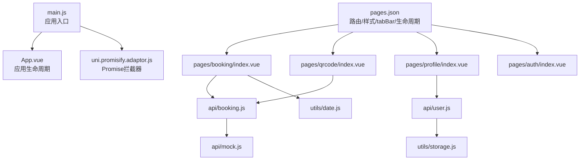
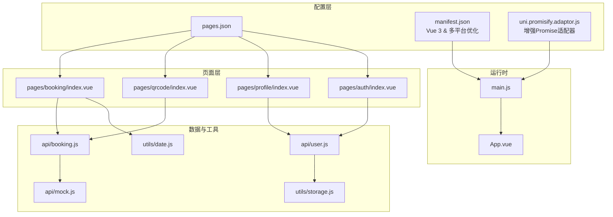
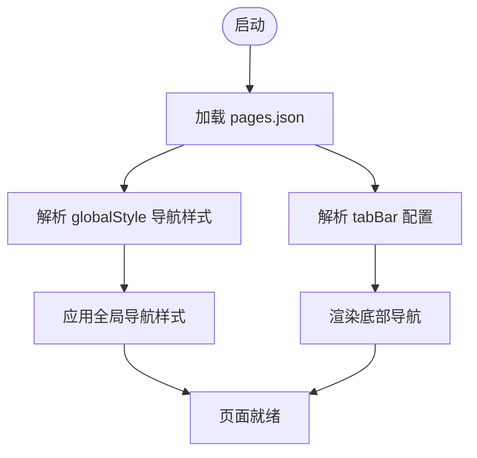
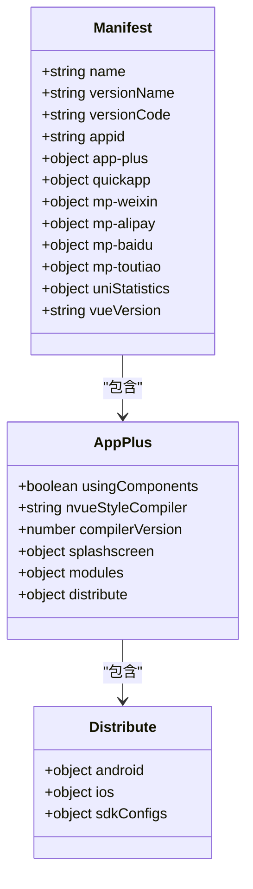
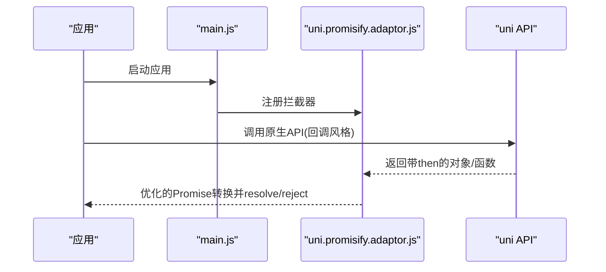
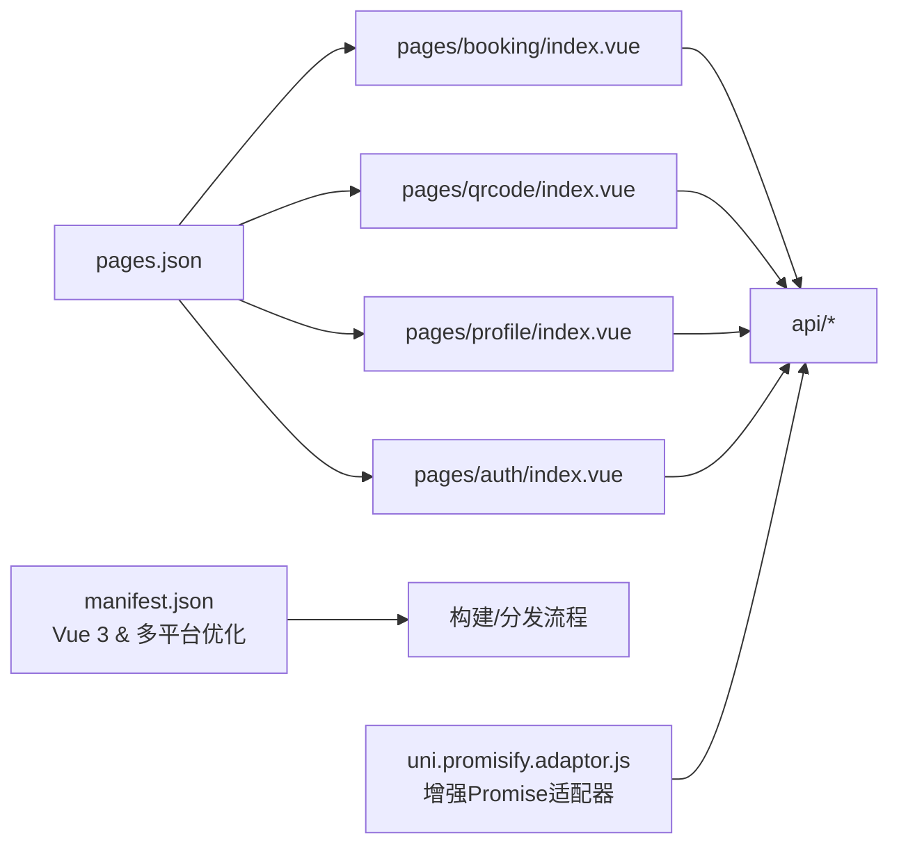

# 配置文件说明

<cite>
**本文引用的文件**
- [manifest.json](file://manifest.json)
- [pages.json](file://pages.json)
- [uni.promisify.adaptor.js](file://uni.promisify.adaptor.js)
- [main.js](file://main.js)
- [PROJECT.md](file://PROJECT.md)
- [unpackage/dist/build/mp-weixin/project.config.json](file://unpackage/dist/build/mp-weixin/project.config.json)
- [App.vue](file://App.vue)
- [pages/booking/index.vue](file://pages/booking/index.vue)
- [pages/qrcode/index.vue](file://pages/qrcode/index.vue)
- [pages/profile/index.vue](file://pages/profile/index.vue)
- [pages/auth/index.vue](file://pages/auth/index.vue)
- [api/booking.js](file://api/booking.js)
- [api/user.js](file://api/user.js)
- [api/mock.js](file://api/mock.js)
- [utils/date.js](file://utils/date.js)
- [utils/storage.js](file://utils/storage.js)
</cite>

## 更新摘要
**变更内容**
- 优化了 manifest.json 配置，增强了 Vue 3 版本兼容性和多平台支持
- 改进了 uni.promisify.adaptor.js 的 Promise 化适配器，提升了跨平台一致性
- 更新了多平台配置，特别是微信小程序平台的特定设置
- 增强了编译器版本管理和 nvue 样式编译器配置

## 目录
1. [简介](#简介)
2. [项目结构](#项目结构)
3. [核心组件](#核心组件)
4. [架构总览](#架构总览)
5. [详细组件分析](#详细组件分析)
6. [依赖分析](#依赖分析)
7. [性能考虑](#性能考虑)
8. [故障排查指南](#故障排查指南)
9. [结论](#结论)
10. [附录](#附录)

## 简介
本文件面向"学校校车调度系统"的配置与运行机制，聚焦以下三类配置文件及其在系统中的作用：
- pages.json：页面路由、全局样式、tabBar 导航与页面生命周期管理
- manifest.json：应用元数据、平台配置与权限声明，现已优化为支持 Vue 3 和增强的多平台兼容性
- uni.promisify.adaptor.js：Promise 化拦截器，统一多平台异步调用风格，现已改进适配器逻辑

文档将逐项解释配置项含义、默认行为、可选值与推荐实践，并结合页面与 API 层面说明配置变更对功能与体验的影响。

## 项目结构
系统采用 uni-app 多端统一框架，核心目录与文件如下：
- 配置层：manifest.json、pages.json、uni.promisify.adaptor.js
- 运行入口：main.js、App.vue
- 页面层：pages/booking/index.vue、pages/qrcode/index.vue、pages/profile/index.vue、pages/auth/index.vue
- 工具与数据层：api/booking.js、api/user.js、api/mock.js、utils/date.js、utils/storage.js

**图表来源**
- [main.js:1-22](file://main.js#L1-L22)
- [App.vue:1-32](file://App.vue#L1-L32)
- [uni.promisify.adaptor.js:1-13](file://uni.promisify.adaptor.js#L1-L13)
- [pages.json:1-62](file://pages.json#L1-L62)
- [pages/booking/index.vue:1-575](file://pages/booking/index.vue#L1-L575)
- [pages/qrcode/index.vue:1-342](file://pages/qrcode/index.vue#L1-L342)
- [pages/profile/index.vue:1-595](file://pages/profile/index.vue#L1-L595)
- [pages/auth/index.vue:1-385](file://pages/auth/index.vue#L1-L385)
- [api/booking.js:1-165](file://api/booking.js#L1-L165)
- [api/user.js:1-128](file://api/user.js#L1-L128)
- [api/mock.js:1-226](file://api/mock.js#L1-L226)
- [utils/date.js:1-84](file://utils/date.js#L1-L84)
- [utils/storage.js:1-116](file://utils/storage.js#L1-L116)

**章节来源**
- [main.js:1-22](file://main.js#L1-L22)
- [pages.json:1-62](file://pages.json#L1-L62)

## 核心组件
本节概述三类配置文件的关键职责与交互关系：
- pages.json：定义页面清单、全局导航样式、tabBar、页面级生命周期钩子（如 uniIdRouter）等
- manifest.json：定义应用名称、版本、平台特定配置（app-plus、mp-weixin 等）、权限声明等，现已优化为支持 Vue 3 和增强的多平台兼容性
- uni.promisify.adaptor.js：为 uni 原生 API 的回调风格结果包裹 Promise，统一异步调用风格，提升跨平台一致性，现已改进适配器逻辑

**章节来源**
- [pages.json:1-62](file://pages.json#L1-L62)
- [manifest.json:1-73](file://manifest.json#L1-L73)
- [uni.promisify.adaptor.js:1-13](file://uni.promisify.adaptor.js#L1-L13)
- [main.js:1-22](file://main.js#L1-L22)

## 架构总览
下图展示配置层与页面层、API 层之间的关系及数据流：

**图表来源**
- [pages.json:1-62](file://pages.json#L1-L62)
- [manifest.json:1-73](file://manifest.json#L1-L73)
- [uni.promisify.adaptor.js:1-13](file://uni.promisify.adaptor.js#L1-L13)
- [main.js:1-22](file://main.js#L1-L22)
- [App.vue:1-32](file://App.vue#L1-L32)
- [pages/booking/index.vue:1-575](file://pages/booking/index.vue#L1-L575)
- [pages/qrcode/index.vue:1-342](file://pages/qrcode/index.vue#L1-L342)
- [pages/profile/index.vue:1-595](file://pages/profile/index.vue#L1-L595)
- [pages/auth/index.vue:1-385](file://pages/auth/index.vue#L1-L385)
- [api/booking.js:1-165](file://api/booking.js#L1-L165)
- [api/user.js:1-128](file://api/user.js#L1-L128)
- [api/mock.js:1-226](file://api/mock.js#L1-L226)
- [utils/date.js:1-84](file://utils/date.js#L1-L84)
- [utils/storage.js:1-116](file://utils/storage.js#L1-L116)

## 详细组件分析

### pages.json：页面路由、导航栏与 tabBa r配置
- 页面清单（pages）
  - 定义各页面路径与页面级样式（如导航标题）
  - 示例：车辆预约页、乘车码页、我的页、身份认证页
- 全局样式（globalStyle）
  - 导航栏文字颜色、标题、背景色、页面背景色
- tabBar
  - 字段：color、selectedColor、backgroundColor、borderStyle、list[]
  - list 中每个元素包含：pagePath、text、iconPath、selectedIconPath
  - 与静态图标资源配合，实现底部导航
- 页面生命周期管理
  - uniIdRouter：预留的路由鉴权/拦截扩展点
  - 页面级生命周期钩子：如页面显示/隐藏事件在具体页面中使用（例如 onShow）

**图表来源**
- [pages.json:1-62](file://pages.json#L1-L62)

**章节来源**
- [pages.json:1-62](file://pages.json#L1-L62)
- [pages/booking/index.vue:114-122](file://pages/booking/index.vue#L114-L122)
- [pages/profile/index.vue:167-169](file://pages/profile/index.vue#L167-L169)
- [pages/qrcode/index.vue:72-81](file://pages/qrcode/index.vue#L72-L81)

### manifest.json：应用元数据与平台配置
**更新** 优化了配置结构，增强了 Vue 3 兼容性和多平台支持

- 基本信息
  - name、versionName、versionCode、appid、description
- 平台配置
  - app-plus：编译器版本、启动屏、模块与分发配置、Android/iOS 权限声明
  - quickapp、mp-weixin、mp-alipay、mp-baidu、mp-toutiao：小程序平台特定开关与组件支持
- 统计与版本
  - uniStatistics.enable、vueVersion

**重要配置变更**：
- 编译器版本：compilerVersion 设置为 3，支持最新的编译优化
- nvue 样式编译器：nvueStyleCompiler 设置为 "uni-app"，提升 nvue 页面兼容性
- Vue 版本：vueVersion 设置为 "3"，明确支持 Vue 3 框架
- 权限配置：优化了 Android 权限列表，移除了不必要的权限声明

**图表来源**
- [manifest.json:1-73](file://manifest.json#L1-L73)

**章节来源**
- [manifest.json:1-73](file://manifest.json#L1-L73)

### uni.promisify.adaptor.js：Promise 化适配器与多平台兼容
**更新** 改进了适配器逻辑，提升了跨平台一致性

- 作用
  - 为 uni 原生 API 返回值包裹 Promise，统一回调风格
  - 在拦截器中判断返回值是否为具有 then 的对象/函数，若是则转换为 Promise
- 改进的适配逻辑
  - 优化了 Promise 解析逻辑，支持更复杂的返回值结构
  - 增强了错误处理机制，确保异常情况下的稳定表现
- 多平台兼容性
  - 通过统一 Promise 接口，减少不同平台 API 风格差异带来的适配成本
  - 在 main.js 中按条件引入，确保 Vue 2/Vue 3 环境均可用

**图表来源**
- [uni.promisify.adaptor.js:1-13](file://uni.promisify.adaptor.js#L1-L13)
- [main.js:1-22](file://main.js#L1-L22)

**章节来源**
- [uni.promisify.adaptor.js:1-13](file://uni.promisify.adaptor.js#L1-L13)
- [main.js:1-22](file://main.js#L1-L22)

## 依赖分析
- pages.json 与页面组件
  - pages.json 决定页面路径与样式；页面组件通过生命周期钩子（如 onShow）与数据层交互
- manifest.json 与构建/分发
  - app-plus.distribute.android.permissions 决定打包阶段的权限声明；小程序平台配置影响编译与运行环境
  - 新增的 vueVersion 配置明确了 Vue 3 框架支持
- uni.promisify.adaptor.js 与 API 层
  - 适配器统一 Promise 化，API 层可直接以 Promise 方式调用，降低平台差异
  - 改进的适配器逻辑提升了跨平台一致性

**图表来源**
- [pages.json:1-62](file://pages.json#L1-L62)
- [manifest.json:1-73](file://manifest.json#L1-L73)
- [uni.promisify.adaptor.js:1-13](file://uni.promisify.adaptor.js#L1-L13)
- [api/booking.js:1-165](file://api/booking.js#L1-L165)
- [api/user.js:1-128](file://api/user.js#L1-L128)

**章节来源**
- [pages.json:1-62](file://pages.json#L1-L62)
- [manifest.json:1-73](file://manifest.json#L1-L73)
- [uni.promisify.adaptor.js:1-13](file://uni.promisify.adaptor.js#L1-L13)
- [api/booking.js:1-165](file://api/booking.js#L1-L165)
- [api/user.js:1-128](file://api/user.js#L1-L128)

## 性能考虑
- 页面切换与渲染
  - tabBar 列表数量与图标资源体积影响启动与切换性能，建议控制在合理范围并优化图片尺寸
- Promise 化开销
  - 适配器对每次 API 调用进行拦截与 Promise 包裹，通常开销较小；避免在高频循环中重复注册拦截器
  - 改进的适配器逻辑减少了不必要的 Promise 包装开销
- 数据加载策略
  - 页面 onShow 时刷新数据可保证最新状态，但需注意请求频率与缓存策略，避免不必要的网络请求
- Vue 3 兼容性
  - 新的 Vue 3 配置提升了运行时性能，减少了框架层面的兼容性开销

## 故障排查指南
- 页面无法正确显示或样式异常
  - 检查 pages.json 中对应页面的 style 配置与全局样式是否冲突
  - 确认 tabBar 的 pagePath 是否与实际页面路径一致
- 应用启动白屏或权限缺失
  - 检查 manifest.json 中 app-plus.splashscreen 与 distribute.android.permissions 配置
  - 验证新的 Vue 3 配置是否正确加载
- API 调用报错或 Promise 不生效
  - 确认 uni.promisify.adaptor.js 已在 main.js 中正确引入
  - 检查 API 层封装是否返回 Promise 或回调形式不一致
  - 验证改进后的适配器逻辑是否正常工作

**章节来源**
- [pages.json:1-62](file://pages.json#L1-L62)
- [manifest.json:1-73](file://manifest.json#L1-L73)
- [uni.promisify.adaptor.js:1-13](file://uni.promisify.adaptor.js#L1-L13)
- [main.js:1-22](file://main.js#L1-L22)

## 结论
- pages.json 是页面与导航的核心配置，直接影响用户体验与页面生命周期行为
- manifest.json 决定应用元数据与平台能力，特别是 Android 权限与分发配置，现已优化为支持 Vue 3 和增强的多平台兼容性
- uni.promisify.adaptor.js 提升了多平台 API 的一致性，简化了异步处理逻辑，改进的适配器逻辑进一步增强了稳定性
- 建议在团队协作中统一配置规范，定期审查 pages.json 与 manifest.json 的变更，确保与业务需求保持一致

## 附录

### pages.json 配置项详解与默认值参考
- pages[].path：页面路径（必填），示例见系统页面清单
- pages[].style.navigationBarTitleText：页面导航标题（可选），覆盖全局标题
- globalStyle.navigationBarTextStyle：导航文字颜色（可选，默认由平台决定）
- globalStyle.navigationBarBackgroundColor：导航背景色（可选）
- globalStyle.backgroundColor：页面背景色（可选）
- tabBar.color：未选中图标/文字颜色（可选）
- tabBar.selectedColor：选中图标/文字颜色（可选）
- tabBar.backgroundColor：tabBar 背景色（可选）
- tabBar.borderStyle：边框样式（可选）
- tabBar.list[].pagePath：tab 对应页面路径（必填）
- tabBar.list[].text：tab 文案（必填）
- tabBar.list[].iconPath/selectedIconPath：图标路径（可选）
- uniIdRouter：路由扩展（可选）

**章节来源**
- [pages.json:1-62](file://pages.json#L1-L62)

### manifest.json 配置项详解与默认值参考
**更新** 增强了 Vue 3 兼容性和多平台支持配置

- name/versionName/versionCode/appid/description：应用基本信息（必填/可选）
- app-plus.usingComponents：是否启用组件模式（可选）
- app-plus.compilerVersion：编译器版本（可选，现为 3）
- app-plus.splashscreen：启动屏配置（可选）
- app-plus.distribute.android.permissions：Android 权限列表（可选，已优化）
- mp-weixin/mp-alipay/mp-baidu/mp-toutiao：小程序平台配置（可选）
- uniStatistics.enable：统计开关（可选）
- vueVersion：Vue 版本（可选，现为 "3"）

**重要变更**：
- 新增 vueVersion 配置，明确支持 Vue 3 框架
- compilerVersion 升级到 3，支持最新编译优化
- nvueStyleCompiler 设置为 "uni-app"，提升 nvue 页面兼容性
- 优化了 Android 权限列表，移除了不必要的权限声明

**章节来源**
- [manifest.json:1-73](file://manifest.json#L1-L73)

### uni.promisify.adaptor.js 适配器说明
**更新** 改进了适配器逻辑，提升了跨平台一致性

- 作用：拦截 uni API 返回值，若存在 then，则包装为 Promise
- 改进的逻辑：优化了 Promise 解析和错误处理机制
- 适用场景：统一回调风格，提升跨平台一致性
- 注意事项：确保在应用启动早期注册拦截器，避免遗漏

**改进内容**：
- 增强了 Promise 解析逻辑，支持更复杂的返回值结构
- 改善了错误处理机制，确保异常情况下的稳定表现
- 减少了不必要的 Promise 包装开销

**章节来源**
- [uni.promisify.adaptor.js:1-13](file://uni.promisify.adaptor.js#L1-L13)
- [main.js:1-22](file://main.js#L1-L22)

### 自定义配置示例（路径指引）
- 在 pages.json 中新增页面与样式
  - 参考路径：[pages.json:2-26](file://pages.json#L2-L26)
- 在 manifest.json 中添加 Android 权限
  - 参考路径：[manifest.json:24-41](file://manifest.json#L24-L41)
- 在 main.js 中引入适配器
  - 参考路径：[main.js:5](file://main.js#L5)

**章节来源**
- [pages.json:1-62](file://pages.json#L1-L62)
- [manifest.json:1-73](file://manifest.json#L1-L73)
- [main.js:1-22](file://main.js#L1-L22)

### 多平台配置最佳实践
**新增** 基于当前配置的最佳实践建议

- Vue 3 兼容性配置
  - 确保 vueVersion 设置为 "3"
  - 使用条件编译指令 #ifdef VUE3/#endif
  - 验证 Vue 3 生态系统的兼容性

- 微信小程序平台配置
  - mp-weixin.appid 需要与微信公众平台一致
  - setting.urlCheck 设置为 false 便于开发调试
  - usingComponents 确保组件化开发支持

- Android 权限优化
  - 仅声明必要的权限
  - 定期审查权限列表，移除不再使用的权限
  - 遵循最小权限原则

- 编译器配置
  - compilerVersion 3 提供更好的性能优化
  - nvueStyleCompiler "uni-app" 提升 nvue 页面兼容性
  - 启用必要的编译优化选项

**章节来源**
- [manifest.json:1-73](file://manifest.json#L1-L73)
- [PROJECT.md:1-220](file://PROJECT.md#L1-L220)