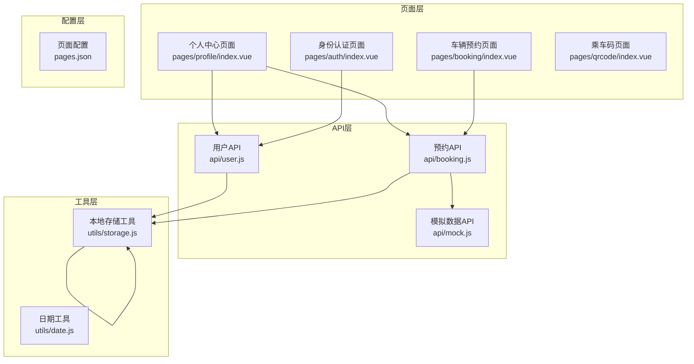
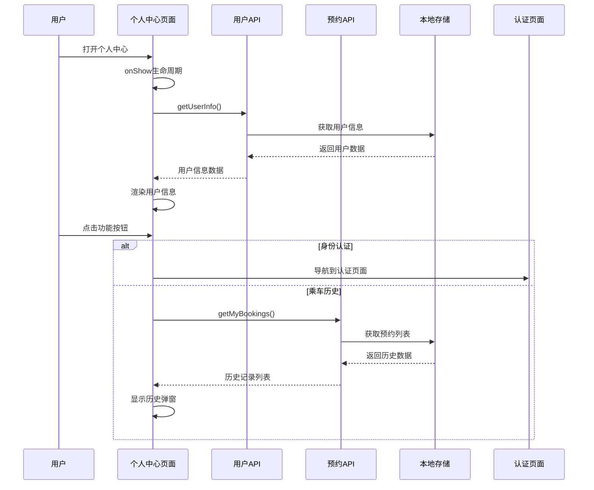
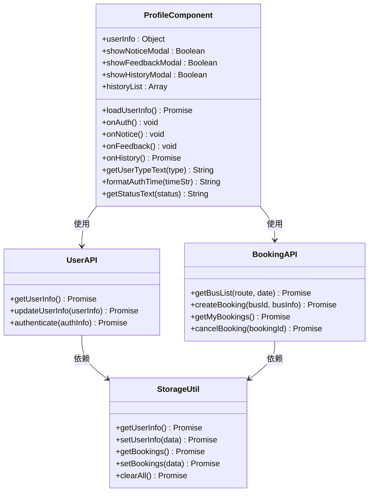
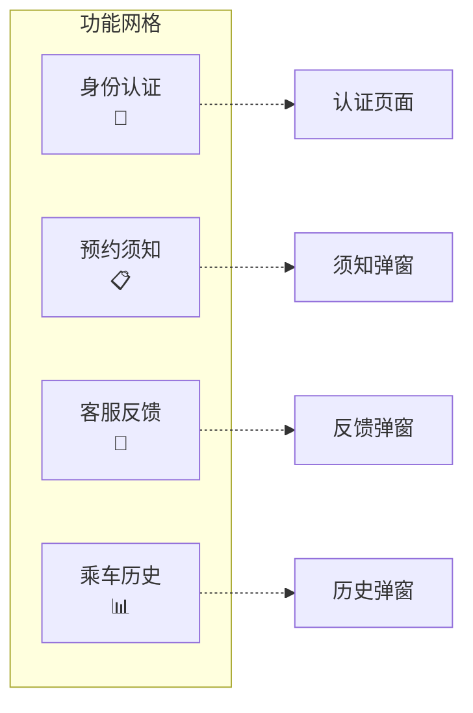
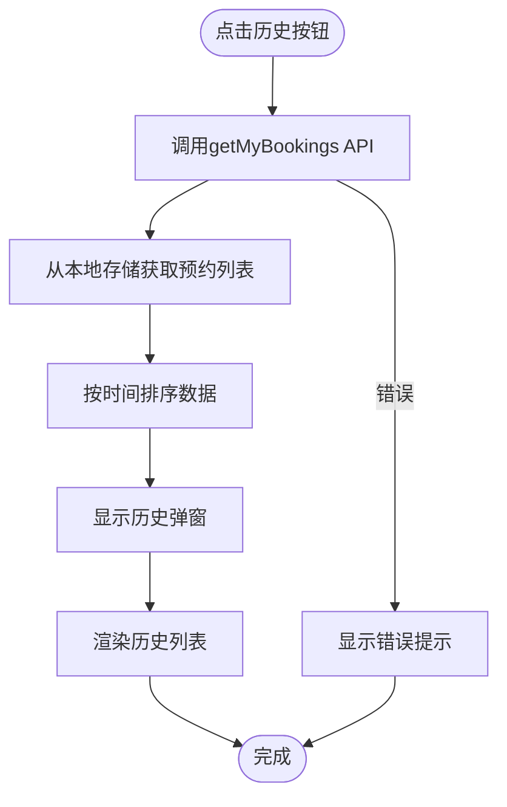
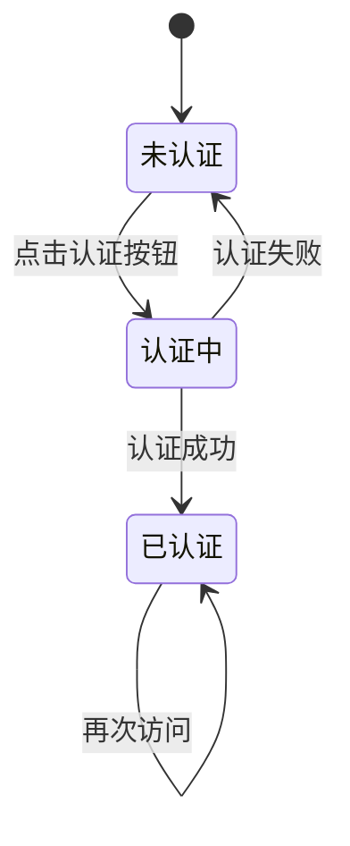
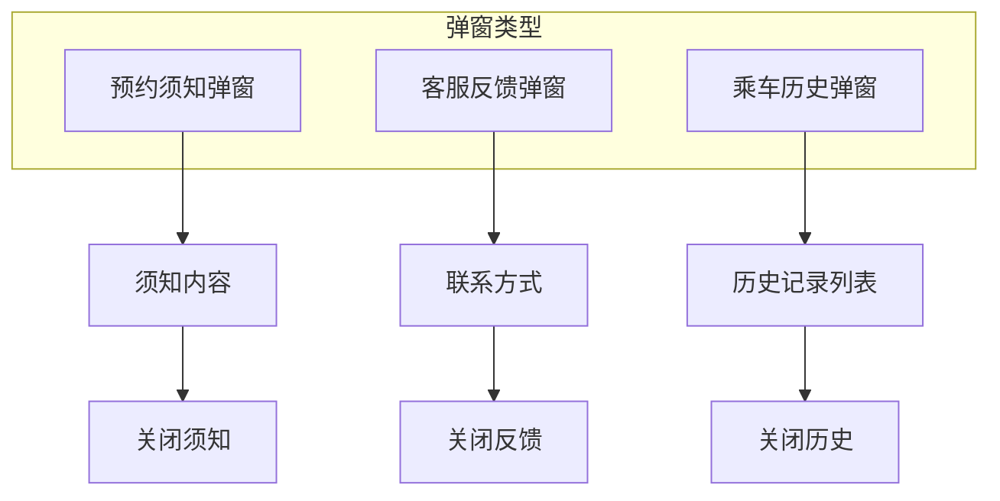
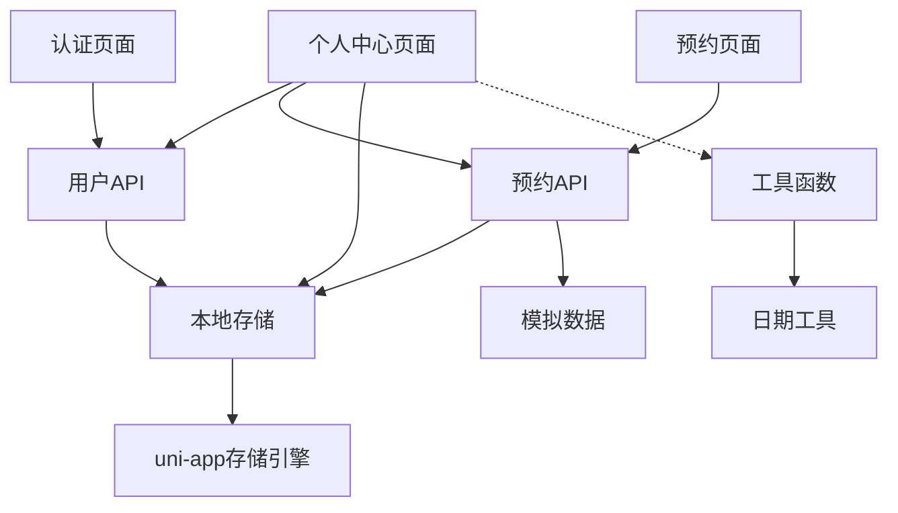

# 个人中心页面组件

<cite>
**本文档引用的文件**
- [pages/profile/index.vue](file://pages/profile/index.vue)
- [api/user.js](file://api/user.js)
- [utils/storage.js](file://utils/storage.js)
- [pages/auth/index.vue](file://pages/auth/index.vue)
- [pages/booking/index.vue](file://pages/booking/index.vue)
- [api/booking.js](file://api/booking.js)
- [api/mock.js](file://api/mock.js)
- [utils/date.js](file://utils/date.js)
- [pages.json](file://pages.json)
</cite>

## 目录
1. [简介](#简介)
2. [项目结构](#项目结构)
3. [核心组件](#核心组件)
4. [架构概览](#架构概览)
5. [详细组件分析](#详细组件分析)
6. [依赖关系分析](#依赖关系分析)
7. [性能考虑](#性能考虑)
8. [故障排除指南](#故障排除指南)
9. [结论](#结论)
10. [附录](#附录)

## 简介

个人中心页面组件是校车预约系统中的核心功能模块，负责展示用户个人信息、提供功能导航入口、管理乘车历史记录以及处理身份认证状态。该组件采用Vue.js框架构建，基于uni-app跨平台开发环境，实现了完整的用户界面交互和数据管理功能。

本组件主要包含以下核心功能：
- 用户信息展示与格式化
- 身份认证状态管理
- 功能导航设计（认证、须知、反馈、历史）
- 乘车历史管理（获取、渲染、查看详情）
- 本地存储数据持久化
- 页面间导航关系管理

## 项目结构

该项目采用模块化的文件组织结构，按照功能域进行分层：



**图表来源**
- [pages/profile/index.vue:1-595](file://pages/profile/index.vue#L1-L595)
- [api/user.js:1-128](file://api/user.js#L1-L128)
- [api/booking.js:1-165](file://api/booking.js#L1-L165)
- [utils/storage.js:1-116](file://utils/storage.js#L1-L116)

**章节来源**
- [pages.json:1-62](file://pages.json#L1-L62)
- [pages/profile/index.vue:1-595](file://pages/profile/index.vue#L1-L595)

## 核心组件

个人中心页面组件是一个完整的Vue单文件组件，包含了模板、脚本和样式三个部分。组件的核心特性包括：

### 组件架构特征
- **响应式数据管理**：使用Vue的data选项管理组件状态
- **生命周期钩子**：利用onShow钩子在页面显示时自动加载用户信息
- **异步数据处理**：支持Promise异步操作和错误处理
- **事件驱动交互**：通过点击事件处理用户操作

### 数据流设计
组件采用自上而下的数据流模式，从API层获取数据，经过格式化处理后渲染到视图层。

**章节来源**
- [pages/profile/index.vue:156-248](file://pages/profile/index.vue#L156-L248)

## 架构概览

个人中心页面组件在整个系统架构中扮演着关键角色，作为用户交互的中枢节点，连接着多个功能模块：



**图表来源**
- [pages/profile/index.vue:167-218](file://pages/profile/index.vue#L167-L218)
- [api/user.js:12-35](file://api/user.js#L12-L35)
- [api/booking.js:78-102](file://api/booking.js#L78-L102)

### 组件关系图



**图表来源**
- [pages/profile/index.vue:156-248](file://pages/profile/index.vue#L156-L248)
- [api/user.js:8-127](file://api/user.js#L8-L127)
- [api/booking.js:8-164](file://api/booking.js#L8-L164)
- [utils/storage.js:6-115](file://utils/storage.js#L6-L115)

## 详细组件分析

### 用户信息展示机制

个人中心页面的核心功能是展示用户的认证信息和个人资料。组件通过以下机制实现：

#### 数据获取流程
1. **生命周期触发**：页面显示时自动调用`loadUserInfo()`方法
2. **API调用**：通过`userApi.getUserInfo()`获取用户信息
3. **数据格式化**：对获取的数据进行格式化处理
4. **界面渲染**：根据认证状态动态渲染不同的UI

#### 认证状态判断
组件根据`userInfo.isAuthenticated`属性决定界面显示：
- 已认证：显示完整用户信息卡片
- 未认证：显示认证引导界面

**章节来源**
- [pages/profile/index.vue:171-179](file://pages/profile/index.vue#L171-L179)
- [pages/profile/index.vue:38-74](file://pages/profile/index.vue#L38-L74)

### 功能导航设计

个人中心页面提供了四个主要功能入口，每个入口都有明确的布局和交互设计：

#### 功能网格布局


**图表来源**
- [pages/profile/index.vue:4-34](file://pages/profile/index.vue#L4-L34)

#### 点击事件处理
每个功能按钮都绑定相应的处理函数：
- **身份认证**：检查认证状态，未认证时跳转到认证页面
- **预约须知**：显示须知内容弹窗
- **客服反馈**：显示联系方式弹窗
- **乘车历史**：异步获取历史数据并显示

**章节来源**
- [pages/profile/index.vue:181-218](file://pages/profile/index.vue#L181-L218)

### 历史记录管理功能

乘车历史功能是个人中心的重要组成部分，实现了完整的数据管理流程：

#### 数据获取机制


**图表来源**
- [pages/profile/index.vue:206-218](file://pages/profile/index.vue#L206-L218)
- [api/booking.js:78-102](file://api/booking.js#L78-L102)

#### 列表渲染逻辑
- **数据结构**：历史记录包含路线、日期、时间、状态等字段
- **状态显示**：不同状态使用不同的颜色标识
- **空状态处理**：无历史记录时显示提示信息

**章节来源**
- [pages/profile/index.vue:124-148](file://pages/profile/index.vue#L124-L148)
- [pages/profile/index.vue:132-146](file://pages/profile/index.vue#L132-L146)

### 身份认证状态管理

身份认证是系统的核心安全机制，个人中心页面提供了完整的认证状态管理：

#### 认证状态检查


**图表来源**
- [pages/profile/index.vue:182-194](file://pages/profile/index.vue#L182-L194)
- [pages/auth/index.vue:154-187](file://pages/auth/index.vue#L154-L187)

#### 权限控制机制
- **页面级权限**：某些功能需要认证状态才能使用
- **API级权限**：通过本地存储检查用户认证状态
- **界面状态切换**：根据认证状态动态调整界面元素

**章节来源**
- [pages/booking/index.vue:182-198](file://pages/booking/index.vue#L182-L198)
- [pages/booking/index.vue:260-295](file://pages/booking/index.vue#L260-L295)

### 页面交互设计

个人中心页面实现了丰富的用户交互体验，包括多种交互模式：

#### 弹窗系统设计


**图表来源**
- [pages/profile/index.vue:77-148](file://pages/profile/index.vue#L77-L148)

#### 加载状态管理
- **异步操作指示**：使用Promise处理异步操作
- **错误处理机制**：统一的错误提示和处理
- **用户反馈**：通过Toast和Modal提供即时反馈

**章节来源**
- [pages/profile/index.vue:206-218](file://pages/profile/index.vue#L206-L218)
- [pages/auth/index.vue:164-187](file://pages/auth/index.vue#L164-L187)

## 依赖关系分析

个人中心页面组件的依赖关系体现了清晰的分层架构：



**图表来源**
- [pages/profile/index.vue:153-154](file://pages/profile/index.vue#L153-L154)
- [api/user.js:6](file://api/user.js#L6)
- [api/booking.js:6](file://api/booking.js#L6)

### 组件耦合度分析

- **低耦合高内聚**：各模块职责明确，相互依赖程度适中
- **接口抽象**：通过API层抽象底层实现细节
- **数据流向清晰**：数据从API层流向组件，再渲染到视图

**章节来源**
- [api/user.js:12-35](file://api/user.js#L12-L35)
- [api/booking.js:14-40](file://api/booking.js#L14-L40)

## 性能考虑

个人中心页面在性能优化方面采用了多项策略：

### 数据缓存策略
- **本地存储缓存**：用户信息和预约数据存储在本地
- **避免重复请求**：页面显示时只在必要时重新加载数据
- **批量数据处理**：历史记录按需加载，避免一次性渲染大量数据

### 渲染优化
- **条件渲染**：根据认证状态动态渲染不同UI
- **虚拟滚动**：历史记录列表使用滚动容器优化渲染
- **懒加载**：弹窗内容按需加载

### 网络请求优化
- **Promise链式调用**：避免回调地狱，提高代码可读性
- **错误边界处理**：统一的错误处理机制
- **防抖处理**：避免频繁的API调用

## 故障排除指南

### 常见问题及解决方案

#### 用户信息加载失败
**问题现象**：用户信息无法正常显示
**可能原因**：
- 本地存储数据损坏
- API调用异常
- 网络连接问题

**解决步骤**：
1. 检查本地存储中是否存在`user_info`键
2. 验证API服务可用性
3. 查看控制台错误信息

#### 历史记录为空
**问题现象**：乘车历史显示为空
**可能原因**：
- 用户从未预约过
- 本地存储中没有预约数据
- 数据格式不正确

**解决步骤**：
1. 确认用户是否有预约记录
2. 检查`booking_list`存储键
3. 验证数据格式完整性

#### 认证功能异常
**问题现象**：身份认证按钮无效或认证失败
**可能原因**：
- 表单验证规则过于严格
- 本地存储写入失败
- 页面导航问题

**解决步骤**：
1. 检查表单输入验证逻辑
2. 验证本地存储权限
3. 测试页面跳转功能

**章节来源**
- [pages/profile/index.vue:173-179](file://pages/profile/index.vue#L173-L179)
- [pages/auth/index.vue:178-187](file://pages/auth/index.vue#L178-L187)

## 结论

个人中心页面组件是一个功能完整、架构清晰的Vue.js组件。它成功地实现了用户信息展示、功能导航、历史记录管理和身份认证状态管理等核心功能。组件的设计体现了以下特点：

### 技术优势
- **模块化设计**：清晰的分层架构，职责分离明确
- **异步处理**：完善的Promise异步处理机制
- **用户体验**：丰富的交互效果和友好的用户界面
- **数据管理**：合理的本地存储策略和数据格式化

### 改进建议
- **状态管理**：可以考虑引入Vuex进行全局状态管理
- **单元测试**：增加组件的单元测试覆盖率
- **性能监控**：添加性能指标监控和错误追踪
- **国际化支持**：预留多语言支持的扩展点

该组件为整个校车预约系统的用户中心提供了坚实的基础，为后续的功能扩展和维护奠定了良好的技术基础。

## 附录

### 用户数据模型说明

#### 用户信息数据结构
```javascript
{
  isAuthenticated: boolean,    // 是否已认证
  name: string,               // 用户姓名
  studentId: string,          // 学号/工号
  userType: string,           // 用户类型(student/teacher)
  authenticatedAt: string     // 认证时间(ISO格式)
}
```

#### 预约记录数据结构
```javascript
{
  id: string,                 // 预约ID
  busId: string,              // 车次ID
  route: string,              // 路线
  date: string,               // 日期(YYYY-MM-DD)
  dateDisplay: string,        // 显示日期
  time: string,               // 出发时间
  location: string,           // 上车站点
  seat: string,               // 座位号
  status: string,             // 状态(pending/completed/cancelled)
  createdAt: string           // 创建时间
}
```

### 本地存储最佳实践

#### 存储键值规范
- `user_info`: 用户认证信息
- `booking_list`: 用户预约记录列表
- `bus_data`: 车次数据统计

#### 数据持久化策略
- **数据验证**：存储前进行数据格式验证
- **错误处理**：存储失败时提供降级方案
- **数据清理**：定期清理过期或无效数据