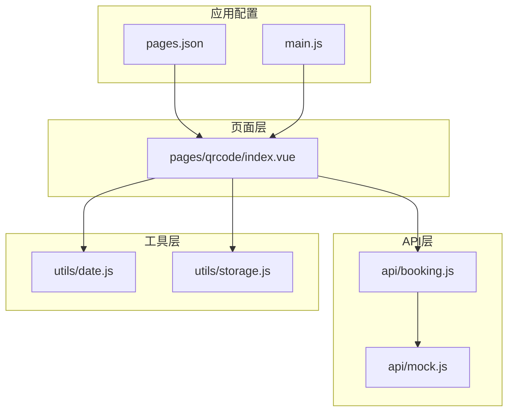
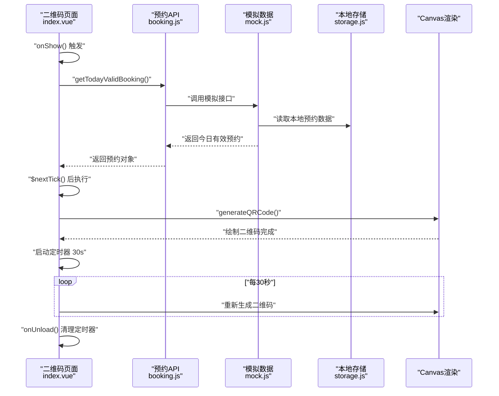
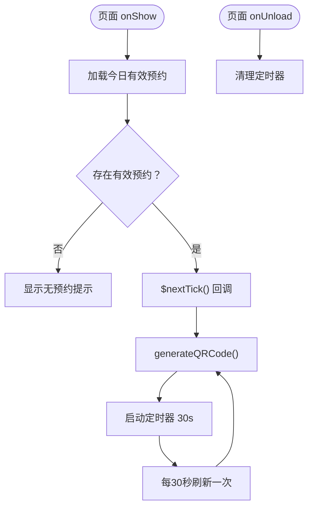
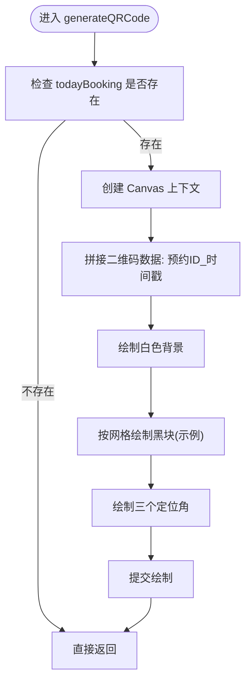
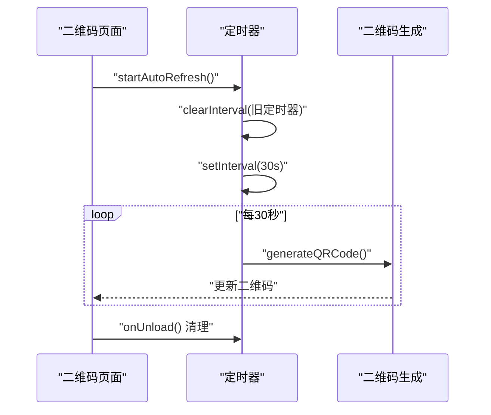
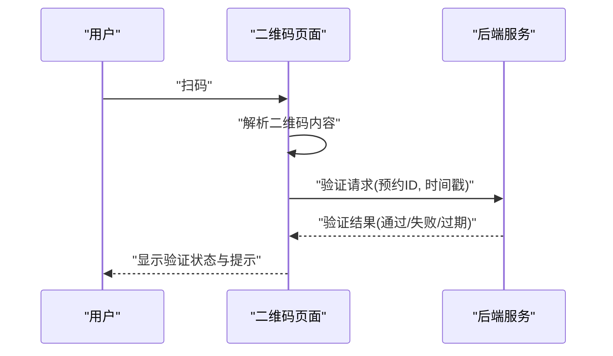
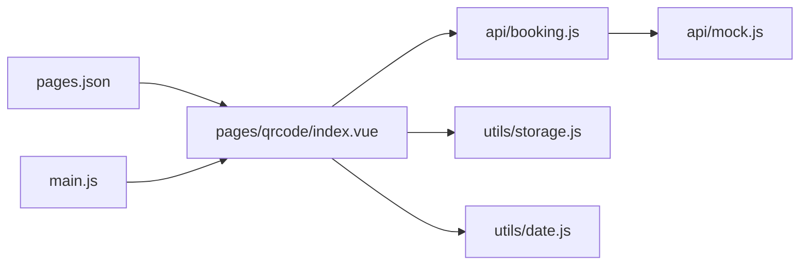

# 二维码页面组件

<cite>
**本文引用的文件**
- [pages/qrcode/index.vue](file://pages/qrcode/index.vue)
- [api/booking.js](file://api/booking.js)
- [api/mock.js](file://api/mock.js)
- [utils/date.js](file://utils/date.js)
- [utils/storage.js](file://utils/storage.js)
- [pages.json](file://pages.json)
- [main.js](file://main.js)
</cite>

## 目录
1. [简介](#简介)
2. [项目结构](#项目结构)
3. [核心组件](#核心组件)
4. [架构总览](#架构总览)
5. [详细组件分析](#详细组件分析)
6. [依赖关系分析](#依赖关系分析)
7. [性能考虑](#性能考虑)
8. [故障排查指南](#故障排查指南)
9. [结论](#结论)
10. [附录](#附录)

## 简介
本文件面向“二维码页面组件”的技术文档，聚焦以下目标：
- 解析动态二维码生成机制：Canvas API 的使用、二维码内容格式化与图像渲染流程。
- 自动刷新机制：定时器管理、数据轮询逻辑与状态同步。
- 乘车验证流程：二维码扫描处理、API 调用验证与状态反馈机制（当前为概念性说明）。
- 页面生命周期管理：onLoad 初始化、onShow 自动刷新、onUnload 清理逻辑。
- 用户界面设计：二维码显示区域、状态指示器与操作按钮布局。
- 二维码生成算法说明与性能优化建议。

## 项目结构
二维码页面位于 uni-app 项目中，采用 Vue 单文件组件（SFC）形式，配合 API 层与工具层完成数据获取、本地存储与日期处理。

图表来源
- [pages/qrcode/index.vue:1-342](file://pages/qrcode/index.vue#L1-L342)
- [api/booking.js:1-165](file://api/booking.js#L1-L165)
- [api/mock.js:1-226](file://api/mock.js#L1-L226)
- [utils/date.js:1-84](file://utils/date.js#L1-L84)
- [utils/storage.js:1-116](file://utils/storage.js#L1-L116)
- [pages.json:1-62](file://pages.json#L1-L62)
- [main.js:1-22](file://main.js#L1-L22)

章节来源
- [pages/qrcode/index.vue:1-342](file://pages/qrcode/index.vue#L1-L342)
- [pages.json:1-62](file://pages.json#L1-L62)
- [main.js:1-22](file://main.js#L1-L22)

## 核心组件
二维码页面组件负责：
- 在页面可见时加载今日有效预约并渲染二维码。
- 使用 Canvas 绘制二维码图像，并在 30 秒周期内自动刷新。
- 提供无有效预约时的引导与跳转入口。
- 在页面卸载时清理定时器，避免内存泄漏。

关键职责映射：
- 数据加载与状态：通过 API 层获取今日有效预约。
- UI 渲染：模板中根据是否存在有效预约进行条件渲染。
- 二维码生成：Canvas 绘制简易二维码网格与定位角。
- 生命周期：onShow 触发加载与刷新；onUnload 清理定时器。

章节来源
- [pages/qrcode/index.vue:60-184](file://pages/qrcode/index.vue#L60-L184)
- [api/booking.js:136-163](file://api/booking.js#L136-L163)
- [api/mock.js:205-225](file://api/mock.js#L205-L225)

## 架构总览
下图展示二维码页面与各模块之间的交互关系与数据流向。

图表来源
- [pages/qrcode/index.vue:72-101](file://pages/qrcode/index.vue#L72-L101)
- [pages/qrcode/index.vue:104-175](file://pages/qrcode/index.vue#L104-L175)
- [api/booking.js:136-163](file://api/booking.js#L136-L163)
- [api/mock.js:205-225](file://api/mock.js#L205-L225)
- [utils/storage.js:1-116](file://utils/storage.js#L1-L116)

## 详细组件分析

### 页面生命周期与控制流
- onShow(): 页面进入前台时触发，加载今日有效预约并准备渲染二维码。
- onUnload(): 页面卸载时清理定时器，防止后台继续刷新导致资源浪费。
- $nextTick(): 在 DOM 更新后执行二维码生成，确保 canvas 可用。
- 定时器策略：每次启动前先清除旧定时器，避免重复定时器叠加。

图表来源
- [pages/qrcode/index.vue:72-81](file://pages/qrcode/index.vue#L72-L81)
- [pages/qrcode/index.vue:84-101](file://pages/qrcode/index.vue#L84-L101)
- [pages/qrcode/index.vue:164-175](file://pages/qrcode/index.vue#L164-L175)

章节来源
- [pages/qrcode/index.vue:72-101](file://pages/qrcode/index.vue#L72-L101)
- [pages/qrcode/index.vue:164-175](file://pages/qrcode/index.vue#L164-L175)

### 动态二维码生成机制
- Canvas API 使用：通过 uni.createCanvasContext 获取上下文，设置尺寸并绘制。
- 内容格式化：二维码数据由“预约ID_当前时间戳”拼接而成，保证刷新时内容变化。
- 图像渲染：绘制背景、随机黑块网格（示例实现）、定位角（三个对齐标记）。
- 性能注意：当前实现为示例级网格绘制，实际项目建议使用成熟的二维码生成库以提升稳定性与兼容性。

图表来源
- [pages/qrcode/index.vue:104-141](file://pages/qrcode/index.vue#L104-L141)
- [pages/qrcode/index.vue:144-151](file://pages/qrcode/index.vue#L144-L151)
- [pages/qrcode/index.vue:154-162](file://pages/qrcode/index.vue#L154-L162)

章节来源
- [pages/qrcode/index.vue:104-141](file://pages/qrcode/index.vue#L104-L141)
- [pages/qrcode/index.vue:144-151](file://pages/qrcode/index.vue#L144-L151)
- [pages/qrcode/index.vue:154-162](file://pages/qrcode/index.vue#L154-L162)

### 自动刷新机制
- 定时器管理：每次启动前先清理旧定时器，避免重复定时器叠加。
- 刷新周期：每 30 秒调用一次 generateQRCode()。
- 状态同步：刷新仅影响二维码内容，不改变预约状态；若预约失效，页面将切换到无预约视图。

图表来源
- [pages/qrcode/index.vue:164-175](file://pages/qrcode/index.vue#L164-L175)
- [pages/qrcode/index.vue:76-81](file://pages/qrcode/index.vue#L76-L81)

章节来源
- [pages/qrcode/index.vue:164-175](file://pages/qrcode/index.vue#L164-L175)
- [pages/qrcode/index.vue:76-81](file://pages/qrcode/index.vue#L76-L81)

### 乘车验证流程（概念说明）
当前页面未实现扫码验证的具体 API 调用与状态反馈逻辑。可参考如下概念流程：
- 扫码触发：页面监听扫码事件（如 uni.scanCode），获取二维码内容。
- 内容解析：解析二维码中的预约标识与时间戳。
- 验证请求：向后端发起验证请求，携带预约标识与设备信息。
- 状态反馈：根据响应结果更新页面状态（成功/失败/过期等），并给出提示。

说明
- 当前代码未包含扫码与验证的具体实现，以上为概念性流程示意。

### 用户界面设计
- 有效预约视图：展示二维码画布、预约信息（路线、日期时间、候车位置、座位号）、使用说明。
- 无有效预约视图：显示空状态图标、提示文本与“去预约”按钮。
- 布局与样式：卡片式容器、阴影与圆角、渐变背景、提示气泡与强调色。

章节来源
- [pages/qrcode/index.vue:1-58](file://pages/qrcode/index.vue#L1-L58)
- [pages/qrcode/index.vue:187-341](file://pages/qrcode/index.vue#L187-L341)

### 数据来源与格式化
- 今日有效预约：通过 API 层的 getTodayValidBooking() 获取，当前使用 mock 数据。
- 本地存储：使用 utils/storage.js 封装的本地存储方法，便于后续替换为后端 API。
- 日期处理：utils/date.js 提供日期格式化与过期判断等工具，可用于扩展预约有效性校验。

章节来源
- [api/booking.js:136-163](file://api/booking.js#L136-L163)
- [api/mock.js:205-225](file://api/mock.js#L205-L225)
- [utils/storage.js:1-116](file://utils/storage.js#L1-L116)
- [utils/date.js:1-84](file://utils/date.js#L1-L84)

## 依赖关系分析
- 组件依赖：二维码页面依赖 API 层与工具层；API 层依赖模拟数据与本地存储。
- 配置依赖：页面注册与 tabbar 配置由 pages.json 管理；运行时适配由 main.js 引入。

图表来源
- [pages/qrcode/index.vue:60-61](file://pages/qrcode/index.vue#L60-L61)
- [api/booking.js:6](file://api/booking.js#L6)
- [api/mock.js:1-5](file://api/mock.js#L1-L5)
- [utils/storage.js:1-4](file://utils/storage.js#L1-L4)
- [utils/date.js:1-3](file://utils/date.js#L1-L3)
- [pages.json:1-62](file://pages.json#L1-L62)
- [main.js:1-22](file://main.js#L1-L22)

章节来源
- [pages/qrcode/index.vue:60-61](file://pages/qrcode/index.vue#L60-L61)
- [api/booking.js:6](file://api/booking.js#L6)
- [pages.json:1-62](file://pages.json#L1-L62)
- [main.js:1-22](file://main.js#L1-L22)

## 性能考虑
- Canvas 绘制优化
  - 当前实现为示例网格绘制，建议使用成熟的二维码生成库，减少自定义绘制开销。
  - 控制网格单元大小与绘制复杂度，避免在低端设备上出现卡顿。
- 定时器管理
  - 启动前清理旧定时器，避免重复定时器导致的资源浪费。
  - 在页面隐藏或不可见时可暂停刷新，回到前台再恢复。
- 数据轮询
  - 30 秒刷新频率合理，但可根据业务需要调整；同时应避免在短时间内频繁请求。
- 本地存储
  - 使用本地存储减少网络请求，提高首屏渲染速度；注意数据一致性与过期处理。

## 故障排查指南
- 二维码不显示
  - 检查 todayBooking 是否存在且有效；确认 $nextTick 回调是否执行。
  - 确认 canvas 元素已渲染，尺寸设置正确。
- 刷新无效
  - 检查定时器是否被清理或重复启动；确认 generateQRCode() 是否被调用。
- 无有效预约
  - 确认本地存储中是否存在今日有效预约；检查状态字段与日期匹配逻辑。
- 生命周期问题
  - 确保 onUnload 中清理定时器；避免页面切换后仍继续刷新。

章节来源
- [pages/qrcode/index.vue:72-81](file://pages/qrcode/index.vue#L72-L81)
- [pages/qrcode/index.vue:104-141](file://pages/qrcode/index.vue#L104-L141)
- [pages/qrcode/index.vue:164-175](file://pages/qrcode/index.vue#L164-L175)
- [api/mock.js:205-225](file://api/mock.js#L205-L225)

## 结论
二维码页面组件通过 Canvas 实现了简易的动态二维码渲染，并结合定时器实现了 30 秒自动刷新。页面生命周期管理完善，具备良好的可维护性。建议在生产环境中引入成熟的二维码生成库，并补充扫码验证与状态反馈机制，以满足实际乘车场景的需求。

## 附录
- 页面注册与 tabbar 配置：见 pages.json。
- 运行时适配：见 main.js。
- 二维码生成算法说明：当前为示例网格绘制，建议使用专业库替代。

章节来源
- [pages.json:1-62](file://pages.json#L1-L62)
- [main.js:1-22](file://main.js#L1-L22)