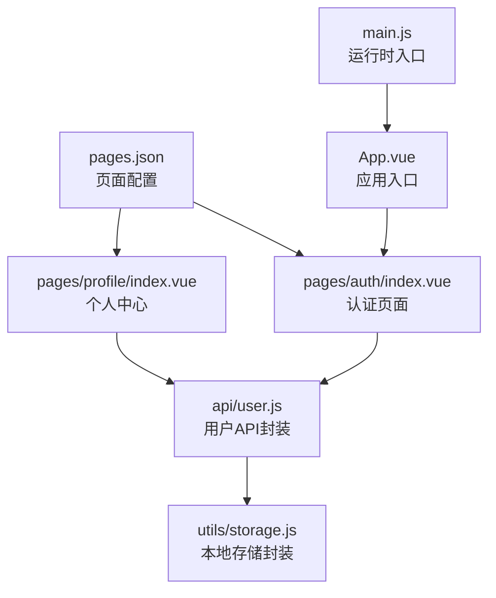
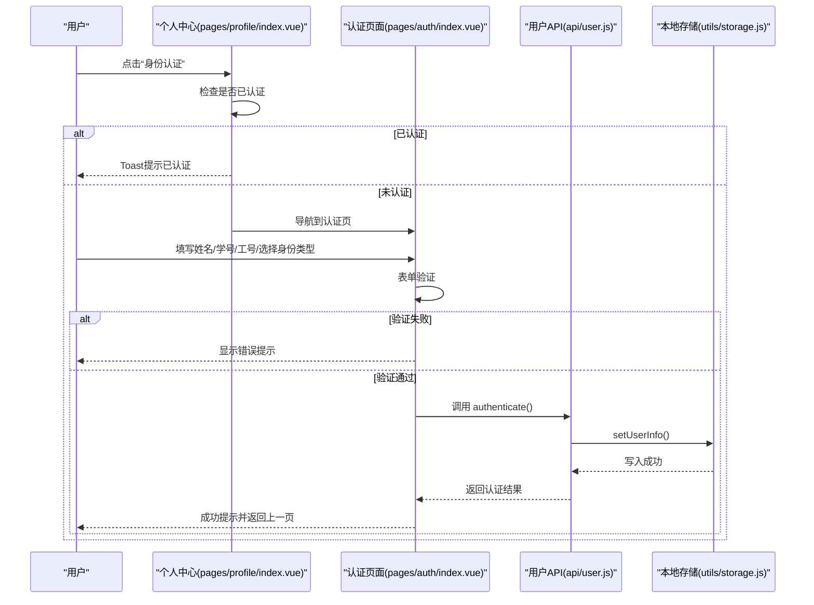
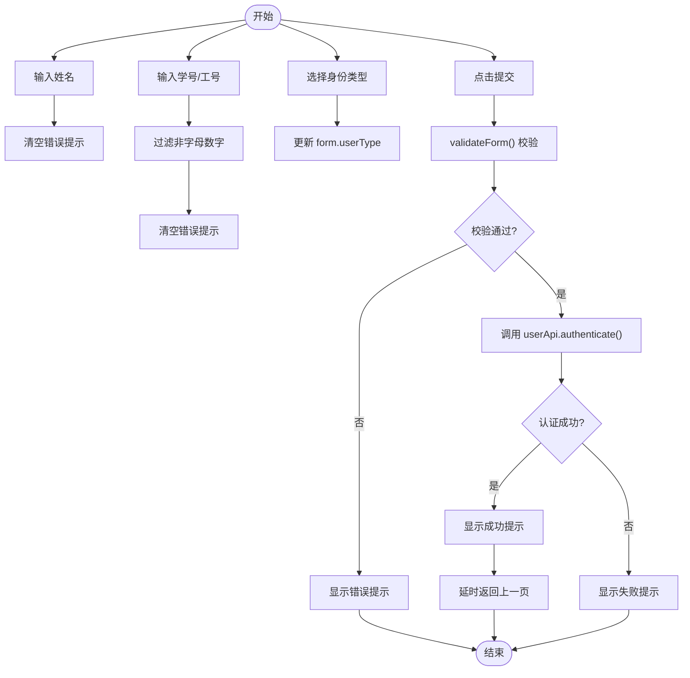
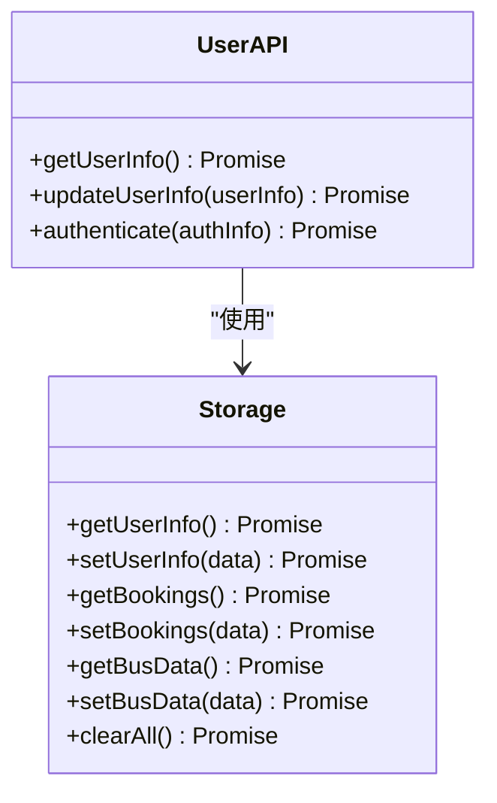
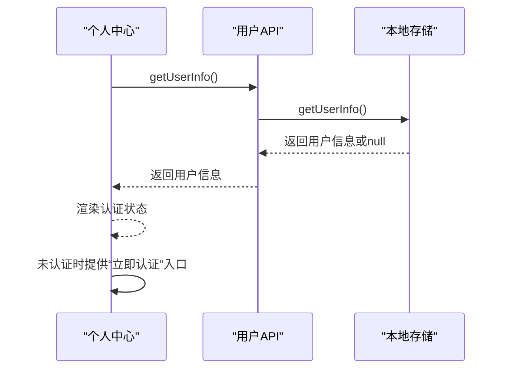
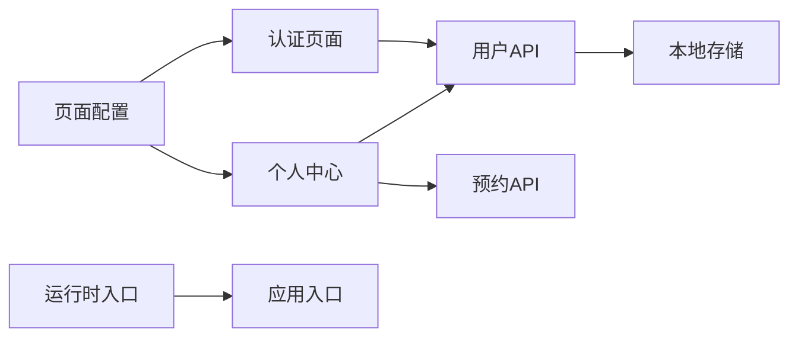

# 认证页面组件

<cite>
**本文引用的文件**
- [pages/auth/index.vue](file://pages/auth/index.vue)
- [api/user.js](file://api/user.js)
- [utils/storage.js](file://utils/storage.js)
- [pages/profile/index.vue](file://pages/profile/index.vue)
- [pages.json](file://pages.json)
- [App.vue](file://App.vue)
- [main.js](file://main.js)
</cite>

## 目录
1. [简介](#简介)
2. [项目结构](#项目结构)
3. [核心组件](#核心组件)
4. [架构总览](#架构总览)
5. [详细组件分析](#详细组件分析)
6. [依赖关系分析](#依赖关系分析)
7. [性能考虑](#性能考虑)
8. [故障排查指南](#故障排查指南)
9. [结论](#结论)
10. [附录](#附录)

## 简介
本文件针对“认证页面组件”进行系统性技术文档整理，重点覆盖以下方面：
- 身份类型选择功能：radio按钮组实现、用户类型切换与表单状态联动
- 表单验证机制：输入字段验证、错误提示显示、提交条件检查
- 用户信息收集流程：姓名输入、学号/工号验证与身份信息存储
- 本地存储机制：用户信息持久化、存储格式设计与数据恢复逻辑
- 认证状态管理：认证标志设置、权限控制与页面跳转逻辑
- 数据传递与状态同步：从认证页到主页面（个人中心）的数据流
- 验证规则说明与用户体验优化建议

## 项目结构
该应用采用 uni-app 多端统一框架，页面以功能模块划分，认证页面位于 pages/auth/index.vue，用户信息通过 api/user.js 与 utils/storage.js 进行读写，个人中心 pages/profile/index.vue 展示认证状态并触发认证流程。

图表来源
- [pages/auth/index.vue:1-385](file://pages/auth/index.vue#L1-L385)
- [api/user.js:1-128](file://api/user.js#L1-L128)
- [utils/storage.js:1-116](file://utils/storage.js#L1-L116)
- [pages/profile/index.vue:1-595](file://pages/profile/index.vue#L1-L595)
- [pages.json:1-62](file://pages.json#L1-L62)
- [App.vue:1-32](file://App.vue#L1-L32)
- [main.js:1-22](file://main.js#L1-L22)

章节来源
- [pages/auth/index.vue:1-385](file://pages/auth/index.vue#L1-L385)
- [pages/profile/index.vue:1-595](file://pages/profile/index.vue#L1-L595)
- [pages.json:1-62](file://pages.json#L1-L62)

## 核心组件
- 认证页面组件：负责收集用户姓名、学号/工号、身份类型，并执行表单验证与提交
- 用户API封装：提供获取/更新用户信息、身份认证等方法，当前基于本地存储
- 本地存储封装：提供用户信息、预约列表、车次数据等的读写能力
- 个人中心页面：展示认证状态，未认证时引导进入认证流程

章节来源
- [pages/auth/index.vue:100-189](file://pages/auth/index.vue#L100-L189)
- [api/user.js:8-127](file://api/user.js#L8-L127)
- [utils/storage.js:6-115](file://utils/storage.js#L6-L115)
- [pages/profile/index.vue:152-248](file://pages/profile/index.vue#L152-L248)

## 架构总览
认证流程从个人中心触发，导航到认证页面，填写表单并提交；认证成功后，用户信息被持久化到本地存储，个人中心页面在显示时读取该信息并更新界面状态。

图表来源
- [pages/profile/index.vue:181-194](file://pages/profile/index.vue#L181-L194)
- [pages/auth/index.vue:135-187](file://pages/auth/index.vue#L135-L187)
- [api/user.js:72-100](file://api/user.js#L72-L100)
- [utils/storage.js:27-36](file://utils/storage.js#L27-L36)

## 详细组件分析

### 认证页面组件（pages/auth/index.vue）
- 表单字段与状态
  - 姓名：双向绑定到 form.name，输入时清空错误提示
  - 学号/工号：双向绑定到 form.studentId，输入时过滤非字母数字字符，清空错误提示
  - 身份类型：双向绑定到 form.userType，默认为 student，支持点击切换
  - 错误提示：errorMsg 字段承载错误消息
  - 提交状态：submitting 控制按钮禁用与文案
- 身份类型选择器
  - 使用两个 type-item 区块模拟 radio 组合，选中态通过 type-active 类切换
  - 点击事件调用 selectUserType(type)，更新 form.userType
- 表单验证
  - validateForm() 对姓名与学号/工号进行基础长度校验
  - 校验失败时设置 errorMsg 并阻止提交
- 提交流程
  - onSubmit() 先执行 validateForm()，再调用 userApi.authenticate(form)
  - 成功：显示成功提示，延时返回上一页
  - 失败：捕获异常，设置 errorMsg 并显示失败提示
  - finally：关闭提交状态

图表来源
- [pages/auth/index.vue:117-187](file://pages/auth/index.vue#L117-L187)
- [api/user.js:72-100](file://api/user.js#L72-L100)

章节来源
- [pages/auth/index.vue:115-187](file://pages/auth/index.vue#L115-L187)

### 用户API封装（api/user.js）
- getUserInfo()：从本地存储读取用户信息
- updateUserInfo(userInfo)：更新本地存储中的用户信息
- authenticate(authInfo)：本地认证逻辑
  - 基础校验：姓名至少2字符，学号/工号至少6位
  - 生成用户信息对象：包含认证标志、姓名、学号/工号、身份类型、认证时间
  - 调用 storage.setUserInfo() 持久化，成功后 resolve 用户信息

图表来源
- [api/user.js:8-127](file://api/user.js#L8-L127)
- [utils/storage.js:6-115](file://utils/storage.js#L6-L115)

章节来源
- [api/user.js:8-127](file://api/user.js#L8-L127)

### 本地存储封装（utils/storage.js）
- 用户信息：键 user_info，提供 get/set 方法
- 预约列表：键 booking_list
- 车次数据：键 bus_data
- 清理：clearAll() 清空所有本地数据
- 所有方法均返回 Promise，便于后续替换为后端 API

章节来源
- [utils/storage.js:6-115](file://utils/storage.js#L6-L115)

### 个人中心页面（pages/profile/index.vue）
- 页面加载时调用 userApi.getUserInfo() 获取用户信息并渲染
- 未认证时展示“立即认证”按钮，点击后导航到认证页
- 已认证时展示用户头像、姓名、身份类型、学号/工号、认证时间与“已认证”徽章

图表来源
- [pages/profile/index.vue:172-179](file://pages/profile/index.vue#L172-L179)
- [pages/profile/index.vue:181-194](file://pages/profile/index.vue#L181-L194)
- [api/user.js:12-13](file://api/user.js#L12-L13)
- [utils/storage.js:10-21](file://utils/storage.js#L10-L21)

章节来源
- [pages/profile/index.vue:152-248](file://pages/profile/index.vue#L152-L248)

## 依赖关系分析
- 认证页面依赖用户API封装与本地存储
- 个人中心依赖用户API封装与预约API（用于历史记录）
- 页面注册与导航由 pages.json 管理
- 应用入口由 main.js 与 App.vue 组成

图表来源
- [pages/auth/index.vue:100](file://pages/auth/index.vue#L100)
- [pages/profile/index.vue:154](file://pages/profile/index.vue#L154)
- [api/user.js:6](file://api/user.js#L6)
- [utils/storage.js:6](file://utils/storage.js#L6)
- [pages.json:22-26](file://pages.json#L22-L26)
- [main.js:1](file://main.js#L1)
- [App.vue:1](file://App.vue#L1)

章节来源
- [pages/auth/index.vue:100](file://pages/auth/index.vue#L100)
- [pages/profile/index.vue:154](file://pages/profile/index.vue#L154)
- [api/user.js:6](file://api/user.js#L6)
- [utils/storage.js:6](file://utils/storage.js#L6)
- [pages.json:22-26](file://pages.json#L22-L26)
- [main.js:1](file://main.js#L1)
- [App.vue:1](file://App.vue#L1)

## 性能考虑
- 输入过滤与验证在前端即时执行，减少无效请求
- 本地存储读写为异步 Promise，避免阻塞主线程
- 认证成功后延迟返回，避免频繁导航导致的闪烁
- 样式使用 scoped 与过渡动画，保证交互流畅度

## 故障排查指南
- 表单验证失败
  - 症状：点击提交出现错误提示
  - 排查：确认姓名至少2字符、学号/工号至少6位
  - 位置参考：[pages/auth/index.vue:135-152](file://pages/auth/index.vue#L135-L152)
- 认证失败
  - 症状：提交后显示失败提示
  - 排查：查看网络或本地存储写入是否异常；检查本地存储键 user_info 是否存在
  - 位置参考：[pages/auth/index.vue:178-186](file://pages/auth/index.vue#L178-L186)
- 个人中心未显示认证状态
  - 症状：未认证状态下未出现“立即认证”入口
  - 排查：确认 user_info 是否正确写入；检查 getUserInfo() 返回值
  - 位置参考：[pages/profile/index.vue:172-179](file://pages/profile/index.vue#L172-L179)
- 页面跳转异常
  - 症状：无法从个人中心跳转到认证页
  - 排查：确认 pages.json 中认证页路径配置正确
  - 位置参考：[pages.json:22-26](file://pages.json#L22-L26)

章节来源
- [pages/auth/index.vue:135-187](file://pages/auth/index.vue#L135-L187)
- [pages/profile/index.vue:172-194](file://pages/profile/index.vue#L172-L194)
- [pages.json:22-26](file://pages.json#L22-L26)

## 结论
认证页面组件通过简洁的表单与本地存储实现了身份认证流程，具备良好的可扩展性与可维护性。后续可直接替换用户API与本地存储为后端服务，无需修改页面逻辑。建议在生产环境中补充更严格的输入校验与国际化提示，并完善错误上报与埋点。

## 附录

### 表单验证规则说明
- 姓名
  - 必填；最小长度：2
  - 触发时机：每次输入与提交前
  - 位置参考：[pages/auth/index.vue:135-152](file://pages/auth/index.vue#L135-L152)
- 学号/工号
  - 必填；最小长度：6
  - 输入过滤：仅保留字母数字字符
  - 触发时机：每次输入与提交前
  - 位置参考：[pages/auth/index.vue:122-128](file://pages/auth/index.vue#L122-L128)、[pages/auth/index.vue:135-152](file://pages/auth/index.vue#L135-L152)
- 身份类型
  - 默认：student
  - 切换：点击“学生/教职工”区域更新 form.userType
  - 位置参考：[pages/auth/index.vue:130-134](file://pages/auth/index.vue#L130-L134)

### 用户体验优化建议
- 实时校验：在输入过程中即时显示校验状态与错误提示
- 输入增强：对学号/工号增加占位符与输入法优化
- 提交反馈：提交中按钮禁用与加载指示
- 错误友好：错误文案明确且提供修复建议
- 状态同步：认证成功后立即刷新个人中心状态