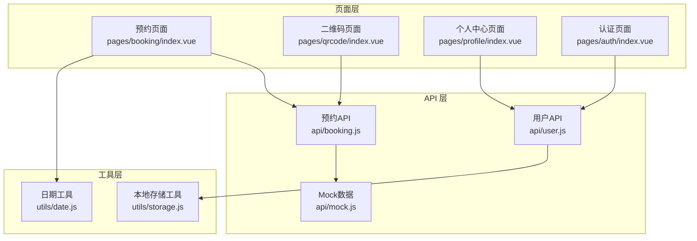
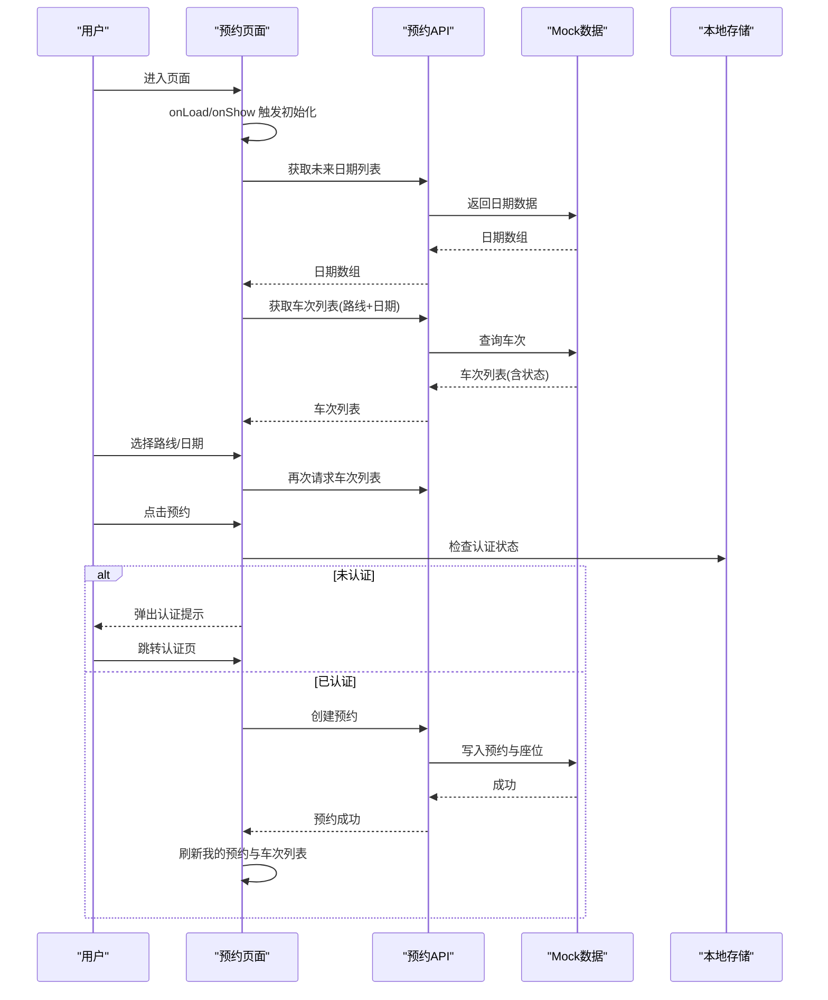
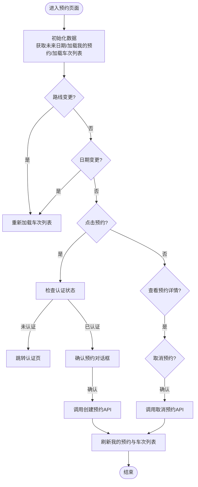
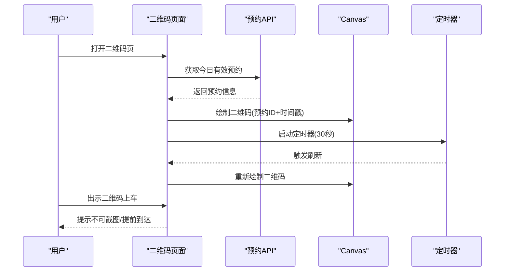
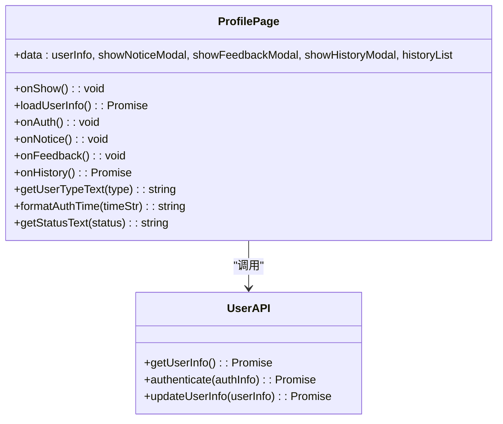
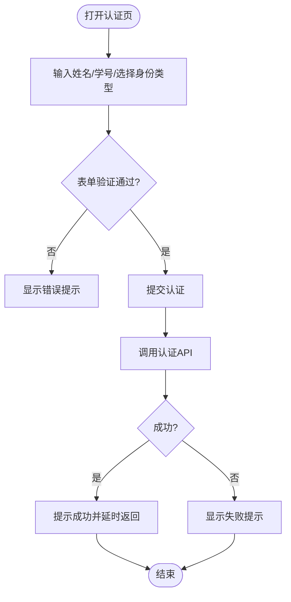
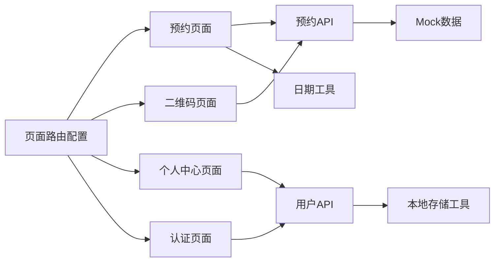

# 页面组件详解

<cite>
**本文档引用的文件**
- [pages/booking/index.vue](file://pages/booking/index.vue)
- [pages/qrcode/index.vue](file://pages/qrcode/index.vue)
- [pages/profile/index.vue](file://pages/profile/index.vue)
- [pages/auth/index.vue](file://pages/auth/index.vue)
- [pages/index/index.vue](file://pages/index/index.vue)
- [api/booking.js](file://api/booking.js)
- [api/user.js](file://api/user.js)
- [api/mock.js](file://api/mock.js)
- [utils/date.js](file://utils/date.js)
- [utils/storage.js](file://utils/storage.js)
- [pages.json](file://pages.json)
- [App.vue](file://App.vue)
</cite>

## 目录
1. [简介](#简介)
2. [项目结构](#项目结构)
3. [核心组件](#核心组件)
4. [架构总览](#架构总览)
5. [详细组件分析](#详细组件分析)
6. [依赖关系分析](#依赖关系分析)
7. [性能考虑](#性能考虑)
8. [故障排除指南](#故障排除指南)
9. [结论](#结论)
10. [附录](#附录)

## 简介
本项目是一个基于 uni-app 的学校校车调度系统，围绕“预约—乘车—个人中心”三大核心场景构建。本文档深入解析四个核心页面组件：预约页面（双向路线选择、日期选择、车次列表与预约）、二维码页面（动态生成、自动刷新与乘车验证）、个人中心页面（身份认证入口、历史记录管理与功能导航）以及认证页面（表单验证、身份类型选择与本地存储）。同时，文档涵盖各组件的生命周期管理、状态更新、事件处理与用户交互逻辑，并说明组件间通信模式与数据流转。

## 项目结构
项目采用 uni-app 多页面架构，页面按功能模块划分：
- pages/booking/index.vue：车辆预约与我的预约管理
- pages/qrcode/index.vue：乘车码与乘车验证
- pages/profile/index.vue：个人中心与功能导航
- pages/auth/index.vue：身份认证
- api/*：业务 API 封装与 mock 数据
- utils/*：通用工具函数（日期、本地存储）
- pages.json：页面路由与 tabbar 配置
- App.vue：应用生命周期与全局样式

**图表来源**
- [pages/booking/index.vue:1-575](file://pages/booking/index.vue#L1-L575)
- [pages/qrcode/index.vue:1-342](file://pages/qrcode/index.vue#L1-L342)
- [pages/profile/index.vue:1-595](file://pages/profile/index.vue#L1-L595)
- [pages/auth/index.vue:1-385](file://pages/auth/index.vue#L1-L385)
- [api/booking.js:1-165](file://api/booking.js#L1-L165)
- [api/user.js:1-128](file://api/user.js#L1-L128)
- [api/mock.js:1-226](file://api/mock.js#L1-L226)
- [utils/date.js:1-84](file://utils/date.js#L1-L84)
- [utils/storage.js:1-116](file://utils/storage.js#L1-L116)

**章节来源**
- [pages.json:1-62](file://pages.json#L1-L62)
- [App.vue:1-32](file://App.vue#L1-L32)

## 核心组件
- 预约页面：支持双向路线选择、日期滚动选择、车次列表展示与预约操作；集成认证拦截与状态管理。
- 二维码页面：根据今日有效预约动态生成乘车码，定时刷新机制保障有效性；提供乘车须知与跳转入口。
- 个人中心页面：统一的功能入口（认证、须知、反馈、历史），展示用户认证状态与基础信息，管理历史记录弹窗。
- 认证页面：表单输入与实时校验、身份类型选择、提交认证并回退。

**章节来源**
- [pages/booking/index.vue:98-297](file://pages/booking/index.vue#L98-L297)
- [pages/qrcode/index.vue:60-184](file://pages/qrcode/index.vue#L60-L184)
- [pages/profile/index.vue:152-248](file://pages/profile/index.vue#L152-L248)
- [pages/auth/index.vue:99-189](file://pages/auth/index.vue#L99-L189)

## 架构总览
系统采用“页面组件 + API 封装 + 工具函数”的分层架构。页面组件负责视图与交互，API 封装负责数据访问与业务逻辑，工具函数提供日期与本地存储能力。页面通过 uni-app 生命周期触发数据加载与状态更新，组件间通过页面跳转与本地存储实现松耦合通信。

**图表来源**
- [pages/booking/index.vue:114-135](file://pages/booking/index.vue#L114-L135)
- [pages/booking/index.vue:148-162](file://pages/booking/index.vue#L148-L162)
- [pages/booking/index.vue:176-247](file://pages/booking/index.vue#L176-L247)
- [api/booking.js:14-40](file://api/booking.js#L14-L40)
- [api/mock.js:49-93](file://api/mock.js#L49-L93)

## 详细组件分析

### 预约页面（双向路线选择、日期选择、车次列表与预约）
- 双向路线选择：使用 picker 控件提供“长江新区至武昌”和“武昌至长江新区”两个选项，默认选中第一个。
- 日期选择：通过滚动容器展示未来 N 天日期，点击切换当前选中日期，高亮显示当前日期。
- 车次列表：根据路线与日期动态加载，展示发车时间、剩余座位、出发地点与预约按钮；按钮状态随座位状态变化。
- 预约功能：检查认证状态，未认证则引导跳转认证页；确认预约后调用 API 创建预约，成功后刷新我的预约与车次列表。
- 取消预约：在“我的预约”卡片中点击可取消，二次确认后调用取消 API 并更新本地数据。

**图表来源**
- [pages/booking/index.vue:114-135](file://pages/booking/index.vue#L114-L135)
- [pages/booking/index.vue:164-174](file://pages/booking/index.vue#L164-L174)
- [pages/booking/index.vue:176-247](file://pages/booking/index.vue#L176-L247)
- [pages/booking/index.vue:259-295](file://pages/booking/index.vue#L259-L295)

**章节来源**
- [pages/booking/index.vue:98-297](file://pages/booking/index.vue#L98-L297)
- [utils/date.js:10-33](file://utils/date.js#L10-L33)
- [api/booking.js:14-102](file://api/booking.js#L14-L102)
- [api/mock.js:49-203](file://api/mock.js#L49-L203)

### 二维码页面（动态生成、自动刷新与乘车验证）
- 今日有效预约：进入页面时加载今日待出行的预约，若存在则渲染二维码区域与乘车信息。
- 动态生成：使用 canvas 绘制简易二维码图案（定位角、随机黑点），以预约 ID 与时间戳为数据源。
- 自动刷新：启动定时器每 30 秒重新生成二维码，确保乘车时的有效性。
- 乘车验证：页面提供使用说明与跳转入口，强调二维码每 30 秒刷新、不可截图等规则。
- 生命周期：页面显示时加载数据，页面卸载时清理定时器，避免内存泄漏。

**图表来源**
- [pages/qrcode/index.vue:72-101](file://pages/qrcode/index.vue#L72-L101)
- [pages/qrcode/index.vue:103-183](file://pages/qrcode/index.vue#L103-L183)

**章节来源**
- [pages/qrcode/index.vue:60-184](file://pages/qrcode/index.vue#L60-L184)
- [api/booking.js:139-163](file://api/booking.js#L139-L163)
- [api/mock.js:209-225](file://api/mock.js#L209-L225)

### 个人中心页面（身份认证入口、历史记录管理与功能导航）
- 功能入口：提供“身份认证”“预约须知”“客服反馈”“乘车历史”四个快捷入口，点击跳转对应功能或弹窗。
- 身份信息：展示已认证用户的姓名、学号/工号、身份类型与认证时间；未认证时显示引导按钮。
- 历史记录：拉取我的预约列表并在弹窗中展示，支持关闭与滚动查看。
- 交互细节：点击“身份认证”时若已认证则提示；点击“乘车历史”时异步加载并展示。

**图表来源**
- [pages/profile/index.vue:152-248](file://pages/profile/index.vue#L152-L248)
- [api/user.js:12-42](file://api/user.js#L12-L42)

**章节来源**
- [pages/profile/index.vue:152-248](file://pages/profile/index.vue#L152-L248)
- [api/user.js:12-42](file://api/user.js#L12-L42)

### 认证页面（表单验证、身份类型选择与本地存储）
- 表单字段：姓名、学号/工号、身份类型（学生/教职工），必填项。
- 实时校验：姓名至少 2 字符，学号/工号至少 6 位；输入时清除错误提示。
- 身份类型：点击切换选中状态，视觉高亮。
- 提交流程：验证通过后调用认证 API，成功后提示并延时返回上一页；失败时显示错误信息。
- 本地存储：认证成功后写入用户信息到本地存储，供其他页面读取。

**图表来源**
- [pages/auth/index.vue:115-189](file://pages/auth/index.vue#L115-L189)
- [api/user.js:72-100](file://api/user.js#L72-L100)

**章节来源**
- [pages/auth/index.vue:99-189](file://pages/auth/index.vue#L99-L189)
- [api/user.js:72-100](file://api/user.js#L72-L100)
- [utils/storage.js:10-37](file://utils/storage.js#L10-L37)

## 依赖关系分析
- 页面到 API：预约页面与二维码页面均依赖预约 API；个人中心依赖用户 API；认证页面依赖用户 API。
- API 到工具：预约 API 使用 mock 数据；用户 API 使用本地存储工具。
- 工具到页面：日期工具被预约页面使用；本地存储工具被用户 API 使用。
- 页面路由：pages.json 定义页面路径与 tabbar 导航，实现页面间跳转。

**图表来源**
- [pages.json:1-62](file://pages.json#L1-L62)
- [api/booking.js:1-165](file://api/booking.js#L1-L165)
- [api/user.js:1-128](file://api/user.js#L1-L128)
- [api/mock.js:1-226](file://api/mock.js#L1-L226)
- [utils/date.js:1-84](file://utils/date.js#L1-L84)
- [utils/storage.js:1-116](file://utils/storage.js#L1-L116)

**章节来源**
- [pages.json:1-62](file://pages.json#L1-L62)

## 性能考虑
- 数据加载策略：页面 onShow 时刷新数据，避免重复请求；车次列表按路线与日期筛选，减少无效渲染。
- 本地缓存：使用本地存储缓存用户信息与预约数据，降低网络请求频率。
- 图形绘制：二维码使用 canvas 绘制，定时器每 30 秒刷新，避免频繁重绘导致卡顿。
- 交互优化：按钮禁用态与状态类名控制，减少不必要的 DOM 更新。

[本节为通用指导，无需特定文件来源]

## 故障排除指南
- 预约失败：检查网络状态与后端接口可用性；查看控制台错误信息；确认座位状态与是否已预约。
- 二维码不刷新：确认定时器是否正常启动与清理；检查页面生命周期 onUnload 是否执行。
- 认证失败：核对姓名与学号长度；查看错误提示；确认本地存储权限。
- 历史记录为空：确认本地存储中是否存在预约数据；检查过滤条件（仅显示待出行）。

**章节来源**
- [pages/booking/index.vue:155-161](file://pages/booking/index.vue#L155-L161)
- [pages/qrcode/index.vue:76-81](file://pages/qrcode/index.vue#L76-L81)
- [pages/auth/index.vue:178-187](file://pages/auth/index.vue#L178-L187)
- [api/mock.js:158-169](file://api/mock.js#L158-L169)

## 结论
本系统通过清晰的页面分层与 API 抽象，实现了从预约到乘车再到个人中心的完整闭环。预约页面提供直观的双向路线与日期选择，二维码页面具备动态刷新机制保障乘车验证，个人中心整合功能入口与历史记录，认证页面完成基础表单验证与本地存储。组件间通过页面跳转与本地存储实现松耦合通信，具备良好的扩展性与维护性。

[本节为总结，无需特定文件来源]

## 附录
- 页面路由与 tabbar 配置：见 pages.json。
- 应用生命周期：见 App.vue。
- 页面入口示例：pages/index/index.vue。

**章节来源**
- [pages.json:1-62](file://pages.json#L1-L62)
- [App.vue:1-32](file://App.vue#L1-L32)
- [pages/index/index.vue:1-53](file://pages/index/index.vue#L1-L53)