# 预约页面组件

<cite>
**本文档引用的文件**
- [pages/booking/index.vue](file://pages/booking/index.vue)
- [api/booking.js](file://api/booking.js)
- [utils/date.js](file://utils/date.js)
- [api/user.js](file://api/user.js)
- [pages/auth/index.vue](file://pages/auth/index.vue)
- [api/mock.js](file://api/mock.js)
- [utils/storage.js](file://utils/storage.js)
- [pages.json](file://pages.json)
</cite>

## 目录
1. [简介](#简介)
2. [项目结构](#项目结构)
3. [核心组件](#核心组件)
4. [架构概览](#架构概览)
5. [详细组件分析](#详细组件分析)
6. [依赖关系分析](#依赖关系分析)
7. [性能考虑](#性能考虑)
8. [故障排除指南](#故障排除指南)
9. [结论](#结论)

## 简介

预约页面组件是湖北大学校车预约系统的核心功能模块，为用户提供便捷的校车预约服务。该组件实现了完整的双向路线选择、日期选择器、车次列表渲染和预约流程管理功能。系统采用UniApp框架开发，支持多端部署，具有良好的用户体验和可扩展性。

## 项目结构

系统采用模块化的文件组织方式，主要包含以下核心目录和文件：

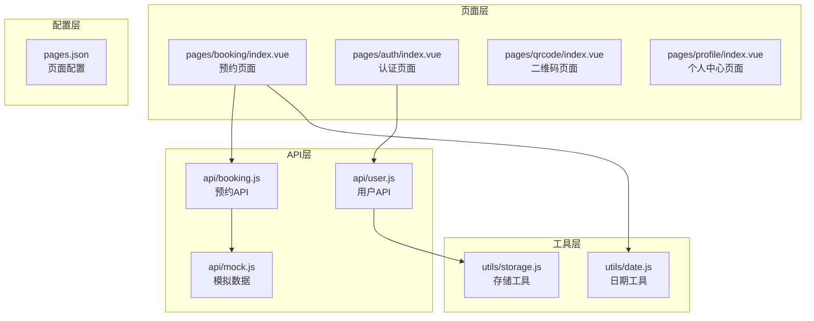

**图表来源**
- [pages/booking/index.vue:1-575](file://pages/booking/index.vue#L1-L575)
- [api/booking.js:1-165](file://api/booking.js#L1-L165)
- [utils/date.js:1-84](file://utils/date.js#L1-L84)

**章节来源**
- [pages.json:1-62](file://pages.json#L1-L62)

## 核心组件

### 路线选择器组件

路线选择器是双向路线选择功能的核心组件，支持"长江新区至武昌"和"武昌至长江新区"两个方向的路线切换。

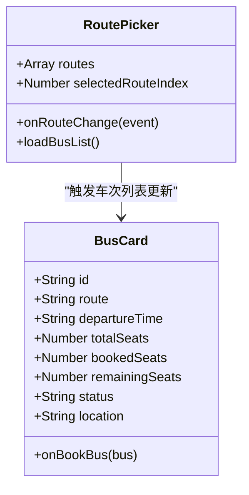

**图表来源**
- [pages/booking/index.vue:105-106](file://pages/booking/index.vue#L105-L106)
- [pages/booking/index.vue:165-168](file://pages/booking/index.vue#L165-L168)

### 日期选择器组件

日期选择器实现了未来7天的日期展示和选择功能，提供直观的日期导航体验。

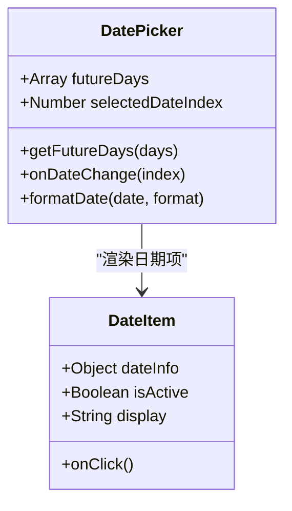

**图表来源**
- [utils/date.js:10-33](file://utils/date.js#L10-L33)
- [pages/booking/index.vue:171-174](file://pages/booking/index.vue#L171-L174)

### 车次列表组件

车次列表组件负责展示可用的校车班次，包含时间、座位状态、位置等信息，并提供预约按钮。

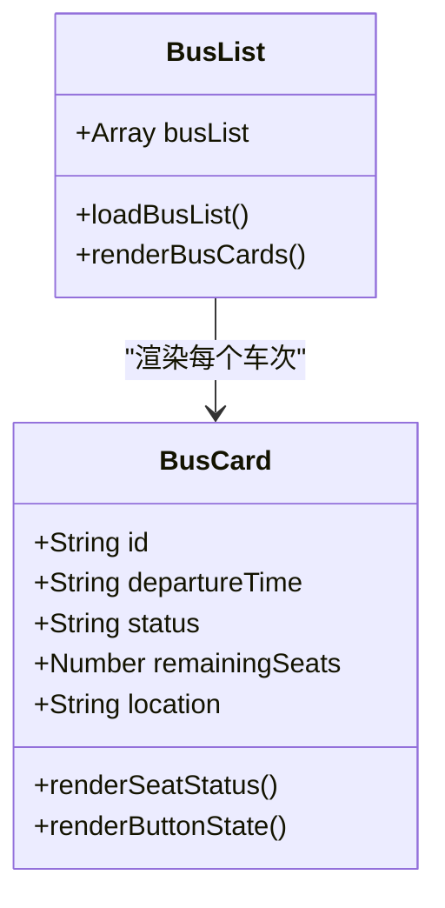

**图表来源**
- [pages/booking/index.vue:56-93](file://pages/booking/index.vue#L56-L93)
- [pages/booking/index.vue:75-86](file://pages/booking/index.vue#L75-L86)

**章节来源**
- [pages/booking/index.vue:28-52](file://pages/booking/index.vue#L28-L52)

## 架构概览

系统采用分层架构设计，各层职责明确，便于维护和扩展：

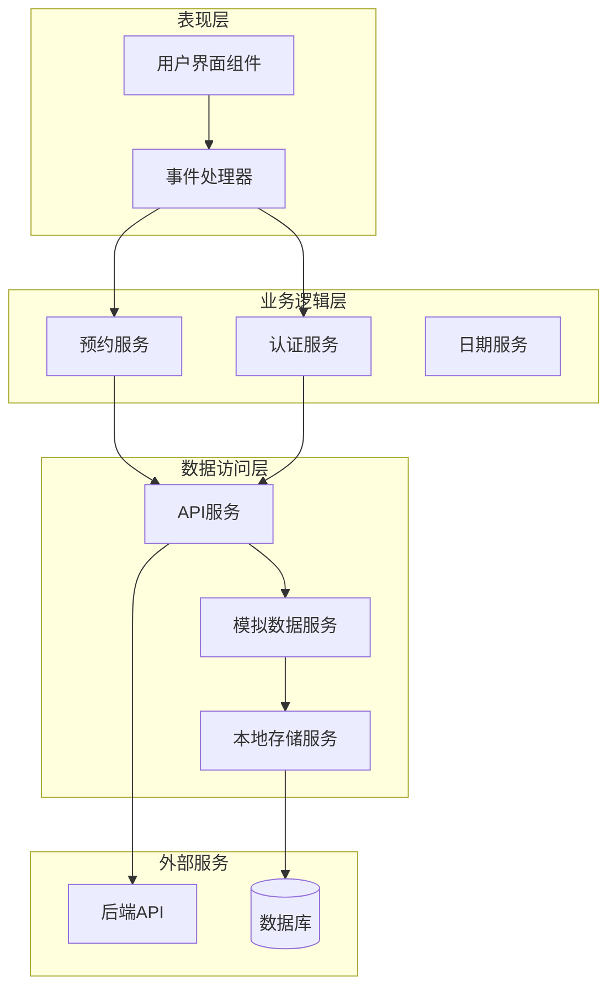

**图表来源**
- [pages/booking/index.vue:99-296](file://pages/booking/index.vue#L99-L296)
- [api/booking.js:8-164](file://api/booking.js#L8-L164)

## 详细组件分析

### 路线数组定义与picker组件配置

路线数组在组件data中定义，包含了系统支持的双向路线选项：

```javascript
routes: ['长江新区至武昌', '武昌至长江新区']
```

picker组件配置实现了双向路线选择功能：

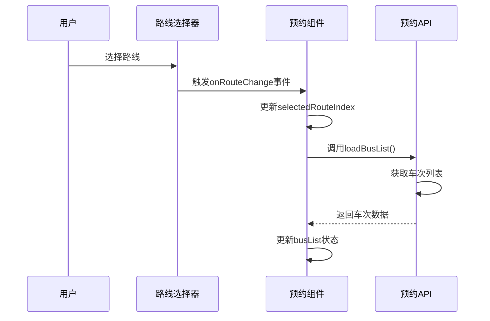

**图表来源**
- [pages/booking/index.vue:30-36](file://pages/booking/index.vue#L30-L36)
- [pages/booking/index.vue:165-168](file://pages/booking/index.vue#L165-L168)

**章节来源**
- [pages/booking/index.vue:105-106](file://pages/booking/index.vue#L105-L106)
- [pages/booking/index.vue:30-36](file://pages/booking/index.vue#L30-L36)

### 日期选择器实现机制

日期选择器通过`getFutureDays`工具函数生成未来N天的日期数组：

```mermaid
flowchart TD
Start([开始]) --> GetDays[调用getFutureDays(7)]
GetDays --> InitArray[初始化结果数组]
InitArray --> Loop{循环7天}
Loop --> |每天| CreateDate[创建日期对象]
CreateDate --> CalcDate[计算月日和星期]
CalcDate --> FormatDate[格式化日期字符串]
FormatDate --> AddToResult[添加到结果数组]
AddToResult --> Loop
Loop --> |完成| ReturnResult[返回日期数组]
ReturnResult --> End([结束])
```

**图表来源**
- [utils/date.js:10-33](file://utils/date.js#L10-L33)

日期格式化逻辑支持多种格式：
- `MM-DD 周X` 格式：如 "01-15 周一"
- `YYYY-MM-DD` 格式：标准日期格式
- 自动识别今天标记

**章节来源**
- [utils/date.js:41-55](file://utils/date.js#L41-L55)
- [utils/date.js:62-83](file://utils/date.js#L62-L83)

### 车次列表渲染机制

车次列表渲染采用Vue.js的响应式数据绑定，实现了动态状态更新：

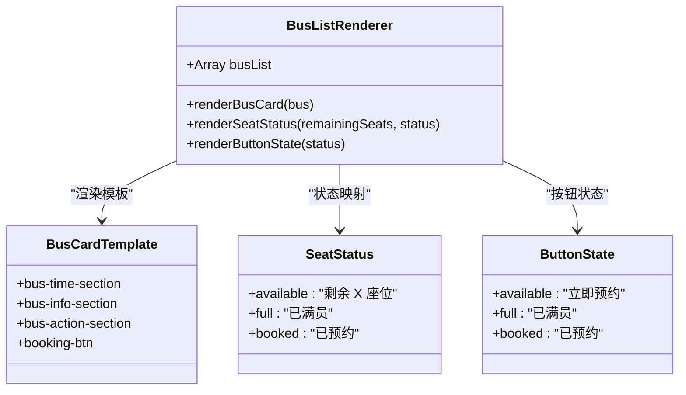

**图表来源**
- [pages/booking/index.vue:57-87](file://pages/booking/index.vue#L57-L87)
- [pages/booking/index.vue:64-85](file://pages/booking/index.vue#L64-L85)

座位状态显示逻辑：
- `available`: 显示剩余座位数量
- `full`: 显示"已满员"状态
- `booked`: 显示"已预约"状态

按钮状态控制：
- `available`: 可点击，显示"立即预约"
- `full`: 禁用状态，显示"已满员"
- `booked`: 禁用状态，显示"已预约"

**章节来源**
- [pages/booking/index.vue:64-85](file://pages/booking/index.vue#L64-L85)

### 预约流程完整实现

预约流程包含多个步骤，从用户认证检查到最终确认：

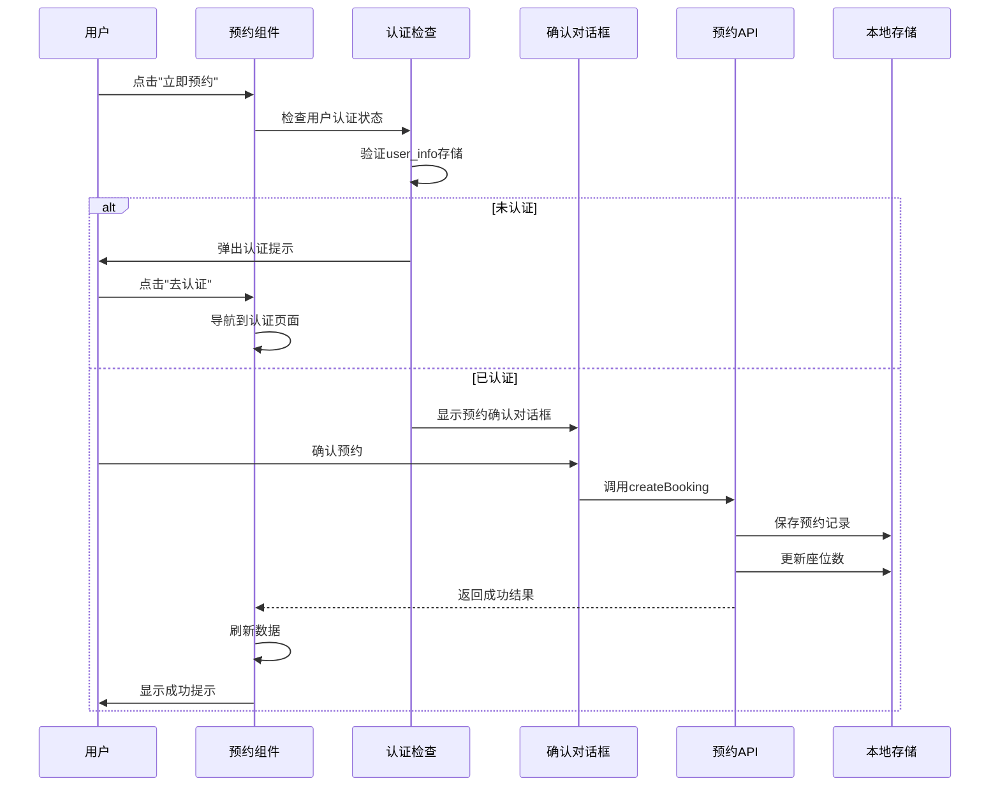

**图表来源**
- [pages/booking/index.vue:177-247](file://pages/booking/index.vue#L177-L247)

预约确认对话框包含以下信息：
- 路线信息
- 出发时间
- 上车地点

执行逻辑包含：
- 预约状态检查（防止重复预约）
- 座位数量验证
- 数据持久化
- 成功/失败反馈

**章节来源**
- [pages/booking/index.vue:177-247](file://pages/booking/index.vue#L177-L247)

### 页面生命周期管理

页面生命周期采用了适当的生命周期钩子来确保数据的正确加载和更新：

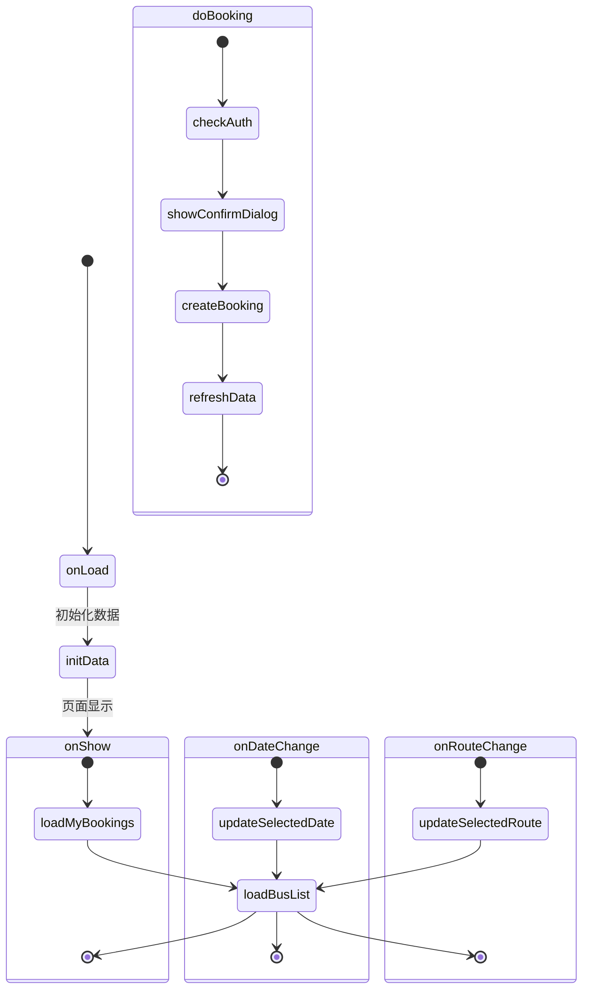

**图表来源**
- [pages/booking/index.vue:114-122](file://pages/booking/index.vue#L114-L122)
- [pages/booking/index.vue:165-174](file://pages/booking/index.vue#L165-L174)

生命周期管理策略：
- `onLoad`: 页面加载时初始化基础数据
- `onShow`: 每次显示页面时刷新最新数据
- 路由变更和日期变更时局部刷新

**章节来源**
- [pages/booking/index.vue:114-122](file://pages/booking/index.vue#L114-L122)

### 组件间通信模式

系统采用多种组件间通信模式：

1. **父子组件通信**: 通过props传递数据，通过事件回调更新父组件状态
2. **全局状态管理**: 使用本地存储作为简单的状态管理
3. **API层抽象**: 通过统一的API接口层实现数据访问

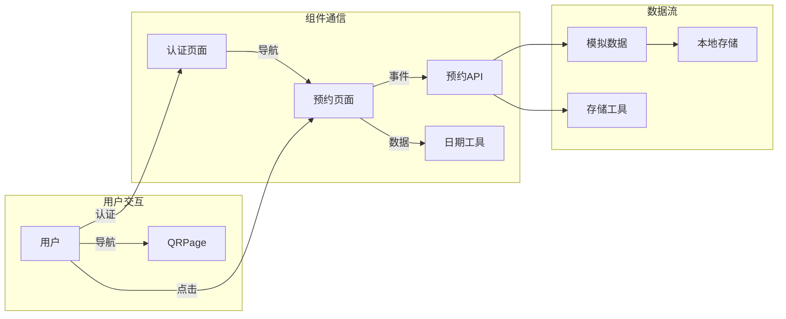

**图表来源**
- [pages/booking/index.vue:99-100](file://pages/booking/index.vue#L99-L100)
- [pages/auth/index.vue:100](file://pages/auth/index.vue#L100)

## 依赖关系分析

系统依赖关系清晰，层次分明：

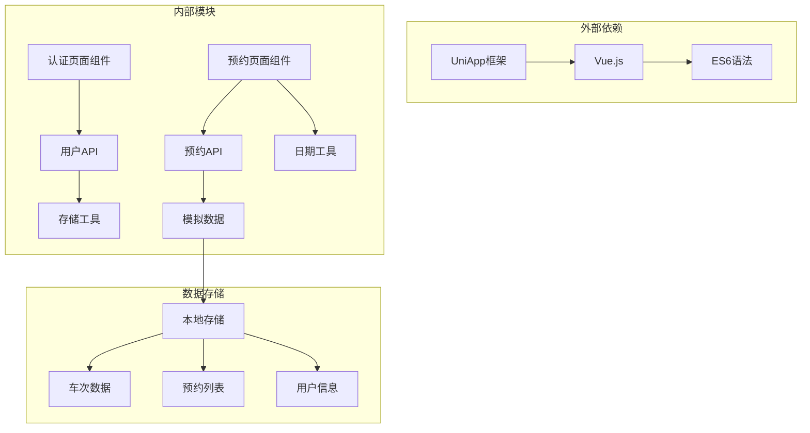

**图表来源**
- [pages/booking/index.vue:99-100](file://pages/booking/index.vue#L99-L100)
- [api/booking.js:6](file://api/booking.js#L6)

**章节来源**
- [api/booking.js:6](file://api/booking.js#L6)
- [api/user.js:6](file://api/user.js#L6)

## 性能考虑

系统在设计时充分考虑了性能优化：

1. **懒加载策略**: 车次列表采用滚动视图，避免一次性渲染大量DOM元素
2. **数据缓存**: 使用本地存储减少重复请求
3. **状态管理**: 合理的状态更新避免不必要的重新渲染
4. **异步处理**: 所有网络请求都采用异步方式，不阻塞UI线程

优化建议：
- 实现虚拟滚动以处理大量车次数据
- 添加请求去重机制避免重复请求
- 实现数据预加载策略提升用户体验

## 故障排除指南

### 常见问题及解决方案

**问题1: 预约失败**
- 检查用户认证状态
- 验证座位数量是否充足
- 确认是否已存在相同车次的预约

**问题2: 车次列表为空**
- 检查网络连接状态
- 验证路线和日期参数
- 确认后端服务正常运行

**问题3: 认证页面无法跳转**
- 检查页面路径配置
- 验证路由权限设置
- 确认页面文件存在

**章节来源**
- [pages/booking/index.vue:183-198](file://pages/booking/index.vue#L183-L198)
- [pages/booking/index.vue:240-246](file://pages/booking/index.vue#L240-L246)

### 错误处理机制

系统实现了多层次的错误处理：

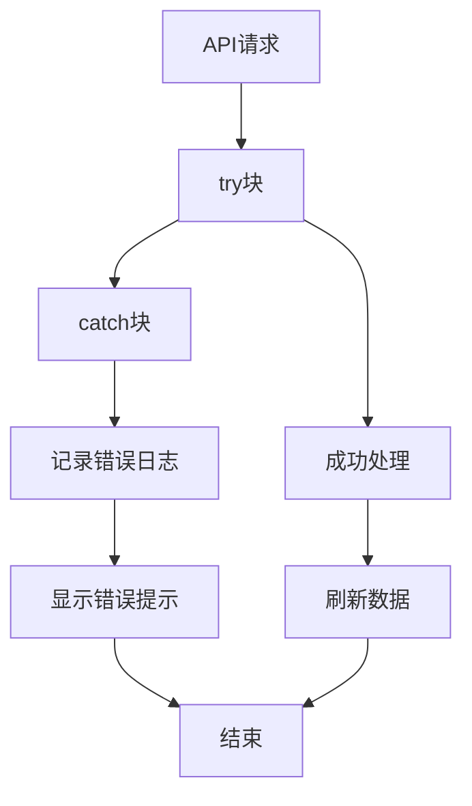

错误处理策略：
- 网络请求异常捕获
- 用户操作反馈
- 数据状态恢复

**章节来源**
- [pages/booking/index.vue:155-161](file://pages/booking/index.vue#L155-L161)
- [pages/booking/index.vue:240-246](file://pages/booking/index.vue#L240-L246)

## 结论

预约页面组件是一个功能完整、架构清晰的校车预约系统核心模块。系统实现了以下关键特性：

1. **完整的双向路线支持**: 支持"长江新区至武昌"和"武昌至长江新区"双向路线
2. **灵活的日期选择**: 提供未来7天的日期选择功能
3. **实时状态更新**: 车次状态实时反映座位剩余情况
4. **完善的用户认证**: 集成身份认证流程
5. **友好的用户界面**: 响应式设计，适配移动端设备

系统采用模块化设计，易于维护和扩展。通过API层抽象，可以轻松替换为真实的后端服务。整体架构合理，功能实现完整，为用户提供了优质的预约体验。