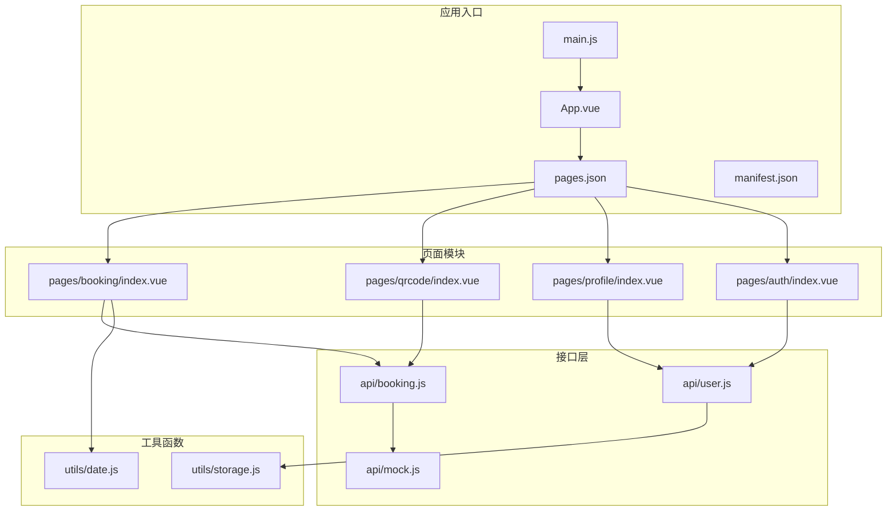
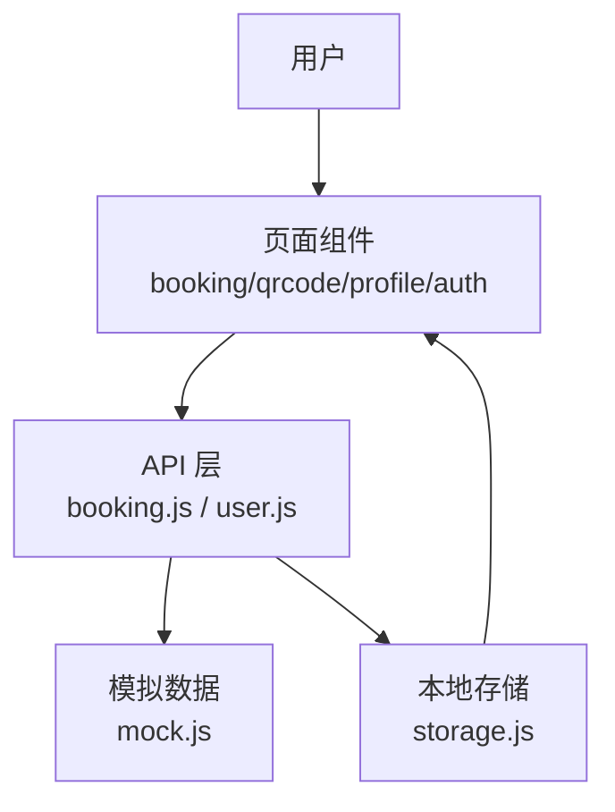
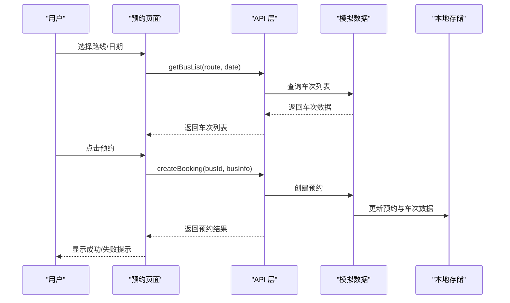
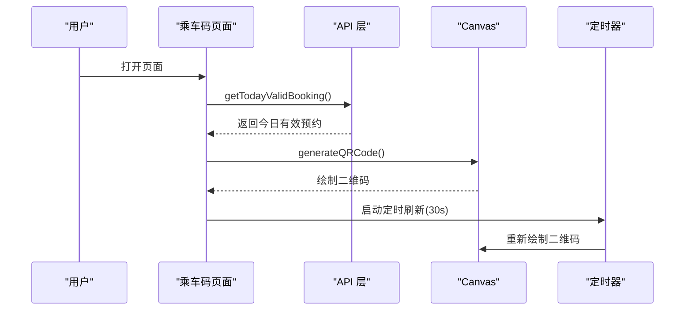
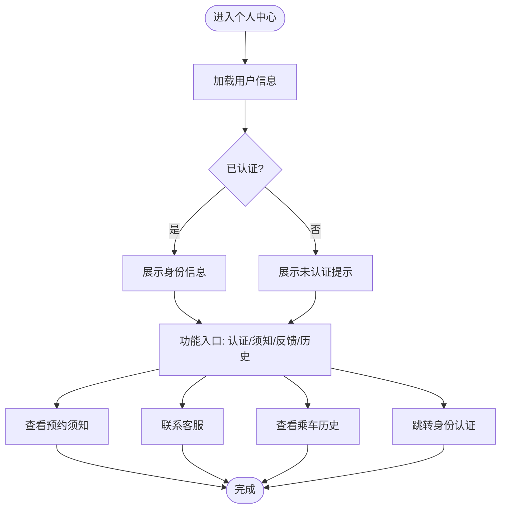
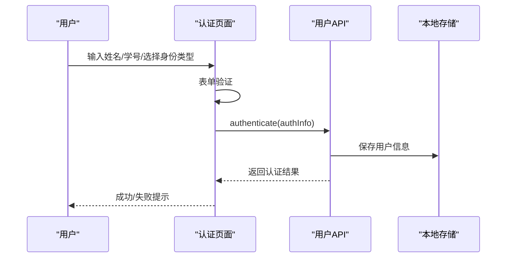
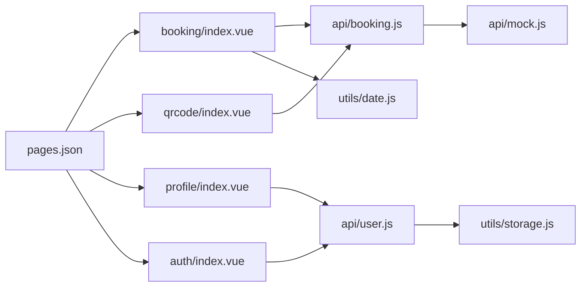

# 项目概述

<cite>
**本文档引用的文件**
- [PROJECT.md](file://PROJECT.md)
- [main.js](file://main.js)
- [manifest.json](file://manifest.json)
- [pages.json](file://pages.json)
- [App.vue](file://App.vue)
- [api/booking.js](file://api/booking.js)
- [api/user.js](file://api/user.js)
- [api/mock.js](file://api/mock.js)
- [utils/storage.js](file://utils/storage.js)
- [utils/date.js](file://utils/date.js)
- [pages/booking/index.vue](file://pages/booking/index.vue)
- [pages/qrcode/index.vue](file://pages/qrcode/index.vue)
- [pages/profile/index.vue](file://pages/profile/index.vue)
- [pages/auth/index.vue](file://pages/auth/index.vue)
</cite>

## 目录
1. [引言](#引言)
2. [项目结构](#项目结构)
3. [核心组件](#核心组件)
4. [架构总览](#架构总览)
5. [详细组件分析](#详细组件分析)
6. [依赖关系分析](#依赖关系分析)
7. [性能考量](#性能考量)
8. [故障排除指南](#故障排除指南)
9. [结论](#结论)
10. [附录](#附录)

## 引言
本项目是基于 uni-app 框架开发的学校校车调度系统，主要服务于湖北大学师生，提供便捷的校车查询、预约与乘车管理服务。系统采用微信小程序为目标平台，结合 Vue 3 技术栈，通过模块化的 API 层与本地存储实现数据持久化，界面以自定义组件为主，强调简洁直观的用户体验。项目具备良好的扩展性，预留了后端 API 接口，便于后续接入真实后端服务。

项目旨在解决校园内跨校区通勤的痛点，通过统一的预约与乘车流程，提升乘车效率与安全性，同时为后续的运营统计与管理提供数据基础。

**章节来源**
- [PROJECT.md:1-11](file://PROJECT.md#L1-L11)

## 项目结构
项目采用典型的 uni-app 单页应用结构，按功能模块划分目录，便于维护与扩展：
- pages：页面级组件，包含预约、乘车码、个人中心、身份认证等页面
- api：接口层，封装与后端交互的 API 方法，当前使用 mock 数据
- utils：通用工具函数，包括本地存储封装与日期处理
- static：静态资源（图标等）
- 根目录配置文件：main.js、manifest.json、pages.json、App.vue 等

**图表来源**
- [main.js:1-22](file://main.js#L1-L22)
- [App.vue:1-32](file://App.vue#L1-L32)
- [pages.json:1-62](file://pages.json#L1-L62)
- [manifest.json:1-73](file://manifest.json#L1-L73)
- [api/booking.js:1-165](file://api/booking.js#L1-L165)
- [api/user.js:1-128](file://api/user.js#L1-L128)
- [api/mock.js:1-226](file://api/mock.js#L1-L226)
- [utils/storage.js:1-116](file://utils/storage.js#L1-L116)
- [utils/date.js:1-84](file://utils/date.js#L1-L84)

**章节来源**
- [PROJECT.md:41-67](file://PROJECT.md#L41-L67)

## 核心组件
系统由四个核心页面组成，分别承担不同的业务职责：
- 车辆预约页面：提供路线与日期筛选、车次列表展示与一键预约功能
- 乘车码页面：动态生成二维码，展示预约信息与使用说明
- 个人中心页面：提供身份认证入口、预约须知、客服反馈、乘车历史等功能
- 身份认证页面：收集用户姓名、学号/工号与身份类型，完成本地认证

此外，系统通过 API 层与工具函数实现数据访问与处理，确保业务逻辑与数据层解耦，便于后续接入真实后端。

**章节来源**
- [PROJECT.md:12-40](file://PROJECT.md#L12-L40)
- [pages/booking/index.vue:1-575](file://pages/booking/index.vue#L1-L575)
- [pages/qrcode/index.vue:1-342](file://pages/qrcode/index.vue#L1-L342)
- [pages/profile/index.vue:1-595](file://pages/profile/index.vue#L1-L595)
- [pages/auth/index.vue:1-385](file://pages/auth/index.vue#L1-L385)

## 架构总览
系统采用“页面组件 + API 层 + 工具函数”的分层架构，数据流遵循“用户操作 → 组件 → API 层 → 本地存储”的模式，保证了前后端解耦与数据一致性。

**图表来源**
- [PROJECT.md:115-134](file://PROJECT.md#L115-L134)
- [api/booking.js:1-165](file://api/booking.js#L1-L165)
- [api/user.js:1-128](file://api/user.js#L1-L128)
- [api/mock.js:1-226](file://api/mock.js#L1-L226)
- [utils/storage.js:1-116](file://utils/storage.js#L1-L116)

## 详细组件分析

### 车辆预约页面（booking/index.vue）
该页面负责展示用户的待出行预约与可用车次列表，支持路线与日期筛选，提供一键预约与取消预约能力。页面通过 API 层获取车次列表与预约数据，使用本地存储实现数据持久化。

**图表来源**
- [pages/booking/index.vue:124-296](file://pages/booking/index.vue#L124-L296)
- [api/booking.js:14-163](file://api/booking.js#L14-L163)
- [api/mock.js:49-152](file://api/mock.js#L49-L152)
- [utils/storage.js:10-114](file://utils/storage.js#L10-L114)

**章节来源**
- [pages/booking/index.vue:1-575](file://pages/booking/index.vue#L1-L575)
- [api/booking.js:1-165](file://api/booking.js#L1-L165)
- [api/mock.js:1-226](file://api/mock.js#L1-L226)
- [utils/date.js:1-84](file://utils/date.js#L1-L84)

### 乘车码页面（qrcode/index.vue）
该页面根据今日有效预约动态生成二维码，展示预约信息与使用说明，并支持每 30 秒自动刷新，确保二维码有效性。

**图表来源**
- [pages/qrcode/index.vue:83-183](file://pages/qrcode/index.vue#L83-L183)
- [api/booking.js:139-163](file://api/booking.js#L139-L163)
- [utils/date.js:1-84](file://utils/date.js#L1-L84)

**章节来源**
- [pages/qrcode/index.vue:1-342](file://pages/qrcode/index.vue#L1-L342)
- [api/booking.js:1-165](file://api/booking.js#L1-L165)

### 个人中心页面（profile/index.vue）
该页面提供身份认证入口、预约须知、客服反馈、乘车历史等功能，集中展示用户身份信息与相关操作。

**图表来源**
- [pages/profile/index.vue:156-247](file://pages/profile/index.vue#L156-L247)
- [api/user.js:12-127](file://api/user.js#L12-L127)
- [api/booking.js:78-163](file://api/booking.js#L78-L163)

**章节来源**
- [pages/profile/index.vue:1-595](file://pages/profile/index.vue#L1-L595)
- [api/user.js:1-128](file://api/user.js#L1-L128)
- [api/booking.js:1-165](file://api/booking.js#L1-L165)

### 身份认证页面（auth/index.vue）
该页面负责收集用户的真实姓名、学号/工号与身份类型，进行基础表单验证并通过 API 层完成本地认证。

**图表来源**
- [pages/auth/index.vue:115-188](file://pages/auth/index.vue#L115-L188)
- [api/user.js:72-127](file://api/user.js#L72-L127)
- [utils/storage.js:10-37](file://utils/storage.js#L10-L37)

**章节来源**
- [pages/auth/index.vue:1-385](file://pages/auth/index.vue#L1-L385)
- [api/user.js:1-128](file://api/user.js#L1-L128)
- [utils/storage.js:1-116](file://utils/storage.js#L1-L116)

## 依赖关系分析
系统通过 pages.json 统一管理页面路由与全局样式，manifest.json 配置应用元信息与平台参数，main.js 作为应用入口初始化根组件。各页面通过 API 层与工具函数间接依赖，形成清晰的依赖链。

**图表来源**
- [pages.json:1-62](file://pages.json#L1-L62)
- [api/booking.js:1-165](file://api/booking.js#L1-L165)
- [api/user.js:1-128](file://api/user.js#L1-L128)
- [api/mock.js:1-226](file://api/mock.js#L1-L226)
- [utils/storage.js:1-116](file://utils/storage.js#L1-L116)
- [utils/date.js:1-84](file://utils/date.js#L1-L84)

**章节来源**
- [pages.json:1-62](file://pages.json#L1-L62)
- [manifest.json:1-73](file://manifest.json#L1-L73)
- [main.js:1-22](file://main.js#L1-L22)

## 性能考量
- 数据加载优化：API 层使用 Promise 与异步调用，避免阻塞主线程；模拟数据层设置合理延迟，模拟真实网络环境。
- 页面渲染优化：使用滚动视图与条件渲染减少 DOM 节点数量；卡片式布局提升视觉层次与交互效率。
- 本地存储策略：通过统一的存储工具函数封装读写操作，降低重复代码与潜在错误。
- 二维码刷新机制：乘车码页面采用定时器每 30 秒刷新，平衡时效性与性能消耗。

[本节为通用性能指导，不直接分析具体文件]

## 故障排除指南
- 运行时报错 "pages.json 配置错误"：检查页面路径是否正确且文件存在。
- TabBar 不显示图标：确认 static/icons 目录下存在对应 PNG 图标文件，尺寸建议 81x81px。
- 预约功能无法使用：检查是否已完成身份认证；查看控制台错误信息；尝试清除本地存储后重试。
- 二维码不显示：当前为简易实现，建议集成成熟的二维码库；检查 canvas 组件是否正确渲染。

**章节来源**
- [PROJECT.md:185-202](file://PROJECT.md#L185-L202)

## 结论
本项目以 uni-app 为核心，构建了面向湖北大学师生的校车调度系统，具备清晰的模块划分与良好的扩展性。通过模拟数据与本地存储实现快速原型开发，预留了后端 API 接口，便于后续接入真实服务。页面设计注重用户体验，功能覆盖预约、乘车、认证与个人中心等关键场景。对于初学者，项目提供了明确的开发路径与最佳实践；对于有经验的开发者，项目展示了分层架构与模块化设计的优势。

[本节为总结性内容，不直接分析具体文件]

## 附录

### UniApp 框架优势与跨平台特性
- 一套代码多端运行：支持微信小程序、H5、App 等多平台，降低开发与维护成本。
- Vue 3 生态：利用 Vue 3 的 Composition API 与响应式系统，提升开发效率与代码可维护性。
- 统一的生命周期与事件系统：简化跨平台开发中的差异处理。
- 插件生态：可集成丰富的第三方插件与组件库，加速功能实现。

**章节来源**
- [PROJECT.md:6-11](file://PROJECT.md#L6-L11)

### 版本信息与更新日志
- v1.0.0 (2024-04-09)：初始版本发布，实现车辆预约、乘车码展示、用户身份认证与个人中心功能，预留后端 API 接口。

**章节来源**
- [PROJECT.md:203-212](file://PROJECT.md#L203-L212)

### 许可证说明
- 项目采用 MIT License，允许自由使用、复制、修改、合并、出版发行、分发、再授权及销售软件及软件的副本。

**章节来源**
- [PROJECT.md:213-216](file://PROJECT.md#L213-L216)